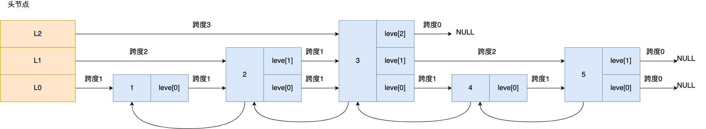

# 什么是跳表

## 1. 背景：为什么需要跳表？

- **普通链表查找问题**
   链表在查找时只能从头一个一个遍历，时间复杂度是 **O(N)**。
- **目标**
   希望在链表上“加速”查找，就像高速公路有“匝道”一样，不必从头到尾走一遍。

------

## 2. 核心思想：在链表上加“多层索引”


跳表（Skip List）就是在有序链表的基础上，增加 **多层“跳跃”指针**，用空间换时间：

- **L0 层**：完整的原始链表，包含所有节点。
- **L1 层**：只包含部分节点（例如每隔 2 个节点取 1 个）。
- **L2 层**：再精简一部分（例如每隔 4 个节点取 1 个）。
- …
- 高层节点越少，但跨度越大，可以“一步跨过多个节点”。

这样查找时可以 **先用高层快速跳跃**，再用低层精确定位。

------

## 3. 查找过程举例



假设有一个三层的跳表，要找 **节点 4**：

1. 从最高层（L2）开始 → 直接跳到“离 4 最近但不超过 4 的节点”，比如节点 3。
2. 降到下一层（L1），继续跳，直到找到 4 或到达它的前一个节点。
3. 降到 L0 层，走一步到达 4。

这样从 O(N) 变成 O(logN)。

------

## 4. 跳表节点的数据结构（Redis 实现）

Redis 跳表的节点结构体：

```c
typedef struct zskiplistNode {
    sds ele;                 // 元素值（Zset成员）
    double score;            // 排序用的分值
    struct zskiplistNode *backward; // 后向指针，方便反向遍历

    struct zskiplistLevel {
        struct zskiplistNode *forward; // 指向下一节点
        unsigned long span;            // 跨度（距离）
    } level[];               // 层数组
} zskiplistNode;
```

- **level 数组**：每个节点可能有多层，每层都有一个 `forward` 指针。
- **span（跨度）**：表示这一层从当前节点到下一节点跨了多少个 L0 层的节点。
   它不是为了遍历，而是为了快速计算**排名**（rank）。

------

## 5. 层数是怎么决定的？

- Redis 在创建节点时，用**随机数**决定层数：
  1. 初始层数为 1。
  2. 生成一个 0~1 的随机数，如果 < 0.25（25% 概率），层数 +1。
  3. 再次生成随机数，继续判断……直到不满足条件。
  4. 最大层数不超过 64。
- **特点**：层数越高，概率越小 → 形成类似 2:1 的稀疏分布，但不做强制比例维护。

------

## 6. 特殊情况：头节点

- 虽然普通节点的层数是随机的，但**跳表的头节点**会直接创建最大高度（64 层），以便查找时有最高的入口。

> 1. 头节点就像一个有 64 层的“索引塔”，
>
> 2. 但如果跳表里数据很少，比如只有 1~2 层的节点，那么高层上的 forward 指针就没东西可指，只能是 NULL。
> 3. Level63:  head ──> NULL
>    Level62:  head ──> NULL
>     ...     
>    Level2 :  head ──> NULL
>    Level1 :  head ──> B ──> NULL
>    Level0 :  head ──> A ──> B ──> NULL

------

## 7. 总结逻辑图

```
普通链表：O(N)
↓  加索引
跳表结构：
    L2:    3  --------> ...
    L1:  2 -> 3 -> 5 -> ...
    L0: 1 -> 2 -> 3 -> 4 -> 5

查找节点 4：
    L2: 头 -> 3（停）
    L1: 3 -> 5（过了）停
    L0: 3 -> 4（找到）
复杂度：O(logN)
```

## 8.Java三层跳表示例

### 示例代码

```java
import java.util.Random;

public class SkipList {
    private static final int MAX_LEVEL = 3; // 最大层数
    private static final double P = 0.25;   // 每提升一层的概率
    private final Node head = new Node("HEAD", 0, MAX_LEVEL); // 头节点
    private int levelCount = 1; // 当前最大层数
    private final Random random = new Random();

    // 跳表节点
    static class Node {
        String ele;    // 元素值
        double score;  // 分值
        Node backward; // 后向指针
        Node[] forward; // 每层的前向指针

        Node(String ele, double score, int level) {
            this.ele = ele;
            this.score = score;
            this.forward = new Node[level];
        }

        @Override
        public String toString() {
            return ele + "(" + score + ")";
        }
    }

    // 插入元素
    public void insert(String ele, double score) {
        int level = randomLevel();
        Node newNode = new Node(ele, score, level);
        Node[] update = new Node[level]; // 记录每层需要更新 forward 的节点

        Node curr = head;
        for (int i = level - 1; i >= 0; i--) { // 从最高层往下走
            while (curr.forward[i] != null && curr.forward[i].score < score) {
                curr = curr.forward[i];
            }
            update[i] = curr; // 这一层需要插入的位置
        }

        // 在每层插入新节点
        for (int i = 0; i < level; i++) {
            newNode.forward[i] = update[i].forward[i];
            update[i].forward[i] = newNode;
        }

        // 设置 backward（只在 L0 层设置即可）
        if (newNode.forward[0] != null) {
            newNode.forward[0].backward = newNode;
        }
        newNode.backward = update[0];

        // 更新最大层数
        if (level > levelCount) {
            levelCount = level;
        }
    }

    // 查找
    public Node search(double score) {
        Node curr = head;
        for (int i = levelCount - 1; i >= 0; i--) {
            while (curr.forward[i] != null && curr.forward[i].score < score) {
                curr = curr.forward[i];
            }
        }
        curr = curr.forward[0];
        return (curr != null && curr.score == score) ? curr : null;
    }

    // 打印跳表
    public void printList() {
        for (int i = levelCount - 1; i >= 0; i--) {
            System.out.print("Level " + i + ": ");
            Node curr = head.forward[i];
            while (curr != null) {
                System.out.print(curr + " -> ");
                curr = curr.forward[i];
            }
            System.out.println("NULL");
        }
    }

    // 随机层数生成（25% 概率提升一层）
    private int randomLevel() {
        int level = 1;
        while (random.nextDouble() < P && level < MAX_LEVEL) {
            level++;
        }
        return level;
    }

    // 测试
    public static void main(String[] args) {
        SkipList skipList = new SkipList();
        skipList.insert("A", 1);
        skipList.insert("B", 2);
        skipList.insert("C", 3);
        skipList.insert("D", 4);

        skipList.printList();

        Node found = skipList.search(3);
        System.out.println("搜索结果: " + found);
    }
}
```

### 运行结果（示例输出）

```
Level 2: C(3) -> NULL
Level 1: B(2) -> C(3) -> NULL
Level 0: A(1) -> B(2) -> C(3) -> NULL
```

### 代码解析

> 插入
>
> 1. 模拟 Redis 的 25% 概率提升一层的规则
> 2. 创建新节点newNode
> 3. 创建一个Node类型（原生的）的数组update来记录`在每层中的哪一个节点后面添加节点`
> 4. 从最高层开始找位置，如果头结点的下一个节点不为空且新节点的分数比下一个节点的分数大，指针就向后移动一个
> 5. 找到位置后在update数组中记录下
> 6. 用update存储的位置开始插入新节点。
> 7. 新节点的下一个指针指向老节点的下一个指针，老节点的下一个指针更新为当前的新节点（**与数据结构中的节点插入一样**）
> 8. 如果newNode在第0层的下一个节点存在，则设置后向指针（下一个节点的后向指针边变更为指向新节点，新节点的后向指针变更为update[0]，也就是在第0层的插入位置）

```java
    // 插入元素
    public void insert(String ele, double score) {
        int level = randomLevel();
        Node newNode = new Node(ele, score, level);
        Node[] update = new Node[level]; // 记录每层需要更新 forward 的节点

        Node curr = head;
        for (int i = level - 1; i >= 0; i--) { // 从最高层往下走
            while (curr.forward[i] != null && curr.forward[i].score < score) {
                curr = curr.forward[i];
            }
            update[i] = curr; // 这一层需要插入的位置
        }

        // 在每层插入新节点
        for (int i = 0; i < level; i++) {
            newNode.forward[i] = update[i].forward[i];
            update[i].forward[i] = newNode;
        }

        // 设置 backward（只在 L0 层设置即可）
        if (newNode.forward[0] != null) {
            newNode.forward[0].backward = newNode;
        }
        newNode.backward = update[0];

        // 更新最大层数
        if (level > levelCount) {
            levelCount = level;
        }
    }
```

> 查找
>
> 1. 从顶层开始查，若该值没有在这一个层，会找到一个最接近的值，进入下一层
> 2. 从次顶层的该值继续向后查，若该值没有在这一个层，会找到一个最接近的值，进入下一层。循环向下
> 3. 如果在高层找到该值，则直接降落到0层取值
> 4. 值在高层有，在下层一定有。就像一座塔，中间不可能有空值

```java
public Node search(double score) {
    Node curr = head;
    for (int i = levelCount - 1; i >= 0; i--) {
        while (curr.forward[i] != null && curr.forward[i].score < score) {
            curr = curr.forward[i];
        }
    }
    curr = curr.forward[0];
    return (curr != null && curr.score == score) ? curr : null;
}
```