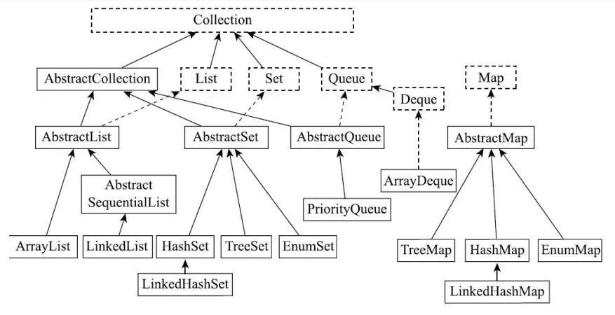
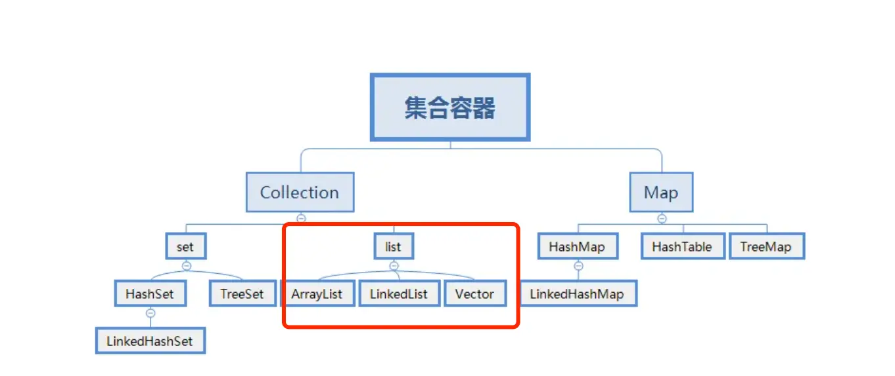
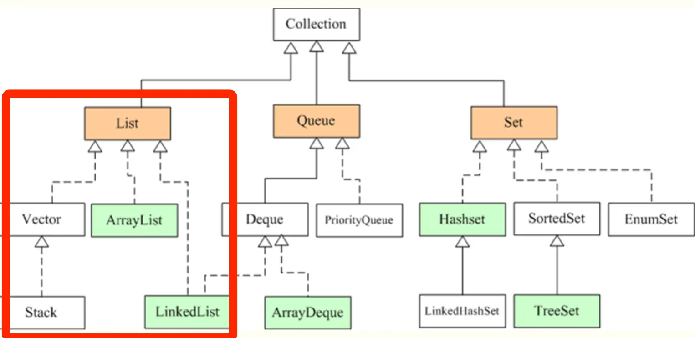

# Java集合面试题

## 概念

### 1.数组与集合区别，用过哪些？

数组和集合的区别：

- 数组是固定长度的数据结构，一旦创建长度就无法改变，而集合是动态长度的数据结构，可以根据需要动态增加或减少元素。
- 数组可以包含基本数据类型和对象，而集合只能包含对象。
- 数组可以直接访问元素，而集合需要通过迭代器或其他方法访问元素。

我用过的一些 Java 集合类：

- **ArrayList：** 动态数组，实现了List接口，支持动态增长。
- **LinkedList：** 双向链表，也实现了List接口，支持快速的插入和删除操作。
- **HashMap：** 基于哈希表的Map实现，存储键值对，通过键快速查找值。
- **HashSet：** 基于HashMap实现的Set集合，用于存储唯一元素。
- **TreeMap：** 基于红黑树实现的有序Map集合，可以按照键的顺序进行排序。
- **LinkedHashMap：** 基于哈希表和双向链表实现的Map集合，保持插入顺序或访问顺序。
- **PriorityQueue：** 优先队列，可以按照比较器或元素的自然顺序进行排序。

### 2.说说Java中的集合？



> List是有序的Collection，使用此接口能够精确的控制每个元素的插入位置，用户能根据索引访问List中元素。常用的实现List的类有LinkedList，ArrayList，Vector，Stack。

- ArrayList是容量可变的非线程安全列表，其底层使用数组实现。当几何扩容时，会创建更大的数组，并把原数组复制到新数组。ArrayList支持对元素的快速随机访问，但插入与删除速度很慢。
- LinkedList本质是一个双向链表，与ArrayList相比，，其插入和删除速度更快，但随机访问速度更慢。

> Set不允许存在重复的元素，与List不同，set中的元素是无序的。常用的实现有HashSet，LinkedHashSet和TreeSet。

- HashSet通过HashMap实现，HashMap的Key即HashSet存储的元素，所有Key都是用相同的Value，一个名为PRESENT的Object类型常量。使用Key保证元素唯一性，但不保证有序性。由于HashSet是HashMap实现的，因此线程不安全。
- LinkedHashSet继承自HashSet，通过LinkedHashMap实现，使用双向链表维护元素插入顺序。
- TreeSet通过TreeMap实现的，添加元素到集合时按照比较规则将其插入合适的位置，保证插入后的集合仍然有序。

> Map 是一个键值对集合，存储键、值和之间的映射。Key 无序，唯一；value 不要求有序，允许重复。Map 没有继承于Collection 接口，从 Map 集合中检索元素时，只要给出键对象，就会返回对应的值对象。主要实现有TreeMap、HashMap、HashTable、LinkedHashMap、ConcurrentHashMap

- HashMap：JDK1.8 之前 HashMap 由数组+链表组成的，数组是 HashMap 的主体，链表则是主要为了解决哈希冲突而存在的（“拉链法”解决冲突），JDK1.8 以后在解决哈希冲突时有了较大的变化，当链表长度大于阈值（默认为 8）时，将链表转化为红黑树，以减少搜索时间
- LinkedHashMap：LinkedHashMap 继承自 HashMap，所以它的底层仍然是基于拉链式散列结构即由数组和链表或红黑树组成。另外，LinkedHashMap 在上面结构的基础上，增加了一条双向链表，使得上面的结构可以保持键值对的插入顺序。同时通过对链表进行相应的操作，实现了访问顺序相关逻辑。
- HashTable：数组+链表组成的，数组是 HashTable 的主体，链表则是主要为了解决哈希冲突而存在的
- TreeMap：红黑树（自平衡的排序二叉树）
- ConcurrentHashMap：Node数组+链表+红黑树实现，线程安全的（jdk1.8以前Segment锁，1.8以后volatile + CAS 或者 synchronized）

### 3.Java中的线程安全的集合是什么？

> [!important]
>
> 在 java.util 包中的线程安全的类主要 2 个，其他都是非线程安全的。

- **Vector**：线程安全的动态数组，其内部方法基本都经过synchronized修饰，如果不需要线程安全，并不建议选择，毕竟同步是有额外开销的。Vector 内部是使用对象数组来保存数据，可以根据需要自动的增加容量，当数组已满时，会创建新的数组，并拷贝原有数组数据。
- **Hashtable**：线程安全的哈希表，HashTable 的加锁方法是给每个方法加上 synchronized 关键字，这样锁住的是整个 Table 对象，不支持 null 键和值，由于同步导致的性能开销，所以已经很少被推荐使用，如果要保证线程安全的哈希表，可以用ConcurrentHashMap。

> java.util.concurrent 包提供的都是线程安全的集合：

> [!note]
>
> 并发Map：

- **ConcurrentHashMap**：它与 HashTable 的主要区别是二者加锁粒度的不同，在**JDK1.7**，ConcurrentHashMap加的是分段锁，也就是Segment锁，每个Segment 含有整个 table 的一部分，这样不同分段之间的并发操作就互不影响。在**JDK 1.8** ，它取消了Segment字段，直接在table元素上加锁，实现对每一行进行加锁，进一步减小了并发冲突的概率。对于put操作，如果Key对应的数组元素为null，则通过CAS操作（Compare and Swap）将其设置为当前值。如果Key对应的数组元素（也即链表表头或者树的根元素）不为null，则对该元素使用 synchronized 关键字申请锁，然后进行操作。如果该 put 操作使得当前链表长度超过一定阈值，则将该链表转换为红黑树，从而提高寻址效率。
- **ConcurrentSkipListMap**：实现了一个基于SkipList（跳表）算法的可排序的并发集合，SkipList是一种可以在对数预期时间内完成搜索、插入、删除等操作的数据结构，通过维护多个指向其他元素的“跳跃”链接来实现高效查找。

> [!note]
>
>并发Set：

- **ConcurrentSkipListSet**：是线程安全的有序的集合。底层是使用ConcurrentSkipListMap实现。
- **CopyOnWriteArraySet**：是线程安全的Set实现，它是线程安全的无序的集合，可以将它理解成线程安全的HashSet。有意思的是，CopyOnWriteArraySet和HashSet虽然都继承于共同的父类AbstractSet；但是，HashSet是通过“散列表”实现的，而CopyOnWriteArraySet则是通过“动态数组(CopyOnWriteArrayList)”实现的，并不是散列表。

> [!note]
>
>并发List：

- **CopyOnWriteArrayList**：它是 ArrayList 的线程安全的变体，其中所有写操作（add，set等）都通过对底层数组进行全新复制来实现，允许存储 null 元素。即当对象进行写操作时，使用了Lock锁做同步处理，内部拷贝了原数组，并在新数组上进行添加操作，最后将新数组替换掉旧数组；若进行的读操作，则直接返回结果，操作过程中不需要进行同步。
> [!note]
>
>并发 Queue：

- **ConcurrentLinkedQueue**：是一个适用于高并发场景下的队列，它通过无锁的方式(CAS)，实现了高并发状态下的高性能。通常，ConcurrentLinkedQueue 的性能要好于 BlockingQueue 。
- **BlockingQueue**：与 ConcurrentLinkedQueue 的使用场景不同，BlockingQueue 的主要功能并不是在于提升高并发时的队列性能，而在于简化多线程间的数据共享。BlockingQueue 提供一种读写阻塞等待的机制，即如果消费者速度较快，则 BlockingQueue 则可能被清空，此时消费线程再试图从 BlockingQueue 读取数据时就会被阻塞。反之，如果生产线程较快，则 BlockingQueue 可能会被装满，此时，生产线程再试图向 BlockingQueue 队列装入数据时，便会被阻塞等待。

> [!note]
>
>并发 Deque：

- **LinkedBlockingDeque**：是一个线程安全的双端队列实现。它的内部使用链表结构，每一个节点都维护了一个前驱节点和一个后驱节点。LinkedBlockingDeque 没有进行读写锁的分离，因此同一时间只能有一个线程对其进行操作
- **ConcurrentLinkedDeque**：ConcurrentLinkedDeque是一种基于链接节点的无限并发链表。可以安全地并发执行插入、删除和访问操作。当许多线程同时访问一个公共集合时，ConcurrentLinkedDeque是一个合适的选择。

### 4.Collections和Collection的区别

- Collection是Java集合框架中的一个接口，它是所有集合类的基础接口。它定义了一组通用的操作和方法，如添加、删除、遍历等，用于操作和管理一组对象。Collection接口有许多实现类，如List、Set和Queue等。
- Collections（注意有一个s）是Java提供的一个工具类，位于java.util包中。它提供了一系列静态方法，用于对集合进行操作和算法。Collections类中的方法包括排序、查找、替换、反转、随机化等等。这些方法可以对实现了Collection接口的集合进行操作，如List和Set。

### 5.集合遍历的方法有哪些？

在Java中，集合的遍历方法主要有以下几种：

- **普通 for 循环：** 可以使用带有索引的普通 for 循环来遍历 List。

```java
List<String> list = new ArrayList<>();
list.add("A");
list.add("B");
list.add("C");

for (int i = 0; i < list.size(); i++) {
    String element = list.get(i);
    System.out.println(element);
}
```

- **增强 for 循环（for-each循环）：** 用于循环访问数组或集合中的元素。

```java
List<String> list = new ArrayList<>();
list.add("A");
list.add("B");
list.add("C");

for (String element : list) {
    System.out.println(element);
}
```

- **Iterator 迭代器：** 可以使用迭代器来遍历集合，特别适用于需要删除元素的情况。

```java
List<String> list = new ArrayList<>();
list.add("A");
list.add("B");
list.add("C");

Iterator<String> iterator = list.iterator();
while(iterator.hasNext()) {
    String element = iterator.next();
    System.out.println(element);
}
```

- **ListIterator 列表迭代器：** ListIterator是迭代器的子类，可以双向访问列表并在迭代过程中修改元素。

```java
List<String> list = new ArrayList<>();
list.add("A");
list.add("B");
list.add("C");

ListIterator<String> listIterator= list.listIterator();
while(listIterator.hasNext()) {
    String element = listIterator.next();
    System.out.println(element);
}
```

- **使用 forEach 方法：** Java 8引入了 forEach 方法，可以对集合进行快速遍历。

```java
List<String> list = new ArrayList<>();
list.add("A");
list.add("B");
list.add("C");

list.forEach(element -> System.out.println(element));
```

- **Stream API：** Java 8的Stream API提供了丰富的功能，可以对集合进行函数式操作，如过滤、映射等。

```java
List<String> list = new ArrayList<>();
list.add("A");
list.add("B");
list.add("C");

list.stream().forEach(element -> System.out.println(element));
```

这些是常用的集合遍历方法，根据情况选择合适的方法来遍历和操作集合。

## List

### 1.常见的List

常见的List集合（非线程安全）：

- `ArrayList`基于动态数组实现，它允许快速的随机访问，即通过索引访问元素的时间复杂度为 O (1)。在添加和删除元素时，如果操作位置不是列表末尾，可能需要移动大量元素，性能相对较低。适用于需要频繁随机访问元素，而对插入和删除操作性能要求不高的场景，如数据的查询和展示等。
- `LinkedList`基于双向链表实现，在插入和删除元素时，只需修改链表的指针，不需要移动大量元素，时间复杂度为 O (1)。但随机访问元素时，需要从链表头或链表尾开始遍历，时间复杂度为 O (n)。适用于需要频繁进行插入和删除操作的场景，如队列、栈等数据结构的实现，以及需要在列表中间频繁插入和删除元素的情况。

常见的List集合（线程安全）：

- `Vector`和`ArrayList`类似，也是基于数组实现。`Vector`中的方法大多是同步的，这使得它在多线程环境下可以保证数据的一致性，但在单线程环境下，由于同步带来的开销，性能会略低于`ArrayList`。
- `CopyOnWriteArrayList`在对列表进行修改（如添加、删除元素）时，会创建一个新的底层数组，将修改操作应用到新数组上，而读操作仍然在原数组上进行，这样可以保证读操作不会被写操作阻塞，实现了读写分离，提高了并发性能。适用于读操作远远多于写操作的并发场景，如事件监听列表等，在这种场景下可以避免大量的锁竞争，提高系统的性能和响应速度。

### 2.讲一下java里面list的几种实现，几种实现有什么不同？

在Java中，`List`接口是最常用的集合类型之一，用于存储元素的有序集合。以下是Java中常见的`List`实现及其特点：

 

- Vector 是 Java 早期提供的线程安全的动态数组，如果不需要线程安全，并不建议选择，毕竟同步是有额外开销的。Vector 内部是使用对象数组来保存数据，可以根据需要自动的增加容量，当数组已满时，会创建新的数组，并拷贝原有数组数据。
- ArrayList 是应用更加广泛的动态数组实现，它本身不是线程安全的，所以性能要好很多。与 Vector 近似，ArrayList 也是可以根据需要调整容量，不过两者的调整逻辑有所区别，Vector 在扩容时会提高 1 倍，而 ArrayList 则是增加 50%。
- LinkedList 顾名思义是 Java 提供的双向链表，所以它不需要像上面两种那样调整容量，它也不是线程安全的。

> 这几种实现具体在什么场景下应该用哪种？

- Vector 和 ArrayList 作为动态数组，其内部元素以数组形式顺序存储的，所以非常适合随机访问的场合。除了尾部插入和删除元素，往往性能会相对较差，比如我们在中间位置插入一个元素，需要移动后续所有元素。
- 而 LinkedList 进行节点插入、删除却要高效得多，但是随机访问性能则要比动态数组慢。

### 3.list可以一边遍历一边修改元素吗？

普通情况下，**不能直接在遍历过程中修改 List 的结构（增删元素）**，否则会抛出 ConcurrentModificationException。

但如果只是**修改元素值**（不改变结构），是可以的。

**解决方案有三种**：

1. ✅ 使用 **ListIterator**，支持边遍历边修改、添加、删除。
2. ✅ 使用 **for 循环**（通过索引），可安全修改。
3. ✅ 使用 **CopyOnWriteArrayList**（线程安全的 List），支持修改但有性能代价。

**🔍 详细解释：**

**❌ 错误示例：使用增强 for 遍历时修改结构**

```
List<String> list = new ArrayList<>(List.of("a", "b", "c"));
for (String s : list) {
    if ("b".equals(s)) {
        list.remove(s); // ❌ 抛异常
    }
}
```

> 抛出：java.util.ConcurrentModificationException

**✅ 正确做法 1：使用 ListIterator**

```
List<String> list = new ArrayList<>(List.of("a", "b", "c"));
ListIterator<String> iter = list.listIterator();
while (iter.hasNext()) {
    String s = iter.next();
    if ("b".equals(s)) {
        iter.remove(); // ✅ 安全移除
    }
}
```

**✅ 正确做法 2：使用 for 循环（倒序更稳妥）**

```java
//正序：删除元素后，要修正下下标的值.因为删除后元素整体向前移了一步
for (int i = 0; i < list.size(); i++) {
    if ("b".equals(list.get(i))) {
        list.remove(i);
        i = i - 1;
    }
}

//倒序
for (int i = list.size() - 1; i >= 0; i--) {
    if ("b".equals(list.get(i))) {
        list.remove(i);
    }
}
```

**✅ 正确做法 3：CopyOnWriteArrayList（适合读多写少）**

```
List<String> list = new CopyOnWriteArrayList<>(List.of("a", "b", "c"));
for (String s : list) {
    if ("b".equals(s)) {
        list.remove(s); // ✅ 不抛异常，但性能低
    }
}
```

🧠 总结口诀：

> 遍历中改 List，增强 for 会崩溃；ListIterator 最安全，CopyOnWrite 读多贵。

### 4.list如何快速删除某个指定下标的元素？

`ArrayList`提供了`remove(int index)`方法来删除指定下标的元素，该方法在删除元素后，会将后续元素向前移动，以填补被删除元素的位置。如果删除的是列表末尾的元素，时间复杂度为 O (1)；如果删除的是列表中间的元素，时间复杂度为 O (n)，n 为列表中元素的个数，因为需要移动后续的元素。示例代码如下：

```java
import java.util.ArrayList;
import java.util.List;

public class ArrayListRemoveExample {
    public static void main(String[] args) {
        List<Integer> list = new ArrayList<>();
        list.add(1);
        list.add(2);
        list.add(3);

        // 删除下标为1的元素
        list.remove(1);

        System.out.println(list);
    }
}
```

`LinkedList`的`remove(int index)`方法也可以用来删除指定下标的元素。它需要先遍历到指定下标位置，然后修改链表的指针来删除元素。时间复杂度为 O (n)，n 为要删除元素的下标。不过，如果已知要删除的元素是链表的头节点或尾节点，可以直接通过修改头指针或尾指针来实现删除，时间复杂度为 O (1)。示例代码如下：

```java
import java.util.LinkedList;
import java.util.List;

public class LinkedListRemoveExample {
    public static void main(String[] args) {
        List<Integer> list = new LinkedList<>();
        list.add(1);
        list.add(2);
        list.add(3);

        // 删除下标为1的元素
        list.remove(1);

        System.out.println(list);
    }
}
```

`opyOnWriteArrayList`的`remove`方法同样可以删除指定下标的元素。由于`CopyOnWriteArrayList`在写操作时会创建一个新的数组，所以删除操作的时间复杂度取决于数组的复制速度，通常为 O (n)，n 为数组的长度。但在并发环境下，它的删除操作不会影响读操作，具有较好的并发性能。示例代码如下：

```java
import java.util.concurrent.CopyOnWriteArrayList;

public class CopyOnWriteArrayListRemoveExample {
    public static void main(String[] args) {
        CopyOnWriteArrayList<Integer> list = new CopyOnWriteArrayList<>();
        list.add(1);
        list.add(2);
        list.add(3);

        // 删除下标为1的元素
        list.remove(1);

        System.out.println(list);
    }
}
```

### 5.Arraylist和LinkedList的区别，哪个集合是线程安全的？

ArrayList和LinkedList都是Java中常见的集合类，它们都实现了List接口。

- **底层数据结构不同**：ArrayList使用数组实现，通过索引进行快速访问元素。LinkedList使用链表实现，通过节点之间的指针进行元素的访问和操作。
- **插入和删除操作的效率不同**：ArrayList在尾部的插入和删除操作效率较高，但在中间或开头的插入和删除操作效率较低，需要移动元素。LinkedList在任意位置的插入和删除操作效率都比较高，因为只需要调整节点之间的指针，但是LinkedList是不支持随机访问的，所以除了头结点外插入和删除的时间复杂度都是0(n)，效率也不是很高所以LinkedList基本没人用。
- **随机访问的效率不同**：ArrayList支持通过索引进行快速随机访问，时间复杂度为O(1)。LinkedList需要从头或尾开始遍历链表，时间复杂度为O(n)。
- **空间占用**：ArrayList在创建时需要分配一段连续的内存空间，因此会占用较大的空间。LinkedList每个节点只需要存储元素和指针，因此相对较小。
- **使用场景**：ArrayList适用于频繁随机访问和尾部的插入删除操作，而LinkedList适用于频繁的中间插入删除操作和不需要随机访问的场景。
- **线程安全**：这两个集合都不是线程安全的，Vector是线程安全的

### 6.ArrayList线程安全吗？

把ArrayList变成线程安全有哪些方法？不是线程安全的，ArrayList变成线程安全的方式有：

- 使用Collections类的synchronizedList方法将ArrayList包装成线程安全的List：

```java
List<String> synchronizedList = Collections.synchronizedList(arrayList);
```

- 使用CopyOnWriteArrayList类代替ArrayList，它是一个线程安全的List实现：

```java
CopyOnWriteArrayList<String> copyOnWriteArrayList = new CopyOnWriteArrayList<>(arrayList);
```

- 使用Vector类代替ArrayList，Vector是线程安全的List实现：

```java
Vector<String> vector = new Vector<>(arrayList);
```

### 7.为什么ArrayList不是线程安全的，具体来说是哪里不安全？

> [!important]
>
> ArrayList 不是线程安全的，因为它没有任何同步机制。在多线程环境下同时进行 add()、remove() 或 get() 操作，会导致数据丢失、数组越界、并发修改异常等问题。主要原因是内部操作如 size++ 和数组移动是非原子的。解决方案包括使用 Collections.synchronizedList() 包装，或使用 CopyOnWriteArrayList 等并发集合类。

在高并发环境下频繁向 ArrayList 添加数据时，可能会出现以下三种异常问题：

- **数组中出现 null 元素**（明明没有添加 null）
- **IndexOutOfBoundsException 索引越界异常**
- **size 与实际 add 次数不一致**

为理解这些问题的根源，我们先看 ArrayList 中添加元素的核心实现：

```
public boolean add(E e) {
    ensureCapacityInternal(size + 1); // 检查是否需要扩容
    elementData[size++] = e;          // 将元素插入并更新 size
    return true;
}
```

其中，ensureCapacityInternal() 的作用是确保 elementData 数组容量满足新增一个元素的需求，若不足，则通过 grow() 方法扩容。整个流程可以简化为以下三步：

1. **判断是否需要扩容**：如果 size + 1 > elementData.length，则扩容；
2. **插入元素**：将元素放入 elementData[size]；
3. **更新 size**：通过 size++ 将元素个数加 1。

---

**🔍 三类问题的产生原因详解**

**1. ❗ 数组中出现 null 元素**

**并发插入导致覆盖冲突 + size 异常推进**

示例场景：

- 线程 A 和线程 B 几乎同时进入 add() 方法；
- 此时 size = 9，数组容量是 10，二者都判断无需扩容；
- 线程 A 设置了 elementData[9] = e，但还未执行 size++；
- 线程 B 此时也执行 elementData[9] = e2，再次覆盖原值；
- 然后两者相继执行 size++，最终 size = 11；
- 但实际上只插入了 2 个元素，elementData[10] 被跳过，保持 null。

**2. ❗ 索引越界异常**

**并发误判扩容条件，导致越界写入**

示例场景：

- 线程 A 和 B 几乎同时判断 size = 9，容量是 10，均认为无需扩容；
- 线程 A 设置完 elementData[9] 并将 size++ 改为 10；
- 线程 B 紧随其后尝试写入 elementData[10]；
- 然而数组最大下标为 9（容量为 10），触发 IndexOutOfBoundsException。

**3. ❗ size 不等于 add 次数**

**size++ 非原子操作导致丢失更新**

size++ 实际上由三步组成：

1. 读取 size 当前值；
2. 对值加 1；
3. 将结果写回 size；

在并发情况下，两个线程可能同时读取到相同的旧值，并各自加 1 后写回，导致其中一个更新被覆盖，从而实际增长次数 < 实际调用次数。

**✅ 总结**

| **问题类型**  | **产生原因**                               |
| ------------- | ------------------------------------------ |
| 数组出现 null | 并发写入同一索引，导致部分索引未被正确写入 |
| 索引越界异常  | 并发时扩容判断失效，写入超出数组边界       |
| size 不一致   | 非原子操作 size++ 被并发覆盖，更新丢失     |

**💡 解决方案：**

- 使用 **线程安全集合**：如 Vector、Collections.synchronizedList() 或 CopyOnWriteArrayList
- 使用 **并发控制机制**：如加锁 synchronized、ReentrantLock
- 或使用 **更高级的并发容器**：如 ConcurrentLinkedQueue、ConcurrentSkipListMap

### 8.ArrayList 和 LinkedList 的应用场景？

- ArrayList适用于需要频繁访问集合元素的场景。它基于数组实现，可以通过索引快速访问元素，因此在按索引查找、遍历和随机访问元素的操作上具有较高的性能。当需要频繁访问和遍历集合元素，并且集合大小不经常改变时，推荐使用ArrayList
- LinkedList适用于频繁进行插入和删除操作的场景。它基于链表实现，插入和删除元素的操作只需要调整节点的指针，因此在插入和删除操作上具有较高的性能。当需要频繁进行插入和删除操作，或者集合大小经常改变时，可以考虑使用LinkedList。

### 9.ArrayList的扩容机制说一下

ArrayList在添加元素时，如果当前元素个数已经达到了内部数组的容量上限，就会触发扩容操作。

ArrayList的扩容操作主要包括以下几个步骤：

- 计算新的容量：一般情况下，新的容量会扩大为原容量的1.5倍（在JDK 10之后，扩容策略做了调整），然后检查是否超过了最大容量限制。
- 创建新的数组：根据计算得到的新容量，创建一个新的更大的数组。
- 将元素复制：将原来数组中的元素逐个复制到新数组中。
- 更新引用：将ArrayList内部指向原数组的引用指向新数组。
- 完成扩容：扩容完成后，可以继续添加新元素。

ArrayList的扩容操作涉及到数组的复制和内存的重新分配，所以在频繁添加大量元素时，扩容操作可能会影响性能。为了减少扩容带来的性能损耗，可以在初始化ArrayList时预分配足够大的容量，避免频繁触发扩容操作。之所以扩容是 1.5 倍，是因为 1.5 可以充分利用移位操作，减少浮点数或者运算时间和运算次数。

```java
// 新容量计算 
int newCapacity = oldCapacity + (oldCapacity >> 1);
```

>[!note]
>
>oldCapacity >> 1 是一个 位运算表达式，表示对 oldCapacity 进行右移一位，等同于：oldCapacity ÷ 2

### 10.线程安全的 List， CopyonWriteArraylist是如何实现线程安全的

CopyOnWriteArrayList底层也是通过一个数组保存数据，使用volatile关键字修饰数组，保证当前线程对数组对象重新赋值后，其他线程可以及时感知到。

```java
private transient volatile Object[] array;
```

在写入操作时，加了一把互斥锁ReentrantLock以保证线程安全。

```java
public boolean add(E e) {
    //获取锁
    final ReentrantLock lock = this.lock;
    //加锁
    lock.lock();
    try {
        //获取到当前List集合保存数据的数组
        Object[] elements = getArray();
        //获取该数组的长度（这是一个伏笔，同时len也是新数组的最后一个元素的索引值）
        int len = elements.length;
        //将当前数组拷贝一份的同时，让其长度加1
        Object[] newElements = Arrays.copyOf(elements, len + 1);
        //将加入的元素放在新数组最后一位，len不是旧数组长度吗，为什么现在用它当成新数组的最后一个元素的下标？建议自行画图推演，就很容易理解。
        newElements[len] = e;
        //替换引用，将数组的引用指向给新数组的地址
        setArray(newElements);
        return true;
    } finally {
        //释放锁
        lock.unlock();
    }
}
```

看到源码可以知道写入新元素时，首先会先将原来的数组拷贝一份并且让原来数组的长度+1后就得到了一个新数组，新数组里的元素和旧数组的元素一样并且长度比旧数组多一个长度，然后将新加入的元素放置都在新数组最后一个位置后，用新数组的地址替换掉老数组的地址就能得到最新的数据了。在我们执行替换地址操作之前，读取的是老数组的数据，数据是有效数据；执行替换地址操作之后，读取的是新数组的数据，同样也是有效数据，而且使用该方式能比读写都加锁要更加的效率。现在我们来看读操作，读是没有加锁的，所以读是一直都能读

```java
public E get(int index) {
    return get(getArray(), index);
}
```

## Map

### 1.如何对map进行快速遍历？

- 使用for-each循环和entrySet()方法：这是一种较为常见和简洁的遍历方式，它可以同时获取`Map`中的键和值

```java
import java.util.HashMap;
import java.util.Map;

public class MapTraversalExample {
    public static void main(String[] args) {
        Map<String, Integer> map = new HashMap<>();
        map.put("key1", 1);
        map.put("key2", 2);
        map.put("key3", 3);

        // 使用for-each循环和entrySet()遍历Map
        for (Map.Entry<String, Integer> entry : map.entrySet()) {
            System.out.println("Key: " + entry.getKey() + ", Value: " + entry.getValue());
        }
    }
}
```

- 使用for-each循环和keySet()方法：如果只需要遍历`Map`中的键，可以使用`keySet()`方法，这种方式相对简单，性能也较好。

```java
import java.util.HashMap;
import java.util.Map;

public class MapTraversalExample {
    public static void main(String[] args) {
        Map<String, Integer> map = new HashMap<>();
        map.put("key1", 1);
        map.put("key2", 2);
        map.put("key3", 3);

        // 使用for-each循环和keySet()遍历Map的键
        for (String key : map.keySet()) {
            System.out.println("Key: " + key + ", Value: " + map.get(key));
        }
    }
}
```

- 使用迭代器：通过获取Map的entrySet()或keySet()的迭代器，也可以实现对Map的遍历，这种方式在需要删除元素等操作时比较有用。

```java
import java.util.HashMap;
import java.util.Iterator;
import java.util.Map;
import java.util.Map.Entry;

public class MapTraversalExample {
    public static void main(String[] args) {
        Map<String, Integer> map = new HashMap<>();
        map.put("key1", 1);
        map.put("key2", 2);
        map.put("key3", 3);

        // 使用迭代器遍历Map
        Iterator<Entry<String, Integer>> iterator = map.entrySet().iterator();
        while (iterator.hasNext()) {
            Entry<String, Integer> entry = iterator.next();
            System.out.println("Key: " + entry.getKey() + ", Value: " + entry.getValue());
        }
    }
}
```

- 使用 Lambda 表达式和forEach()方法：在 Java 8 及以上版本中，可以使用 Lambda 表达式和`forEach()`方法来遍历`Map`，这种方式更加简洁和函数式。

```java
import java.util.HashMap;
import java.util.Map;

public class MapTraversalExample {
    public static void main(String[] args) {
        Map<String, Integer> map = new HashMap<>();
        map.put("key1", 1);
        map.put("key2", 2);
        map.put("key3", 3);

        // 使用Lambda表达式和forEach()方法遍历Map
        map.forEach((key, value) -> System.out.println("Key: " + key + ", Value: " + value));
    }
}
```

- 使用Stream API：Java 8 引入的`Stream API`也可以用于遍历`Map`，可以将`Map`转换为流，然后进行各种操作。

```java
import java.util.HashMap;
import java.util.Map;
import java.util.stream.Collectors;

public class MapTraversalExample {
    public static void main(String[] args) {
        Map<String, Integer> map = new HashMap<>();
        map.put("key1", 1);
        map.put("key2", 2);
        map.put("key3", 3);

        // 使用Stream API遍历Map
        map.entrySet().stream()
          .forEach(entry -> System.out.println("Key: " + entry.getKey() + ", Value: " + 								entry.getValue()));

        // 还可以进行其他操作，如过滤、映射等
        Map<String, Integer> filteredMap = map.entrySet().stream()
                                            .filter(entry -> entry.getValue() > 1)
                                            .collect(Collectors.toMap(Map.Entry::getKey, 							Map.Entry::getValue));
        System.out.println(filteredMap);
    }
}
```

### 2.HashMap实现原理介绍一下？

在 JDK 1.7 版本之前， HashMap 数据结构是数组和链表，HashMap通过哈希算法将元素的键（Key）映射到数组中的槽位（Bucket）。如果多个键映射到同一个槽位，它们会以链表的形式存储在同一个槽位上，因为链表的查询时间是O(n)，所以冲突很严重，一个索引上的链表非常长，效率就很低了。 

 所以在 **JDK 1.8** 版本的时候做了优化，当一个链表的长度超过8的时候就转换数据结构，不再使用链表存储，而是使用**红黑树**，查找时使用红黑树，时间复杂度O（log n)，可以提高查询性能，但是在数量较少时，即数量小于6时，会将红黑树转换回链表。链表在**元素数量 ≥ 8 且满足数组容量 ≥ 64**时，会进化为红黑树（TreeNode 结构)。留出一个缓冲区，避免链表和红黑树频繁在 7/8 之间反复切换。

| **操作**      | **条件**                            | **说明**                         |
| ------------- | ----------------------------------- | -------------------------------- |
| 链表 → 红黑树 | 链表元素数 ≥ 8 且数组容量 ≥ 64      | 满足后触发 treeifyBin() 转树结构 |
| 红黑树 → 链表 | 元素数 ≤ 6，且触发 remove 或 resize | 会自动退化为链表结构             |


### 3.了解的哈希冲突解决方法有哪些？

- 链接法：使用链表或其他数据结构来存储冲突的键值对，将它们链接在同一个哈希桶中。
- 开放寻址法：在哈希表中找到另一个可用的位置来存储冲突的键值对，而不是存储在链表中。常见的开放寻址方法包括线性探测、二次探测和双重散列。
- 再哈希法（Rehashing）：当发生冲突时，使用另一个哈希函数再次计算键的哈希值，直到找到一个空槽来存储键值对。
- 哈希桶扩容：当哈希冲突过多时，可以动态地扩大哈希桶的数量，重新分配键值对，以减少冲突的概率。

> 哈希桶

| **概念**             | **含义**                                       | **是否抽象** |
| -------------------- | ---------------------------------------------- | ------------ |
| **Bucket（哈希桶）** | 存储哈希冲突元素的“单元”，可能是链表、红黑树等 | 是概念       |
| **数组槽位**         | HashMap 中 Node[] table 的每一项               | 是实现       |

**✅ 在 HashMap 中：**

- table 是一个数组（Node[]），每一个 table[i] 是一个哈希桶。
- 所以 **数组槽位 = 哈希桶的实现容器**。
- 每个槽位（bucket）可以是：
  - 空（null）
  - 一个节点（只有一个元素）
  - 一个链表
  - 一个红黑树

### 4.HashMap是线程安全的吗？

HashMap不是线程安全的。它在多线程环境下可能会出现数据丢失、覆盖，甚至死循环的问题，尤其是JDK 1.7版本扩容时容易产生环形链表导致死锁。虽然JDK 1.8优化了结构，引入了红黑树，但并没有解决线程安全的问题。要在多线程下安全使用HashMap，可以用Collections.synchronizedMap包裹，或者更推荐用ConcurrentHashMap，它专门为并发设计，性能更好更安全。简单来说，HashMap不适合多线程环境，想安全用得换线程安全的类。

### 5.hashmap的put过程介绍一下

### 

HashMap的put()方法用于向HashMap中添加键值对，当调用HashMap的put()方法时，会按照以下详细流程执行（JDK8 1.8版本）：

> 第一步：根据要添加的键的哈希码计算在数组中的位置（索引）。

> 第二步：检查该位置是否为空（即没有键值对存在）

- 如果为空，则直接在该位置创建一个新的Entry对象来存储键值对。将要添加的键值对作为该Entry的键和值，并保存在数组的对应位置。将HashMap的修改次数（modCount）加1，以便在进行迭代时发现并发修改。

> 第三步：如果该位置已经存在其他键值对，检查该位置的第一个键值对的哈希码和键是否与要添加的键值对相同？

- 如果相同，则表示找到了相同的键，直接将新的值替换旧的值，完成更新操作。

> 第四步：如果第一个键值对的哈希码和键不相同，则需要遍历链表或红黑树来查找是否有相同的键：

如果键值对集合是链表结构，从链表的头部开始逐个比较键的哈希码和equals()方法，直到找到相同的键或达到链表末尾。

- 如果找到了相同的键，则使用新的值取代旧的值，即更新键对应的值。
- 如果没有找到相同的键，则将新的键值对添加到链表的头部。

如果键值对集合是红黑树结构，在红黑树中使用哈希码和equals()方法进行查找。根据键的哈希码，定位到红黑树中的某个节点，然后逐个比较键，直到找到相同的键或达到红黑树末尾。

- 如果找到了相同的键，则使用新的值取代旧的值，即更新键对应的值。
- 如果没有找到相同的键，则将新的键值对添加到红黑树中。

> 第五步：检查链表长度是否达到阈值（默认为8）：

- 如果链表长度超过阈值，且HashMap的数组长度大于等于64，则会将链表转换为红黑树，以提高查询效率。

> 第六步：检查负载因子是否超过阈值（默认为0.75）：

- 如果键值对的数量（size）与数组的长度的比值大于阈值，则需要进行扩容操作。

> 第七步：扩容操作：

- 创建一个新的两倍大小的数组。
- 将旧数组中的键值对重新计算哈希码并分配到新数组中的位置。
- 更新HashMap的数组引用和阈值参数。

> 第八步：完成添加操作。

此外，HashMap是非线程安全的，如果在多线程环境下使用，需要采取额外的同步措施或使用线程安全的ConcurrentHashMap。

### 6.HashMap的put(key,val)和get(key)过程

- 你往 HashMap 里放数据的时候，会先用 key 的 hashCode() 算出它应该放在哪个“桶”里。
- 如果那个桶空着，直接放进去；如果已经有别的元素了，就会把它们串成链表。
- 但是从 Java 8 开始，如果链表太长了（超过8个元素），它会把链表换成红黑树，这样查找和插入就更快了。
- 另外，当存的元素越来越多，超过了默认的负载因子（0.75），HashMap 会自动扩容，容量翻倍，重新给元素分桶。
- 取数据时，HashMap 还是先用 hashCode() 找到对应的桶，然后在链表或者红黑树里用 equals() 找到对应的 key，拿到对应的 value。

### 7.hashmap 调用get方法一定安全吗？

不是，调用 get 方法有几点需要注意的地方：

- **空指针异常（NullPointerException）**：如果你尝试用 `null` 作为键调用 `get` 方法，而 `HashMap` 没有被初始化（即为 `null`），那么会抛出空指针异常。不过，如果 `HashMap` 已经初始化，使用 `null` 作为键是允许的，因为 `HashMap` 支持 `null` 键。
- **线程安全**：`HashMap` 本身不是线程安全的。如果在多线程环境中，没有适当的同步措施，同时对 `HashMap` 进行读写操作可能会导致不可预测的行为。例如，在一个线程中调用 `get` 方法读取数据，而另一个线程同时修改了结构（如增加或删除元素），可能会导致读取操作得到错误的结果或抛出 `ConcurrentModificationException`。如果需要在多线程环境中使用类似 `HashMap` 的数据结构，可以考虑使用 `ConcurrentHashMap`。

### 8.HashMap一般用什么做Key？

- **Key最好是不可变对象**，也就是对象的内容不能变，比如常用的 String、Integer 这些不可变类型特别适合做Key。
- 这样做是为了保证hashCode()和equals()的值不会变，否则如果Key对象内容变了，HashMap就找不到对应的桶了，会导致数据丢失或查找失败。
- 你也可以用自定义类做Key，但一定要重写hashCode()和equals()方法，保证两个相等的对象返回相同的hash值，且判断相等的逻辑正确。
- 总结一句话就是：**Key要保证哈希值稳定且equals判等正确，通常用不可变类型或重写了hashCode/equals的自定义对象。**

### 9.为什么HashMap要用红黑树而不是平衡二叉树？

- 平衡二叉树追求的是一种 **“完全平衡”** 状态：任何结点的左右子树的高度差不会超过 1，优势是树的结点是很平均分配的。这个要求实在是太严了，导致每次进行插入/删除节点的时候，几乎都会破坏平衡树的第二个规则，进而我们都需要通过**左旋**和**右旋**来进行调整，使之再次成为一颗符合要求的平衡树。
- 红黑树不追求这种完全平衡状态，而是追求一种 **“弱平衡”** 状态：整个树最长路径不会超过最短路径的 2 倍。优势是虽然牺牲了一部分查找的性能效率，但是能够换取一部分维持树平衡状态的成本。与平衡树不同的是，红黑树在插入、删除等操作，**不会像平衡树那样，频繁着破坏红黑树的规则，所以不需要频繁着调整**，这也是我们为什么大多数情况下使用红黑树的原因。

### 10.hashmap key可以为null吗？

可以为 null。

- hashMap中使用hash()方法来计算key的哈希值，当key为空时，直接令key的哈希值为0，不走key.hashCode()方法；


- hashMap虽然支持key和value为null，但是null作为key只能有一个，null作为value可以有多个；
- 因为hashMap中，如果key值一样，那么会覆盖相同key值的value为最新，所以key为null只能有一个

### 11.重写HashMap的equal和hashcode方法需要注意什么？

在 `HashMap` 中，`hashCode()` 用于确定 key 的存储位置（即桶索引），`equals()` 用于判断 key 是否相同。

当我们向 `HashMap` 中存放元素时：

1. 会先调用 `hashCode()` 计算键的哈希值；
2. 再用哈希值定位桶；
3. 如果桶中已有元素，则用 `equals()` 比较是否是相同的 key。

如果这两个方法没有正确重写：

- 不同的 key 可能被误判为相同，导致值被覆盖；
- 相同的 key 可能被判断为不同，导致无法覆盖或查找失败。

因此，**必须同时重写 `hashCode()` 和 `equals()` 方法，并确保逻辑一致**。

根据规范：

- 如果两个对象 `equals()` 相等，则它们的 `hashCode()` 必须相等；
- 反之不成立。

这对保证 `HashMap`、`HashSet` 等哈希结构的正确性非常重要。

### 12.重写HashMap的equal方法不当会出现什么问题？

HashMap在比较元素时，会先通过hashCode进行比较，相同的情况下再通过equals进行比较。所以 equals相等的两个对象，hashCode一定相等。hashCode相等的两个对象，equals不一定相等（比如哈希冲突的情况）重写了equals方法，不重写hashCode方法时，可能会出现equals方法返回为true，而hashCode方法却返回false，这样的一个后果会导致在hashmap等类中存储多个一模一样的对象，导致出现覆盖存储的数据的问题，这与hashmap只能有唯一的key的规范不符合。

### 13.列举HashMap在多线程下可能会出现的问题？

- JDK1.7中的 HashMap 使用头插法插入元素，在多线程的环境下，扩容的时候有可能导致环形链表的出现，形成死循环。因此，JDK1.8使用尾插法插入元素，在扩容时会保持链表元素原本的顺序，不会出现环形链表的问题。
- 多线程同时执行 put 操作，如果计算出来的索引位置是相同的，那会造成前一个 key 被后一个 key 覆盖，从而导致元素的丢失。此问题在JDK 1.7和 JDK 1.8 中都存在。

### 14.HashMap的扩容机制介绍一下

hashMap默认的负载因子是0.75，即如果hashmap中的元素个数超过了总容量75%，则会触发扩容，扩容分为两个步骤：

- **第1步**是对哈希表长度的扩展（2倍）
- **第2步**是将旧哈希表中的数据放到新的哈希表中。

由于数组的容量是以2的幂次方扩容的，那么一个Entity在扩容时，新的位置要么在**原位置**，要么在**原长度+原位置**的位置。原因如下图：

数组长度变为原来的2倍，表现在二进制上就是**多了一个高位参与数组下标确定**。此时，一个元素通过hash转换坐标的方法计算后，恰好出现一个现象：最高位是0则坐标不变，最高位是1则坐标变为“10000+原坐标”，即“原长度+原坐标”。如下图：


因此，我们在扩充HashMap的时候，不需要重新计算hash，只需要看看原来的hash值新增的那个bit是1还是0就好了，是0的话索引没变，是1的话索引变成“原索引+oldCap”。

>[!important]
>
>当我们用 `hash & (table.length - 1)` 来计算桶索引时，其实就是取 hash 值的低几位。如果容量是 32（2^5），掩码是 31（二进制 11111），表示只取 hash 的**低 5 位**，这就实现了**快速的模运算**（比 `hash % capacity` 快）。掩码二进制越多，取hash的位数越多。

### 15.HashMap的大小为什么是2的n次方大小呢？

因为这样能用位运算代替模运算，提高性能。具体来说，HashMap 通过 `hash & (capacity - 1)` 来计算元素放在哪个桶里。如果容量是 2 的幂次方，比如 16 或 32，那么 `capacity - 1` 在二进制中就是一串连续的 1，这样位运算能快速定位桶的位置，效率远高于取模运算。如果容量不是2的幂次方，位运算就没法准确定位，可能导致元素分布不均或者哈希冲突更多。所以，设计成2的幂次方是为了保证快速且均匀的元素定位。

### 16.往hashmap存20个元素，会扩容几次？

当插入 20 个元素时，HashMap 的扩容过程如下：**初始容量**：16

- 插入第 1 到第 12 个元素时，不需要扩容。
- 插入第 13 个元素时，达到负载因子限制，需要扩容。此时，HashMap 的容量从 16 扩容到 32。

**扩容后的容量**：32

- 插入第 14 到第 24 个元素时，不需要扩容。

因此，总共会进行一次扩容。

### 17.说说hashmap的负载因子HashMap 负载因子 

loadFactor 的默认值是 0.75，当 HashMap 中的元素个数超过了容量的 75% 时，就会进行扩容。默认负载因子为 0.75，是因为它提供了空间和时间复杂度之间的良好平衡。负载因子太低会导致大量的空桶浪费空间，负载因子太高会导致大量的碰撞，降低性能。0.75 的负载因子在这两个因素之间取得了良好的平衡。

### 18.Hashmap和Hashtable有什么不一样的？Hashmap一般怎么用？

- **HashMap线程不安全**，效率高一点，可以存储null的key和value，null的key只能有一个，null的value可以有多个。**默认初始容量为16**，每次扩充变为原来2倍。创建时如果给定了初始容量，则扩充为2的幂次方大小。底层数据结构为数组+链表，插入元素后如果链表长度大于阈值（默认为8），先判断数组长度是否小于64，如果小于，则扩充数组，反之将链表转化为红黑树，以减少搜索时间。
- **HashTable线程安全**，效率低一点，其内部方法基本都经过synchronized修饰，不可以有null的key和value。默认初始容量为11，每次扩容变为原来的2n+1。创建时给定了初始容量，会直接用给定的大小。底层数据结构为数组+链表。它基本被淘汰了，要保证线程安全可以用ConcurrentHashMap。
- **怎么用**：HashMap主要用来存储键值对，可以调用put方法向其中加入元素，调用get方法获取某个键对应的值，也可以通过containsKey方法查看某个键是否存在等

### 19.ConcurrentHashMap怎么实现的？

JDK 1.7 ConcurrentHashMap

在 JDK 1.7 中它使用的是数组加链表的形式实现的，而数组又分为：大数组 Segment 和小数组 HashEntry。 Segment 是一种可重入锁（ReentrantLock），在 ConcurrentHashMap 里扮演锁的角色；HashEntry 则用于存储键值对数据。一个 ConcurrentHashMap 里包含一个 Segment 数组，一个 Segment 里包含一个 HashEntry 数组，每个 HashEntry 是一个链表结构的元素。


JDK 1.7 ConcurrentHashMap 分段锁技术将数据分成一段一段的存储，然后给每一段数据配一把锁，当一个线程占用锁访问其中一个段数据的时候，其他段的数据也能被其他线程访问，能够实现真正的并发访问。

JDK 1.8 ConcurrentHashMap

在 JDK 1.7 中，ConcurrentHashMap 虽然是线程安全的，但因为它的底层实现是数组 + 链表的形式，所以在数据比较多的情况下访问是很慢的，因为要遍历整个链表，而 JDK 1.8 则使用了数组 + 链表/红黑树的方式优化了 ConcurrentHashMap 的实现，具体实现结构如下：


JDK 1.8 ConcurrentHashMap JDK 1.8 ConcurrentHashMap 主要通过 volatile + CAS 或者 synchronized 来实现的线程安全的。添加元素时首先会判断容器是否为空：

- 如果为空则使用 volatile 加 CAS 来初始化
- 如果容器不为空，则根据存储的元素计算该位置是否为空。 
- 如果根据存储的元素计算结果为空，则利用 CAS 设置该节点；
- 如果根据存储的元素计算结果不为空，则使用 synchronized ，然后，遍历桶中的数据，并替换或新增节点到桶中，最后再判断是否需要转为红黑树，这样就能保证并发访问时的线程安全了。

如果把上面的执行用一句话归纳的话，就相当于是ConcurrentHashMap通过对头结点加锁来保证线程安全的，锁的粒度相比 Segment 来说更小了，发生冲突和加锁的频率降低了，并发操作的性能就提高了。而且 JDK 1.8 使用的是红黑树优化了之前的固定链表，那么当数据量比较大的时候，查询性能也得到了很大的提升，从之前的 O(n) 优化到了 O(logn) 的时间复杂度。

>CAS 就是利用 CPU 原子操作，**无锁地比较和更新变量的值**，是Java 8中高并发设计的重要基础。

### 20.分段锁怎么加锁的？

在 ConcurrentHashMap 中，将整个数据结构分为多个 Segment，每个 Segment 都类似于一个小的 HashMap，每个 Segment 都有自己的锁，不同 Segment 之间的操作互不影响，从而提高并发性能。在 ConcurrentHashMap 中，对于插入、更新、删除等操作，需要先定位到具体的 Segment，然后再在该 Segment 上加锁，而不是像传统的 HashMap 一样对整个数据结构加锁。这样可以使得不同 Segment 之间的操作并行进行，提高了并发性能。

### 21.分段锁是可重入的吗？

- JDK 1.7 之前的 ConcurrentHashMap 是基于分段锁（ReentrantLock，可重入）实现的。

- JDK 1.8 之后改为基于 CAS + synchronized 的细粒度节点锁，其中的 `synchronized` 是可重入锁。

### 22.已经用了synchronized，为什么还要用CAS呢？

Java 8 的 ConcurrentHashMap 先用 CAS 尝试无锁更新，成功了性能特别高。如果 CAS 失败太多了，再用 synchronized 加锁保证线程安全。CAS 和 synchronized 搭配用，是为了既保证安全又提升性能。

> [!note]
>
> CAS 的作用：**乐观无锁更新**
>
> - CAS 是一种轻量级的**原子操作**，用来尝试快速地更新某个变量（比如桶里的节点引用）。
> - 它不会阻塞线程，如果竞争失败，线程可以重试或者退化为加锁。
> - 适合**低冲突场景**，避免了加锁的开销，提升性能。
>
> synchronized 的作用：**保证关键代码块的排他性**
>
> - 当 CAS 多次尝试失败（即竞争非常激烈）时，为了保证线程安全，才使用 `synchronized` 来串行访问。
> - 这是**一种“乐观锁+悲观锁”结合的策略**，保证数据正确同时尽可能提高并发。
>
>  为什么两者都用？
>
> - **CAS 先试图无锁快速更新，减少锁竞争和上下文切换开销。**
> - **如果 CAS 不成功，表明竞争激烈，再用 synchronized 来保证安全。**
> - 这样做既充分利用了无锁的性能优势，又保证了并发安全。

### 23.ConcurrentHashMap用了悲观锁还是乐观锁?

悲观锁和乐观锁都有用到。添加元素时首先会判断容器是否为空：

- 如果为空则使用 volatile 加 **CAS （乐观锁）** 来初始化。
- 如果容器不为空，则根据存储的元素计算该位置是否为空。
- 如果根据存储的元素计算结果为空，则利用 **CAS（乐观锁）** 设置该节点；
- 如果根据存储的元素计算结果不为空，则使用 **synchronized（悲观锁）** ，然后，遍历桶中的数据，并替换或新增节点到桶中，最后再判断是否需要转为红黑树，这样就能保证并发访问时的线程安全了。

### 24.HashTable 底层实现原理是什么？


- Hashtable的底层数据结构主要是**数组加上链表**，数组是主体，链表是解决hash冲突存在的。
- HashTable是线程安全的，实现方式是**Hashtable的所有公共方法均采用synchronized关键字**，当一个线程访问同步方法，另一个线程也访问的时候，就会陷入阻塞或者轮询的状态。

### 25.HashTable线程安全是怎么实现的？

因为它的put，get做成了同步方法，保证了Hashtable的线程安全性，每个操作数据的方法都进行同步控制之后，由此带来的问题任何一个时刻**只能有一个线程可以操纵Hashtable，所以其效率比较低**。Hashtable 的 put(K key, V value) 和 get(Object key) 方法的源码：

```java
public synchronized V put(K key, V value) {
// Make sure the value is not null
if (value == null) {
    throw new NullPointerException();
}
 // Makes sure the key is not already in the hashtable.
Entry<?,?> tab[] = table;
int hash = key.hashCode();
int index = (hash & 0x7FFFFFFF) % tab.length;
@SuppressWarnings("unchecked")
Entry<K,V> entry = (Entry<K,V>)tab[index];
for(; entry != null ; entry = entry.next) {
    if ((entry.hash == hash) && entry.key.equals(key)) {
        V old = entry.value;
        entry.value = value;
        return old;
    }
}
 addEntry(hash, key, value, index);
return null;
}

public synchronized V get(Object key) {
Entry<?,?> tab[] = table;
int hash = key.hashCode();
int index = (hash & 0x7FFFFFFF) % tab.length;
for (Entry<?,?> e = tab[index] ; e != null ; e = e.next) {
    if ((e.hash == hash) && e.key.equals(key)) {
        return (V)e.value;
    }
}
return null;
}
```

可以看到，**Hashtable是通过使用了 synchronized 关键字来保证其线程安全**。在Java中，可以使用synchronized关键字来标记一个方法或者代码块，当某个线程调用该对象的synchronized方法或者访问synchronized代码块时，这个线程便获得了该对象的锁，其他线程暂时无法访问这个方法，只有等待这个方法执行完毕或者代码块执行完毕，这个线程才会释放该对象的锁，其他线程才能执行这个方法或者代码块。

### 26.hashtable 和concurrentHashMap有什么区别

**底层数据结构：**

- jdk7之前的ConcurrentHashMap底层采用的是**分段的数组+链表**实现，jdk8之后采用的是**数组+链表/红黑树；**
- HashTable采用的是**数组+链表**，数组是主体，链表是解决hash冲突存在的。

**实现线程安全的方式：**

- jdk8以前，ConcurrentHashMap采用分段锁，对整个数组进行了分段分割，每一把锁只锁容器里的一部分数据，多线程访问不同数据段里的数据，就不会存在锁竞争，提高了并发访问；
- jdk8以后，ConcurrentHashMap直接采用数组+链表/红黑树，并发控制使用CAS和synchronized操作，更加提高了速度。
- HashTable：所有的方法都加了锁来保证线程安全，但是效率非常的低下，当一个线程访问同步方法，另一个线程也访问的时候，就会陷入阻塞或者轮询的状态。

### 27.说一下HashMap和Hashtable、ConcurrentMap的区别

>HashMap 快但不安全，Hashtable 安全但慢；ConcurrentHashMap 又快又安全，推荐使用！

- HashMap线程不安全，效率高一点，可以存储null的key和value，null的key只能有一个，null的value可以有多个。默认初始容量为16，每次扩充变为原来2倍。创建时如果给定了初始容量，则扩充为2的幂次方大小。底层数据结构为数组+链表，插入元素后如果链表长度大于阈值（默认为8），先判断数组长度是否小于64，如果小于，则扩充数组，反之将链表转化为红黑树，以减少搜索时间。
- HashTable线程安全，效率低一点，其内部方法基本都经过synchronized修饰，不可以有null的key和value。默认初始容量为11，每次扩容变为原来的2n+1。创建时给定了初始容量，会直接用给定的大小。底层数据结构为数组+链表。它基本被淘汰了，要保证线程安全可以用ConcurrentHashMap。
- ConcurrentHashMap是Java中的一个线程安全的哈希表实现，它可以在多线程环境下并发地进行读写操作，而不需要像传统的HashTable那样在读写时加锁。ConcurrentHashMap的实现原理主要基于分段锁和CAS操作。它将整个哈希表分成了多Segment（段），每个Segment都类似于一个小的HashMap，它拥有自己的数组和一个独立的锁。在ConcurrentHashMap中，读操作不需要锁，可以直接对Segment进行读取，而写操作则只需要锁定对应的Segment，而不是整个哈希表，这样可以大大提高并发性能。

| 特性/对比点         | HashMap                          | Hashtable                     | ConcurrentHashMap（ConcurrentMap）          |
| ------------------- | -------------------------------- | ----------------------------- | ------------------------------------------- |
| **是否线程安全**    | ❌ 否                             | ✅ 是（全方法 `synchronized`） | ✅ 是（分段锁或 CAS 机制）                   |
| **性能表现**        | 快，非线程安全                   | 慢，线程安全（但全锁效率低）  | 高性能线程安全（支持高并发）                |
| **出现时间**        | JDK 1.2                          | JDK 1.0                       | JDK 1.5+                                    |
| **允许 null 键/值** | ✅ 允许一个 null 键，多个 null 值 | ❌ 不允许 null 键或 null 值    | ❌ 不允许 null 键或 null 值（为了并发安全）  |
| **底层数据结构**    | 数组 + 链表/红黑树（JDK 8+）     | 同上                          | 同上（加了分段机制或桶级锁/CAS）            |
| **加锁机制**        | 无锁                             | 方法级同步锁（整表锁）        | 分段锁（JDK 7 以前）→ 桶级锁 + CAS（JDK 8） |

## Set

### 1.Set集合有什么特点？如何实现key无重复的？

- **set集合特点**：Set集合中的元素是唯一的，不会出现重复的元素。
- **set实现原理**：Set集合通过内部的数据结构（如哈希表、红黑树等）来实现key的无重复。当向Set集合中插入元素时，会先根据元素的hashCode值来确定元素的存储位置，然后再通过equals方法来判断是否已经存在相同的元素，如果存在则不会再次插入，保证了元素的唯一性。

### 2.有序的Set是什么？记录插入顺序的集合是什么？

- **有序的 Set 包括 `TreeSet` 和 `LinkedHashSet`**。
  - `TreeSet` 基于红黑树实现，按照元素的**自然顺序**或自定义排序规则进行排列。
  - `LinkedHashSet` 基于哈希表和双向链表，按照元素的**插入顺序**进行存储。
- **记录插入顺序的 Set 通常指 `LinkedHashSet`**。
   它不仅确保元素唯一性，还保留元素的插入顺序，是在需要顺序访问的 Set 场景下的首选实现。