# Redis面试题A货

## 基础

### 1.说说什么是 Redis?


Redis 全称是 **Re**mote **Di**ctionary **S**ervice，它是一个基于键值对的 **高性能 NoSQL 数据库**。

相比传统的键值存储（比如 `HashMap`），Redis 的 `value` 不仅支持 `String`，还支持 `Hash`、`List`、`Set`、`ZSet`、`Bitmap`、`HyperLogLog`、`GEO` 等丰富的数据结构，能够满足更多业务场景。

Redis 的 **核心优势**在于数据存放在内存中，读写性能非常高，同时它也支持 **持久化机制**（RDB 和 AOF），保证数据在宕机后不会丢失。

除此之外，Redis 还提供了 **键过期、发布订阅、事务、流水线、Lua 脚本**等高级功能，因此在互联网系统中被广泛用作 **缓存、分布式锁、消息队列以及排行榜** 等场景。

#### Redis 和 MySQL 的区别？

- Redis：数据存储在内存中的 NoSQL 数据库，读写性能非常好，是互联网技术领域中使用最广泛的缓存中间件。
- MySQL：数据存储在硬盘中的关系型数据库，适用于需要事务支持和复杂查询的场景。

#### 部署过 Redis 吗？

我是直接在本地部署的单机版，只需要下载 Redis 的安装包，解压后运行 `redis-server` 命令即可。

也可以通过 Docker 拉取 Redis 镜像，然后运行容器。

```shell
docker run -d --name redis -p 6379:6379 redis
```


### 2.Redis 可以用来干什么？

Redis 可以用来做缓存、排行榜、分布式锁等等。

①、缓存

缓存是 Redis 最常见的用途，由于 Redis 的数据存储在内存中，所以读写速度非常快，远超基于磁盘存储的数据库。使用 Redis 缓存可以极大地提高应用的响应速度和吞吐量。

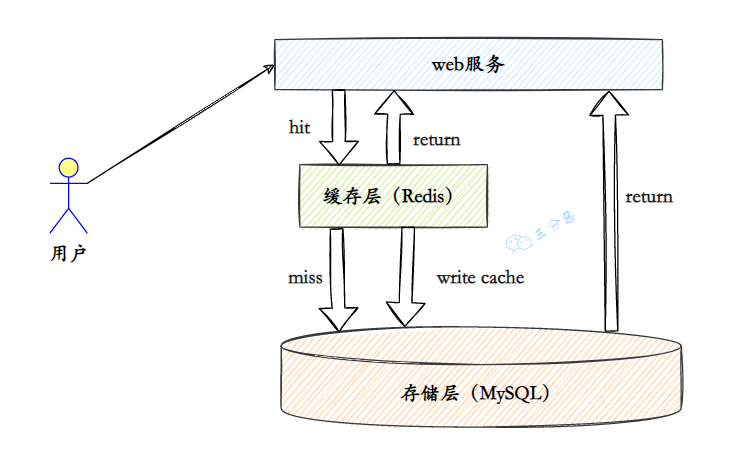

②、排行榜/计数器

Redis 的 ZSet 非常适合用来实现排行榜的功能，可以根据 score（分值）进行排序，实时展示用户的活跃度。

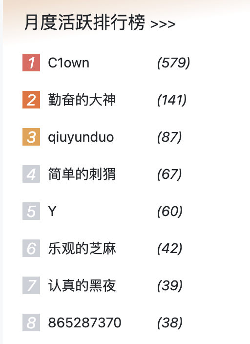

同时 Redis 的原子递增操作可以用来实现计数器功能。

③、分布式锁

Redis 可以实现分布式锁，用来控制跨多个进程的资源访问。

### 3.Redis 有哪些数据类型？

Redis 有五种基本数据类型，这五种数据类型分别是：string（字符串）、hash（哈希）、list（列表）、set（集合）、sorted set（有序集合，也叫 zset）。

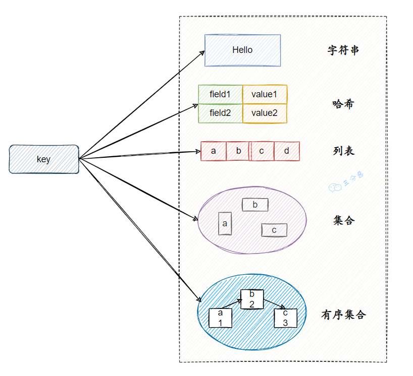

#### 简单介绍下 string？

字符串是最基础的数据类型，key 是一个字符串，不用多说，value 可以是：

- 字符串（简单的字符串、复杂的字符串（例如 JSON、XML））
- 数字 （整数、浮点数）
- 甚至是二进制（图片、音频、视频），但最大不能超过 512MB。

字符串主要有以下几个典型的使用场景：

- 缓存功能
- 计数
- 共享 Session
- 限速

#### 简单介绍下 hash？

键值对集合，key 是字符串，value 是一个 Map 集合，比如说 `value = {name: '隔壁老王', age: 18}`，name 和 age 属于字段 field，隔壁老王 和 18 属于值 value。

哈希主要有以下两个典型应用场景：

- 缓存用户信息
- 缓存对象

#### 什么时候使用 hash 类型而不使用 string 类型序列化存储？

来感受一下，使用字符串类型存储用户信息和使用哈希类型存储用户信息的区别：

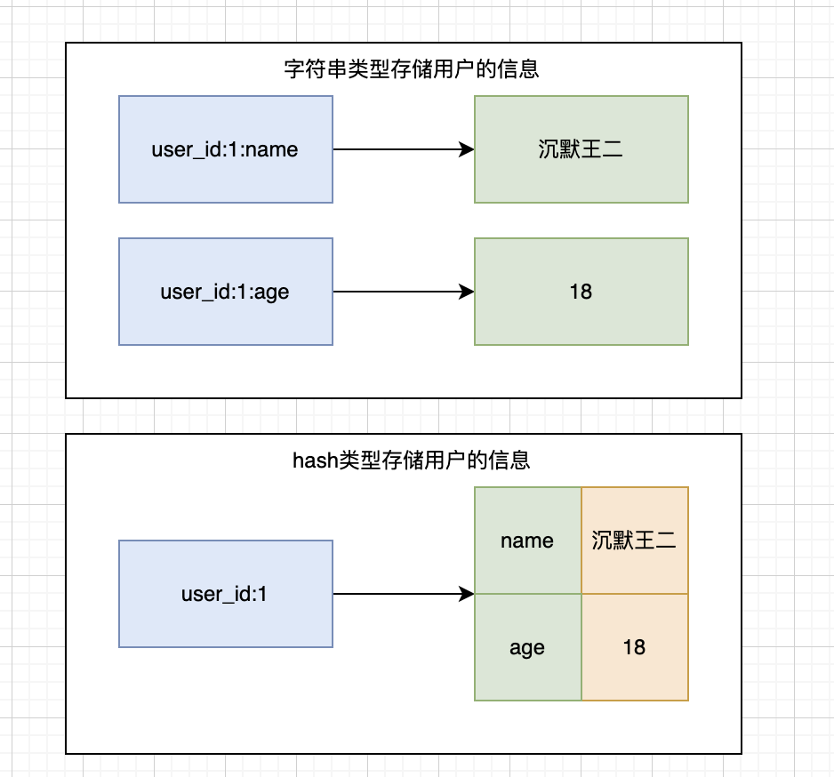

可以看得出，使用 hash 比使用 string 更便于进行序列化，我们可以将一整个用户对象序列化，然后作为一个 value 存储在 Redis 中，存取更加便捷。

#### 简单介绍下 list？

list 是一个简单的字符串列表，按照插入顺序排序。可以添加一个元素到列表的头部（左边）或者尾部（右边）。

列表主要有以下两个使用场景：

- 消息队列
- 文章列表

#### 简单介绍下 set？

Set 是一个无序集合，元素是唯一的，不允许重复。

#### 简单介绍下 zset？

Zset 是有序集合，比 set 多了一个排序属性 score。

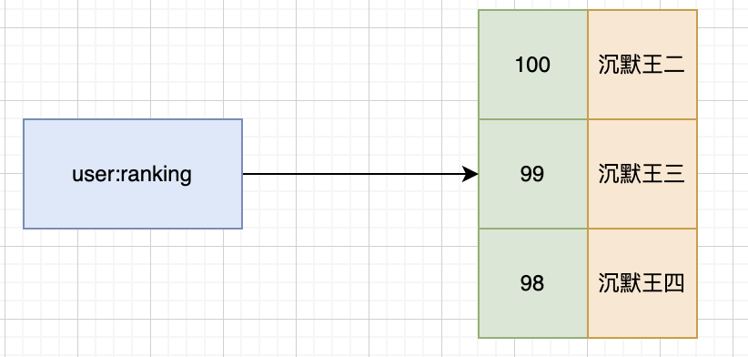

可以用来实现排行榜，比如[实战项目](https://javabetter.cn/zhishixingqiu/paicoding.html)中，我们就使用了 Zset 来实现用户活跃排行榜。

### 4.Redis 为什么快呢？

Redis 的速度⾮常快，单机的 Redis 就可以⽀撑每秒十几万的并发，性能是 MySQL 的⼏⼗倍。原因主要有⼏点：

①、**基于内存的数据存储**，Redis 将数据存储在内存当中，使得数据的读写操作避开了磁盘 I/O。而内存的访问速度远超硬盘，这是 Redis 读写速度快的根本原因。

②、**单线程模型**，Redis 使用单线程模型来处理客户端的请求，这意味着在任何时刻只有一个命令在执行。这样就避免了线程切换和锁竞争带来的消耗。

③、**IO 多路复⽤**，基于 Linux 的 select/epoll 机制。该机制允许内核中同时存在多个监听套接字和已连接套接字，内核会一直监听这些套接字上的连接请求或者数据请求，一旦有请求到达，就会交给 Redis 处理，就实现了所谓的 Redis 单个线程处理多个 IO 读写的请求。


④、**高效的数据结构**，Redis 提供了多种高效的数据结构，如字符串（String）、列表（List）、集合（Set）、有序集合（Sorted Set）等，这些数据结构经过了高度优化，能够支持快速的数据操作。

### 5.能说一下 I/O 多路复用吗？

IO 多路复用是一种高效管理多个 IO 事件的技术，通过单线程监控多个文件描述符（fd），实现高并发的 IO 操作。

常见的 I/O 多路复用机制包括 select、poll 和 epoll 等。

| 特性           | `select`             | `poll`         | `epoll`              |
| -------------- | -------------------- | -------------- | -------------------- |
| 文件描述符限制 | 受 `FD_SETSIZE` 限制 | 无限制         | 无限制               |
| 时间复杂度     | O(n)                 | O(n)           | O(1)                 |
| 数据复制       | 需要                 | 需要           | 不需要               |
| 工作方式       | 线性扫描             | 线性扫描       | 事件通知             |
| 内核支持       | 所有 UNIX 系统       | 所有 UNIX 系统 | Linux 2.6 及以上版本 |
| 适用场景       | 少量连接             | 中等连接       | 大量并发连接         |


比如说你是一名数学老师，上课时提出了一个问题：“今天谁来证明一下勾股定律？”

同学小王举手，你就让小王回答；小李举手，你就让小李回答；小张举手，你就让小张回答。

这种模式就是 IO 多路复用，你只需要在讲台上等，谁举手谁回答，不需要一个一个去问。


Redis 就是使用 epoll 这样的 I/O 多路复用机制，在单线程模型下实现高效的网络 I/O，从而支持高并发的请求处理。

#### 举例子说一下 I/O 多路复用？

假设你是一个老师，让 30 个学生解答一道题目，然后检查学生做的是否正确，你有下面几个选择：

- 第一种选择：按顺序逐个检查，先检查 A，然后是 B，之后是 C、D。。。这中间如果有一个学生卡住，全班都会被耽误。这种模式就好比，你用循环挨个处理 socket，根本不具有并发能力。
- 第二种选择：你创建 30 个分身，每个分身检查一个学生的答案是否正确。 这种类似于为每一个用户创建一个进程或者线程处理连接。
- 第三种选择，你站在讲台上等，谁解答完谁举手。这时 C、D 举手，表示他们解答问题完毕，你下去依次检查 C、D 的答案，然后继续回到讲台上等。此时 E、A 又举手，然后去处理 E 和 A。

第一种就是阻塞 IO 模型，第三种就是 I/O 复用模型。

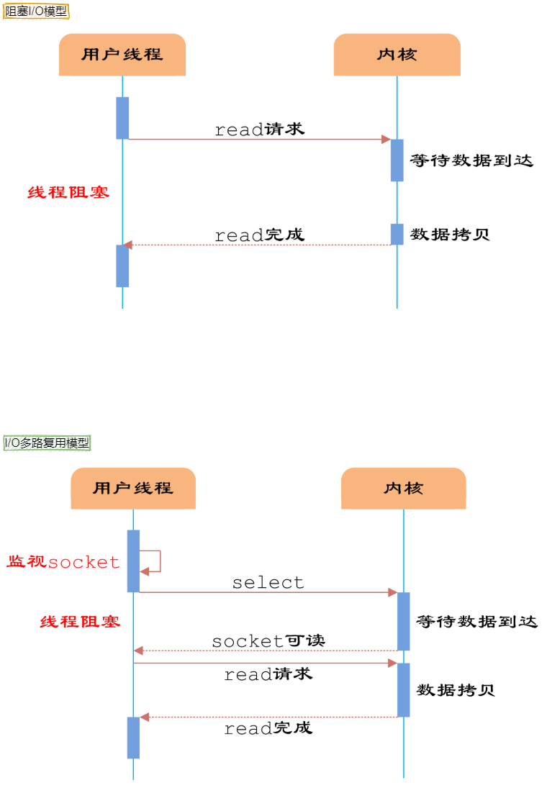

Linux 系统有三种方式实现 IO 多路复用：select、poll 和 epoll。

例如 epoll 方式是将用户 socket 对应的 fd 注册进 epoll，然后 epoll 帮你监听哪些 socket 上有消息到达，这样就避免了大量的无用操作。此时的 socket 应该采用非阻塞模式。

这样，整个过程只在进行 select、poll、epoll 这些调用的时候才会阻塞，收发客户消息是不会阻塞的，整个进程或者线程就被充分利用起来，这就是事件驱动，所谓的 reactor 模式。

#### select、poll 和 epoll 的实现原理？

select 使用位图管理 fd，每次调用都需要将 fd 集合从用户态复制到内核态。最大支持 1024 个文件描述符。

poll 使用动态数组管理 fd，突破了 select 的数量限制。

epoll 使用红黑树和链表管理 fd，每次调用只需要将 fd 集合从用户态复制到内核态一次，不需要重复复制。

### 6. Redis 为什么早期选择单线程？

官方解释：https://redis.io/topics/faq

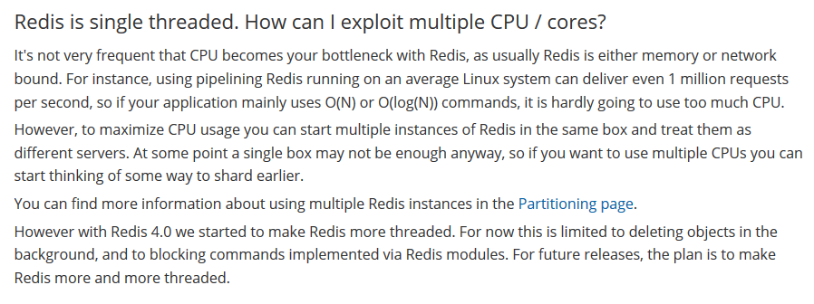
官方 FAQ 表示，因为 Redis 是基于内存的操作，CPU 成为 Redis 的瓶颈的情况很少见，Redis 的瓶颈最有可能是内存的大小或者网络限制。

如果想要最大程度利用 CPU，可以在一台机器上启动多个 Redis 实例。

PS：网上有这样的回答，吐槽官方的解释有些敷衍，其实就是历史原因，开发者嫌多线程麻烦，后来这个 CPU 的利用问题就被抛给了使用者。

同时 FAQ 里还提到了， Redis 4.0 之后开始变成多线程，除了主线程外，它也有后台线程在处理一些较为缓慢的操作，例如清理脏数据、无用连接的释放、大 Key 的删除等等。

> Redis 早期选择单线程是因为它主要在内存中操作数据，性能瓶颈不在 CPU，而在网络 I/O。单线程避免了多线程的锁竞争和上下文切换开销，加上 I/O 多路复用机制，已经足以支撑高并发。

### 7.Redis 6.0 使用多线程是怎么回事?

Redis6.0的多线程是⽤多线程来处理数据的读写和协议解析，但是Redis执⾏命令还是单线程的。

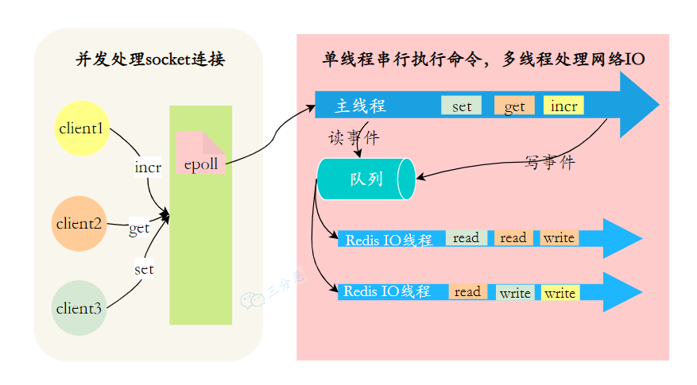

这样做的⽬的是因为Redis的性能瓶颈在于网络IO而非CPU，使⽤多线程能提升IO读写的效率，从而整体提⾼Redis的性能。

### 8.:star2:说说 Redis 常用命令

①、操作`字符串`的命令有：

- `SET key value`：设置键 key 的值为 value。
- `GET key`：获取键 key 的值。
- `DEL key`：删除键 key。
- `INCR key`：将键 key 存储的数值增一。
- `DECR key`：将键 key 存储的数值减一。

②、操作`列表`的命令有：

- `LPUSH key value`：将一个值插入到列表 key 的头部。
- `RPUSH key value`：将一个值插入到列表 key 的尾部。
- `LPOP key`：移除并返回列表 key 的头元素。
- `RPOP key`：移除并返回列表 key 的尾元素。
- `LRANGE key start stop`：获取列表 key 中指定范围内的元素。

③、操作`集合`的命令有：

- `SADD key member`：向集合 key 添加一个元素。
- `SREM key member`：从集合 key 中移除一个元素。
- `SMEMBERS key`：返回集合 key 中的所有元素。

④、操作`有序集合`的命令有：

- `ZADD key score member`：向有序集合 key 添加一个成员，或更新其分数。
- `ZRANGE key start stop [WITHSCORES]`：按照索引区间返回有序集合 key 中的成员，可选 WITHSCORES 参数返回分数。
- `ZREVRANGE key start stop [WITHSCORES]`：返回有序集合 key 中，指定区间内的成员，按分数递减。
- `ZREM key member`：移除有序集合 key 中的一个或多个成员。

⑤、操作`哈希`的命令有：

- `HSET key field value`：向键为 key 的哈希表中设置字段 field 的值为 value。
- `HGET key field`：获取键为 key 的哈希表中字段 field 的值。
- `HGETALL key`：获取键为 key 的哈希表中所有的字段和值。
- `HDEL key field`：删除键为 key 的哈希表中的一个或多个字段。

#### 详细说说 set 命令？

在 Redis 中，设置键值对的命令是 set。set 命令有几个常用的参数：

①、可以通过 EX 或 PX 为键设置过期时间（秒或毫秒）

```shell
redis-cli SET session_id "xyz" EX 3600  # 设置键 session_id，值为 "xyz"，过期时间为 3600 秒
```

②、NX 选项表示只有键不存在时才设置

```shell
redis-cli SET lock_key "locked" NX
```

③、XX 选项表示只有键存在时才设置

```shell
redis-cli SET config "new_config" XX
```

#### sadd 命令的时间复杂度是多少？

向指定 Set 中添加 1 个或多个 member，如果指定 Set 不存在，会自动创建一个。**时间复杂度 O(N)** ，N 为添加的 member 个数。

#### incr命令了解吗？

INCR 命令是 Redis 中的一个原子操作，用于将存储在 key 中的数值加 1。

Redis 的单线程模型确保了每个命令都是原子执行的，不会被其他命令打断。

### 9.单线程 Redis 的 QPS 是多少？

Redis 的 QPS（Queries Per Second，每秒查询率）受多种因素影响，包括硬件配置（如 CPU、内存、网络带宽）、数据模型、命令类型、网络延迟等。

根据官方的基准测试，一个普通服务器的 Redis 实例通常可以达到每秒数万到几十万的 QPS。

可以通过 `redis-benchmark` 命令进行基准测试：

```shell
redis-benchmark -h 127.0.0.1 -p 6379 -c 50 -n 10000
```

- `-h`：指定 Redis 服务器的地址，默认是 127.0.0.1。
- `-p`：指定 Redis 服务器的端口，默认是 6379。
- `-c`：并发连接数，即同时有多少个客户端在进行测试。
- `-n`：请求总数，即测试过程中总共要执行多少个请求。

我本机是一台 macOS，4 GHz 四核 Intel Core i7，32 GB 1867 MHz DDR3，测试结果如下：


## 持久化

### 10.Redis 持久化⽅式有哪些？有什么区别？

Redis 的持久化机制保证了 Redis 服务器在重启后数据不丢失，通过 RDB 和 AOF 文件来恢复内存中原有的数据。

这两种持久化方式可以单独使用，也可以同时使用。

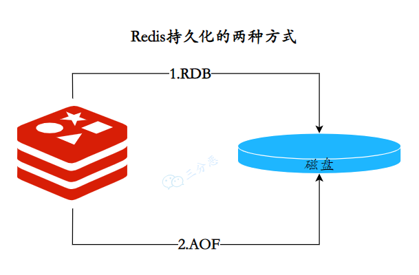

#### 说一下 RDB？

RDB持久化是把当前进程数据⽣成快照保存到硬盘的过程，触发RDB持久化过程分为⼿动触发和⾃动
触发。

RDB⽂件是⼀个压缩的⼆进制⽂件，通过它可以还原某个时刻数据库的状态。由于RDB⽂件是保存在
硬盘上的，所以即使Redis崩溃或者退出，只要RDB⽂件存在，就可以⽤它来恢复还原数据库的状态。


**手动触发分别对应save和bgsave命令:**


- `save`命令：阻塞当前Redis服务器，直到RDB过程完成为⽌，对于内存⽐较⼤的实例会造成长时间阻塞，线上环境不建议使⽤。 
- `bgsave`命令：Redis进程执行fork操作创建⼦进程，RDB持久化过程由⼦进程负责，完成后⾃动结束。阻塞只发⽣在fork阶段，⼀般时间很短。

> 以下场景会自动触发 RDB 持久化：

- 使⽤save相关配置，如“save m n”。表⽰m秒内数据集存在n次修改时，⾃动触发bgsave。
- 如果从节点执⾏全量复制操作，主节点⾃动执⾏bgsave⽣成RDB⽂件并发送给从节点
- 执⾏debug reload命令重新加载Redis时，也会⾃动触发save操作
- 默认情况下执⾏shutdown命令时，如果没有开启AOF持久化功能则⾃动执⾏bgsave。

#### 说一下 AOF？

AOF（append only file）持久化：以独⽴⽇志的⽅式记录每次写命令， 重启时再重新执⾏AOF⽂件中的命令达到恢复数据的⽬的。AOF的主要作⽤是解决了数据持久化的实时性，⽬前已经是Redis持久化的主流⽅式。 

AOF的⼯作流程操作：命令写⼊ （append）、⽂件同步（sync）、⽂件重写（rewrite）、重启加载  （load）


1）当 AOF 持久化机制被启用时，Redis 服务器会将接收到的所有写命令追加到 AOF 缓冲区的末尾。

2）接着将缓冲区中的命令刷新到磁盘的 AOF 文件中，刷新策略有三种：

- always：每次写命令都会同步到 AOF 文件。
- everysec（默认）：每秒同步一次。如果系统崩溃，可能会丢失最后一秒的数据。
- no：在这种模式下，如果发生宕机，那么丢失的数据量由操作系统内核的缓存冲洗策略决定。

3）随着 AOF 文件的不断增长，Redis 会启用重写机制来生成一个更小的 AOF 文件：

- 将内存中每个键值对的当前状态转换为一条最简单的 Redis 命令，写入到一个新的 AOF 文件中。即使某个键被修改了多次，在新的 AOF 文件中也只会保留最终的状态。
- Redis 会 fork 一个子进程，子进程负责重写 AOF 文件，主进程不会被阻塞。

```
主进程（fork）  
   │  
   ├─→ 子进程（生成新的 AOF 文件）  
   │       │  
   │       ├─→ 内存快照  
   │       ├─→ 写入临时 AOF 文件  
   │       ├─→ 通知主进程完成  
   │  
   ├─→ 主进程（追加缓冲区到新 AOF 文件）  
   ├─→ 替换旧 AOF 文件  
   ├─→ 重写完成
```

4）当 Redis 服务器重启时，会读取 AOF 文件中的所有命令并重新执行它们，以恢复重启前的内存状态。

#### AOF 文件存储的是什么类型的数据？

AOF 文件存储的是 Redis 所有的写操作命令，比如 SET、HSET、INCR 等。


#### AOF重写期间命令可能会写入两次，会造成什么影响？

AOF 重写期间，Redis 会将新的写命令同时写入旧的 AOF 文件和重写缓冲区。

这样会带来额外的磁盘开销。

但可以防止在 AOF 重写尚未完成时，Redis 发生崩溃，导致数据丢失。即使重写失败，旧的 AOF 文件仍然是完整的。

当重写完成后，会通过原子操作将新的 AOF 文件替换旧的 AOF 文件。


### 11.RDB 和 AOF 各自有什么优缺点？

> RDB | 优点

1. 只有⼀个紧凑的⼆进制⽂件 dump.rdb ，⾮常适合备份、全量复制的场景。
2. 容灾性好，可以把RDB⽂件拷贝到远程机器或者⽂件系统中，⽤于容灾恢复。
3. 恢复速度快，RDB恢复数据的速度远远快于AOF的⽅式

> RDB | 缺点

1. 实时性低，RDB 是间隔⼀段时间进⾏持久化，没法做到实时持久化/秒级持久化。如果在这⼀间
    隔事件发⽣故障，数据会丢失。
2. 存在兼容问题，Redis演进过程存在多个格式的RDB版本，存在⽼版本Redis⽆法兼容新版本
    RDB的问题。

> AOF | 优点

1. 实时性好，aof 持久化可以配置 appendfsync 属性，有 always ，每进⾏⼀次命令操作就记录
    到 aof ⽂件中⼀次。
2. 通过 append 模式写⽂件，即使中途服务器宕机，可以通过 redis-check-aof ⼯具解决数据⼀致
    性问题。

> AOF | 缺点

1. AOF ⽂件⽐ RDB ⽂件⼤，且恢复速度慢。
2. 数据集⼤的时候，比 RDB 启动效率低。

### 12.RDB 和 AOF 如何选择？

在选择 Redis 持久化方案时，会从业务需求和技术特性两个维度来考虑。
如果是缓存场景，可以接受一定程度的数据丢失，会倾向于选择 RDB 或者完全不使用持久化。RDB 的快照方式对性能影响小，而且恢复速度快，非常适合这类场景。

Redis 做缓存
但如果是处理订单或者支付这样的核心业务，数据丢失将造成严重后果，那么 AOF 就成为必然选择。通过配置每秒同步一次，可以将潜在的数据丢失风险限制在可接受范围内。

reids 在秒杀中的应用
在实际的项目当中，我更偏向于使用 RDB + AOF 的混合模式。RDB 作为冷备，AOF 作为实时同步
appendonly yes # 开启 AOF
appendfsync everysec # 每秒刷盘一次
aof-use-rdb-preamble yes # 开启混合持久化，重启时优先加载 RDB，RDB 作为冷备，AOF 作为实时同步

### 13.Redis 的数据恢复？

当 Redis 中的数据丢失时，可以从 RDB 或者 AOF 中恢复数据。

可以将 RDB 文件或者 AOF 文件复制到 Redis 的数据目录下，然后重启 Redis 服务，Redis 会自动加载数据文件并恢复数据。

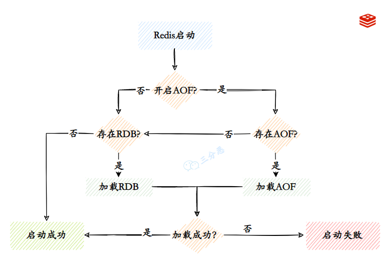

**Redis** 启动时加载数据的流程：

1. AOF 开启且存在 AOF 文件时，优先加载 AOF 文件。
2. AOF 关闭或者 AOF 文件不存在时，加载 RDB 文件。

### 14.Redis 4.0 的混合持久化了解吗？

重启 Redis 时，我们很少使⽤  RDB 来恢复内存状态，因为会丢失⼤量数据。我们通常使⽤ AOF 日志重放，但是重放 AOF 日志性能相对RDB来说要慢很多，这样在 Redis 实例很⼤的情况下，启动需要花费很长的时间。 

Redis 4.0 为了解决这个问题，带来了⼀个新的持久化选项——混合持久化。将  rdb ⽂件的内容和增量的 AOF ⽇志⽂件存在⼀起。这⾥的 AOF ⽇志不再是全量的⽇志，⽽是⾃持久化开始到持久化结束的这段时间发⽣的增量AOF⽇志，通常这部分 AOF 日志很小：

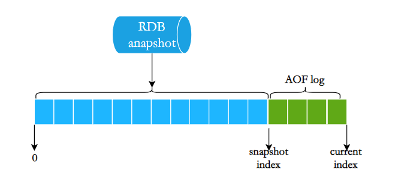

于是在 Redis 重启的时候，可以先加载  rdb 的内容，然后再重放增量 AOF ⽇志就可以完全替代之前的 AOF 全量⽂件重放，重启效率因此⼤幅得到提升。

#### 如何设置持久化模式？

可以通过编辑 Redis 的配置文件 redis.conf 来进行设置，或者在运行时通过 Redis 命令行动态调整。

RDB 持久化通过在配置文件中设置快照（snapshotting）规则来启用。这些规则定义了在多少秒内如果有多少个键被修改，则自动执行一次持久化操作。

```shell
save 900 1      # 如果至少有1个键被修改，900秒后自动保存一次
save 300 10     # 如果至少有10个键被修改，300秒后自动保存一次
save 60 10000   # 如果至少有10000个键被修改，60秒后自动保存一次
```

AOF 持久化是通过在配置文件中设置 appendonly 参数为 yes 来启用的：

```shell
appendonly yes
```

此外，还可以配置 AOF 文件的写入频率，这是通过 appendfsync 设置的：

```shell
appendfsync always    # 每次写入数据都同步，保证数据不丢失，但性能较低
appendfsync everysec  # 每秒同步一次，折衷方案
appendfsync no        # 由操作系统决定何时同步，性能最好，但数据安全性最低
```

为了优化 AOF 文件的大小，Redis 允许自动或手动重写 AOF 文件。可以在配置文件中设置重写的触发条件：

```shell
auto-aof-rewrite-percentage 100  # 增长到原大小的100%时触发重写
auto-aof-rewrite-min-size 64mb   # AOF 文件至少达到64MB时才考虑重写
```

手动执行 AOF 重写的命令是：

```shell
redis-cli bgrewriteaof
```

如果决定同时使用 RDB 和 AOF，可以在配置文件中同时启用两者。

```shell
save 900 1
appendonly yes
```

还可以在运行时动态更改：

```shell
redis-cli config set save "900 1 300 10 60 10000"
redis-cli config set appendonly yes
redis-cli config set appendfsync everysec
```

## 高可用

Redis 除了单机部署外，还可以通过主从复制、哨兵模式和集群模式来实现高可用。

**主从复制**：允许一个 Redis 服务器（主节点）将数据复制到一个或多个 Redis 服务器（从节点）。这种方式可以实现读写分离，适合读多写少的场景。

**哨兵模式**：用于监控主节点和从节点的状态，实现自动故障转移。如果主节点发生故障，哨兵可以自动将一个从节点升级为新的主节点。

**集群模式**：Redis 集群通过分片的方式存储数据，每个节点存储数据的一部分，用户请求可以并行处理。集群模式支持自动分区、故障转移，并且可以在不停机的情况下进行节点增加或删除。

### 15.主从复制了解吗？

主从复制是指将一台 Redis 服务器的数据，复制到其他的 Redis 服务器。

前者称为主节点 master，后者称为从节点slave。且数据的复制是单向的，只能由主节点到从节点。

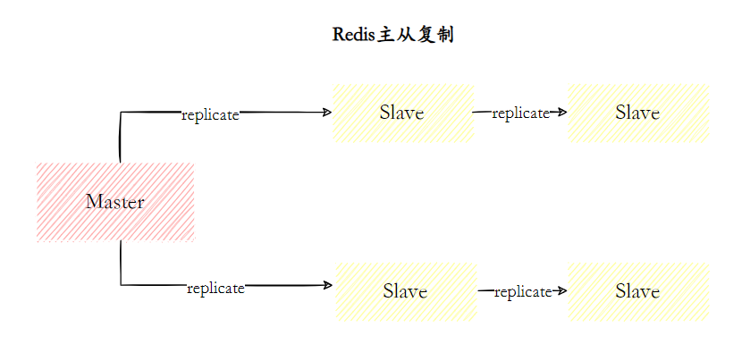

在 Redis 主从架构中，主节点负责处理所有的写操作，并将这些操作异步复制到从节点。从节点主要用于读取操作，以分担主节点的压力和提高读性能。

#### 主从复制主要的作用是什么?

- 数据冗余： 主从复制实现了数据的热备份，是持久化之外的⼀种数据冗余⽅式。 
- 故障恢复： 当主节点出现问题时，可以由从节点提供服务，实现快速的故障恢复 (实际上是⼀种 服务的冗余)。 
- 负载均衡： 在主从复制的基础上，配合读写分离，可以由主节点提供写服务，由从节点提供读服务（即写 Redis 数据时应⽤连接主节点，读 Redis 数据时应⽤连接从节点），分担服务器负载。 尤其是在写少读多的场景下，通过多个从节点分担读负载，可以⼤⼤提⾼ Redis 服务器的并发量。 
- 高可用基石：除了上述作⽤以外，主从复制还是哨兵和集群能够实施的基础，因此说主从复制是 Redis⾼可⽤的基础。

#### 主从复制出现数据不一致怎么办？

Redis 的主从复制是异步进行的，这意味着主节点在执行完写操作后，会立即返回给客户端，而不是等待从节点完成数据同步。

在主节点将数据同步到从节点的过程中，可能会出现网络延迟或中断，从而导致从节点的数据滞后于主节点。

为了解决数据不一致的问题，应该尽量保证主从节点之间的网络连接状况良好，比如说避免在不同机房之间部署主从节点，以减少网络延迟。但可能会带来新的问题，就是整个机房都挂掉的情况。

此外，Redis 本身也提供了一些机制来解决数据不一致的问题，比如说通过 Redis 的 `INFO replication` 命令监控主从节点的复制进度，及时发现和处理复制延迟。

具体做法是获取主节点的 master_repl_offset 和从节点的 slave_repl_offset，计算两者的差值。如果差值超过预设的阈值，采取措施（如停止从节点的数据读取）以减少读到不一致数据的情况。

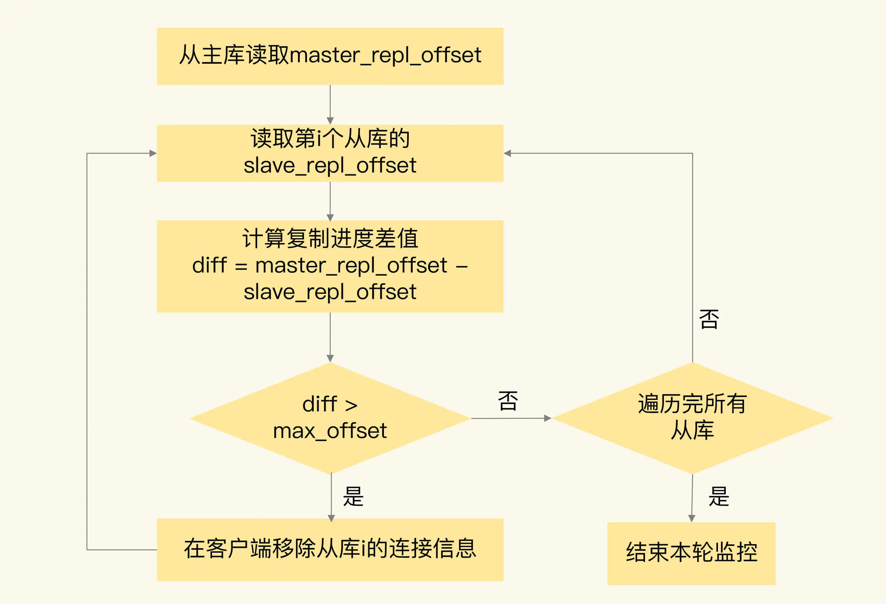

#### Redis解决单点故障主要靠什么？

主从复制，当主节点发生故障时，可以通过手动或自动方式将某个从节点提升为新的主节点，继续对外提供服务，从而避免单点故障。

Redis 的哨兵机制（Sentinel）可以实现自动化的故障转移，当主节点宕机时，哨兵会自动将一个从节点升级为新的主节点。

另外，集群模式下，当某个节点发生故障时，Redis Cluster 会自动将请求路由到其他节点，并通过从节点进行故障恢复。


### 16.Redis 主从有几种常见的拓扑结构？

Redis 的复制拓扑结构可以支持单层或多层复制关系，根据拓扑复杂性可以分为以下三种：一主一从、一主多从、树状主从结构。

1.一主一从结构

一主一从结构是最简单的复制拓扑结构，用于主节点出现宕机时从节点提供故障转移支持。

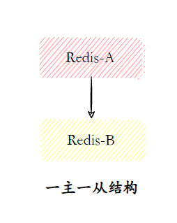 2.一主多从结构

一主多从结构（又称为星形拓扑结构）使得应用端可以利用多个从节点实现读写分离（见图 6-5）。对于读占比较大的场景，可以把读命令发送到从节点来分担主节点压力。

 3.树状主从结构

树状主从结构（又称为树状拓扑结构）使得从节点不但可以复制主节点数据，同时可以作为其他从节点的主节点继续向下层复制。通过引入复制中间层，可以有效降低主节点负载和需要传送给从节点的数据量。


### 17.Redis 的主从复制原理了解吗？

Redis 主从复制的工作流程大概可以分为如下几步：
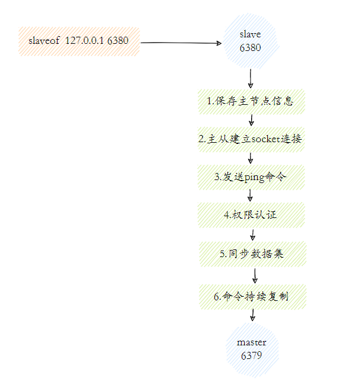

1.  保存主节点（master）信息
    这一步只是保存主节点信息，保存主节点的 ip 和 port。
2.  主从建立连接
    从节点（slave）发现新的主节点后，会尝试和主节点建立网络连接。
3.  发送 ping 命令
    连接建立成功后从节点发送 ping 请求进行首次通信，主要是检测主从之间网络套接字是否可用、主节点当前是否可接受处理命令。
4.  权限验证
    如果主节点要求密码验证，从节点必须正确的密码才能通过验证。
5.  同步数据集
    主从复制连接正常通信后，主节点会把持有的数据全部发送给从节点。
6.  命令持续复制
    接下来主节点会持续地把写命令发送给从节点，保证主从数据一致性。

### 18.说说主从数据同步的方式？

Redis 在 2.8 及以上版本使用 psync 命令完成主从数据同步，同步过程分为：全量复制和部分复制。


**全量复制**
一般用于初次复制场景，Redis 早期支持的复制功能只有全量复制，它会把主节点全部数据一次性发送给从节点，当数据量较大时，会对主从节点和网络造成很大的开销。

全量复制的完整运行流程如下：
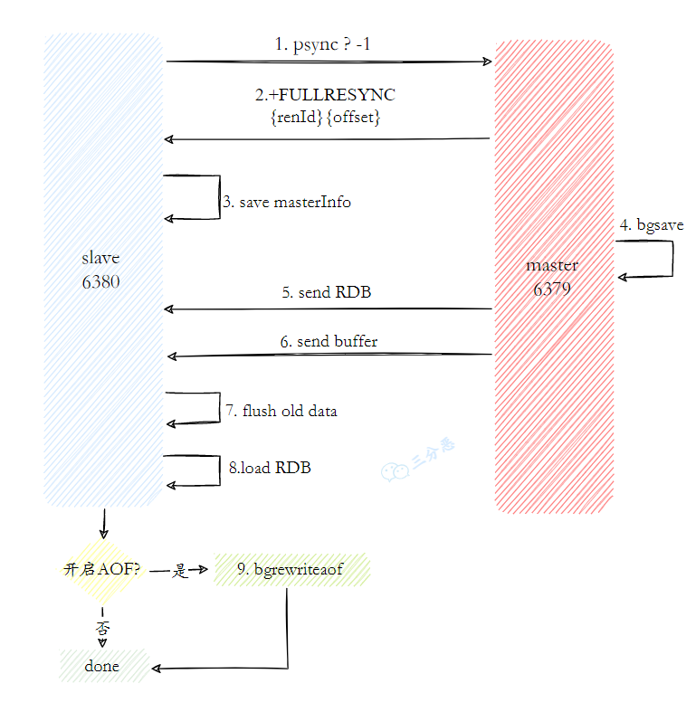

1. **从节点发送 `PSYNC` 命令**

   - 从节点连接主节点时，发送 `PSYNC {runid} {offset}`。

   - `runid`：上一次连接时主节点的唯一标识（第一次为 `?`）。

   - `offset`：从节点已复制的偏移量（第一次为 `-1`）。

2. **主节点判断能否部分复制**
   - 如果主节点不认识这个 `runid` 或者从节点 `offset` 太旧（超出 backlog），则返回 `FULLRESYNC`。

3. **主节点创建 RDB 快照**

   - 主节点 fork 出子进程生成 RDB 文件（快照）

   - 同时把后续写命令写入 **复制积压缓冲区（backlog buffer）**

4. **主节点发送 RDB 给从节点**

   - 从节点清空旧数据

   - 接收 RDB 并加载到内存

5. **主节点发送 backlog 缓冲区里的增量命令**
   - 保证 RDB 生成期间遗漏的写操作也能补齐

6. **进入命令传播阶段**

   - 主节点把之后的写命令实时发送给从节点

   - 保持主从数据一致

> **复制积压缓冲区:**主节点维护的一个定长环形队列，决定了从节点断线后能否部分复制
>
> 可以看做一张可重复擦写的纸，如果旧数据已经被擦除还没有同步到从节点则需要全部复制

**部分复制**
部分复制主要是 Redis 针对全量复制的过高开销做出的一种优化措施， 使用 psync{runId}{offset}命令实现。当从节点（slave）正在复制主节点 （master）时，如果出现网络闪断或者命令丢失等异常情况时，从节点会向 主节点要求补发丢失的命令数据，如果主节点的复制积压缓冲区内存在这部分数据则直接发送给从节点，这样就可以保持主从节点复制的一致性。

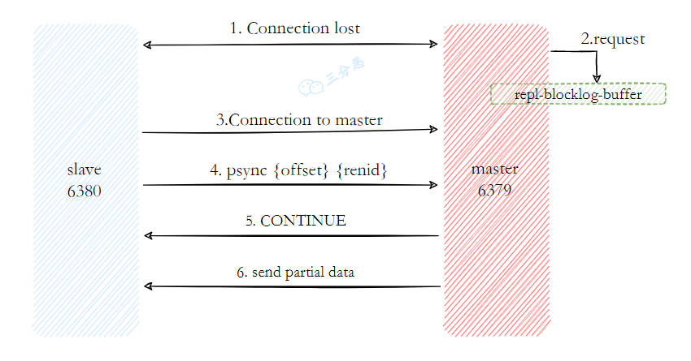

1.  **从节点重连时发送 `PSYNC {runid} {offset}`**
    - runid：之前的主节点 ID
    - offset：上次复制到的位置
2.  **主节点检查**
    - 如果 runid 匹配，并且 offset 在 **backlog buffer** 中还在（没有被覆盖），就可以部分复制
    - 主节点返回 `CONTINUE` 表示支持部分复制
3.  **主节点发送 backlog 中缺失的命令**
    - 从 offset+1 开始，把缺失的数据补发给从节点
4.  **进入命令传播阶段**
    - 后续实时同步写命令

### 19.主从复制存在哪些问题呢？

主从复制虽好，但也存在⼀些问题： 

- ⼀旦主节点出现故障，需要⼿动将⼀个从节点晋升为主节点，同时需要修改应⽤⽅的主节点地址， 还需要命令其他从节点去复制新的主节点，整个过程都需要⼈⼯⼲预。  
- 主节点的写能⼒受到单机的限制。  
- 主节点的存储能⼒受到单机的限制。 

第⼀个问题是Redis的⾼可⽤问题，第⼆、三个问题属于Redis的分布式问题。

#### 脑裂问题了解吗？

Redis 的脑裂问题是指在主从模式或集群模式下，由于网络分区或节点故障，可能导致系统中出现多个主节点，从而引发数据不一致、数据丢失等问题。

可以通过 Sentinel 模式和 Cluster 模式中的投票机制和强制下线机制来解决。

### 20.Redis 哨兵了解吗？

哨兵（Sentinel）机制是 Redis 提供的一个高可用性解决方案，主要用来监控 Redis 主从架构中的实例，并在主节点出现故障时，自动进行故障转移。


Redis Sentinel ，它由两部分组成，哨兵节点和数据节点：

- 哨兵节点： 哨兵系统由⼀个或多个哨兵节点组成，哨兵节点是特殊的 Redis 节点，不存储数据， 对数据节点进⾏监控。 

- 数据节点： 主节点和从节点都是数据节点； 

在复制的基础上，哨兵实现了⾃动化的故障恢复功能，下⾯是官⽅对于哨兵功能的描述： 

- 监控（Monitoring）： 哨兵会不断地检查主节点和从节点是否运作正常。
- ⾃动故障转移（Automatic failover）：当主节点不能正常⼯作时，哨兵会开始⾃动故障转移 操作，它会将失效主节点的其中⼀个从节点升级为新的主节点，并让其他从节点改为复制新的主节点。 
- 配置提供者（Configuration provider）：客户端在初始化时，通过连接哨兵来获得当前 Redis  服务的主节点地址。 
- 通知（Notification）： 哨兵可以将故障转移的结果发送给客户端。 其中，监控和⾃动故障转移功能，使得哨兵可以及时发现主节点故障并完成转移。⽽配置提供者和通知功能，则需要在与客户端的交互中才能体现。

### 21.Redis 哨兵实现原理知道吗？

哨兵的工作流程包括定时监控、主观下线和客观下线、领导者 Sentinel 节点选举、故障转移等。


每个 Sentinel 实例会定期通过 PING 命令向主节点和从节点发送心跳包。


如果一个节点长时间没有响应 PING 命令，Sentinel 会将该节点标记为主观下线。当多个 Sentinel 同时认为一个节点不可用时，该节点被标记为客观下线。

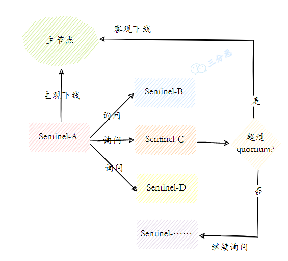

当主节点被确认下线后，Sentinel 之间会通过类似 Raft 的选举算法进行协商，选出一个领导者 Sentinel 来负责执行故障转移。


1. 在从节点列表中选出⼀个节点作为新的主节点，这⼀步是相对复杂⼀些的⼀步 
2. Sentinel领导者节点会对第⼀步选出来的从节点执⾏slaveof no one命令让其成为主节点 
3. Sentinel领导者节点会向剩余的从节点发送命令，让它们成为新主节点的从节点
4. Sentinel节点集合会将原来的主节点更新为从节点，并保持着对其关注，当其恢复后命令它去复制新的主节点

### 22.领导者 Sentinel 节点选举了解吗？

Redis 使用 Raft 算法实现领导者选举的：当主节点挂掉后，新的主节点是由剩余的从节点发起选举后晋升的。

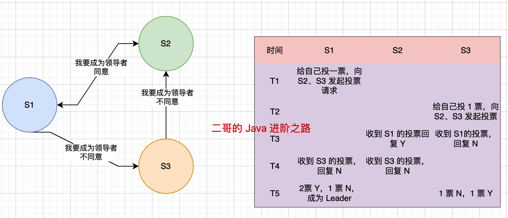

1. 每个在线的Sentinel节点都有资格成为领导者，当它确认主节点主观 下线时候，会向其他 Sentinel节点发送sentinel is-master-down-by-addr命令， 要求将⾃⼰设置为领导者。 
2. 收到命令的Sentinel节点，如果没有同意过其他Sentinel节点的sentinel is-master-down-by addr命令，将同意该请求，否则拒绝。 
3. 如果该Sentinel节点发现⾃⼰的票数已经⼤于等于max（quorum， num（sentinels）/2+1）， 那么它将成为领导者。 
4. 如果此过程没有选举出领导者，将进⼊下⼀次选举。

>`quorum`：配置文件里设置的法定票数(至少有多少 Sentinel 认为主节点下线，才触发故障转移)
>
>`num（sentinels）/2+1`：得票超过半数
>
>**两个条件都满足** 时
>
>超时时间指从节点在没有收到主节点的心跳信号或日志追加请求后，等待多长时间才会认为主节点已挂掉，从而进入候选状态并发起选举。

> 
>
> **领导者选举**：在 **Sentinel 节点**中选出一个 **Leader Sentinel** 来主导故障转移
>
> **主节点晋升**：由 Leader Sentinel 在 **从节点**中挑选一个最优的，晋升为新的主节点

### 23.新的主节点是怎样被挑选出来的？

选出新的主节点，大概分为这么几步：
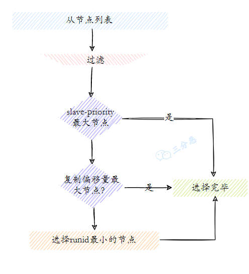

1. 过滤：“不健康”（主观下线、断线）、5秒内没有回复过Sentinel节点ping响应、与主节点失联超过down-after-milliseconds*10秒。 
2. 选择slave-priority（从节点优先级）最⾼的从节点列表，如果存在则返回，不存在则继续。  
3. 选择复制偏移量最⼤的从节点（复制的最完整），如果存在则返回，不存在则继续。  
4. 选择runid最⼩的从节点。

### 24.Redis 集群了解吗？

前面说到了主从存在高可用和分布式的问题，哨兵解决了高可用的问题，而集群就是终极方案，一举解决高可用和分布式问题。

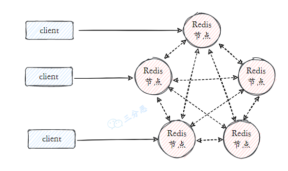

1. **数据分区：** 数据分区 _(或称数据分片)_ 是集群最核心的功能。集群将数据分散到多个节点，一方面 突破了 `Redis` 单机内存大小的限制，**存储容量大大增加**；**另一方面** 每个主节点都可以对外提供读服务和写服务，**大大提高了集群的响应能力**。

2. **高可用：** 集群支持主从复制和主节点的 **自动故障转移** _（与哨兵类似）_，当任一节点发生故障时，集群仍然可以对外提供服务。

### 25.Redis Cluster了解吗?

切片集群是一种将数据分片存储在多个 Redis 实例上的集群架构，每个 Redis 实例负责存储部分数据。比如说把 25G 的数据平均分为 5 份，每份 5G，然后启动 5 个 Redis 实例，每个实例保存一份数据。

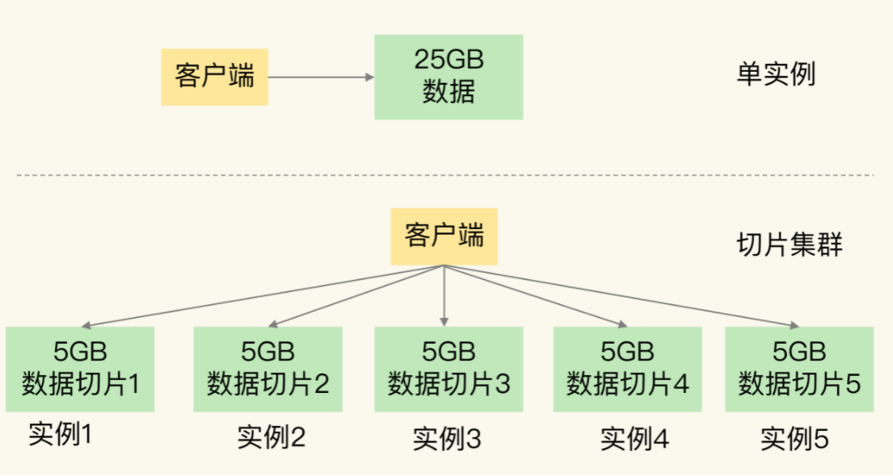

在 Redis 3.0 之前，官方并没有针对切片集群提供具体的解决方案；

但是在 Redis 3.0 之后，官方提供了 Redis Cluster，数据和实例之间的映射通过哈希槽（hash slot）来实现。

Redis Cluster 有 `16384 个哈希槽`，每个键根据其名字的 CRC16 值被映射到这些哈希槽上。然后，这些哈希槽会被均匀地分配到所有的 Redis 实例上。

> CRC16 是一种哈希算法，它可以将任意长度的输入数据映射为一个 16 位的哈希值。

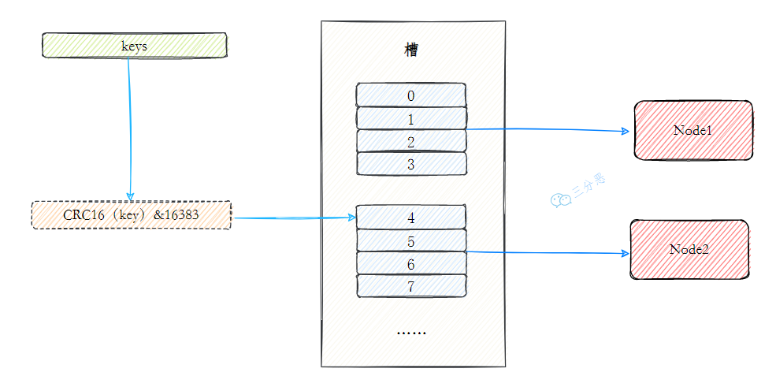

例如，如果我们有 3 个 Redis 实例，那么每个实例可能会负责大约 5461 个哈希槽。

当需要存储或检索一个键值对时，Redis Cluster 会先计算这个键的哈希槽，然后找到负责这个哈希槽的 Redis 实例，最后在这个实例上进行操作。

### 26.集群中数据如何分区？

在 Redis 集群中，数据分区是通过将数据分散到不同的节点来实现的，常见的数据分区规则有三种：节点取余分区、一致性哈希分区、虚拟槽分区。


#### ⽅案⼀：节点取余分区 

节点取余分区，⾮常好理解，使⽤特定的数据，⽐如Redis的键，或者⽤户ID之类，对响应的hash值取余：hash（key）%N，来确定数据映射到哪⼀个节点上。 不过该⽅案最⼤的问题是，当节点数量变化时，如扩容或收缩节点，数据节点映射关系需要重新计算，会导致数据的重新迁移。

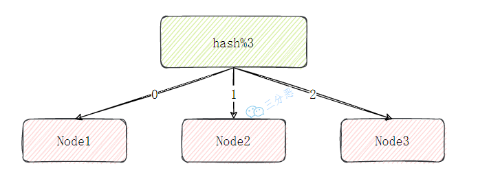

#### 说说一致性哈希分区

将整个 Hash 值空间组织成⼀个虚拟的圆环，然后将缓存节点的 IP 地址或者主机名做 Hash 取值后， 放置在这个圆环上。当我们需要确定某⼀个 Key 需要存取到哪个节点上的时候，先对这个 Key 做同样的 Hash 取值，确定在环上的位置，然后按照顺时针⽅向在环上“⾏⾛”，遇到的第⼀个缓存节点就是要访问的节点。 ⽐如说下⾯这张图⾥⾯，Key 1 和 Key 2 会落⼊到 Node 1 中，Key 3、Key 4 会落⼊到 Node 2  中，Key 5 落⼊到 Node 3 中，Key 6 落⼊到 Node 4 中。

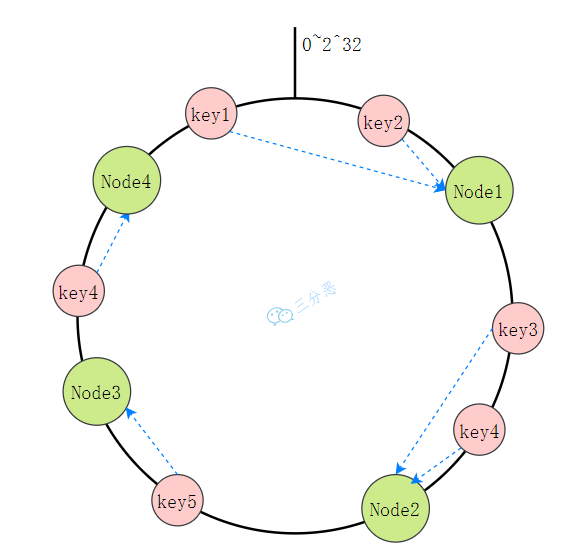

这种⽅式相⽐节点取余最⼤的好处在于加⼊和删除节点只影响哈希环中相邻的节点，对其他节点⽆影响。 

但它还是存在问题： 

- 缓存节点在圆环上分布不平均，会造成部分缓存节点的压⼒较⼤
- 当某个节点故障时，这个节点所要承担的所有访问都会被顺移到另⼀个节点上，会对后⾯这个节点造成压力。

#### ⽅案三：HASH槽分区

这个⽅案在⼀致性哈希分区的基础上，引⼊了 `虚拟节点` 的概念。Redis 集群使⽤的便是该⽅案，其中的虚拟节点称为 `槽（slot）`。槽是介于数据和实际节点之间的虚拟概念，每个实际节点包含⼀定数量的槽，每个槽包含哈希值在⼀定范围内的数据。


在使⽤了槽的⼀致性哈希分区中，槽是数据管理和迁移的基本单位。槽解耦了数据和实际节点 之间的关系，增加或删除节点对系统的影响很⼩。仍以上图为例，系统中有 4 个实际节点，假设为其分配  16 个槽(0-15)； 

- 槽 0-3 位于 node1；4-7 位于 node2；以此类推.... 

如果此时删除  node2 ，只需要将槽 4-7 重新分配即可，例如槽 4-5 分配给  node3 ，槽 7 分配给  node4 ，数据在其他节点的分布仍然较为均衡。

> **16384 个槽必须全部分配**，否则集群不可用。
>
> **分配不一定均匀**，但推荐均匀分配以避免数据和请求倾斜。

### 27.能说说 Redis 集群的原理吗？

Redis 集群通过数据分区来实现数据的分布式存储，通过自动故障转移实现高可用。

##### 集群创建

数据分区是在集群创建的时候完成的。

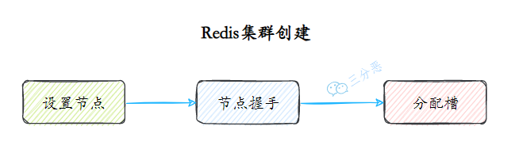

**设置节点**
Redis 集群一般由多个节点组成，节点数量至少为 6 个才能保证组成完整高可用的集群。每个节点需要开启配置 cluster-enabled yes，让 Redis 运行在集群模式下。

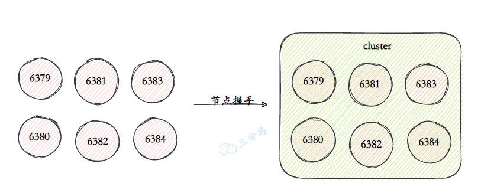

**节点握手**
节点握手是指一批运行在集群模式下的节点通过 Gossip 协议彼此通信， 达到感知对方的过程。节点握手是集群彼此通信的第一步，由客户端发起命 令：cluster meet{ip}{port}。完成节点握手之后，一个个的 Redis 节点就组成了一个多节点的集群。

**分配槽（slot）**
Redis 集群把所有的数据映射到 16384 个槽中。每个节点对应若干个槽，只有当节点分配了槽，才能响应和这些槽关联的键命令。通过 cluster addslots 命令为节点分配槽。

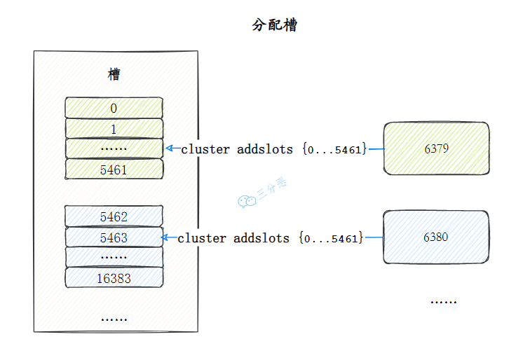

##### 故障转移

Redis 集群的故障转移和哨兵的故障转移类似，但是 Redis 集群中所有的节点都要承担状态维护的任务。

**故障发现**
Redis 集群内节点通过 ping/pong 消息实现节点通信，集群中每个节点都会定期向其他节点发送 ping 消息，接收节点回复 pong 消息作为响应。如果在 cluster-node-timeout 时间内通信一直失败，则发送节 点会认为接收节点存在故障，把接收节点标记为主观下线（pfail）状态。


当某个节点判断另一个节点主观下线后，相应的节点状态会跟随消息在集群内传播。通过 Gossip 消息传播，集群内节点不断收集到故障节点的下线报告。当 半数以上持有槽的主节点都标记某个节点是主观下线时。触发客观下线流程。


**故障恢复**

故障节点变为客观下线后，如果下线节点是持有槽的主节点则需要在它的从节点中选出一个替换它，从而保证集群的高可用。

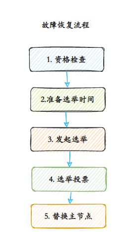

1. 资格检查
   每个从节点都要检查最后与主节点断线时间，判断是否有资格替换故障的主节点。

2. 准备选举时间
   当从节点符合故障转移资格后，更新触发故障选举的时间，只有到达该时间后才能执行后续流程。

3. 发起选举
   当从节点定时任务检测到达故障选举时间（failover_auth_time）到达后，发起选举流程。

4. 选举投票
   持有槽的主节点处理故障选举消息。投票过程其实是一个领导者选举的过程，如集群内有 N 个持有槽的主节点代表有 N 张选票。由于在每个`配置纪元（config epoch）`内持有槽的主节点只能投票给一个从节点，因此只能有一个从节点获得 N/2+1 的选票，保证能够找出唯一的从节点。

   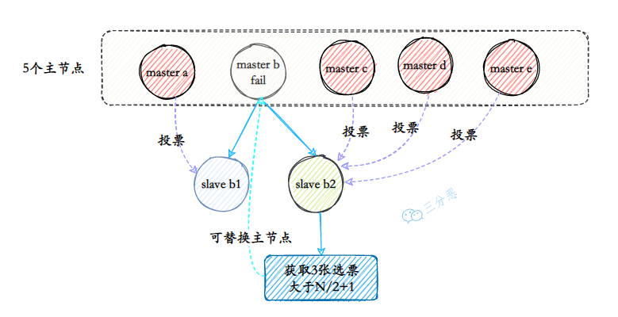

5. 替换主节点
   当从节点收集到足够的选票之后，触发替换主节点操作。

> **配置纪元（config epoch）**
> 每次发生故障转移，都会进入一个新的纪元（类似于版本号），这个纪元内，每个主节点（拥有槽的节点）只能投票一次，并且只能投票给一个候选从节点。

#### 部署 Redis 集群至少需要几个物理节点？

在投票选举的环节，故障主节点也算在投票数内，假设集群内节点规模是 3 主 3 从，其中有 2 个主节点部署在一台机器上，当这台机器宕机时，由于从节点无法收集到 3/2+1 个主节点选票将导致故障转移失败。这个问题也适用于故障发现环节。因此部署集群时所有主节点最少需要部署在 **3 台物理机**上才能避免单点问题。

### 28.说说集群的伸缩？

Redis集群提供了灵活的节点扩容和收缩⽅案，可以在不影响集群对外服务的情况下，为集群添加节点 进⾏扩容也可以下线部分节点进⾏缩容。

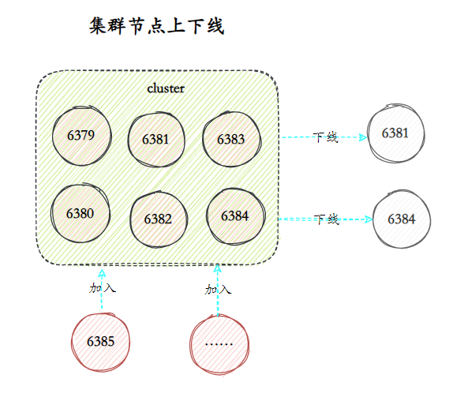

其实，集群扩容和缩容的关键点，就在于槽和节点的对应关系，扩容和缩容就是将⼀部分槽和数据迁移给新节点。

例如下⾯⼀个集群，每个节点对应若⼲个槽，每个槽对应⼀定的数据，如果希望加⼊1个节点希望实现集群扩容时，需要通过相关命令把⼀部分槽和内容迁移给新节点。缩容也是类似，先把槽和数据迁移到其它节点，再把对应的节点下线。


## 缓存设计

### 29.:star2:缓存击穿、缓存穿透、缓存雪崩了解吗？

缓存穿透、缓存击穿和缓存雪崩是指在使用 Redis 做缓存时可能遇到的三种高并发场景下的问题。

#### 什么是缓存击穿？

⼀个并发访问量⽐较⼤的key在某个时间**过期**，导致所有的请求直接打在DB上，导致数据库瞬间压力过大。

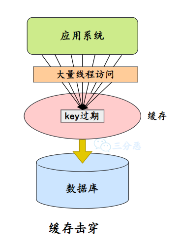

解决⽅案：

①、加锁更新，⽐如请求查询 A，发现缓存中没有，对 A 这个 key 加锁，同时去数据库查询数据，写⼊缓存，再返回给⽤户，这样后⾯的请求就可以从缓存中拿到数据了。


②、将过期时间组合写在 value 中，通过异步的⽅式**不断的刷新**过期时间，防⽌此类现象。

#### 什么是缓存穿透？

缓存穿透指的查询缓存和数据库中**都不存在的数据**，这样每次请求直接打到数据库，就好像缓存不存在 ⼀样。

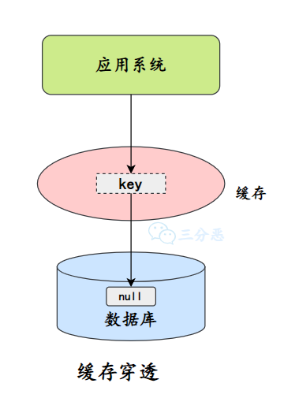

缓存穿透意味着缓存失去了减轻数据压力的意义。缓存穿透可能有两种原因：

1. 自身业务代码问题
2. 恶意攻击，爬虫造成空命中

> 它主要有两种解决办法：

①、**缓存空值/默认值**

⼀种⽅式是在数据库不命中之后，把⼀个空对象或者默认值保存到缓存，之后再访问这个数据，就会从 缓存中获取，这样就保护了数据库。

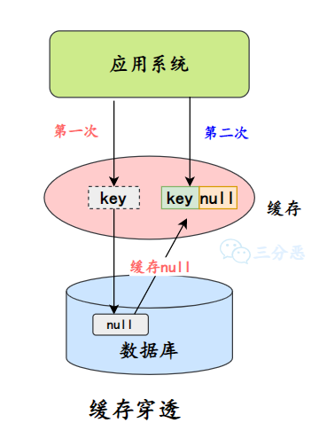

代码示例：

```java
String cacheKey = "product::" + productId;
String result = cache.get(cacheKey);

if (result == null) {
    result = database.queryProductById(productId);

    if (result == null) {
        // 缓存空值，设置较短的过期时间
        cache.set(cacheKey, "null", shortTTL);
    } else {
        // 缓存有效数据
        cache.set(cacheKey, result, longTTL);
    }
}
```

缓存空值有两⼤问题： 

1. 空值做了缓存，意味着缓存层中存了更多的键，需要更多的内存空间（如果是攻击，问题更严重），⽐较有效的⽅法是针对这类数据设置⼀个较短的过期时间，让其⾃动剔除。 
2. 缓存层和存储层的数据会有⼀段时间窗口的不⼀致，可能会对业务有⼀定影响。  例如过期时间设置为5分钟，如果此时存储层添加了这个数据，那此段时间就会出现缓存层和存储层数据的不⼀致。 `这时候可以利用消息队列或者其它异步方式清理缓存中的空对象`。

②、**布隆过滤器**

除了缓存空对象，我们还可以在存储和缓存之前，加⼀个布隆过滤器，做⼀层过滤。

- 如果布隆过滤器认为该键不存在，直接返回空，不会查询数据库。
- 如果布隆过滤器认为该键可能存在，则查询缓存和数据库。

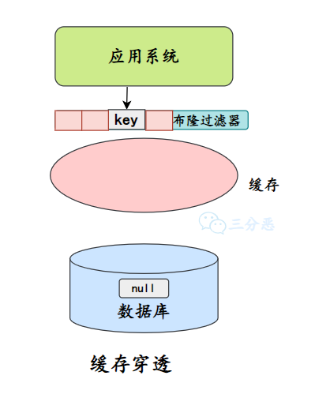

代码示例：

```java
BloomFilter<String> bloomFilter = new BloomFilter<>(expectedInsertions, fpp); // 期望插入量和误判率
bloomFilter.put("valid_key_1");
bloomFilter.put("valid_key_2");

// 判断请求的键是否存在于布隆过滤器中
if (!bloomFilter.mightContain(requestedKey)) {
    // 如果布隆过滤器认为该键不存在，则直接返回空
    return null;
} else {
    // 继续正常的缓存查询和数据库查询流程
}
```

两种解决方案的对比：

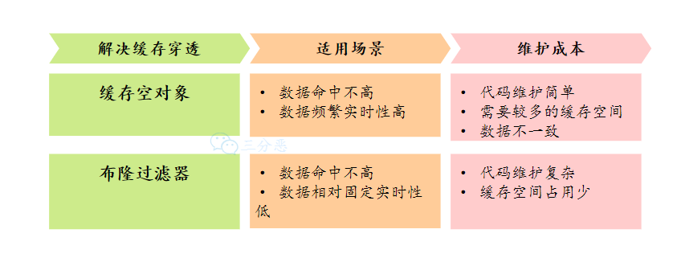

#### 什么是缓存雪崩？

某⼀时刻发⽣⼤规模的缓存失效的情况，例如缓存服务宕机、⼤量key在同⼀时间过期，这样的后果就 是⼤量的请求进来直接打到DB上，可能导致整个系统的崩溃，称为雪崩。


缓存雪崩是三⼤缓存问题⾥最严重的⼀种，我们来看看怎么预防和处理。

#### 如何解决缓存雪崩呢？

> 第一种：提高缓存可用性

**01、集群部署**：采用分布式缓存而不是单一缓存服务器，可以降低单点故障的风险。即使某个缓存节点发生故障，其他节点仍然可以提供服务，从而避免对数据库的大量直接访问。

可以利用 Redis Cluster。

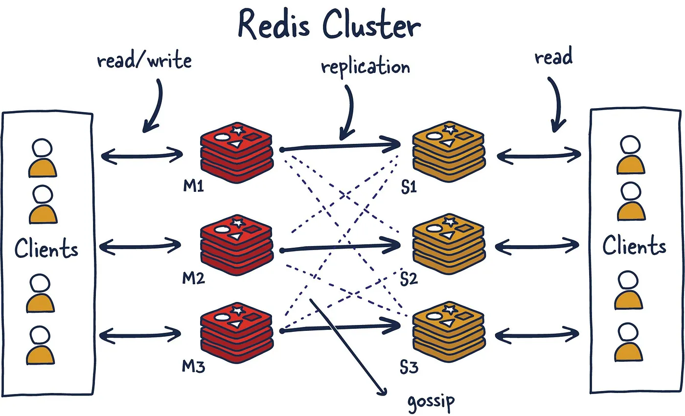

或者第三方集群方案 Codis。

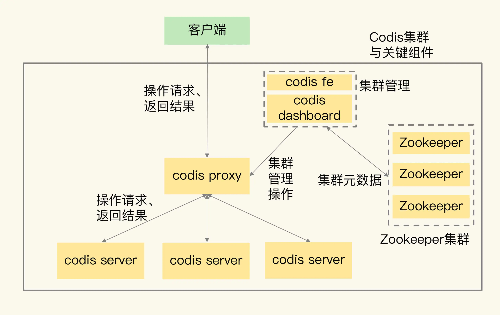

**02多级缓存**：设置多级缓存，第⼀级缓存失效的基础上，访问⼆级缓存，每⼀级缓存的失效时间都不同。

> 第二种：过期时间

1. 均匀过期：为了避免⼤量的缓存在同⼀时间过期，可以把不同的 key 过期时间随机⽣成，避免过期时间太过集中。 
2. 热点数据永不过期。

> 第三种：限流和降级

1. 服务熔断：当缓存服务器宕机或超时响应时，为了防⽌整个系统出现雪崩，暂时停⽌业务服务访问缓存系统。 
2. 服务降级：当出现⼤量缓存失效，⽽且处在⾼并发⾼负荷的情况下，在业务系统内部暂时舍弃对⼀些⾮核⼼的接口和数据的请求，⽽直接返回⼀个提前准备好的 fallback（退路）错误处理信息。

### 30.能说说布隆过滤器吗？

> 元素可能有
>
> 元素一定没有

布隆过滤器是一种 **空间效率很高的概率型数据结构**，主要用来判断某个元素是否存在于一个集合中。
它的特点是：

- **可能存在假阳性（false positive）**：说某个元素在集合里，但实际上可能不在。
- **绝不会有假阴性（false negative）**：如果布隆过滤器说某个元素不在，那它一定不在。

👉 适用于海量数据的快速存在性检测（如去重、缓存穿透拦截）。


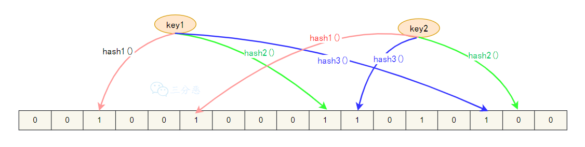

布隆过滤器由一个长度为 m 的位数组和 k 个哈希函数组成。

- 开始时，布隆过滤器的每个位都被设置为 0。
- 当一个元素被添加到过滤器中时，它会被 k 个哈希函数分别计算得到 k 个位置，然后将位数组中对应的位设置为 1。
- 当检查一个元素是否存在于过滤器中时，同样使用 k 个哈希函数计算位置，如果任一位置的位为 0，则该元素肯定不在过滤器中；如果所有位置的位都为 1，则该元素可能在过滤器中。

我们判断缓存key是否存在，同样，K个哈希函数，映射到bit列表上的K个点，判断是不是1：

- 如果全不是1，那么key不存在； 
- 如果都是1，也只是表⽰key可能存在。 

> 布隆过滤器也有⼀些缺点： 

1. 它在判断元素是否在集合中时是有⼀定错误⼏率，因为哈希算法有⼀定的碰撞的概率。 
2. 不⽀持删除元素。

#### 布隆过滤器存在误判吗？

布隆过滤器的优点是空间效率和查询时间都远远超过一般的算法，缺点是存在误判和删除困难。

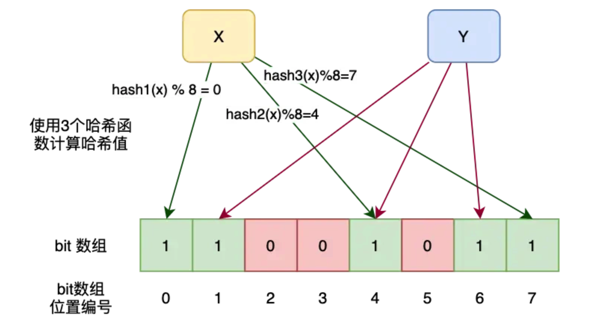

当布隆过滤器保存的元素越多，被置为 1 的 bit 位就会越多。假设元素 x 没有存储过，但其他元素的哈希函数映射到位数组的三个位刚好都为 1 且恰好覆盖了元素 x 映射的位置，那么对于布隆过滤器来讲，元素 x 这个值就是存在的，也就是说布隆过滤器存在一定的误判率。

布隆过滤器的误判率取决于以下几个因素：

1. 位数组的大小（m）：位数组的大小决定了可以存储的标志位数量。如果位数组过小，那么哈希碰撞的几率就会增加，从而导致更高的误判率。
2. 哈希函数的数量（k）：哈希函数的数量决定了每个元素在位数组中标记的位数。哈希函数越多，碰撞的概率也会相应变化。如果哈希函数太少，则过滤器很快会变得不精确；如果太多，误判率也会升高，效率下降。
3. 存入的元素数量（n）：存入的元素越多，哈希碰撞的几率越大，从而导致更高的误判率。

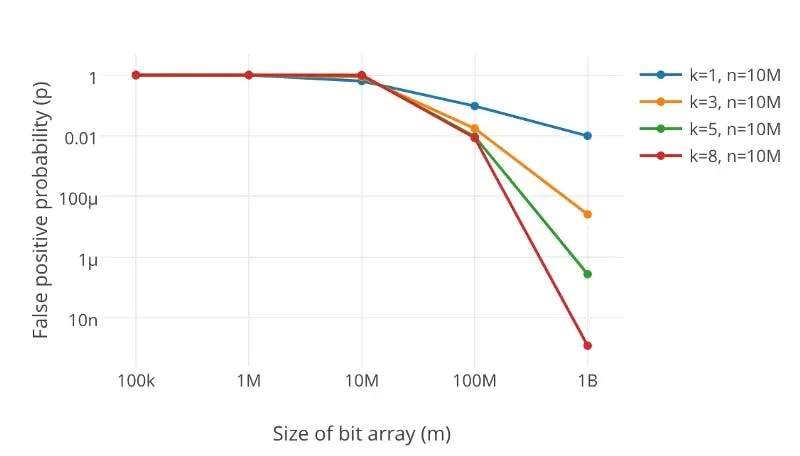

误判率公式如下：

$$
f(k) = \left( 1 - e^{- \frac{kn}{m}} \right)^k
$$

虽然布隆过滤器会产生误判，但在很多场景下一定的误判率是可以接受的，这是因为布隆过滤器的主要优点是其高效的查询速度和低内存占用。相比其他精确的集合数据结构（如哈希表、树等），布隆过滤器可以在空间效率和查询速度上表现更优。

#### 布隆过滤器支持删除吗？

布隆过滤器其实并不支持删除元素，因为多个元素可能哈希到一个布隆过滤器的同一个位置，如果直接删除该位置的元素，则会影响其他元素的判断。

#### 为什么不能用哈希表而是用布隆过滤器？

布隆过滤器是一种基于位数组和多个哈希函数的概率型数据结构，适合在内存资源有限、数据量大且能容忍一定误判的场景下使用。

相比哈希表，布隆过滤器的内存开销非常小，能快速判断一个元素是否存在。虽然它存在误判，但不会漏报，因此在防止缓存穿透、黑名单过滤和推荐系统去重等场景中广泛使用。

哈希表虽然可以精准判断元素存在与否，但需要存储实际数据，内存开销大，不适合大规模数据存储。

#### 布隆过滤器的优点？

1. **内存效率高**：布隆过滤器只需要存储每个元素的哈希值，而不需要存储元素本身，因此内存占用非常小。
2. **查询速度快**：布隆过滤器只需要将元素通过多个哈希函数映射到位数组，并检查位状态即可。它不需要哈希表那样的复杂键值操作，时间复杂度接近常数时间，速度非常快。

### 31.如何保证缓存和数据库的数据⼀致性？

根据CAP理论，在保证可⽤性和分区容错性的前提下，⽆法保证⼀致性，所以缓存和数据库的绝对⼀ 致是不可能实现的，只能尽可能保存缓存和数据库的最终⼀致性。

选择合适的缓存更新策略  

1. 删除缓存⽽不是更新缓存 

当⼀个线程对缓存的key进⾏写操作的时候，如果其它线程进来读数据库的时候，读到的就是脏数据，产⽣了数据不⼀致问题。 相⽐较⽽⾔，删除缓存的速度⽐更新缓存的速度快很多，所⽤时间相对也少很多，读脏数据的概率也⼩很多。


2. 先写数据库，后删缓存

#### 那再说说为什么要先更新数据库，再删除缓存

因为更新数据库的速度比删除缓存的速度要慢得多。因为更新 MySQL 是磁盘 IO 操作，而 Redis 是内存操作。内存操作比磁盘 IO 快得多（这是硬件层面的天然差距）。

那假如是先删除缓存，再更新数据库，就会造成这样的情况：

缓存中不存在，数据库又没有完成更新，此时有请求进来读取数据，并写入到缓存，那么在更新完缓存后，缓存中这个 key 就成了一个脏数据。


目前最流行的缓存读写策略 Cache Aside Pattern(**旁路缓存模式**)就是采用的先写数据库，再删缓存的方式。

- 失效：应用程序先从缓存读取数据，如果数据不存在，再从数据库中读取数据，成功后，放入缓存。
- 命中：应用程序从缓存读取数据，如果数据存在，直接返回。
- 更新：先把数据写入数据库，成功后，再让缓存失效。

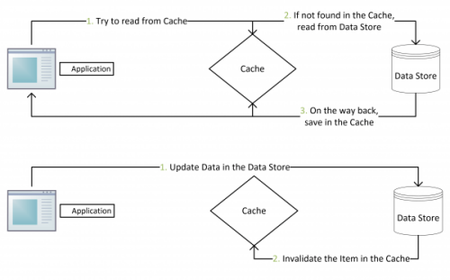

#### 那假如对一致性要求很高，该怎么办呢？

如果不是并发特别⾼，对缓存依赖性很强，其实⼀定程序的不⼀致是可以接受的。 

但是如果对⼀致性要求⽐较⾼，那就得想办法保证缓存和数据库中数据⼀致。

缓存和数据库数据不⼀致常见的两种原因： 

- 缓存key删除失败 
- 并发导致写⼊了脏数据

那通常有四种方案可以解决。


**①、引入消息队列保证缓存被删除**

使用消息队列（如 Kafka、RabbitMQ）保证数据库更新和缓存更新之间的最终一致性。当数据库更新完成后，将更新事件发送到消息队列。有专门的服务监听这些事件并负责更新或删除缓存。

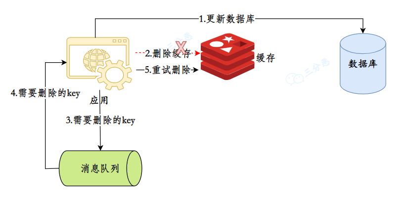

这种方案很不错，缺点是对业务代码有一定的侵入，毕竟引入了消息队列嘛。

**②、数据库订阅+消息队列保证缓存被删除**

可以专门起一个服务（比如 [Canal](https://github.com/alibaba/canal)，阿里巴巴 MySQL binlog 增量订阅&消费组件）去监听 MySQL 的 binlog，获取需要操作的数据。

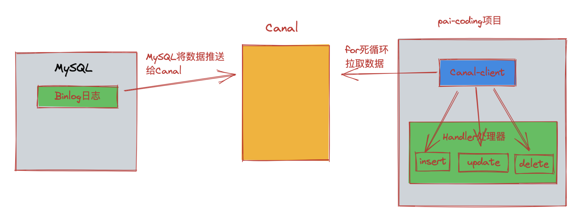

然后用一个公共的服务获取订阅程序传来的信息，进行缓存删除。

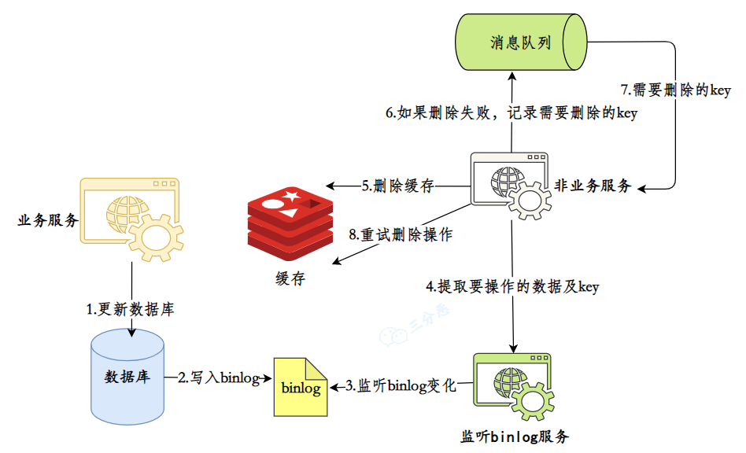

这种方式虽然降低了对业务的侵入，但增加了整个系统的复杂度，适合基建完善的大厂。

**③、延时双删防止脏数据**

简单说，就是在第一次删除缓存之后，过一段时间之后，再次删除缓存。

主要针对缓存不存在，但写入了脏数据的情况。在先删缓存，再写数据库的更新策略下发生的比较多。

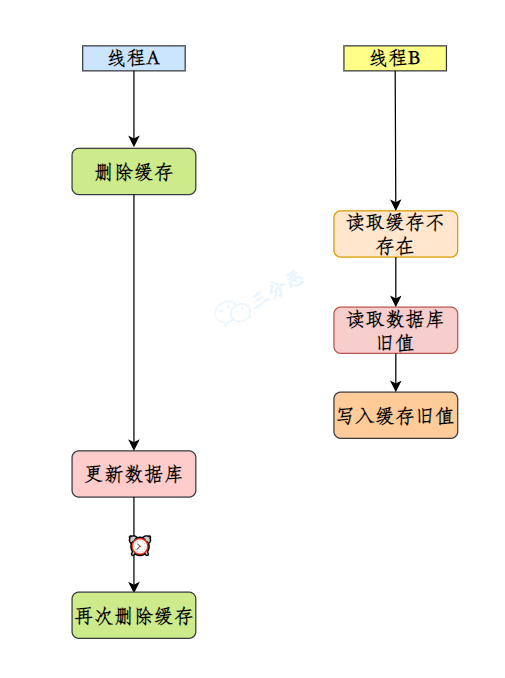

这种方式的延时时间需要仔细考量和测试。

**④：设置缓存过期时间兜底**

这是一个朴素但有用的兜底策略，给缓存设置一个合理的过期时间，即使发生了缓存和数据库的数据不一致问题，也不会永远不一致下去，缓存过期后，自然就一致了。

### 32.如何保证本地缓存和分布式缓存的一致？

PS:这道题⾯试很少问，但实际⼯作中很常见。

在⽇常的开发中，我们常常采⽤两级缓存：本地缓存+分布式缓存。 
所谓本地缓存，就是对应服务器的内存缓存，⽐如Caffeine，分布式缓存基本就是采⽤Redis。


那么问题来了，本地缓存和分布式缓存怎么保持数据⼀致？


Redis缓存，数据库发⽣更新，直接删除缓存的key即可，因为对于应⽤系统⽽⾔，它是⼀种中⼼化的 缓存。 但是本地缓存，它是⾮中⼼化的，散落在分布式服务的各个节点上，没法通过客户端的请求删除本地缓 存的key，所以得想办法通知集群所有节点，删除对应的本地缓存key。


为了保证本地缓存和 Redis 缓存的一致性，通常采用的策略有：

①、设置本地缓存的过期时间，这是最简单也是最直接的方法，当本地缓存过期时，就从 Redis 缓存中去同步。

②、使用 Redis 的 Pub/Sub 机制，当 Redis 缓存发生变化时，发布一个消息，本地缓存订阅这个消息，然后删除对应的本地缓存。

③、Redis 缓存发生变化时，引入消息队列，比如 RocketMQ、RabbitMQ 去更新本地缓存。

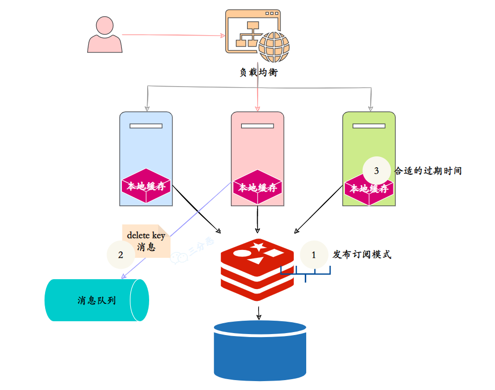

#### 如果在项目中多个地方都要使用到二级缓存的逻辑，如何设计这一块？

在设计时，应该清楚地区分何时使用一级缓存和何时使用二级缓存。通常情况下，对于频繁访问但不经常更改的数据，可以放在本地缓存中以提供最快的访问速度。而对于需要共享或者一致性要求较高的数据，应当放在一级缓存中。

#### 本地缓存和 Redis 缓存的区别和效率对比？

Redis 可以部署在多个节点上，支持数据分片，适用于跨服务器的缓存共享。而本地缓存只能在单个服务器上使用。

Redis 还可以持久化数据，支持数据备份和恢复，适用于对数据安全性要求较高的场景。并且支持发布/订阅、事务、Lua 脚本等高级功能。

效率上，Redis 和本地缓存都是存储在内存中，读写速度都非常快。

### 33.怎么处理热 key？

推荐阅读：

- [阿里：发现并处理 Redis 的大 Key 和热 Key](https://help.aliyun.com/zh/redis/user-guide/identify-and-handle-large-keys-and-hotkeys)
- [董宗磊：Redis 热 Key 发现以及解决办法](https://dongzl.github.io/2021/01/14/03-Redis-Hot-Key/index.html)

所谓的热 key，就是指在很短时间内被频繁访问的键。

比如，热门新闻或热门商品，这类 key 通常会有大流量的访问，对存储这类信息的 Redis 来说，是不小的压力。

> 某天某流量明星突然爆出一个大瓜，微博突然就崩了，这就是热 key 的压力。

再比如说 Redis 是集群部署，热 key 可能会造成整体流量的不均衡（网络带宽、CPU 和内存资源），个别节点出现 OPS 过大的情况，极端情况下热点 key 甚至会超过 Redis 本身能够承受的 OPS。

> OPS（Operations Per Second）是 Redis 的一个重要指标，表示 Redis 每秒钟能够处理的命令数。

通常以 Key 被请求的频率来判定，比如：

- **QPS 集中在特定的 Key**：总的 QPS（每秒查询率）为 10000，其中一个 Key 的 QPS 飙到了 8000。
- **带宽使用率集中在特定的 Key**：一个拥有上千成员且总大小为 1M 的哈希 Key，每秒发送大量的 HGETALL 请求。
- **CPU 使用率集中在特定的 Key**：一个拥有数万个成员的 ZSET Key，每秒发送大量的 ZRANGE 请求。

> - HGETALL 命令用于返回哈希表中，所有的字段和值。
> - ZRANGE 命令用于返回有序集中，指定区间内的成员。

#### 怎么处理热 key？

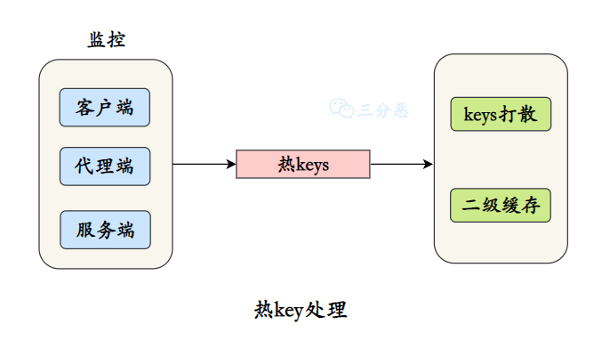

对热 key 的处理，最关键的是对热 key 的监控:

①、客户端

客户端其实是距离 key“最近”的地方，因为 Redis 命令就是从客户端发出的，例如在客户端设置全局字典（key 和调用次数），每次调用 Redis 命令时，使用这个字典进行记录。

②、代理端

像 Twemproxy、Codis 这些基于代理的 Redis 分布式架构，所有客户端的请求都是通过代理端完成的，可以在代理端进行监控。

③、Redis 服务端

使用 monitor 命令统计热点 key 是很多开发和运维人员首先想到的方案，monitor 命令可以监控到 Redis 执行的所有命令。

> monitor 命令的使用：`redis-cli monitor`

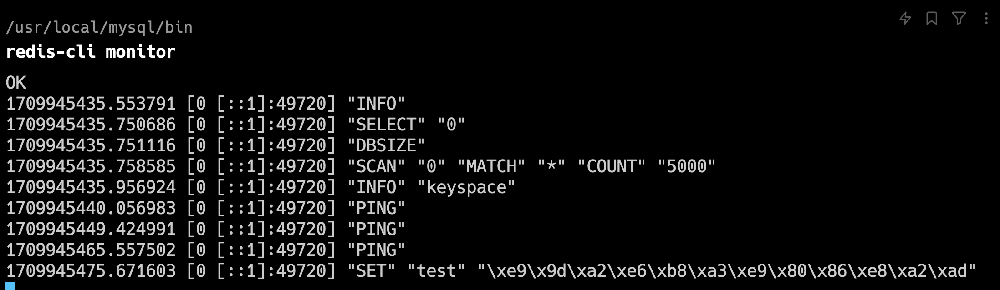

还可以通过 bigkeys 参数来分析热 Key。

> bigkeys 命令的使用：`redis-cli --bigkeys`

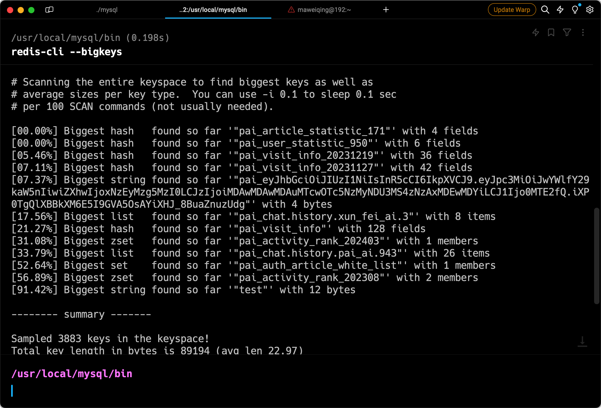

只要监控到了热 key，对热 key 的处理就简单了：

①、把热 key 打散到不同的服务器，降低压⼒。

基本思路就是给热 Key 加上前缀或者后缀，见下例：

```java
// N 为 Redis 实例个数，M 为 N 的 2倍
const M = N * 2
//生成随机数
random = GenRandom(0, M)
//构造备份新 Key
bakHotKey = hotKey + "_" + random
data = redis.GET(bakHotKey)
if data == NULL {
    data = redis.GET(hotKey)
    if data == NULL {
        data = GetFromDB()
        // 可以利用原子锁来写入数据保证数据一致性
        redis.SET(hotKey, data, expireTime)
        redis.SET(bakHotKey, data, expireTime + GenRandom(0, 5))
    } else {
        redis.SET(bakHotKey, data, expireTime + GenRandom(0, 5))
    }
}
```

②、加⼊⼆级缓存，当出现热 Key 后，把热 Key 加载到 JVM 中，后续针对这些热 Key 的请求，直接从 JVM 中读取。

这些本地的缓存工具有很多，比如 Caffeine、Guava 等，或者直接使用 HashMap 作为本地缓存都是可以的。

注意，如果对热 Key 进行本地缓存，需要防止本地缓存过大。

### 34.缓存预热怎么做呢？

所谓缓存预热，就是提前把数据库⾥的数据刷到缓存里，通常有这些⽅法： 

1. 直接写个缓存刷新页⾯或者接口，上线时⼿动操作
2. 数据量不大，可以在项⽬启动的时候⾃动进⾏加载
3. 定时任务刷新缓存

### 35.热点 key 重建？问题？解决？

开发的时候⼀般使⽤“缓存+过期时间”的策略，既可以加速数据读写，又保证数据的定期更新，这种模式基本能够满⾜绝⼤部分需求。 

但是有两个问题如果同时出现，可能就会出现⽐较⼤的问题：  

- 当前key是⼀个热点key（例如⼀个热门的娱乐新闻），并发量⾮常⼤。 
- 重建缓存不能在短时间完成，可能是⼀个复杂计算，例如复杂的 SQL、多次IO、多个依赖等。 在缓存失效的瞬间，有⼤量线程来重建缓存，造成后端负载加⼤，甚⾄可能会让应⽤崩溃。 

> 怎么处理呢？ 

要解决这个问题也不是很复杂，解决问题的要点在于：  

- 减少重建缓存的次数。 
- 数据尽可能⼀致。 
- 较少的潜在危险。 

> 所以⼀般采⽤如下⽅式： 

1. 互斥锁（mutex key）  这种⽅法只允许⼀个线程重建缓存，其他线程等待重建缓存的线程执⾏完，重新从缓存获取数据即可。 
2. 永远不过期  

“永远不过期”包含两层意思：  

- 从缓存层⾯来看，确实没有设置过期时间，所以不会出现热点key过期后产⽣的问题，也就是“物理”不过期。  
- 从功能层⾯来看，为每个value设置⼀个逻辑过期时间，当发现超过逻辑过期时间后，会使⽤单独的线程去构建缓存。

### 36.无底洞问题吗？如何解决？

> 什么是⽆底洞问题？ 

2010年，Facebook的Memcache节点已经达到了3000个，承载着TB级别的缓存数据。但开发和运维⼈员发现了⼀个问题，为了满⾜业务要求添加了⼤量新Memcache节点，但是发现性能不但没有好转反⽽下降了，当时将这种现象称为缓存的“⽆底洞”现象。  

> 那么为什么会产⽣这种现象呢? 

通常来说添加节点使得Memcache集群性能应该更强了，但事实并⾮如此。键值数据库由于通常采⽤哈希函数将 key映射到各个节点上，造成key的分布与业务⽆关，但是由于数据量和访问量的持续增长，造成需要添加⼤量节点做⽔平扩容，导致键值分布到更多的节点上，所以⽆论是Memcache还是 Redis的分布式，批量操作通常需要从不同节点上获取，相⽐于单机批量操作只涉及⼀次⽹络操作，分布式批量操作会涉及多次⽹络时间。  

> ⽆底洞问题如何优化呢？ 

**先分析⼀下⽆底洞问题：** 

- 客户端⼀次批量操作会涉及多次⽹络操作，也就意味着批量操作会随着节点的增多，耗时会不断增⼤。  
- ⽹络连接数变多，对节点的性能也有⼀定影响。  

**常见的优化思路如下：** 

- 命令本⾝的优化，例如优化操作语句等。  
- 减少⽹络通信次数。  
- 降低接⼊成本，例如客户端使⽤长连/连接池、NIO等。 

## Redis 运维

### 37.Redis 报内存不足怎么处理？

Redis 内存不足有这么几种处理方式：

- 修改配置文件 redis.conf 的 maxmemory 参数，增加 Redis 可用内存
- 也可以通过命令 set maxmemory 动态设置内存上限
- 修改内存淘汰策略，及时释放内存空间
- 使用 Redis 集群模式，进行横向扩容。

### 38.Redis key 过期策略有哪些？

Redis 的 key 过期回收策略主要有两种：惰性删除和定期删除。

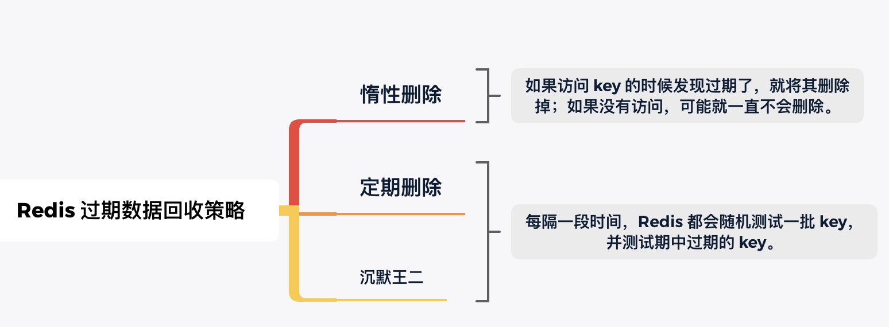

> 惰性删除

惰性删除指的是当我们查询key的时候才对key进⾏检测，如果已经达到过期时间，则删除。显然，他有⼀个缺点就是如果这些过期的key没有被访问，那么他就⼀直⽆法被删除，⽽且⼀直占⽤内存。

> 定期删除 

定期删除指的是Redis每隔⼀段时间对数据库做⼀次检查，删除⾥⾯的过期key。由于不可能对所有key 去做轮询来删除，所以Redis会每次随机取⼀些key去做检查和删除。


#### 拓展

---

可以通过 `config get hz` 命令查看 Redis 内部定时任务的频率。


结果显示 hz 的值为 "10"，意味着 Redis 服务器每秒执行定时任务的频率是 10 次。可以通过 `CONFIG SET hz 20` 进行调整。

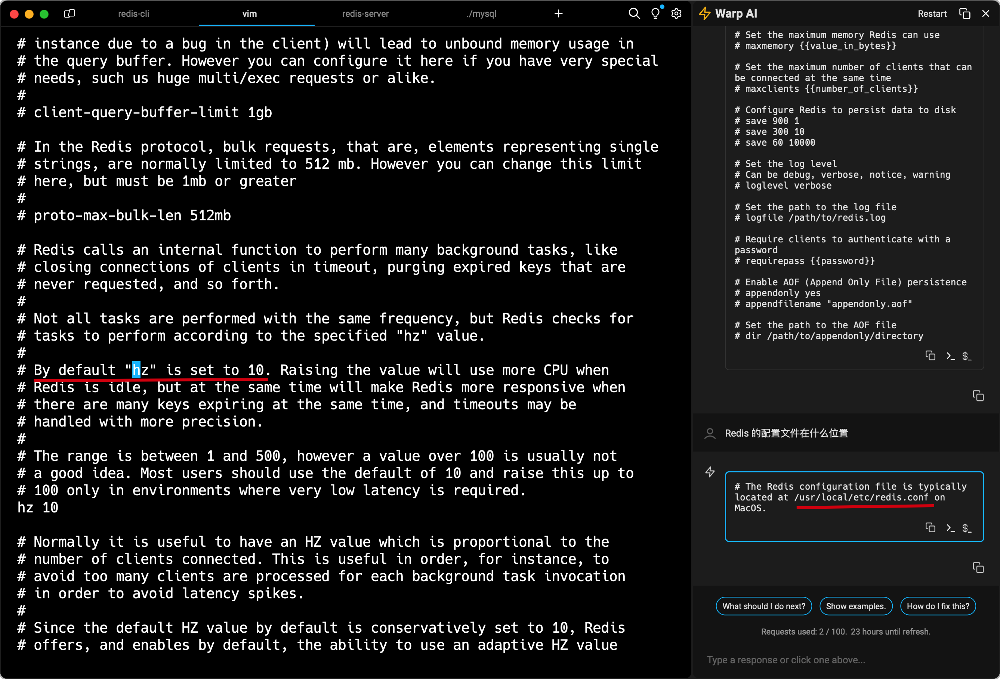

### 39.Redis 有哪些内存淘汰策略？

当内存使用接近 maxmemory 限制时，Redis 会依据内存淘汰策略来决定删除哪些 key 以缓解内存压力。

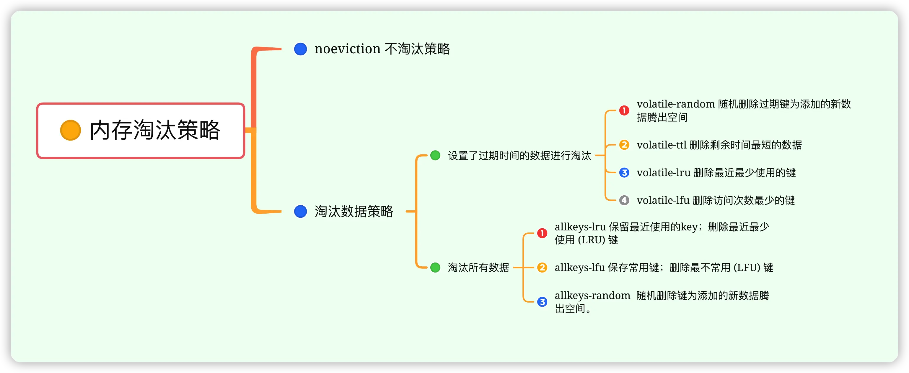

> 内存淘汰策略

常用的内存淘汰策略有八种，分别是默认的 noeviction，内存不足时不会删除任何 key，直接返回错误信息，生产环境下基本上不会使用。

然后是针对所有 key 的 allkeys-lru、allkeys-lfu 和 allkeys-random。

- lru 会删除最近最少使用的 key，在纯缓存场景中最常用，能自动保留热点数据；

- lfu 会删除访问频率最低的 key，更适合长期运行的系统；

random 会随机删除一些 key，一般不推荐使用。

其次是针对设置了过期时间的 key，有 volatile-lru、volatile-lfu、volatile-ttl 和 volatile-random。

lru 在混合存储场景中经常使用。

```plain
@Service
public class HybridStorageService {
    
    // 重要数据不设置过期时间，临时数据设置过期时间
    public void storeData(String key, Object data, DataImportance importance) {
        if (importance == DataImportance.HIGH) {
            // 重要数据不设置过期时间，在volatile-*策略下不会被淘汰
            redisTemplate.opsForValue().set(key, data);
        } else {
            // 临时数据设置过期时间，可以被volatile-*策略淘汰
            redisTemplate.opsForValue().set(key, data, Duration.ofHours(1));
        }
    }
}
```

lfu 适合需要保护某些重要数据不被淘汰的场景；ttl 优先删除即将过期的 key，在用户会话管理系统中推荐使用；random 仍然很少用。

>TTL，Time To Live，存活时间
>
>LRU：页面置算法，最近最久未使用

#### LRU 和 LFU 的区别是什么？

LRU（Least Recently Used）：基于时间维度，淘汰最近最少访问的键。适合访问具有时间特性的场景。

LFU（Least Frequently Used）：基于次数维度，淘汰访问频率最低的键。更适合长期热点数据场景。

### 40.Redis 阻塞？怎么解决？

Redis 发生阻塞，可以从以下几个方面排查：


- **API 或数据结构使用不合理**

  通常 Redis 执行命令速度非常快，但是不合理地使用命令，可能会导致执行速度很慢，导致阻塞，对于高并发的场景，应该尽量避免在大对象上执行算法复杂 度超过 O（n）的命令。

  对慢查询的处理分为两步：

  1. 发现慢查询： slowlog get{n}命令可以获取最近 的 n 条慢查询命令；
  2. 发现慢查询后，可以从两个方向去优化慢查询：
     1）修改为低算法复杂度的命令，如 hgetall 改为 hmget 等，禁用 keys、sort 等命 令
     2）调整大对象：缩减大对象数据或把大对象拆分为多个小对象，防止一次命令操作过多的数据。

- **CPU 饱和的问题**

  单线程的 Redis 处理命令时只能使用一个 CPU。而 CPU 饱和是指 Redis 单核 CPU 使用率跑到接近 100%。

  针对这种情况，处理步骤一般如下：

  1. 判断当前 Redis 并发量是否已经达到极限，可以使用统计命令 redis-cli-h{ip}-p{port}--stat 获取当前 Redis 使用情况
  2. 如果 Redis 的请求几万+，那么大概就是 Redis 的 OPS 已经到了极限，应该做集群化水平扩展来分摊 OPS 压力
  3. 如果只有几百几千，那么就得排查命令和内存的使用

- **持久化相关的阻塞**

  对于开启了持久化功能的 Redis 节点，需要排查是否是持久化导致的阻塞。

  1. fork 阻塞
     fork 操作发生在 RDB 和 AOF 重写时，Redis 主线程调用 fork 操作产生共享内存的子进程，由子进程完成持久化文件重写工作。如果 fork 操作本身耗时过长，必然会导致主线程的阻塞。
  2. AOF 刷盘阻塞
     当我们开启 AOF 持久化功能时，文件刷盘的方式一般采用每秒一次，后台线程每秒对 AOF 文件做 fsync 操作。当硬盘压力过大时，fsync 操作需要等 待，直到写入完成。如果主线程发现距离上一次的 fsync 成功超过 2 秒，为了 数据安全性它会阻塞直到后台线程执行 fsync 操作完成。
  3. HugePage 写操作阻塞
     对于开启 Transparent HugePages 的 操作系统，每次写命令引起的复制内存页单位由 4K 变为 2MB，放大了 512 倍，会拖慢写操作的执行时间，导致大量写操作慢查询。

### 41.大 key 问题了解吗？

> 大 key 是什么

- 单个简单的key存储的value很⼤，size超过10KB 

- hash， set，zset，list 中存储过多的元素（以万为单位） 

> ⼤key会造成什么问题呢？ 

- 客户端耗时增加，甚⾄超时

- 对⼤key进⾏IO操作时，会严重占⽤带宽和CPU 

- 造成Redis集群中数据倾斜

- 主动删除、被动删等，可能会导致阻塞 

> 如何找到⼤key? 

- bigkeys命令：使⽤bigkeys命令以遍历的⽅式分析Redis实例中的所有Key，并返回整体统计信息与每个数据类型中Top1的⼤Key

- redis-rdb-tools：redis-rdb-tools是由Python写的⽤来分析Redis的rdb快照⽂件⽤的⼯具，它可以把rdb快照⽂件⽣成json⽂件或者⽣成报表⽤来分析Redis的使⽤详情。 

> 如何处理⼤key


①、**删除大 key**

- 当 Redis 版本大于 4.0 时，可使用 UNLINK 命令安全地删除大 Key，该命令能够以非阻塞的方式，逐步地清理传入的大 Key。
- 当Redis版本⼩于4.0时，避免使⽤阻塞式命令KEYS，⽽是建议通过SCAN命令执⾏增量迭代 扫描key，然后判断进⾏删除。

②、**压缩和拆分 key**

- 当vaule是string时，⽐较难拆分，则使⽤序列化、压缩算法将key的⼤⼩控制在合理范围内， 但是序列化和反序列化都会带来更多时间上的消耗。 
- 当value是string，压缩之后仍然是⼤key，则需要进⾏拆分，⼀个⼤key分为不同的部分，记录每个部分的key，使⽤multiget等操作实现事务读取。 
- 当value是list/set等集合类型时，根据预估的数据规模来进⾏分⽚，不同的元素计算后分到不同的⽚。

### 42.Redis 常见性能问题和解决方案？

1.  Master 最好不要做任何持久化工作，包括内存快照和 AOF 日志文件，特别是不要启用内存快照做持久化。
2.  如果数据比较关键，某个 Slave 开启 AOF 备份数据，策略为每秒同步一次。
3.  为了主从复制的速度和连接的稳定性，Slave 和 Master 最好在同一个局域网内。
4.  尽量避免在压力较大的主库上增加从库。
5.  Master 调用 BGREWRITEAOF 重写 AOF 文件，AOF 在重写的时候会占大量的 CPU 和内存资源，导致服务 load 过高，出现短暂服务暂停现象。
6.  为了 Master 的稳定性，主从复制不要用图状结构，用单向链表结构更稳定，即主从关系为：Master<–Slave1<–Slave2<–Slave3…，这样的结构也方便解决单点故障问题，实现 Slave 对 Master 的替换，也即，如果 Master 挂了，可以立马启用 Slave1 做 Master，其他不变。

## Redis 应用

### 43.使用 Redis 如何实现异步队列？

我们知道 redis 支持很多种结构的数据，那么如何使用 redis 作为异步队列使用呢？
一般有以下几种方式：

- **使用 list 作为队列，lpush 生产消息，rpop 消费消息**

这种方式，消费者死循环 rpop 从队列中消费消息。但是这样，即使队列里没有消息，也会进行 rpop，会导致 Redis CPU 的消耗。
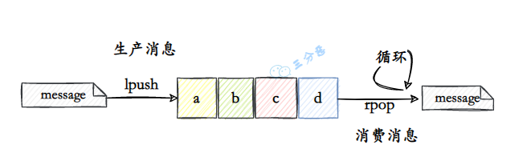
可以通过让消费者休眠的方式的方式来处理，但是这样又会又消息的延迟问题。

-**使用 list 作为队列，lpush 生产消息，brpop 消费消息**

brpop 是 rpop 的阻塞版本，list 为空的时候，它会一直阻塞，直到 list 中有值或者超时。
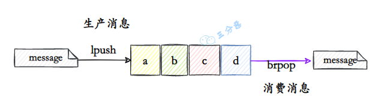

这种方式只能实现一对一的消息队列。

- **使用 Redis 的 pub/sub 来进行消息的发布/订阅**

发布/订阅模式可以 1：N 的消息发布/订阅。发布者将消息发布到指定的频道频道（channel），订阅相应频道的客户端都能收到消息。

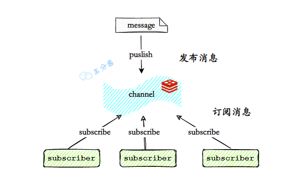
但是这种方式不是可靠的，它不保证订阅者一定能收到消息，也不进行消息的存储。

所以，一般的异步队列的实现还是交给专业的消息队列。

### 44.Redis 如何实现延时队列?

可以使用 Redis 的 zset（有序集合）来实现延时队列。

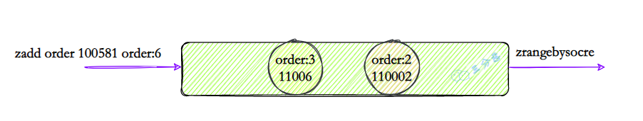

第一步，将任务添加到 zset 中，score 为任务的执行时间戳，value 为任务的内容。

```bash
ZADD delay_queue 1617024000 task1
```

第二步，定期（例如每秒）从 zset 中获取 score 小于当前时间戳的任务，然后执行任务。

```bash
ZREMRANGEBYSCORE delay_queue -inf 1617024000
```

第三步，任务执行后，从 zset 中删除任务。

```bash
ZREM delay_queue task1
```

### 45.Redis 支持事务吗？

Redis提供了简单的事务，但它对事务ACID的⽀持并不完备。

multi命令代表事务开始，exec命令代表事务结束，它们之间的命令是原⼦顺序执⾏的

主要通过 multi、exec、discard、watch 等命令来实现：

- multi：标记一个事务块的开始
- exec：执行所有事务块内的命令
- discard：取消事务，放弃执行事务块内的所有命令
- watch：监视一个或多个 key，如果在事务执行之前这个 key 被其他命令所改动，那么事务将被打断

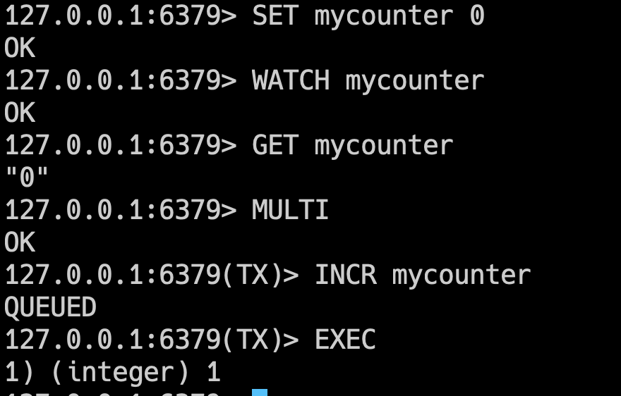

#### 说一下 Redis 事务的原理？


- 使用 MULTI 命令开始一个事务。从这个命令执行之后开始，所有的后续命令都不会立即执行，而是被放入一个队列中。在这个阶段，Redis 只是记录下了这些命令。
- 使用 EXEC 命令触发事务的执行。一旦执行了 EXEC，之前 MULTI 后队列中的所有命令会被原子地（atomic）执行。这里的“原子”意味着这些命令要么全部执行，要么（在出现错误时）全部不执行。
- 如果在执行 EXEC 之前决定不执行事务，可以使用 DISCARD 命令来取消事务。这会清空事务队列并退出事务状态。
- WATCH 命令用于实现乐观锁。WATCH 命令可以监视一个或多个键，如果在执行事务的过程中（即在执行 MULTI 之后，执行 EXEC 之前），被监视的键被其他命令改变了，那么当执行 EXEC 时，事务将被取消，并且返回一个错误。

#### Redis 事务的注意点有哪些？

- Redis 事务是不⽀持回滚的，不像 MySQL 的事务⼀样，要么都执⾏要么都不执⾏； 

- Redis 服务端在执⾏事务的过程中，不会被其他客户端发送来的命令请求打断。直到事务命令全部执⾏完毕才会执⾏其他客户端的命令。

#### Redis 事务为什么不支持回滚？

引入事务回滚机制会大大增加 Redis 的复杂性，因为需要跟踪事务中每个命令的状态，并在发生错误时逆向执行命令以恢复原始状态。

Redis 是一个基于内存的数据存储系统，其设计重点是实现高性能。事务回滚需要额外的资源和时间来管理和执行，这与 Redis 的设计目标相违背。因此，Redis 选择不支持事务回滚。

换句话说，**就是我 Redis 不想支持事务，也没有这个必要**。

#### Redis 事务的 ACID 特性如何体现？

ACID 一般指 MySQL 事务中的四个特性：原子性、一致性、隔离性、持久性。虽然 Redis 提供了事务的支持，但它在 ACID 上的表现与 MySQL 有所不同。

Redis 事务中，所有命令会依次执行，但并不支持部分失败后的自动回滚。因此 Redis 在事务层面并不能保证一致性，我们必须通过程序逻辑来进行优化。

Redis 事务在一定程度上提供了隔离性，事务中的命令会按顺序执行，不会被其他客户端的命令插入。

Redis 的持久性依赖于其持久化机制（如 RDB 和 AOF），而不是事务本身。

#### Redis事务满足原子性吗？要怎么改进？

不满足，Redis 事务不支持回滚，一旦 EXEC 命令被调用，所有命令都会被执行，即使有些命令可能执行失败。

可以通过 Lua 脚本来实现事务的原子性，Lua 脚本在 Redis 中是原子执行的，执行过程中间不会插入其他命令。

### 46.有 Lua 脚本操作 Redis 的经验吗？

> **Lua** 是一种轻量级、可扩展的脚本语言，常被嵌入到其他程序中（例如 Redis、Nginx、游戏引擎等），用来进行灵活的逻辑控制。

Redis的事务功能⽐较简单，平时的开发中，可以利⽤Lua脚本来增强Redis的命令。 

Lua脚本能给开发⼈员带来这些好处：

- Lua脚本在Redis中是原⼦执⾏的，执⾏过程中间不会插⼊其他命令。 

- Lua脚本可以帮助开发和运维⼈员创造出⾃⼰定制的命令，并可以将这些命令常驻在Redis内存中，实现复⽤的效果。 

- Lua脚本可以将多条命令⼀次性打包，有效地减少⽹络开销。 

⽐如这⼀段很（烂）经（⼤）典（街）的秒杀系统利⽤lua扣减Redis库存的脚本：

```java
-- 库存未预热
if (redis.call('exists', KEYS[2]) == 1) then
    return -9;
end;
-- 秒杀商品库存存在
if (redis.call('exists', KEYS[1]) == 1) then
    local stock = tonumber(redis.call('get', KEYS[1]));
    local num = tonumber(ARGV[1]);
    -- 剩余库存少于请求数量
    if (stock < num) then
        return -3
    end;
    -- 扣减库存
    if (stock >= num) then
        redis.call('incrby', KEYS[1], 0 - num);
        -- 扣减成功
        return 1
    end;
    return -2;
end;
-- 秒杀商品库存不存在
return -1;
```

### 47.Redis 的管道Pipeline了解吗？

Redis 提供三种将客户端多条命令**打包发送给服务端执⾏**的⽅式：

Pipelining(管道) 、 Transactions(事务) 和 Lua Scripts(Lua 脚本) 。 

> Pipelining（管道）

Pipeline 是 Redis 提供的一种优化手段，允许客户端一次性向服务器发送多个命令，而不必等待每个命令的响应，从而减少网络延迟。它的工作原理类似于批量操作，即多个命令一次性打包发送，Redis 服务器依次执行后再将结果一次性返回给客户端。

通常在 Redis 中，每个请求都会遵循以下流程：

1. 客户端发送命令到服务器。
2. 服务器执行命令并将结果返回给客户端。
3. 客户端接收返回结果。

每一个请求和响应之间存在一次网络通信的往返时间（RTT，Round-Trip Time），如果大量请求依次发送，网络延迟会显著增加请求的总执行时间。

有了 Pipeline 后，流程变为：

>发送命令1、命令2、命令3…… -> 服务器处理 -> 一次性返回所有结果。

例如，批量写入大量数据或执行一系列查询时，可以将这些操作打包通过 Pipeline 执行。

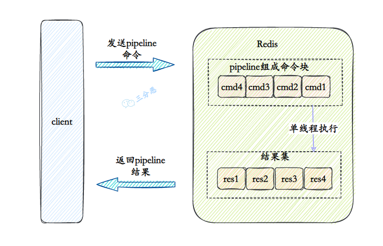

在 Pipeline 模式下，客户端不会在每条命令发送后立即等待 Redis 的响应，而是将多个命令依次写入 TCP 缓冲区，所有命令一起发送到 Redis 服务器。

Redis 服务器接收到批量命令后，依次执行每个命令。

Redis 服务器执行完所有命令后，将每条命令的结果一次性打包通过 TCP 返回给客户端。

客户端一次性接收所有返回结果，并解析每个命令的执行结果。 

在性能⽅⾯， Pipelining 有下⾯两个优势： 

- 节省了RTT：将多条命令打包⼀次性发送给服务端，减少了客户端与服务端之间的⽹络调⽤次数

- 减少了上下⽂切换：当客户端/服务端需要从⽹络中读写数据时，都会产⽣⼀次系统调⽤，系统调⽤是⾮常耗时的操作，其中设计到程序由⽤户态切换到内核态，再从内核态切换回⽤户态的过程。 当我们执⾏ 10 条 redis 命令的时候，就会发⽣ 10 次⽤户态到内核态的上下⽂切换，但如果我们 使⽤ Pipeining 将多条命令打包成⼀条⼀次性发送给服务端，就只会产⽣⼀次上下⽂切换。

### 48.Redis 实现分布式锁了解吗？

> 分布式锁是一种用于控制多个不同进程在分布式系统中访问共享资源的锁机制。

它确保在同一时刻，只有一个节点可以对资源进行访问，从而避免并发问题。

**可以使用 Redis 的 SET 命令实现分布式锁**。同时添加过期时间，以防止死锁的发生。

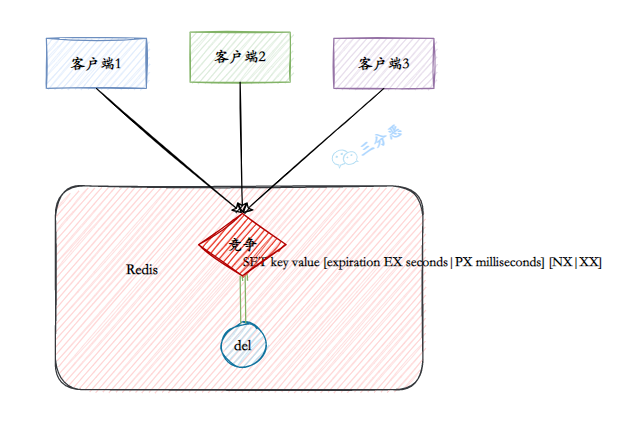

```
SET key value NX PX 30000
```

- `key` 是锁名。
- `value` 是锁的持有者标识，可以使用 UUID 作为 value。
- `NX` 只在 key 不存在时才创建（避免覆盖锁）。
- `PX 30000`：设置锁的过期时间为 30 秒（防止死锁）。

用 Java 来实现就是：

```java
String lockKey = "lock:order:123";
String uniqueId = UUID.randomUUID().toString();
boolean isLocked = redisTemplate.opsForValue()
    .setIfAbsent(lockKey, uniqueId, 10, TimeUnit.SECONDS);
if (isLocked) {
    try {
        // 执行业务逻辑
    } finally {
        // 释放锁
    }
}
```

#### 什么是 setnx？

**setnx 从 Redis 版本 2.6.12 开始被弃用，因为可以通过 set 命令的 NX 选项来实现相同的功能。**

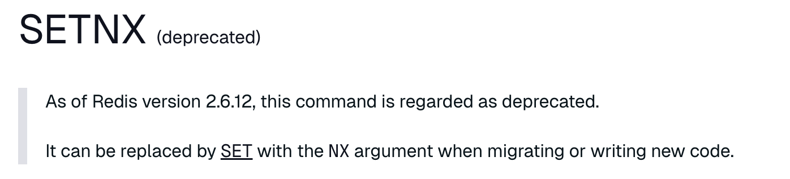

使用 setnx 创建分布式锁时，虽然设置过期时间可以避免死锁问题，但可能存在这样的问题：

线程 A 获取锁后开始任务，如果任务执行时间超过锁的过期时间，锁会提前释放，导致线程 B 也获取了锁并开始执行任务。这会破坏锁的独占性，导致并发访问资源，进而造成数据不一致。

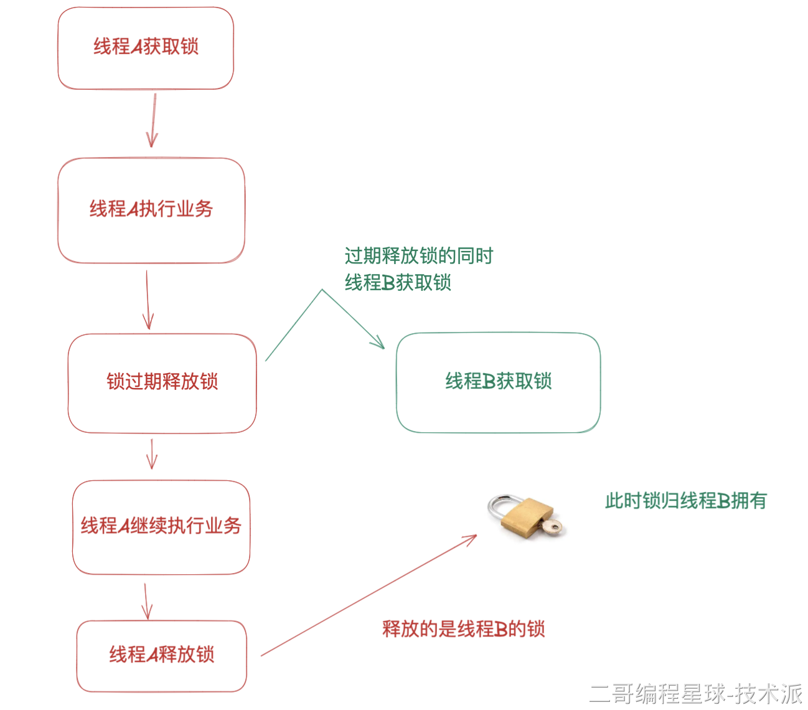

可以引入锁的自动续约机制，在任务执行过程中定期续期，确保锁在任务完成之前不会过期。

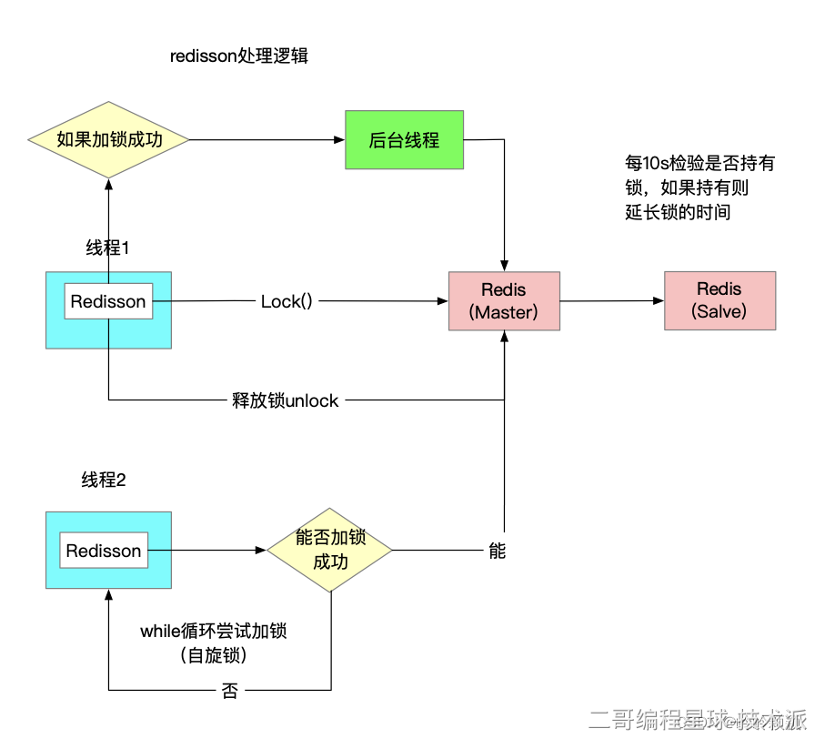

比如说 Redisson 的 RedissonLock 就支持自动续期，通过看门狗机制定期续期锁的有效期。

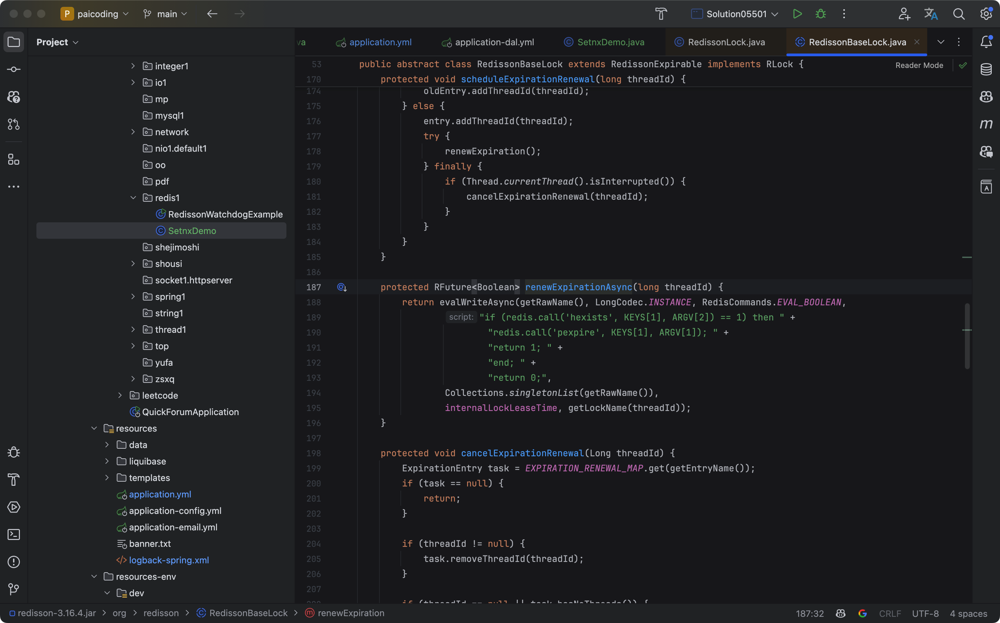

#### Redisson 了解吗？

开发中，我们可以使用专业的轮子——[Redisson](https://xie.infoq.cn/article/d8e897f768eb1a358a0fd6300)。


Redisson 是一个基于 Redis 的 Java 驻内存数据网格，提供了一系列 API 用来操作 Redis，其中最常用的功能就是分布式锁。

```java
RLock lock = redisson.getLock("lock");
lock.lock();
try {
    // do something
} finally {
    lock.unlock();
}
```

实现源码在 RedissonLock 类中，通过 Lua 脚本封装 Redis 命令来实现，比如说 tryLockInnerAsync 源码：

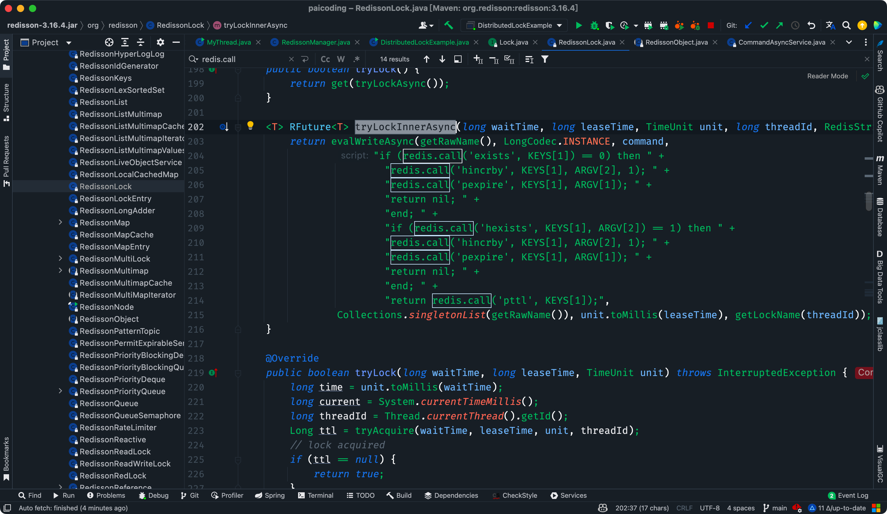

其中 hincrby 命令用于对哈希表中的字段值执行自增操作，pexpire 命令用于设置键的过期时间。

#### PmHub 系统里面的分布式锁是怎么做的？

主要通过 Redisson 框架实现的 RedLock 来完成的。

```java
// 创建 Redisson 客户端配置
Config config = new Config();
config.useClusterServers()
        .addNodeAddress("redis://127.0.0.1:6379",
                "redis://127.0.0.1:6380",
                "redis://127.0.0.1:6381"); // 假设有三个 Redis 节点
// 创建 Redisson 客户端实例
RedissonClient redissonClient = Redisson.create(config);
// 创建 RedLock 对象
RLock redLock = redissonClient.getLock("lock_key");

try {
    // 尝试获取分布式锁，最多尝试 5 秒获取锁，并且锁的有效期为 5000 毫秒
    boolean lockAcquired = redLock.tryLock(5, 5000, TimeUnit.MILLISECONDS);
    if (lockAcquired) {
        // 加锁成功，执行业务代码...
    } else {
        System.out.println("Failed to acquire the lock!");
    }
} catch (InterruptedException e) {
    Thread.currentThread().interrupt();
    System.err.println("Interrupted while acquiring the lock");
} finally {
    // 无论是否成功获取到锁，在业务逻辑结束后都要释放锁
    if (redLock.isLocked()) {
        redLock.unlock();
    }
    // 关闭 Redisson 客户端连接
    redissonClient.shutdown();
}
```

#### 你提到了Redlock，那它机制是怎么样的？

Redlock 是 Redis 作者提出的一种分布式锁实现方案，用于确保在分布式环境下安全可靠地获取锁。它的目标是在分布式系统中提供一种高可用、高容错的锁机制，确保在同一时刻，只有一个客户端能够成功获得锁，从而实现对共享资源的互斥访问。

Redisson 中的 RedLock 是基于 RedissonMultiLock（联锁）实现的。

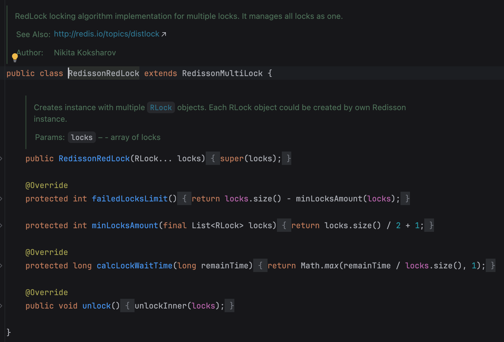

RedissonMultiLock 的 tryLock 方法会在指定的 Redis 实例上逐一尝试获取锁。

在获取锁的过程中，Redlock 会根据配置的 waitTime（最大等待时间）和 leaseTime（锁的持有时间）进行灵活控制。比如，如果获取锁的时间小于锁的有效期（通过TTL命令获取锁的剩余时间），则表示获取锁成功。

通常，至少需要多数（如 5 个实例中的 3 个）实例成功获取锁，才能认为整个锁获取成功。

如果指定了锁的持有时间（leaseTime），在成功获取锁后，Redlock 会为锁进行续期，以防止锁在操作完成之前意外失效。

#### 红锁能不能保证百分百上锁？

Redlock 不能保证百分百上锁，因为在分布式系统中，网络延迟、时钟漂移、Redis 实例宕机等因素都可能导致锁的获取失败。

#### 加分布式锁时Redis如何保证不会发生冲突？

①、使用 SET NX PX 或 SETNX 命令确保锁的获取是一个原子操作，同时设置锁的过期时间防止死锁。

比如说 `SET lock_key unique_value NX PX 5000` 命令，其中 `NX` 确保了原子操作，，如果 lock_key 已存在，SET 操作会返回 nil；`PX 5000` 设置过期时间为 5000 毫秒，避免死锁。

②、使用 Lua 脚本将锁的检查和释放操作封装为一个原子操作，确保安全地释放锁。

```
EVAL "if redis.call('get', KEYS[1]) == ARGV[1] then return redis.call('del', KEYS[1]) else return 0 end" 1 lock_key unique_value
```

③、使用 Redlock 算法确保锁的正确获取和释放。

```java
RLock lock = redisson.getLock("lock_key");
try {
    // 500ms 等待时间，10000ms 锁过期时间
    boolean isLocked = lock.tryLock(500, 10000, TimeUnit.MILLISECONDS);
    if (isLocked) {
        // 执行需要同步的操作
    }
} finally {
    lock.unlock();
}
```

#### Redisson 中的看门狗机制了解吗？

Redisson 提供的分布式锁是支持锁自动续期的，也就是说，如果线程在锁到期之前还没有执行完，那么 Redisson 会自动给锁续期。

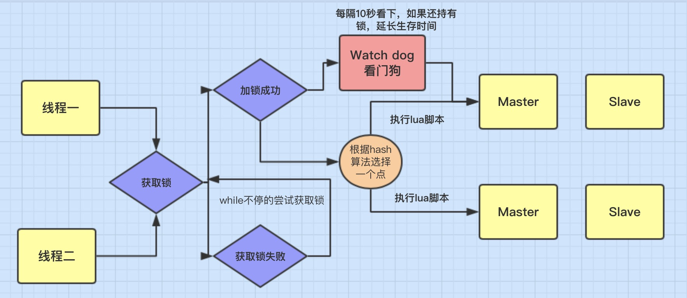

这被称为“看门狗”机制。

```java
class RedissonWatchdogExample {
    public static void main(String[] args) {
        // 配置 Redisson 客户端
        Config config = new Config();
        config.useSingleServer().setAddress("redis://127.0.0.1:6379");
        RedissonClient redisson = Redisson.create(config);

        // 获取锁对象
        RLock lock = redisson.getLock("myLock");

        try {
            // 获取锁，默认看门狗机制会启动
            lock.lock();

            // 模拟任务执行
            System.out.println("Task is running...");
            Thread.sleep(40000); // 模拟长时间任务（40秒）

            System.out.println("Task completed.");
        } catch (InterruptedException e) {
            e.printStackTrace();
        } finally {
            // 释放锁
            lock.unlock();
        }

        // 关闭 Redisson 客户端
        redisson.shutdown();
    }
}
```

看门狗启动后，每隔 10 秒会刷新锁的过期时间，将其延长到 30 秒，确保在锁持有期间不会因为过期而释放。

当任务执行完成时，客户端调用 `unlock()` 方法释放锁，看门狗也随之停止。

#### 检查锁的过程是原子操作吗？

在 Redis 的看门狗机制中，检查锁的过程并不是单独的一个步骤，而是与锁的续期操作绑定在一起，通过 Lua 脚本完成的。因此，检查与续期是一个整体的原子操作，以确保只有持有锁的客户端才能成功续期。

```java
if redis.call('get', KEYS[1]) == ARGV[1] then
    return redis.call('expire', KEYS[1], ARGV[2])
else
    return 0
end
```

## 底层结构

这一部分就比较深了，如果不是简历上写了精通 Redis，应该不会怎么问。

### 49.说说 Redis 底层数据结构？

Redis 的底层数据结构有**动态字符串(sds)**、**链表(list)**、**字典(ht)**、**跳跃表(skiplist)**、**整数集合(intset)**、**压缩列表(ziplist)** 等。


比如说 string 是通过 SDS 实现的，list 是通过链表实现的，hash 是通过字典实现的，set 是通过字典实现的，zset 是通过跳跃表实现的。

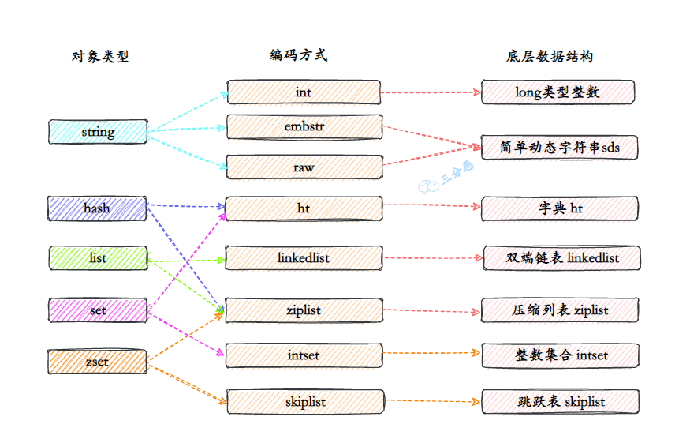

#### 简单介绍下 SDS？

Redis 是通过 C 语言实现的，但 Redis 并没有直接使用 C 语言的字符串，而是自己实现了一种叫做动态字符串 SDS 的类型。

```c
struct sdshdr {
    int len; // buf 中已使用的长度
    int free; // buf 中未使用的长度
    char buf[]; // 数据空间
};
```

因为 C 语⾔的字符串不记录⾃身的⻓度信息，当需要获取字符串⻓度时，需要遍历整个字符串，时间复杂度为 O(N)。

⽽ SDS 保存了⻓度信息，这样就将获取字符串⻓度的时间由 O(N) 降低到了 O(1)。


#### 简单介绍下链表 linkedlist

Redis 的链表是⼀个双向⽆环链表结构，和 Java 中的 [LinkedList](https://javabetter.cn/collection/linkedlist.html) 类似。

链表的节点由⼀个叫做 listNode 的结构来表示，每个节点都有指向其前置节点和后置节点的指针，同时头节点的前置和尾节点的后置均指向 null。


#### 简单介绍下字典 dict

⽤于保存键值对的抽象数据结构。Redis 使⽤ hash 表作为底层实现，一个哈希表里可以有多个哈希表节点，而每个哈希表节点就保存了字典里中的一个键值对。

每个字典带有两个 hash 表，供平时使⽤和 rehash 时使⽤，hash 表使⽤链地址法来解决键冲突，被分配到同⼀个索引位置的多个键值对会形成⼀个单向链表，在对 hash 表进⾏扩容或者缩容的时候，为了服务的可⽤性，rehash 的过程不是⼀次性完成的，⽽是渐进式的。

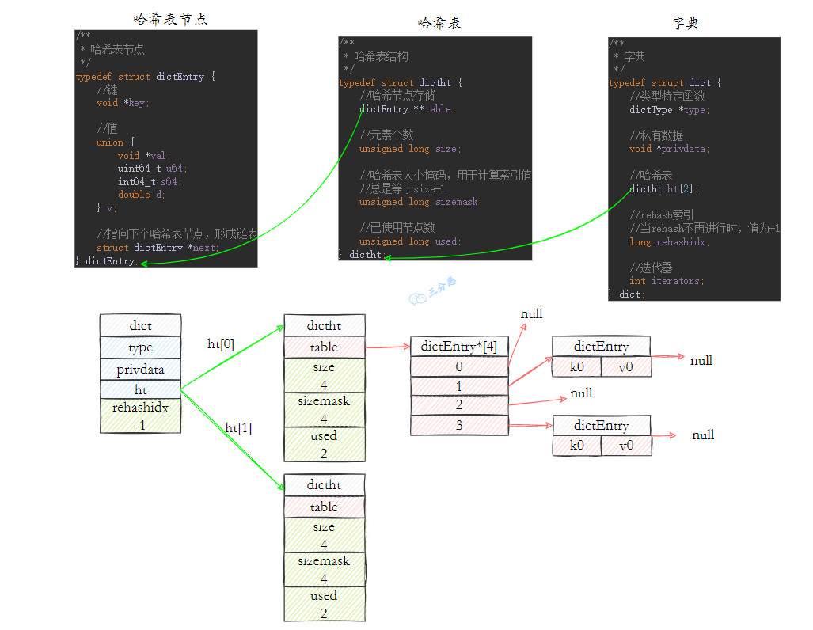

#### 简单介绍下跳表 skiplist

推荐阅读：[全网最详细的跳表文章](https://www.jianshu.com/p/9d8296562806)

跳表是有序集合 Zset 的底层实现之⼀。在 Redis 7.0 之前，如果有序集合的元素个数小于 128 个，并且每个元素的值小于 64 字节时，Redis 会使用压缩列表作为 Zset 的底层实现，否则会使用跳表；在 Redis 7.0 之后，压缩列表已经废弃，交由 listpack 来替代。


跳表由 zskiplist 和 zskiplistNode 组成，zskiplist ⽤于保存跳表的基本信息（表头、表尾、⻓度、层高等）。

```c
typedef struct zskiplist {
    struct zskiplistNode *header, *tail;
    unsigned long length;
    int level;
} zskiplist;
```

zskiplistNode ⽤于表示跳表节点，每个跳表节点的层⾼是不固定的，每个节点都有⼀个指向保存了当前节点的分值和成员对象的指针。

```c
typedef struct zskiplistNode {
    sds ele;
    double score;
    struct zskiplistNode *backward;
    struct zskiplistLevel {
        struct zskiplistNode *forward;
        unsigned int span;
    } level[];
} zskiplistNode;
```

#### 简单介绍下整数集合 intset

⽤于保存整数值的集合抽象数据结构，不会出现重复元素，底层实现为数组。

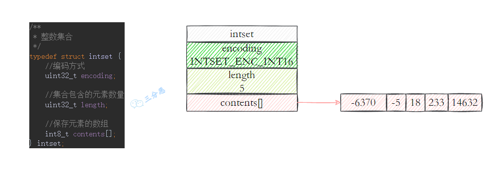

#### 简单介绍下压缩列表 ziplist

压缩列表是为节约内存⽽开发的顺序性数据结构，它可以包含任意多个节点，每个节点可以保存⼀个字节数组或者整数值。

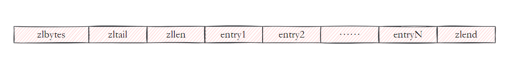

#### 简单介绍下紧凑列表 listpack

listpack 是 Redis 用来替代压缩列表（ziplist）的一种内存更加紧凑的数据结构。

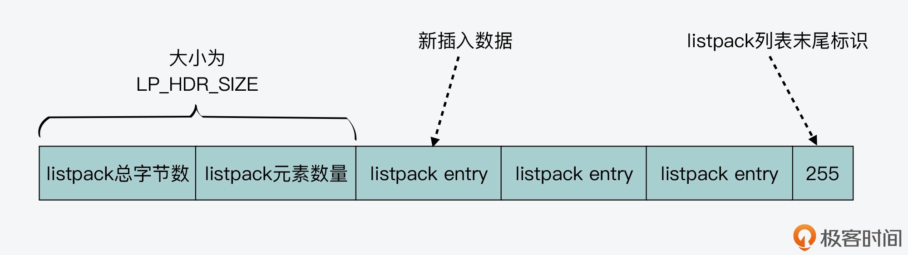

为了避免 ziplist 引起的连锁更新问题，listpack 中的元素不再像 ziplist 那样，保存其前一个元素的长度，而是保存当前元素的编码类型、数据，以及编码类型和数据的长度。


listpack 每个元素项不再保存上一个元素的长度，而是优化元素内字段的顺序，来保证既可以从前也可以向后遍历。

但因为 List/Hash/Set/ZSet 都严重依赖 ziplist，所以这个替换之路很漫长。

> 1. [Java 面试指南（付费）](https://javabetter.cn/zhishixingqiu/mianshi.html)收录的字节跳动商业化一面的原题：说说 Redis 的 zset，什么是跳表，插入一个节点要构建几层索引
> 2. [Java 面试指南（付费）](https://javabetter.cn/zhishixingqiu/mianshi.html)收录的字节跳动面经同学 9 飞书后端技术一面面试原题：Redis 的数据类型，ZSet 的实现
> 3. [Java 面试指南（付费）](https://javabetter.cn/zhishixingqiu/mianshi.html)收录的小米暑期实习同学 E 一面面试原题：你知道 Redis 的 zset 底层实现吗
> 4. [Java 面试指南（付费）](https://javabetter.cn/zhishixingqiu/mianshi.html)收录的腾讯面经同学 23 QQ 后台技术一面面试原题：zset 的底层原理
> 5. [Java 面试指南（付费）](https://javabetter.cn/zhishixingqiu/mianshi.html)收录的快手面经同学 7 Java 后端技术一面面试原题：说一下 ZSet 底层结构
> 6. [Java 面试指南（付费）](https://javabetter.cn/zhishixingqiu/mianshi.html)收录的美团同学 9 一面面试原题：redis的数据结构底层原理？
> 7. [Java 面试指南（付费）](https://javabetter.cn/zhishixingqiu/mianshi.html)收录的腾讯面经同学 27 云后台技术一面面试原题：Zset的底层实现？
> 8. [Java 面试指南（付费）](https://javabetter.cn/zhishixingqiu/mianshi.html)收录的得物面经同学 9 面试题目原题：Zset的底层如何实现？

### 50.Redis 的 SDS 和 C 中字符串相比有什么优势？

C 语言使用了一个长度为 `N+1` 的字符数组来表示长度为 `N` 的字符串，并且字符数组最后一个元素总是 `\0`，这种简单的字符串表示方式 不符合 Redis 对字符串在安全性、效率以及功能方面的要求。


#### C 语言的字符串可能有什么问题？

这样简单的数据结构可能会造成以下一些问题：

- **获取字符串长度复杂度高** ：因为 C 不保存数组的长度，每次都需要遍历一遍整个数组，时间复杂度为 O(n)；
- 不能杜绝 **缓冲区溢出/内存泄漏** 的问题 : C 字符串不记录自身长度带来的另外一个问题是容易造成缓存区溢出（buffer overflow），例如在字符串拼接的时候，新的
- C 字符串 **只能保存文本数据** → 因为 C 语言中的字符串必须符合某种编码（比如 ASCII），例如中间出现的 `'\0'` 可能会被判定为提前结束的字符串而识别不了；

#### Redis 如何解决？优势？

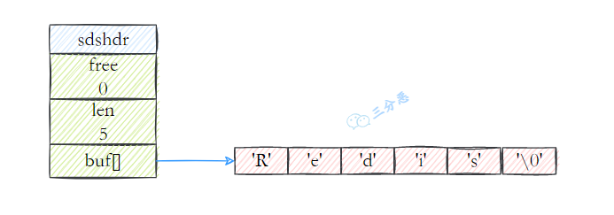

简单来说一下 Redis 如何解决的：

1. **多增加 len 表示当前字符串的长度**：这样就可以直接获取长度了，复杂度 O(1)；
2. **自动扩展空间**：当 SDS 需要对字符串进行修改时，首先借助于 `len` 和 `alloc` 检查空间是否满足修改所需的要求，如果空间不够的话，SDS 会自动扩展空间，避免了像 C 字符串操作中的溢出情况；
3. **有效降低内存分配次数**：C 字符串在涉及增加或者清除操作时会改变底层数组的大小造成重新分配，SDS 使用了 **空间预分配** 和 **惰性空间释放** 机制，简单理解就是每次在扩展时是成倍的多分配的，在缩容是也是先留着并不正式归还给 OS；
4. **二进制安全**：C 语言字符串只能保存 `ascii` 码，对于图片、音频等信息无法保存，SDS 是二进制安全的，写入什么读取就是什么，不做任何过滤和限制；

### 51.字典是如何实现的？Rehash 了解吗？

字典是 Redis 服务器中出现最为频繁的复合型数据结构。除了 **hash** 结构的数据会用到字典外，整个 Redis 数据库的所有 `key` 和 `value` 也组成了一个 **全局字典**，还有带过期时间的 `key` 也是一个字典。_(存储在 RedisDb 数据结构中)_

#### 字典结构是什么样的呢？

**Redis** 中的字典相当于 Java 中的 **HashMap**，内部实现也差不多类似，采用哈希与运算计算下标位置；通过 **"数组 + 链表" **的**链地址法** 来解决哈希冲突，同时这样的结构也吸收了两种不同数据结构的优点。

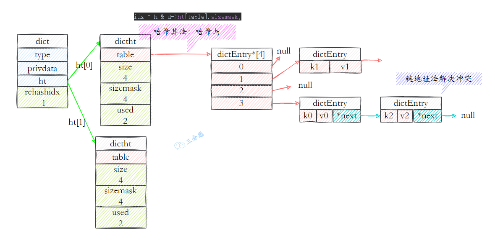

#### 字典是怎么扩容的？

字典结构内部包含 **两个 hashtable**，通常情况下只有一个哈希表 `ht[0]` 有值，在扩容的时候，把 `ht[0]`里的值 rehash 到 `ht[1]`，然后进行 **渐进式 rehash** ——所谓渐进式 rehash，指的是这个 rehash 的动作并不是一次性、集中式地完成的，而是分多次、渐进式地完成的。

待搬迁结束后，`h[1]`就取代 `h[0]`存储字典的元素。

### 52.跳表是如何实现的？原理？

跳表是一种有序的数据结构，它通过在每个节点中维持多个指向其它节点的指针，从而达到快速访问节点的目的。

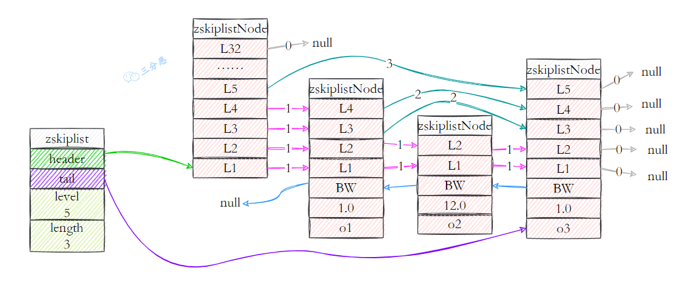

#### 为什么使用跳表？

首先，因为 zset 要支持随机的插入和删除，所以它 **不宜使用数组来实现**，关于排序问题，我们也很容易就想到 **红黑树/ 平衡树** 这样的树形结构，为什么 Redis 不使用这样一些结构呢？

1. **性能考虑：** 在高并发的情况下，树形结构需要执行一些类似于 rebalance 这样的可能涉及整棵树的操作，相对来说跳跃表的变化只涉及局部；
2. **实现考虑：** 在复杂度与红黑树相同的情况下，跳跃表实现起来更简单，看起来也更加直观；

基于以上的一些考虑，Redis 基于 **William Pugh** 的论文做出一些改进后采用了 **跳跃表** 这样的结构。

本质是解决查找问题。

#### 跳跃表是怎么实现的？

跳跃表的节点里有这些元素：

①、**层**

跳跃表节点的 level 数组可以包含多个元素，每个元素都包含一个指向其它节点的指针，程序可以通过这些层来加快访问其它节点的速度，一般来说，层的数量月多，访问其它节点的速度就越快。

每次创建一个新的跳跃表节点的时候，程序都根据幂次定律，随机生成一个介于 1 和 32 之间的值作为 level 数组的大小，这个大小就是层的“高度”

②、**前进指针**

每个层都有一个指向表尾的前进指针（`level[i].forward` 属性），用于从表头向表尾方向访问节点。

我们看一下跳跃表从表头到表尾，遍历所有节点的路径：

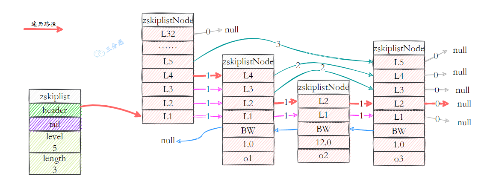

③、**跨度**

层的跨度用于记录两个节点之间的距离。跨度是用来计算排位（rank）的：在查找某个节点的过程中，将沿途访问过的所有层的跨度累计起来，得到的结果就是目标节点在跳跃表中的排位。

例如查找，分值为 3.0、成员对象为 o3 的节点时，沿途经历的层：查找的过程只经过了一个层，并且层的跨度为 3，所以目标节点在跳跃表中的排位为 3。

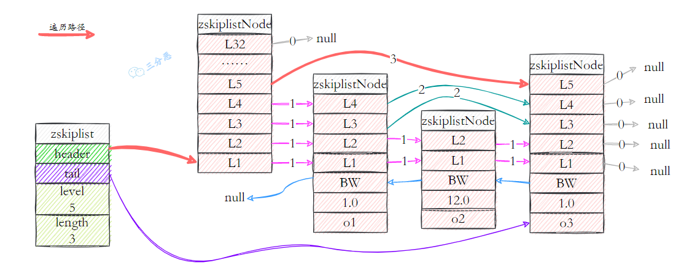

④、**分值和成员**

节点的分值（score 属性）是一个 double 类型的浮点数，跳跃表中所有的节点都按分值从小到大来排序。

节点的成员对象（obj 属性）是一个指针，它指向一个字符串对象，而字符串对象则保存这一个 SDS 值。

#### 为什么 hash 表范围查询效率比跳表低？

哈希表是一种基于键值对的数据结构，主要用于快速查找、插入和删除操作。

哈希表通过计算键的哈希值来确定值的存储位置，这使得它在单个元素的访问上非常高效，时间复杂度为 O(1)。

然而，哈希表内的元素是无序的。因此，对于范围查询（如查找所有在某个范围内的元素），哈希表无法直接支持，必须遍历整个表来检查哪些元素满足条件，这使得其在范围查询上的效率低下，时间复杂度为 O(n)。

跳表是一种有序的数据结构，能够保持元素的排序顺序。

它通过多层的链表结构实现快速的插入、删除和查找操作，其中每一层都是下一层的一个子集，并且元素在每一层都是有序的。

当进行范围查询时，跳表可以从最高层开始，快速定位到范围的起始点，然后沿着下一层继续直到找到范围的结束点。这种分层的结构使得跳表在进行范围查询时非常高效，时间复杂度为 O(log n) 加上范围内元素的数量。

> 1. [Java 面试指南（付费）](https://javabetter.cn/zhishixingqiu/mianshi.html)收录的小米暑期实习同学 E 一面面试原题：为什么 hash 表范围查询效率比跳表低
> 2. [Java 面试指南（付费）](https://javabetter.cn/zhishixingqiu/mianshi.html)收录的腾讯面经同学 23 QQ 后台技术一面面试原题：zset 的底层原理
> 3. [Java 面试指南（付费）](https://javabetter.cn/zhishixingqiu/mianshi.html)收录的得物面经同学 8 一面面试原题：跳表的结构
> 4. [Java 面试指南（付费）](https://javabetter.cn/zhishixingqiu/mianshi.html)收录的美团面经同学 4 一面面试原题：Redis 跳表
> 5. [Java 面试指南（付费）](https://javabetter.cn/zhishixingqiu/mianshi.html)收录的阿里系面经同学 19 饿了么面试原题：跳表了解吗

### 53.压缩列表了解吗？

压缩列表是 Redis **为了节约内存** 而使用的一种数据结构，由一系列特殊编码的连续内存块组成的顺序型数据结构。


hash、list、zset 在元素较少时会使用压缩列表。

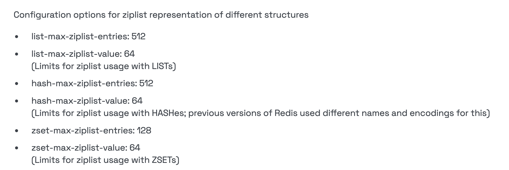

一个压缩列表包含任意多个节点，每个节点可以保存一个字节数组或者一个整数值。

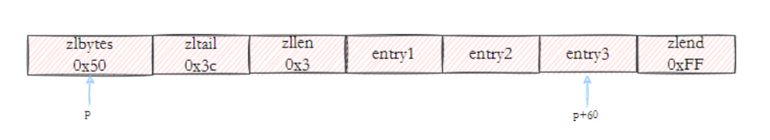

- **zlbyttes**：记录整个压缩列表占用的内存字节数
- **zltail**：记录压缩列表表尾节点距离压缩列表的起始地址有多少字节
- **zllen**：记录压缩列表包含的节点数量
- **entryX**：列表节点
- **zlend**：用于标记压缩列表的末端


> 1. [Java 面试指南（付费）](https://javabetter.cn/zhishixingqiu/mianshi.html)收录的同学 30 腾讯音乐面试原题：什么情况下使用压缩列表

### 54.快速列表 quicklist 了解吗？

Redis 早期版本存储 list 列表数据结构使用的是压缩列表 ziplist 和普通的双向链表 linkedlist，也就是说当元素少时使用 ziplist，当元素多时用 linkedlist。

但考虑到链表的附加空间相对较高，`prev` 和 `next` 指针就要占去 `16` 个字节（64 位操作系统占用 `8` 个字节），另外每个节点的内存都是单独分配，会家具内存的碎片化，影响内存管理效率。

后来 Redis 新版本（3.2）对列表数据结构进行了改造，使用 `quicklist` 代替了 `ziplist` 和 `linkedlist`，quicklist 是综合考虑了时间效率与空间效率引入的新型数据结构。

quicklist 由 list 和 ziplist 结合而成，它是一个由 ziplist 充当节点的双向链表。


GitHub 上标星 10000+ 的开源知识库《[ Java 进阶之路](https://github.com/itwanger/toBeBetterJavaer)》第一版 PDF 终于来了！包括 Java 基础语法、数组&字符串、OOP、集合框架、Java IO、异常处理、Java 新特性、网络编程、NIO、并发编程、JVM 等等，共计 32 万余字，500+张手绘图，可以说是通俗易懂、风趣幽默……详情戳：[太赞了，GitHub 上标星 10000+ 的 Java 教程](https://javabetter.cn/overview/)

微信搜 **隔壁老王** 或扫描下方二维码关注原创公众号隔壁老王，回复 **222** 即可免费领取。


## 补充

### 55.假如 Redis 里面有 1 亿个 key，其中有 10w 个 key 是以某个固定的已知的前缀开头的，如何将它们全部找出来？

使用 `keys` 指令可以扫出指定模式的 key 列表。但是要注意 keys 指令会导致线程阻塞一段时间，线上服务会停顿，直到指令执行完毕，服务才能恢复。这个时候可以使用 `scan` 指令，`scan` 指令可以无阻塞的提取出指定模式的 `key` 列表，但是会有一定的重复概率，在客户端做一次去重就可以了，但是整体所花费的时间会比直接用 `keys` 指令长。

### 56.Redis 的秒杀场景下扮演了什么角色？（补充）

秒杀主要是指大量用户集中在短时间内对服务器进行访问，从而导致服务器负载剧增，可能出现系统响应缓慢甚至崩溃的情况。

针对秒杀的场景来说，最终抢到商品的用户是固定的，也就是说 100 个人和 10000 个人来抢一个商品，最终都只能有 100 个人抢到。

但是对于秒杀活动的初心来说，肯定是希望参与的用户越多越好，但真正开始下单时，最好能把请求控制在服务器能够承受的范围之内（😂）。

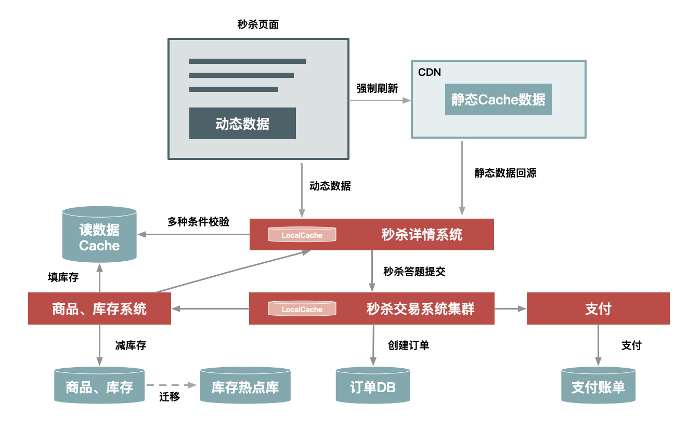

解决这一问题的关键就在于错峰削峰和限流。当然了，前端页面的静态化、按钮防抖也能够有效的减轻服务器的压力。

- 页面静态化：将商品详情等页面静态化，使用 CDN 分发。
- 按钮防抖：避免用户因频繁点击造成的额外请求，比如设定间隔时间后才能再次点击。

#### 如何实现错峰削峰呢？

针对车流量的晚高峰和早高峰，最强有力的办法就是限行，但限行不是无损的，毕竟限行的牌号无法出行。

无损的方式就是有的车辆早出发，有的车辆晚出发，这样就能够实现错峰出行。

在秒杀场景下，可以通过以下几种方式实现错峰削峰：

①、**预热缓存**：提前将热点数据加载到 Redis 缓存中，减少对数据库的访问压力。

②、**消息队列**：引入消息队列，将请求异步处理，减少瞬时请求压力。消息队列就像一个水库，可以削减上游的洪峰流量。

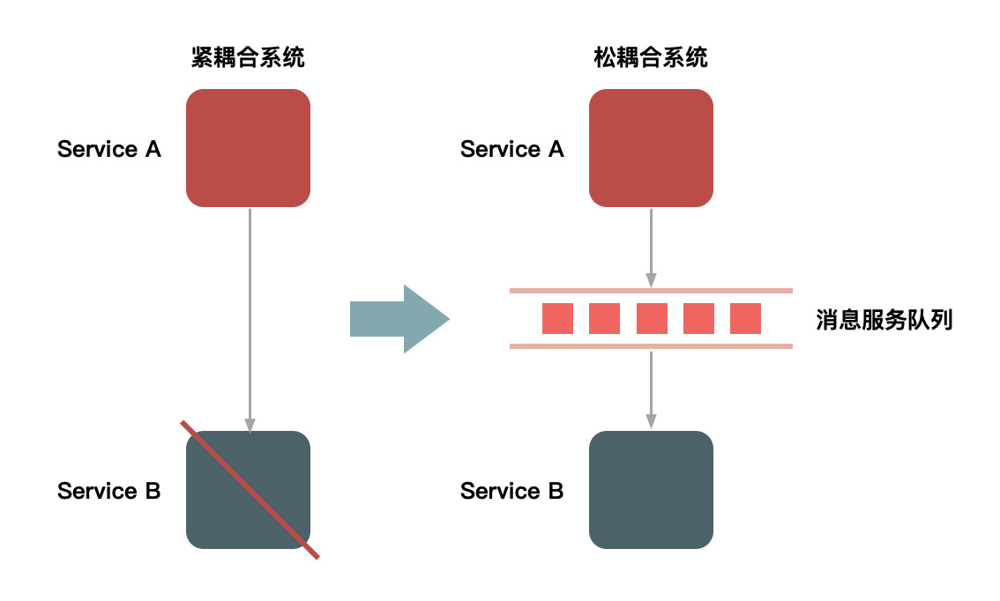

③、**多阶段多时间窗口**：将秒杀活动分为多个阶段，每个阶段设置不同的时间窗口，让用户在不同的时间段内参与秒杀活动。

④、**插入答题系统**：在秒杀活动中加入答题环节，只有答对题目的用户才能参与秒杀活动，这样可以减少无效请求。

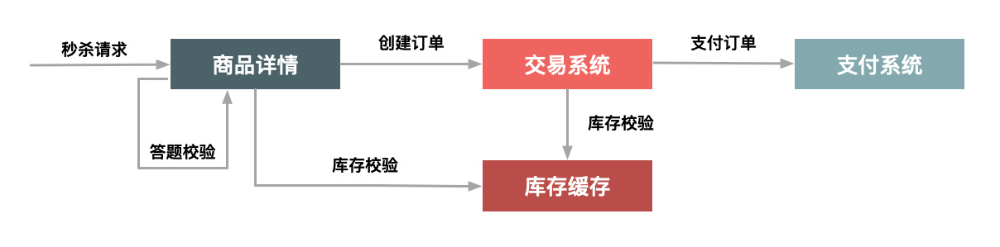

#### 如何限流呢？

采用令牌桶算法，它就像在帝都买车，摇到号才有资格，没摇到就只能等下一次（😁）。

在实际开发中，我们需要维护一个容器，按照固定的速率往容器中放令牌（token），当请求到来时，从容器中取出一个令牌，如果容器中没有令牌，则拒绝请求。

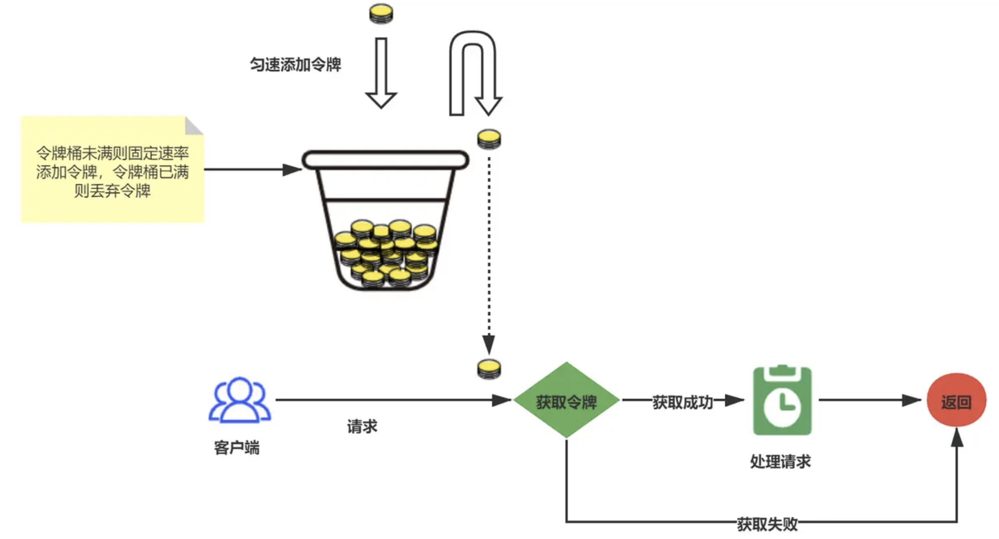

第一步，使用 Redis 初始化令牌桶：

```shell
redis-cli SET "token_bucket" "100"
```

第二步，使用 Lua 脚本实现令牌桶算法；假设每秒向桶中添加 10 个令牌，但不超过桶的最大容量。

```lua
-- Lua 脚本来添加令牌，并确保不超过最大容量
local bucket = KEYS[1]
local add_count = tonumber(ARGV[1])
local max_tokens = tonumber(ARGV[2])
local current = tonumber(redis.call('GET', bucket) or 0)
local new_count = math.min(current + add_count, max_tokens)
redis.call('SET', bucket, tostring(new_count))
return new_count
```

第三步，使用 Shell 脚本调用 Lua 脚本：

```shell
#!/bin/bash
while true; do
    redis-cli EVAL "$(cat add_tokens.lua)" 1 token_bucket 10 100
    sleep 1
done
```

第四步，当请求到达时，需要检查并消耗一个令牌。

```lua
-- Lua 脚本来消耗一个令牌
local bucket = KEYS[1]
local tokens = tonumber(redis.call('GET', bucket) or 0)
if tokens > 0 then
    redis.call('DECR', bucket)
    return 1  -- 成功消耗令牌
else
    return 0  -- 令牌不足
end
```

调用 Lua 脚本：

```shell
redis-cli EVAL "$(cat consume_token.lua)" 1 token_bucket
```

> 1. [Java 面试指南（付费）](https://javabetter.cn/zhishixingqiu/mianshi.html)收录的农业银行面经同学 3 Java 后端面试原题：秒杀问题（错峰、削峰、前端、流量控制）
> 2. [Java 面试指南（付费）](https://javabetter.cn/zhishixingqiu/mianshi.html)收录的滴滴面经同学 3 网约车后端开发一面原题：限流算法

### 57. 客户端宕机后 Redis 服务端如何感知到？

每个客户端在 Redis 中维护一个特定的键（称为心跳键），用于表示客户端的健康状态。该键具有一个设置的超时时间，例如 10 秒。

客户端定期（如每 5 秒）更新这个心跳键的超时时间，保持它的存活状态，通常通过 SET 命令重设键的过期时间。

```java
import redis.clients.jedis.Jedis;

public class ClientHeartbeat {
    private static final String HEARTBEAT_KEY = "client:heartbeat";
    private static final int EXPIRE_TIME = 10; // 10秒

    public static void main(String[] args) {
        // 创建 Redis 连接
        Jedis jedis = new Jedis("localhost");

        // 定时更新心跳键
        while (true) {
            try {
                // 设置心跳键并设置过期时间
                jedis.setex(HEARTBEAT_KEY, EXPIRE_TIME, "alive");

                // 打印心跳日志
                System.out.println("Heartbeat sent.");

                // 等待一段时间后再次发送心跳
                Thread.sleep(5000); // 每5秒发送一次心跳
            } catch (InterruptedException e) {
                e.printStackTrace();
                break;
            }
        }
    }
}
```

Redis 服务端定期检查这个心跳键。如果发现该键已超时并被 Redis 自动删除，说明客户端可能已宕机。

```java
import redis.clients.jedis.Jedis;

public class ServerMonitor {
    private static final String HEARTBEAT_KEY = "client:heartbeat";

    public static void main(String[] args) {
        // 创建 Redis 连接
        Jedis jedis = new Jedis("localhost");

        // 定期检查心跳键
        while (true) {
            try {
                // 检查心跳键是否存在
                if (jedis.exists(HEARTBEAT_KEY)) {
                    System.out.println("Client is alive.");
                } else {
                    System.out.println("Client is down or disconnected.");
                }

                // 每隔一段时间检查一次
                Thread.sleep(10000); // 每10秒检查一次
            } catch (InterruptedException e) {
                e.printStackTrace();
                break;
            }
        }
    }
}
```
