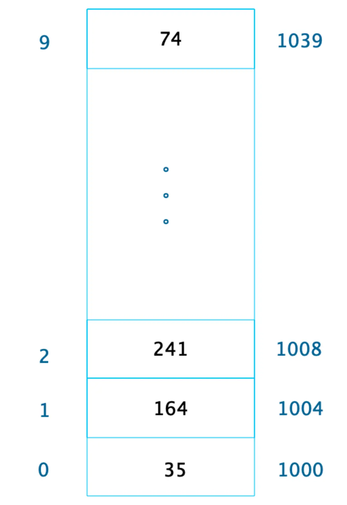
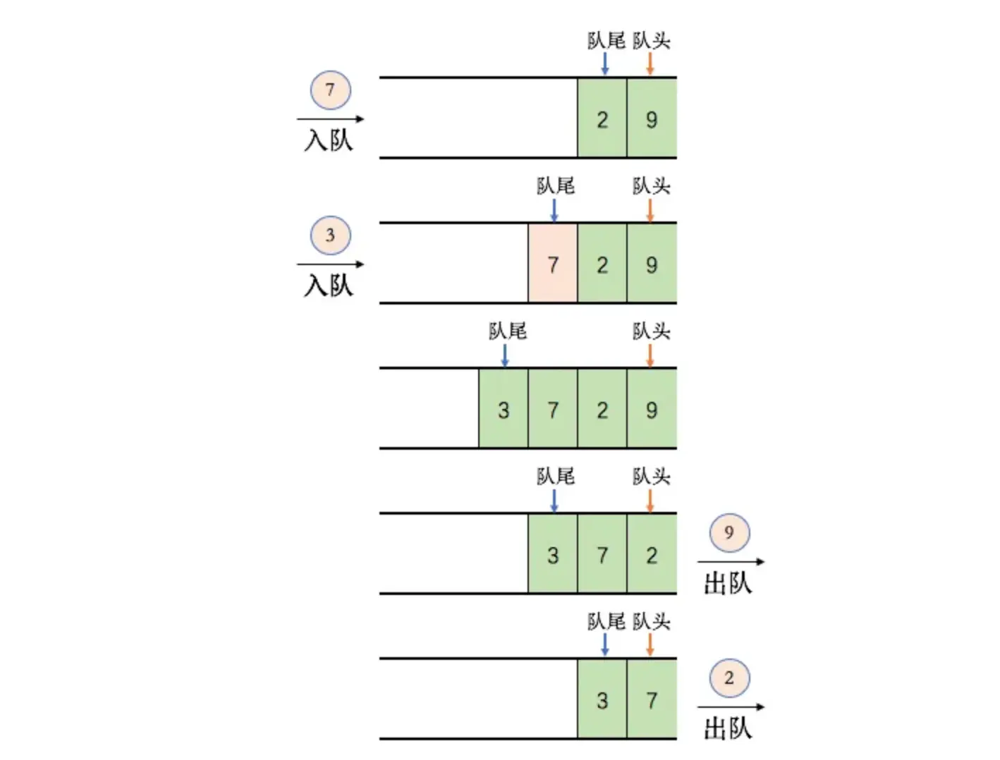
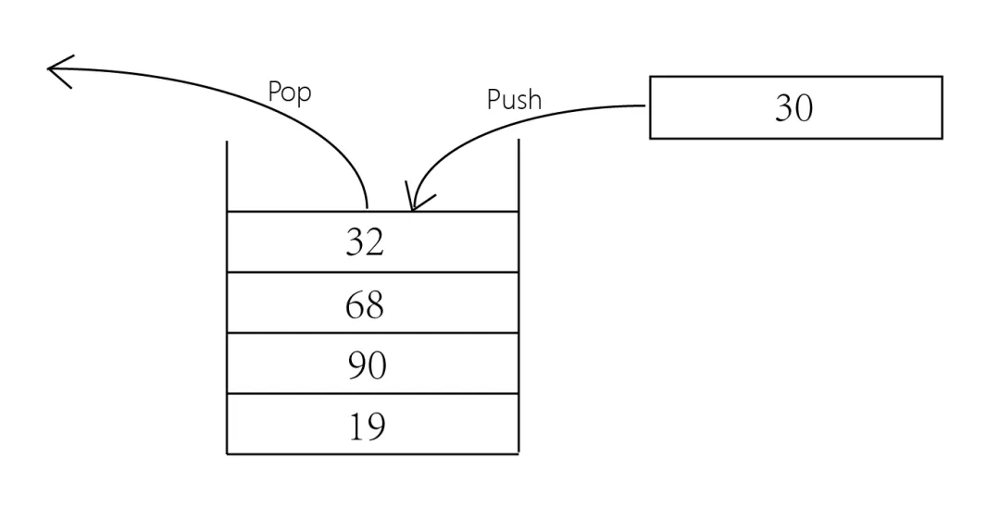
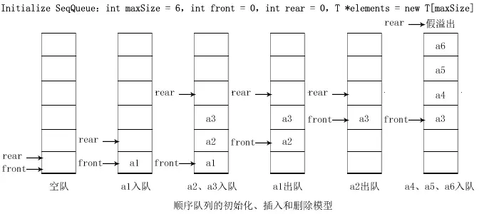
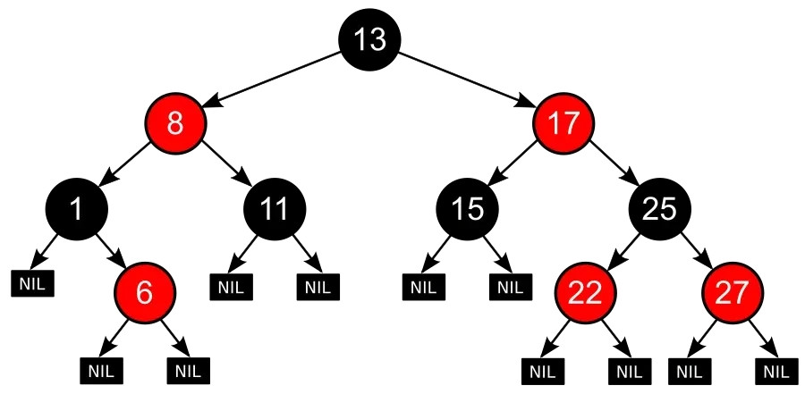
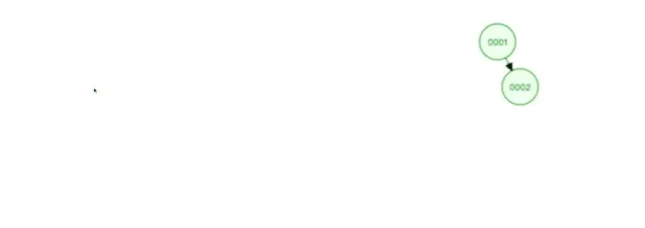

# 数据结构

## 概念

---

### 1.了解哪些数据结构？

- 数组：数组的内存空间是连续的，随机访问的时间复杂度是O1，适用于需要按索引访问元素的场景，但是插入和删除元素较慢，时间复杂度是On
- 链表：链表是由节点组成，节点之间是分散存储的，内存不连续，每个节点存储数据和指向下一个节点的指针。适用于频繁插入和删除元素的场景，随机访问元素较慢。
- 栈：栈是一种先进后出的数据结构，只允许在栈顶进行插入和删除操作。
- 队列：队列是一种先进先出（FIFO）的数据结构，允许在队尾插入元素，在队首删除元素。
- 树：树是一种非线性数据结构，由节点和边组成，每个节点可以有多个子节点。树适用于表示层次关系的场景，例如文件系统、组织结构等。

> 线性：数组，链表，栈，队列。其中栈和队列属于受限的线性表
>
> 非线性：树

---

### 2.数组和链表区别是什么？

- **访问效率**：数组可以通过索引直接访问任何位置的元素，访问效率高，时间复杂度为O(1)，而链表需要从头节点开始遍历到目标位置，访问效率较低，时间复杂度为O(n)。
- **插入和删除操作效率**：数组插入和删除操作可能需要移动其他元素，时间复杂度为O(n)，而链表只需要修改指针指向，时间复杂度为O(1)。
- **缓存命中率：**数组的连续存储能让一个 cache line（块） 覆盖多个元素，从而命中率高；而链表节点分散，cache line（块） 的利用率低，所以命中率差。
- **应用场景**：数组适合静态大小、频繁访问元素的场景，而链表适合动态大小、频繁插入、删除操作的场景。

---

### 3.为什么数组查询的复杂度为O(1)？

数组必须要内存中一块**连续**的空间，并且数组中必须存放**相同**的数据类型。

比如我们创建一个长度为 10，数据类型为整型的数组，在内存中的地址是从 1000 开始，那么它在内存中的存储格式如下。

由于每个整型数据占据 4 个字节的内存空间，因此整个数组的内存空间地址是 1000～1039，根据这个，我们就可以轻易算出数组中每个数据的内存下标地址。利用这个特性，我们只要知道了数组下标，也就是数据在数组中的位置，比如下标 2，就可以计算得到这个数据在内存中的位置 1008，从而对这个位置的数据 241 进行快速读写访问，时间复杂度为 O(1)。

---

### 4.说一下队列和栈的区别

主要区别在于元素的插入和删除方式以及元素的访问顺序。

**插入和删除方式：**

- 队列：队列采用先进先出（FIFO）的方式，即新元素插入队尾，删除操作发生在队首。
- 栈：栈采用后进先出（LIFO）的方式，即新元素插入栈顶，删除操作也发生在栈顶。

**元素的访问顺序：**

- 队列：队列的元素按照插入的顺序进行访问，先插入的元素先被访问到。
- 栈：栈的元素按照插入的顺序进行访问，但是最后插入的元素先被访问到。

队列适用于需要按照插入顺序进行处理的场景，例如任务调度；

而栈适用于需要维护最近操作状态的场景，例如函数调用。


---

### 5.介绍一下数据结构中的栈？怎么用 java 实现？

栈（stack）是一种特殊的线性数据结构，只能够在一端（即栈顶）进行，采用先进后出原则，基本操作有push和pop两种运算。

在Java中，可以通过多种方式实现栈：

- **数组实现**：适合已知最大容量的情况，但可能会导致栈溢出。
- **链表实现**：动态大小，没有溢出的问题，但需要额外的内存来存储指针。
- **内置 Stack类**：简单易用，适合一般情况，但由于其继承自 `Vector`，在多线程环境中可能不够高效。（`Vector` 的方法大多数都被 `synchronized` 修饰，意味着它是**线程安全的**。）

> 1、使用数组实现栈

```java
class ArrayStack {
    private int maxSize;
    private int[] stackArray;
    private int top;

    public ArrayStack(int size) {
        maxSize = size;
        stackArray = new int[maxSize];
        top = -1; // 栈顶指针，初始化为-1表示栈空
    }

    public void push(int value) {
        if (top == maxSize - 1) {
            throw new RuntimeException("Stack is full");
        }
        stackArray[++top] = value;
    }

    public int pop() {
        if (isEmpty()) {
            throw new RuntimeException("Stack is empty");
        }
        return stackArray[top--];
    }
	// 查看栈顶元素
    public int peek() {
        if (isEmpty()) {
            throw new RuntimeException("Stack is empty");
        }
        return stackArray[top];
    }

    public boolean isEmpty() {
        return (top == -1);
    }

    public int size() {
        return top + 1; // 返回栈中当前元素的数量
    }
}
```

> 2、使用链表实现栈

```plain
class Node {
    int data;
    Node next;

    public Node(int data) {
        this.data = data;
    }
}

class LinkedListStack {
    private Node top;

    public void push(int value) {
        Node newNode = new Node(value);
        newNode.next = top;
        top = newNode;
    }

    public int pop() {
        if (isEmpty()) {
            throw new RuntimeException("Stack is empty");
        }
        int value = top.data;
        top = top.next;
        return value;
    }

    public int peek() {
        if (isEmpty()) {
            throw new RuntimeException("Stack is empty");
        }
        return top.data;
    }

    public boolean isEmpty() {
        return (top == null);
    }
}
```

> 3、使用 Java 内置的 Stack 类

```plain
import java.util.Stack;

public class Main {
    public static void main(String[] args) {
        Stack<Integer> stack = new Stack<>();

        stack.push(1);
        stack.push(2);
        stack.push(3);

        System.out.println("Top element: " + stack.peek()); // 输出 3
        System.out.println("Popped element: " + stack.pop()); // 输出 3
        System.out.println("Is stack empty? " + stack.isEmpty()); // 输出 false
    }
}
```

---

### 6.如何使用两个栈实现队列？

使用两个栈实现队列的方法如下：

- 准备两个栈，分别称为`stackPush`和`stackPop`。
- 当需要入队时，将元素压入`stackPush`栈。
- 当需要出队时，先判断`stackPop`是否为空，如果不为空，则直接弹出栈顶元素；如果为空，则将`stackPush`中的所有元素依次弹出并压入`stackPop`中，然后再从`stackPop`中弹出栈顶元素作为出队元素。
- 当需要查询队首元素时，同样需要先将`stackPush`中的元素转移到`stackPop`中，然后取出`stackPop`的栈顶元素但不弹出。
- 通过上述方法，可以实现用两个栈来模拟队列的先进先出（FIFO）特性。

这种方法的时间复杂度为O(1)的入队操作，均摊时间复杂度为O(1)的出队和查询队首元素操作。以下是使用两个栈实现队列的Java代码示例：

```java
import java.util.Stack;

class MyQueue {
    private Stack<Integer> stackPush;
    private Stack<Integer> stackPop;

    public MyQueue() {
        stackPush = new Stack<>();
        stackPop = new Stack<>();
    }

    public void push(int x) {
        stackPush.push(x);
    }

    public int pop() {
        if (stackPop.isEmpty()) {
            while (!stackPush.isEmpty()) {
                stackPop.push(stackPush.pop());
            }
        }
        return stackPop.pop();
    }

    public int peek() {
        if (stackPop.isEmpty()) {
            while (!stackPush.isEmpty()) {
                stackPop.push(stackPush.pop());
            }
        }
        return stackPop.peek();
    }
 
}

// 测试代码
public class Main {
    public static void main(String[] args) {
        MyQueue queue = new MyQueue();
        queue.push(1);
        queue.push(2);
        System.out.println(queue.peek());  // 输出 1
        System.out.println(queue.pop());   // 输出 1
        System.out.println(queue.empty()); // 输出 false
    }
}
```

---

### 7.常见的队列有哪些及应用场景？

- **顺序队列**是利用一组连续的存储单元依次存放从队头到队尾的元素，同时设置两个指针，一个指向队头元素的位置，称为队头指针；另一个指向队尾元素的下一个位置，称为队尾指针。实现简单，空间利用率低，当队尾指针到达数组末尾时，即使前面有空闲空间，也可能无法继续插入元素，造成假溢出。一些简单的、对队列操作不太频繁且数据量相对较小的场景，如学校食堂打饭排队系统，可简单模拟学生排队打饭的过程，新学生在队尾加入，打到饭的学生从队头离开。



- **链式队列**是通过链表来实现的队列，每个节点包含数据域和指针域，指针域指向下一个节点。队头指针指向链表的头节点，队尾指针指向链表的尾节点。插入和删除操作在链表的两端进行，不需要移动元素，操作效率高，可动态分配内存，不存在空间溢出问题，但需要额外的指针空间来存储节点之间的链接关系。常用于处理数据量不确定、需要频繁进行插入和删除操作的场景，如操作系统中的进程调度，新进程可以随时在队尾加入等待队列，就绪的进程从队头取出执行。


- **循环队列**是把顺序队列的存储空间想象成一个首尾相接的圆环，当队尾指针到达数组末尾时，若数组头部还有空闲空间，则将队尾指针重新指向数组头部，继续插入元素。充分利用了数组的空间，避免了顺序队列中的假溢出问题，提高了空间利用率，但实现相对复杂一些，需要处理队头和队尾指针在循环时的特殊情况。常用于数据缓冲区的管理，如音频、视频数据的缓冲，数据以循环的方式存入缓冲区，消费端从队头取出数据进行处理，保证数据的连续和稳定。


- **双端队列**是一种特殊的队列，它允许在队列的两端进行插入和删除操作，既有队头指针又有队尾指针，两端都可以作为队头或队尾进行操作。具有很高的灵活性，可在两端快速插入和删除元素，支持多种操作模式，但实现相对复杂，需要更多的代码来维护两端的操作逻辑。在一些需要频繁在两端进行数据操作的场景中非常有用，如在浏览器的页面浏览历史记录中，用户可以向前和向后浏览页面，新访问的页面可以从队头或队尾插入，浏览过的页面可以从两端删除。


- **优先级队列**中的每个元素都有一个优先级，在插入和删除元素时，会根据元素的优先级来进行操作，优先级高的元素先出队。通常使用堆等数据结构来实现，以保证高效的插入和删除操作。能够快速获取优先级最高（或最低）的元素并进行处理，插入和删除操作的时间复杂度通常为 O (log n)，其中 n 是队列中的元素个数。在任务调度系统中，不同任务可能具有不同的优先级，优先级高的任务需要优先执行，如操作系统中的进程调度，实时性要求高的进程具有较高的优先级，会优先被调度执行。


---

### 8.平衡二叉树结构是怎么样的？

使用二叉树搜索树的目的之一是缩短插入、删除、修改和查找（插入、删除、修改都包括查找操作）节点的时间。

关于查找效率，如果一棵树的高度为h，在最坏的情况，查找一个关键字需要对比 h 次，查找时间复杂度不超过 O(h)。一棵理想的二叉搜索树所有操作的时间可以缩短到 O(logn)（n 是节点总数)。然而 O(h) 的时间复杂度仅为理想情况。在最坏情况下，搜索树有可能退化为链表。

想象一棵每个结点只有右孩子的二叉搜索树，那么它的性质就和链表一样，所有操作（增删改查）的时间是O(n)。可以发现操作的复杂度与树的高度 h 有关。由此引出了平衡树，通过一定操作维持树的高度（平衡性）来降低操作的复杂度。所谓的平衡树是指一种改进的二叉查找树，顾名思义平衡树就是将二叉查找树平衡均匀地分布，这样的好处就是可以减少二叉查找树的深度。一般情况下二叉查找树的查询复杂度取决于目标节点到树根的距离（即深度），当节点的深度普遍较大时，查询的平均复杂度就会上升，因此为了实现更高效的查询就有了平衡树。平衡二叉树平衡的特性：

- 左右两个子树的高度差（平衡因子）的绝对值不超过1
- **左右两个子树都是一棵平衡二叉树**

非平衡二叉树(左)和平衡二叉树(右)如下图所示：

通过平衡的特性，可以有效的减少二叉树的深度，从而提高了查询的效率。再来看看下图：

分析：

- 图一是一个平衡二叉树，它满足平衡二叉树的定义。
- 图二不是平衡二叉树，其原因并不是不满足平衡因子的条件，而是因为它不满足二叉搜索树的构成条件，这提醒我们平衡二叉树首先要是一棵二叉搜索树。
- 图三满足平衡二叉树的构成条件。
- 图 4 中的节点 (8) 平衡因子为 3，不满足平衡二叉树的要求。

---

### 9.红黑树说一下，跳表说一下？

> 左根右，根叶黑，不红红，黑路同  

红黑树（Red-Black Tree）是一种自平衡的二叉搜索树，它在插入和删除操作后能够通过旋转和重新着色来保持树的平衡。红黑树的特点如下：

- 每个节点都有一个颜色，红色或黑色。
- 根节点是黑色的。
- 每个叶子节点（NIL节点）都是黑色的。
- 如果一个节点是红色的，则它的两个子节点都是黑色的。
- 从根节点到叶子节点或空子节点的每条路径上，黑色节点的数量是相同的。

红黑树通过这些特性来保持树的平衡，确保最长路径不超过最短路径的两倍，从而保证了在最坏情况下的搜索、插入和删除操作的时间复杂度都为O(logN)。跳表（Skip List）是一种基于链表的数据结构，它通过添加多层索引来加速搜索操作。跳表的特点如下：

- 跳表中的数据是有序的。
- 跳表中的每个节点都包含一个指向下一层和右侧节点的指针。

跳表通过多层索引的方式来加速搜索操作。最底层是一个普通的有序链表，而上面的每一层都是前一层的子集，每个节点在上一层都有一个指针指向它在下一层的对应节点。这样，在搜索时可以通过跳过一些节点，直接进入目标区域，从而减少搜索的时间复杂度。跳表的平均搜索、插入和删除操作的时间复杂度都为O(logN)，与红黑树相比，跳表的实现更加简单，但空间复杂度稍高。跳表常用于需要高效搜索和插入操作的场景，如数据库、缓存等。

### 10.你知道什么地方用了红黑树和跳表吗？

- epoll 用了红黑树来保存监听的 socket
- redis 用了跳表来实现 zset

### 11.跳表时间复杂度？

> 跳表高度大约是 `O(log n)`，每层平均查找 `O(1)` 个节点


- 搜索操作的时间复杂度：O(log n)，其中n是跳表中元素的数量。这是因为跳表中使用多级索引，可以通过跳跃的方式快速定位到目标元素所在的位置，从而将搜索的时间复杂度降低到对数级别。
- 插入和删除操作的时间复杂度：O(log n)，其中n是跳表中元素的数量。与搜索操作类似，插入和删除操作也可以通过跳跃的方式快速定位到需要插入或删除的位置，并进行相应的操作。因此，插入和删除的时间复杂度也是对数级别的。

### 12.红黑树的数据结构介绍一下？

红黑树是一种自平衡的二叉查找树，具有以下特点：

- 每个节点要么是红色，要么是黑色。
- 根节点是黑色。
- 每个叶子节点（NIL节点）是黑色。
- 如果一个节点是红色，则其子节点必须是黑色。
- 从任一节点到其每个叶子节点的所有路径都包含相同数目的黑色节点。

红黑树的自平衡性质可以保证在进行插入、删除等操作后，树的高度保持在O(log n)内，从而保持了较高的查找、插入和删除效率。下面是红黑树插入节点的过程，这左旋右旋的操作，就是为了自平衡。


### 13.红黑树和AVL树相比查询性能好还是插入性能好一些？

| 操作      | AVL 树        | 红黑树        |
| --------- | ------------- | ------------- |
| 查询      | ⭐⭐⭐⭐⭐（更快） | ⭐⭐⭐⭐          |
| 插入/删除 | ⭐⭐⭐           | ⭐⭐⭐⭐⭐（更快） |
| 平衡开销  | 高            | 低            |

> 查询性能的对比：

- **AVL 树**：AVL 树是严格的平衡二叉搜索树，它要求每个节点的左右子树的高度差（平衡因子）不超过 1。这种严格的平衡特性使得 AVL 树的高度始终保持在 O(log n)，其中 n)是树中节点的数量。在进行查询操作时，由于树的高度相对较低且较为均匀，所以查找任意节点的时间复杂度稳定为 O(log n)。这意味着在理想情况下，AVL 树的查询效率非常高，能快速定位到目标节点。
- **红黑树**：红黑树是一种弱平衡的二叉搜索树，它通过颜色标记和特定的规则（如每个节点要么是红色，要么是黑色；根节点是黑色；每个叶子节点（NIL 节点，空节点）是黑色；如果一个节点是红色的，则它的两个子节点都是黑色的；对每个节点，从该节点到其所有后代叶节点的简单路径上，均包含相同数目的黑色节点）来维持大致的平衡。红黑树的高度通常比 AVL 树略高，其高度上限为 2log(n + 1)，因此查询操作的时间复杂度同样为 (log n)，但在实际应用中，由于树的高度相对较高，其查询性能可能会略逊于 AVL 树。

在查询性能上，AVL 树由于其严格的平衡特性，表现会稍好于红黑树，但差距通常不大。

> 插入性能的对比：

- **AVL 树**：在插入新节点后，AVL 树可能会破坏原有的平衡结构，需要通过旋转操作（单旋转或双旋转）来重新平衡树。由于 AVL 树对平衡的要求非常严格，插入操作后可能需要进行多次旋转来恢复平衡，特别是在树的高度较高时，插入操作可能会引发较多的旋转操作，导致插入性能受到一定影响。插入操作的平均时间复杂度虽然也是 O(log n)，但由于旋转操作的开销，实际插入效率相对较低。
- **红黑树**：红黑树在插入新节点后，同样可能会破坏树的平衡，但它只需要进行少量的颜色调整和最多两次旋转操作就能恢复平衡。红黑树的平衡规则相对宽松，使得在插入操作时不需要像 AVL 树那样频繁地进行旋转操作，因此插入性能相对较好。插入操作的平均时间复杂度同样为 O(log n)，但由于减少了旋转操作的次数，实际插入效率更高。

在插入性能上，红黑树由于其弱平衡特性，表现优于 AVL 树。在实际应用中，如果查询操作频繁，对查询性能要求较高，且插入和删除操作相对较少，可以选择 AVL 树；如果插入和删除操作较为频繁，对插入性能有较高要求，同时查询性能也能接受一定的损耗，则红黑树是更好的选择。例如，Java 中的 `TreeMap` 和 `TreeSet` 底层使用的就是红黑树，以兼顾插入、删除和查询操作的性能。

### 14.二叉树搜索最坏的时间复杂度，为什么会这样？以及用什么结果解决？

**当每次插入的元素都是二叉查找树中最大的元素，二叉查找树就会退化成了一条链表，查找数据的时间复杂度变成了 O(n)**，如下动图演示：

二叉查找树由于存在退化成链表的可能性，会使得查询操作的时间复杂度从 O(logn) 升为 O(n)。为了解决二叉查找树会在极端情况下退化成链表的问题，后面就有人提出**平衡二叉查找树（AVL 树）**。主要是在二叉查找树的基础上增加了一些条件约束：**每个节点的左子树和右子树的高度差不能超过 1**。也就是说节点的左子树和右子树仍然为平衡二叉树，这样查询操作的时间复杂度就会一直维持在 O(logn) 。下图是每次插入的元素都是平衡二叉查找树中最大的元素，可以看到，它会维持自平衡：

除了平衡二叉查找树，还有很多自平衡的二叉树，比如红黑树，它也是通过一些约束条件来达到自平衡，不过红黑树的约束条件比较复杂。下面是红黑树插入节点的过程，这左旋右旋的操作，就是为了自平衡。


