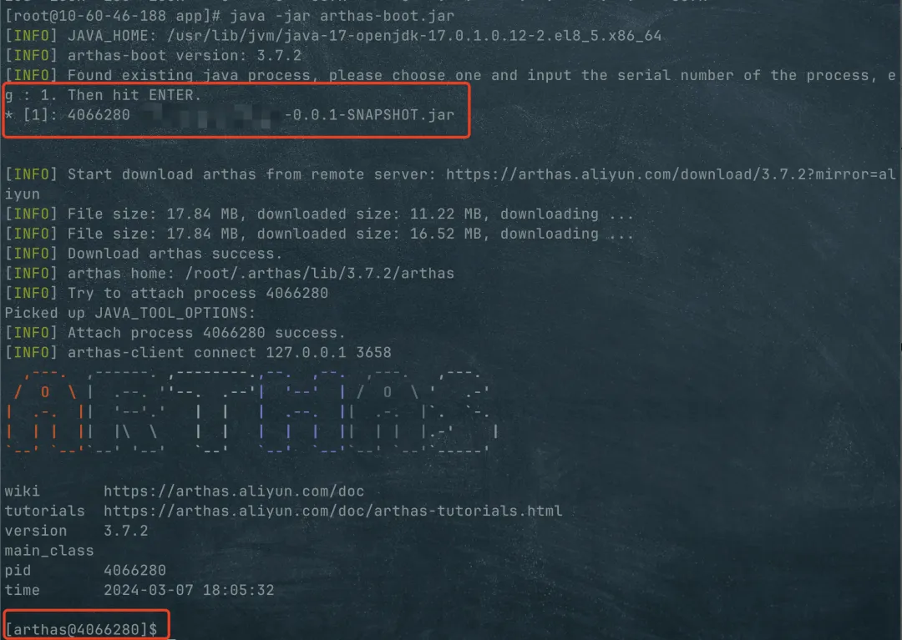
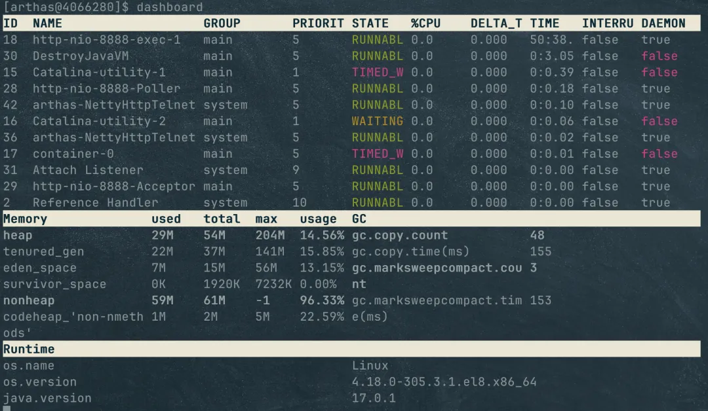
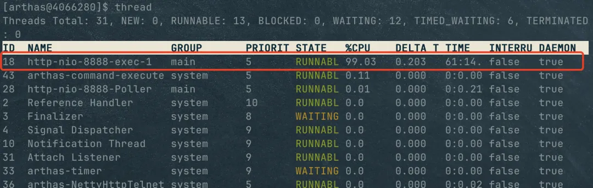
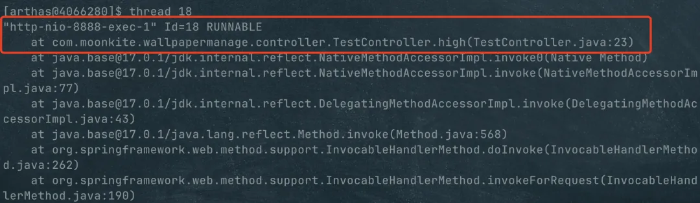

# CPU飘高问题

## 使用 jstack 工具

### 第一步，使用 top 找到占用 CPU 最高的 Java 进程

前面说了这一步，就是使用 Top 命令


使用 `top`命令发现占用 CPU 99.7% 的线程是 Java 进程，进程 PID 为 `13731`。

### 第二步，找到占用 CPU 最高的线程

上一步用 `top`命令找到了那个 Java 进程。那一个进程中有那么多线程，不可能所有线程都一直占着 CPU 不放，这一步要做的就是揪出这个罪魁祸首，当然有可能不止一个。

接下来，还是用 `top`命令，只不过加一个参数`-Hp` ，就是下面这样

```plain
top -Hp pid
```

`H`参数表示要显示线程级别的信息，`p`则表示指定的pid，也就是进程id。代入前面得到的那个Java进程，完整的命令是这样的

```plain
top -Hp 13731
```

执行之后，这个Java进程中占用线程占用 CPU 的情况就列出来了。

.webp)

可以看到占用 CPU 最高的那个线程 PID 为 `13756`。

### 第三步，保存线程堆栈信息

这就要用到 JDK 默认提供的一个工具了，叫做 jstack。当你安装了 JDK 之后，在 `bin`目录下会有一大堆内置的工具，`java`也是其中之一，还有另外我们可能比较熟悉的 `javac`

.webp)

jstack 用于生成 Java 进程的线程快照（thread dump）。线程快照是一个关于 Java 进程中所有线程当前状态的快照，包括每个线程的堆栈信息。通过分析线程快照，可以了解 Java 进程中各个线程的运行状态、锁信息等。

我们用`jstack`的目的就是将那个占用 CPU 最高的线程的堆栈信息搞下来，然后进一步分析。使用命令 `jstack pid > out.log`将某个进程的堆栈信息输出到 out.log文件中。

当前 Java 程序的所有线程信息都可以通过 `jstack`命令查看，我们用`jstack`命令将第一步找到的 Java 进程的线程栈保存下来。

```plain
jstack 13731 > thread_stack.log
```

### 第四步，在线程栈中查找最贵祸首的线程

第二步已经找到了这个罪魁祸首的线程 PID 是 `13756`。

然后我们将 `13756`转换为 16 进制的，可以用在线进制转换的网站直接转换，比如 https://tool.oschina.net/hexconvert 这个，转换结果为 `0x35bc`。

最后，我们在线程栈中，也就是上一步保存的那个 thread_stack.log 文件，在里面查找这个16进制的线程 id （`0x35bc`）。

.webp)

然后，我么能看到了我们需要的线程名称、线程状态，哪个方法的哪一行代码消耗了最多的 CPU 都很清楚了。

## 第二种，Arthas

Arthas 是阿里开源的一款线上监控诊断产品，通过全局视角实时查看应用 load、内存、gc、线程的状态信息，并能在不修改应用代码的情况下，对业务问题进行诊断，包括查看方法调用的出入参、异常，监测方法执行耗时，类加载信息等，大大提升线上问题排查效率。

用 Arthas 查找占用 CPU 最高的方法只是一个开胃小菜，除此之外，它最大的用途是在不改代码、不重启服务的情况下对程序进行动态监控。如果你碰到了线上诡异问题，一定要用 Arthas 尝试找一找问题，开阔一下眼界。

好了，更多的功能到官网 https://arthas.aliyun.com/ 了解吧，接下来就将一下如何用 Arthas 达到前面用 jstack 同样的目的。

### 安装 Arthas

当然了，要使用 Arthas，你就必须先把它安装到你的目标服务器上，也就是那个出问题的Java服务所在的服务器。

下载 jar 包

```plain
curl -O https://arthas.aliyun.com/arthas-boot.jar
```

启动 Arthas 服务

```plain
java -jar arthas-boot.jar
```

启动之后，会列出当前这台服务器上的所有 Java 进程，然后你选择你要排查的那个服务即可。



然后出现 `arthas@`之后表示已经启动，并成功 attach 到目标进程上 。

然后可以输入命令 `dashboard`看一下实时面板，默认 5 秒刷新一次，在这个面板上能够看到线程、内存堆栈、GC和Runtime的基本信息。如果你用过 VisualVM 的话，就和那个基本一样。



好了，开始用 Arthas 找到导致 CPU 负载过高的问题吧。

### 找到占用CPU最高的进程

第一步，其实还是用 `top`命令找到占用 CPU 最高的进程，也就是 Arthas 启动时选择 attach 的那个 Java 进程。

然后 `java -jar arthas-boot.jar`启动Arthas，并attach 。

### 找到占用 CPU 最高的线程

执行 `thread`命令，这个命令会显示所有线程的信息，并且把CPU使用率高的线程排在前面。

这样，一眼就看出来了，第一个线程的 CPU 使用率高达 99% 了，就是它。



### 查看堆栈信息

使用 `thread ID` 获取堆栈信息，其实就是 `jstack pid`相同的作用。通过前一步看到这个线程的 ID 是18，然后执行 `thread 18`



然后直接就看出来了出现问题的位置，`TestController.java`文件的 `high`方法的第23行。然后进代码看

```plain
com.moonkite.wallpapermanage.controller.TestController.high(TestController.java:23)
```

这个方法是我故意写的死循环，真实情况当然没有这么明显，还需要针对具体代码认真分析。

## 总结

高 CPU 占用率这个问题是一种很常见也很典型的线上问题，排查方式只要按上述顺序记下来就基本上没什么问题。

其实还是推荐使用 Arthas，除了它确实功能非常多之外，还有就是在线上场景下，使用 `jstack`有时会碰到问题，如果这个线程已经忙的一点转圜的余地都没有了，`jstack`命令可能会执行失败。