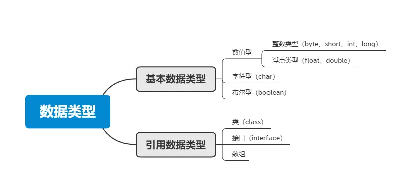
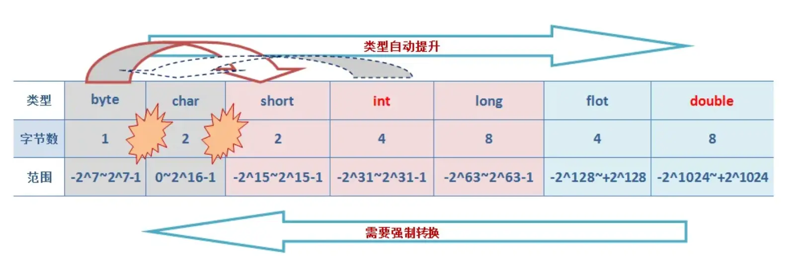
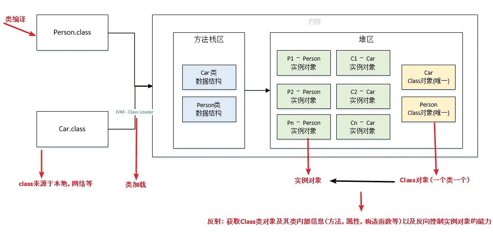
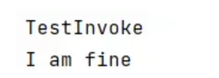
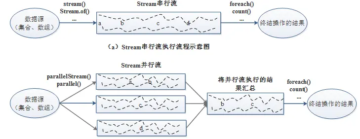
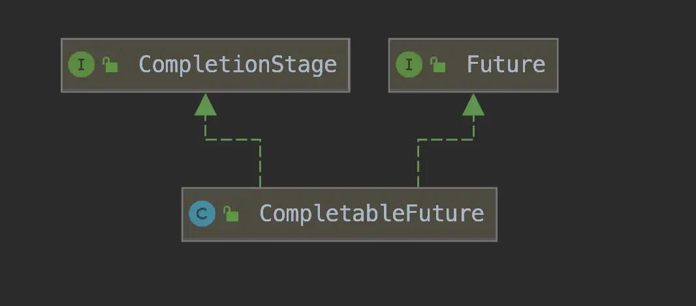

# Java基础面试题

## 概念

### 1.说一下Java的特点
主要有以下的特点：

- **平台无关性**：Java的“编写一次，运行无处不在"哲学是其最大的特点之一。Java编译器将源代码编译成
  字节码(bytecode)，该字节码可以在任何安装了Java虚拟机（JVM)的系统上运行。
- **面向对象**：Java是一门严格的面向对象编程语言，几乎一切都是对象。面向对象编程(OOP)特性使
  得代码更易于维护和重用，包括类(class)、对象（object)、继承(inheritance)、多态
  (polymorphism)、抽象（abstraction)和封装(encapsulation)。
- **内存管理**：Java有自己的垃圾回收机制，自动管理内存和回收不再使用的对象。这样，开发者不需要
  手动管理内存，从而减少内存泄漏和其他内存相关的问题。

### 2.Java 的优势和劣势是什么？

首先，Java的优势，我记得跨平台应该是一个大点，因为JVM的存在，一次编写到处运行。然后面向对象，这个可能也是优势，不过现在很多语言都支持面向对象，但是Java的设计从一开始就是OOP的。还有强大的生态系统，比如Spring框架，Hibernate，各种库和工具，社区支持大，企业应用广泛。另外，内存管理方面，自动垃圾回收制，减少了内存泄漏的问题，对开发者友好。还有多线程支持，内置的线程机制，方便并发编程。安全性方面，Java有安全模型，比如沙箱机制，适合网络环境。还有稳定性，企业级应用长期使用，版本更新也比较注重向后兼容。

劣势的话，性能可能是一个，虽然JVM优化了很多，但相比C++或者Rust这种原生编译语言，还是有一定开销。特别是启动时间，比如微服务场景下，可能不如GO之类的快。语法繁琐，比如样板代码多，之前没有lambda的时候更麻烦，现在有了但比起Python还是不够简洁。内存消耗，JVM本身占内存，对于资源有限的环境可能不太友好还有面向对象过于严格，有时候写简单程序反而麻烦，虽然Java8引入了函数式编程，但不如其他语言自然。还有开发效率，相比动态语言如Python，Java需要更多代码，编译过程也可能拖慢开发节奏。

### 3.Java为什么是跨平台的？

Java能支持跨平台，主要依赖于JVM关系比较大。

JVM也是一个软件，不同的平台有不同的版本。我们编写的Java源码，编译后会生成一种.class文件，称为字节码文件。Java虚拟机就是负责将字节码文件翻译成特定平台下的机器码然后运行。也就是说，只要在不同平台上安装对应的JVM，就可以运行字节码文件，运行我们编写的Java程序。

而这个过程中，我们编写的Java程序没有做任何改变，仅仅是通过JVM这一"中间层”，就能在不同平台上运行，真正实现了"一次编译，到处运行"的目的。

JVM是一个"桥梁"，是一个"中间件"，是实现跨平台的关键，Java代码首先被编译成字节码文件，再由JVM将字节码文件翻译成机器语言，从而达到运行Java程序的目的。

编译的结果不是生成机器码，而是生成字节码，字节码不能直接运行，必须通过VM翻译成机器码才能运行。不同平台下编译生成的字节码是一样的，但是由JVM翻译成的机器码却不一样。

所以，运行Java程序必须有JVM的支持，因为编译的结果不是机器码，必须要经过JVM的再次翻译才能执行。即使你将Java程序打包成可执行文件（例如.exe），仍然需要VM的支持。

跨平台的是Java程序，不是JVM。JVM是用C/C++开发的，是编译后的机器码，不能跨平台，不同平台下需要安装不同版本的VM。


### 4. JVM、JDK、JRE三者关系？


它们之间的关系如下：

- JVM是Java虚拟机，是Java程序运行的环境。它负责将Java字节码（由Java编译器生成）解释或编译成
  机器码，并执行程序。JVM提供了内存管理、垃圾回收、安全性等功能，使得Java程序具备跨平台性。
- JRE是Java运行时环境，是Java程序运行所需的最小环境。它包含了JVM和一组Java类库，用于支持Java程序的执行。JRE不包含开发工具，只提供Java程序运行所需的运行环境。
- JDK是Java开发工具包，是开发Java程序所需的工具集合。它包含了JVM、编译器(javac)、调试器（jdb)等开发工具，以及一系列的类库（如Java标准库和开发工具库）。JDK提供了开发、编译、调试和运行Java程序所需的全部工具和环境。

### 5. 为什么Java解释和编译都有？

首先在Java经过编译之后生成字节码文件，接下来进入JVM中，就有两个步骤编译和解释。 如下图：


这段话的意思是，Java 语言在运行时既使用了编译的方式，也使用了解释的方式，具体解释如下：

**编译性**：

- Java 程序源代码首先被**编译**成字节码（`.class` 文件）。字节码是一种平台无关的中间表示，意味着它可以在任何安装了 Java 虚拟机（JVM）的操作系统上运行，而不需要重新编译。
- **JIT（即时编译器）**：JIT 是 JVM 的一部分，它在程序运行时将字节码转化为机器码（即具体操作系统的本地代码）。JIT 会缓存这些机器码，避免每次执行时都重新编译，这样可以提高程序的执行效率。

**解释性**：

- **解释器**：在程序执行的过程中，JVM 有一个解释器，它可以逐行读取字节码并直接执行，而不需要将字节码完全转化为机器码。解释器是较为“实时”的执行方式，但相对较慢。
- **方法调用计数器**：JVM 采用一种优化机制，当某个方法被调用的次数超过一定阈值时，JIT 编译器会将该方法的字节码编译为机器码，以提高后续的执行效率。如果调用次数较少，JVM 就继续使用解释器来执行，避免不必要的编译开销。

**混合模式**：

- Java 的执行模式是**混合型的**，既有**编译**也有**解释**：
  - 初始阶段，字节码通常是通过解释器执行的（即逐行解释执行）。
  - 如果某个方法被频繁调用，JIT 编译器会将该方法编译成机器码，减少重复解释的开销。

### 6.JVM是什么

JVM是 Java 虚拟机，其主要任务是解释自己的指令集（即字节码），并将其映射到本地的 CPU 指令集和操作系统的系统调用上。

JVM 屏蔽了与操作系统平台相关的细节，使得 Java 程序只需生成在 Java 虚拟机上运行的字节码，便可以在多个平台上无修改地运行。这也是 Java 实现“编译一次，到处运行”的根本原因。

### 7.**编译型语言和解释型语言的区别？**

1. **编译型语言：**
   - **定义**：在程序执行之前，整个源代码会被编译成机器码或字节码，生成可执行文件。
   - **执行方式**：程序执行时直接运行已编译的代码，执行速度较快。
   - **特点**：编译后的程序与平台紧密相关，跨平台性较差。
   - **典型语言**：C、C++。

2. **解释型语言：**
   - **定义**：程序执行时，源代码被逐行解释并执行，不生成独立的可执行文件。
   - **执行方式**：由解释器动态解释并执行代码，通常需要源代码和解释器一起运行。
   - **特点**：具有较好的跨平台性，但执行速度相对较慢。
   - **典型语言**：Python、JavaScript。

### 8.**Python和Java的区别：**

1. **Java：**
   - Java 是一种编译型语言，意思是你写的代码会先通过编译器转换成字节码。
   - 这些字节码不直接运行在操作系统上，而是通过 Java 虚拟机（JVM）来执行。
   - 这样做的好处是，Java 代码可以在任何支持 JVM 的平台上运行，所以它的跨平台性很好。

2. **Python：**
   - Python 是解释型语言，也就是说，代码是直接由解释器逐行翻译并执行的。
   - 这意味着每次运行 Python 程序时，解释器都在一边翻译，一边执行，所以执行速度相对较慢。
   - 尽管如此，Python 也有很好的跨平台性，因为它的解释器可以在不同平台上运行。

## 数据类型

### 1.八种基本的数据类型

Java支持数据类型分为两类：**基本数据类型**和**引用数据类型**。

🔎基本数据类型共有8种，可以分为四类：

✅ **数值型**：**整数类型**：byte， short， int， long  **浮点数类型**：float， double

✅ **字符类型**：char（注意 Java 用 Unicode 编码，支持国际化）

✅ **布尔类型**：boolean



### 2.int和long是多少位，多少字节的？

**int**

- **字节数**：4 个字节（32 bits）

- **取值范围**：

  -2^{31} 到 2^{31} - 1

**long**

- **字节数**：8 个字节（64 bits）

- **取值范围**：

  -2^{63} 到 2^{63} - 1

### 3. long和int可以互转吗？
可以的，Java中的long 和int可以相互转换。由于long类型的范围比 int类型大，因此将 int 转换为long 是安全的将
long转换为int可能会导致数据丢失或溢出。将 int转换为long可以通过直接赋值或强制类型转换来实现。例如：

```java
int intValue = 10;
longlongValue=intValue；//自动转换，安全的
```

将long转换为int需要使用强制类型转换，但需要注意潜在的数据丢失或溢出问题。



例如：

```java
long longValue = 100L;
int intValue = (int)longValue;//强制类型转换，可能会有数据丢失或溢出
```

在将Long转换为int时，如果longValue的值超出了int类型的范围，转换结果将是截断后的低位部分。因此，在进行转换之前，建议先检查longValue的值是否在int类型的范围内，以避免数据丢失或溢出的问题。

### 4.数据类型转换方式你知道哪些？

- 自动类型转换（隐式转换）：当目标类型的范围大于源类型时，Java会自动将源类型转换为目标类型，不需要显式的类型转换。例如，将int转换为Long、将float转换为double等。
- 强制类型转换（显式转换）：当目标类型的范围小于源类型时，需要使用强制类型转换将源类型转换为目标类型。这可能导致数据丢失或溢出。例如，将1ong转换为int、将double转换为int等。语法为：目标类型变量名=（目标类型）源类型。
- 字符串转换：Java提供了将字符串表示的数据转换为其他类型数据的方法。例如，将字符串转换为整型int，可以使用Integer.parseInt()方法；将字符串转换为浮点型double，可以使用 Double.parseDouble()方法等。
- 数值之间的转换：Java提供了一些数值类型之间的转换方法，如将整型转换为字符型、将字符型转换为整型等。这些转换方式可以通过类型的包装类来实现，例如Character类、Integer类等提供了相应的转换方法。

### 5.类型互转会出现什么问题吗？

- 数据丢失：当将一个范围较大的数据类型转换为一个范围较小的数据类型时，可能会发生数据丢失。例如，将一个long类型的值转换为int类型时，如果1ong值超出了int类型的范围，转换结果将是截断后的低位部分，高位部分的数据将丢失。
- 数据溢出：与数据丢失相反，当将一个范围较小的数据类型转换为一个范围较大的数据类型时，可能会发生数据溢出。例如，将一个int类型的值转换为long类型时，转换结果会填充额外的高位空间，但原始数据仍然保持不变。
- 精度损失：在进行浮点数类型的转换时，可能会发生精度损失。由于浮点数的表示方式不同，将一个单精度浮点数(float)转换为双精度浮点数(double)时，精度可能会损失。
- 类型不匹配导致的错误：在进行类型转换时，需要确保源类型和目标类型是兼容的。如果两者不兼容，会导致编译错误或运行时错误。

### 6.为什么用bigDecimal不用double? 

double会出现精度丢失的问题，double:执行的是二进制浮点运算，二进制有些情况下不能准确的表示一个小数，就像十进制不能准确的表示1/3(1/3=0.3333.)，也就是说二进制表示小数的时候只能够表示能够用 1/(2^)的和的任意组合，但是0.1不能够精确表示，因为它不能够表示成为1/(2^n)的和的形式。

### 7.装箱和拆箱是什么？

装箱(Boxing)和拆箱(Unboxing)是将基本数据类型和对应的包装类之间进行转换的过程。

```java
Integer i = 10;//装箱 
int n = i;//拆箱
```

自动装箱主要发生在两种情况，一种是赋值时，另一种是在方法调用的时候。

赋值时

这是最常见的一种情况，在Jva1.5以前我们需要手动地进行转换才行，而现在所有的转换都是由编译器来完成。

```java
//before autoboxing 
Integer iobject = Integer.valueof(3); 
int iPrimitive = iobject.intValue()
//after java5 
Integer iobject = 3;//autobxing primitive to wrapper conversion 
int iPrimitive = iobject;//unboxing object to primitive conversion
```

方法调用时

当我们在方法调用时，我们可以传入原始数据值或者对象，同样编译器会帮我们进行转换。

```java
public static Integer show(Integer iParam){
  System.out.println("autoboxing example method invocation i:"iParam); 
  return iParam;//autoboxing and unboxing in method invocation 
}
  show(3);//autoboxing 
  int result = show(3);//unboxing because return type of method is Integer 
```

show方法接受`Integer`对象作为参数，当调用show(3)时，会将int值转换成对应的Integer对象，这就是所谓的自动装箱，show方法返回`Integer`对象，而`int result=show(3)`中result为int类型，所以这时候发生自动拆箱操作，将show方法的返回的Integer对象转换成int值。

自动装箱的弊端

自动装箱有一个问题，那就是在一个循环中进行自动装箱操作的情况，如下面的例子就会创建多余的对象，影响程序的性能。 

`Integer sum = 0;for(int i=1000;i<5000;i++){sum+=i;}`

上面的代码`sum+=i`可以看成`sum=sum+i，`但是+这个操作符不适用于Integer对象，首先sum进行自动拆箱操作，进行数值相加操作，最后发生自动装箱操作转换成`Integer`对象。其内部变化如下

 ` int result = sum.intValue()+i;Integer sum = new Integer(result);`

由于我们这里声明的sum为Integer类型，在上面的循环中会创建将近4000个无用的Integer对象，在这样庞大的循环中，会降低程序的性能并且加重了垃圾回收的工作量。因此在我们编程时，需要注意到这一点，正确地声明变量类型，避免因为自动装箱引起的性能问题。

### 8.Java为什么要有Integer? 

Integeri对应是int类型的包装类，就是把int类型包装成Objecti对象，对象封装有很多好处，可以把属性也就是数据跟处理这些数据的方法结合在一起，比如Integer就有parselnt()等方法来专门处理int型相关的数据。

另一个非常重要的原因就是在Java中绝大部分方法或类都是用来处理类类型对象的，如ArrayList集合类就只能以类作为他的存储对象，而这时如果想把一个int型的数据存入list是不可能的，必须把它包装成类，也就是Integer才能被List所接受。所以Integer的存在是很必要的。

> 泛型中的应用

在Java中，泛型只能使用引用类型，而不能使用基本类型。因此，如果要在泛型中使用int类型，必须使用 Integer包装类。

例如，假设我们有一个列表，我们想要将其元素排序，并将排序结果存储在一个新的列表中。如果我们使用基本数据类型int，无法直接使用Collections.sort()方法。但是，如果我们使用Integer包装类，我们就可以轻松地使用Collections.sort()方法。 

```java
java List<Integer>list = new ArrayList<>(); 
list.add(3); 
list.add(1); 
list.add(2); 
Collections.sort(list);
System.out.println(list)
```

> 转换中的应用

Java集合中只能存储对象，而不能存储基本数据类型。因此，如果要将int类型的数据存储在集合中，必须使用Integer包装类。例如，假设我们有一个列表，我们想要计算列表中所有元素的和。如果我们使用基本数据类型int，我们需要使用一个循环来遍历列表，并将每个元素相加。但是，如果我们使用Integer包装类，我们可以直接使用stream()方法来计算所有元素的和。
``` java
List<Integer>list = new ArrayList<>(); 
list.add(3); 
list.add(1); 
list.add(2); 
int sum = list.stream().mapToInt(Integer:intValue).sum(); 
System.out.println(sum);
```

### 9.Integer相比int有什么优点？ 

int是Java中的原始数据类型，而Integer是int的包装类。 

> Integer和int的区别：

- 基本类型和引用类型：首先，int是一种基本数据类型，而Integer是一种引用类型。基本数据类型是 Java中最基本的数据类型，它们是预定义的，不需要实例化就可以使用。而引用类型则需要通过实例化对象来使用。这意味着，使用int来存储一个整数时，不需要任何额外的内存分配，而使用Integer时，必须为对象分配内存。在性能方面，基本数据类型的操作通常比相应的引用类型快。
- 自动装箱和拆箱：其次，Integer作为int的包装类，它可以实现自动装箱和拆箱。自动装箱是指将基本类型转化为相应的包装类类型，而自动拆箱则是将包装类类型转化为相应的基本类型。这使得Java程序员更加方便地进行数据类型转换。例如，当我们需要将int类型的值赋给Integer变量时，Java可以自动地将int类型转换为Integer类型。同样地，当我们需要将Integer类型的值赋给int变量时，Java可以自动地将Integer类型转换为int类型。
- 空指针异常：另外，int变量可以直接赋值为0，而Integer变量必须通过实例化对象来赋值。如果对一个未经初始化的Integer变量进行操作，就会出现空指针异常。这是因为它被赋予了null值，而null值是无法进行自动拆箱的。

### 10.那为什么还要保留int类型？

包装类是引用类型，对象的引用和对象本身是分开存储的，而对于基本类型数据，变量对应的内存块直接存储数据本身。因此，基本类型数据在读写效率方面，要比包装类高效。除此之外，在64位JVM上，在开启引用压缩的情况下，一个Integer>对象占用16个字节的内存空间，而一个int类型数据只占用4字节的内存空间，前者对空间的占用是后者的4倍。也就是说，不管是读写效率，还是存储效率，基本类型都比包装类高效。

### 11.说一下integer的缓存 

Java的Integer类内部实现了一个静态缓存池，用于存储特定范围内的整数值对应的Integer对象。默认情况下，这个范围是-128至127。当通过Integer.valueOf(int))方法创建一个在这个范围内的整数对象时，并不会每次都生成新的对象实例，而是复用缓存中的现有对象，会直接从内存中取出，不需要新建一个对象。

## 面向对象

### 1.怎么理解面向对象？简单说说封装继承多态

面向对象是一种编程范式，它将现实世界中的事物抽象为对象，对象具有属性（称为字段或属性）和行为（称为方法)。面向对象编程的设计思想是以对象为中心，通过对象之间的交互来完成程序的功能，具有灵活性和可扩展性，通过封装和继承可以更好地应对需求变化。 

> Java面向对象的三大特性包括：封装、继承、多态

- 封装：封装是指将对象的属性（数据）和行为（方法）结合在一起，对外隐藏对象的内部细节，仅通过对象提供的接口与外界交互。封装的目的是增强安全性和简化编程，使得对象更加独立。
- 继承：继承是一种可以使得子类自动共享父类数据结构和方法的机制。它是代码复用的重要手段，通过继承可以建立类与类之间的层次关系，使得结构更加清晰。
- 多态：多态是指允许不同类的对象对同一消息作出响应。即同一个接口，使用不同的实例而执行不同操作。多态性可以分为编译时多态（重载）和运行时多态（重写）。它使得程序具有良好的灵活性和扩展性。

### 2.多态体现在哪几个方面？

多态在面向对象编程中可以体现在以下几个方面：

- 方法重载：
  - 方法重载是指同一类中可以有多个同名方法，它们具有不同的参数列表（参数类型、数量或顺序不同)。虽然方法名相同，但根据传入的参数不同，编译器会在编译时确定调用哪个方法。
  - 示例：对于一个 add方法，可以定义为 `add(int a， int b)`和` add(double a， double b)`
- 方法重写：
  - 方法重写是指子类能够提供对父类中同名方法的具体实现。在运行时，JVM会根据对象的实际类型确定调用哪个版本的方法。这是实现多态的主要方式。
  - 示例：在一个动物类中，定义一个 sound方法，子类 Dog可以重写该方法以实现 bark ，而 Cat可以实现 meow
- 接口与实现：
  - 多态也体现在接口的使用上，多个类可以实现同一个接口，并且用接口类型的引用来调用这些类的方法。这使得程序在面对不同具体实现时保持一贯的调用方式。
  - 示例：多个类（如 Dog Cat）都实现了一个 Animal接口，当用 Animal类型的引用来调用 sound方法时，会触发对应的实现。
- 向上转型和向下转型：
  - 向上转型是指将子类对象转换为父类类型的过程。子类是父类的一部分，所以这种转换是安全的，通常不需要显式转换，编译器会自动处理。假设有一个 `Dog` 类继承自 `Animal` 类，你可以将 `Dog` 类型的对象赋值给 `Animal` 类型的变量。这就叫做向上转型。
  - 向下转型是将父类类型转换为子类类型的过程。由于父类并不一定包含子类的所有功能，所以这种转换是有风险的，必须显式进行，并且可能会抛出 `ClassCastException`。假设有一个 `Animal` 类型的变量，存储的是一个 `Dog` 对象，想把它转换回 `Dog` 类型，就需要进行向下转型。向下转型不总是安全的，必须小心使用，通常需要使用 `instanceof` 来检查类型。

### 3.多态解决了什么问题？

多态是 Java 面向对象的核心特性之一，主要解决的是**调用方式统一、行为多样化**的问题。

在实际开发中，我们经常会面对这样一个场景：不同的子类需要实现不同的行为，但我们又希望调用它们的方式尽量保持一致。这个时候，通过父类引用指向子类对象，并在运行时动态调用具体实现的方法，就可以实现这种“**对扩展开放、对修改封闭**”的目标。

举个例子，比如我定义了一个 `Payment` 接口，有 `pay()` 方法，不同的支付方式如 `Alipay`、`WeChatPay` 分别实现这个接口。那么我只需要写一个 `processPayment(Payment p)` 方法，调用 `p.pay()` 即可。后续无论是接入银联还是 PayPal，我都不需要改动这段逻辑，只需新增实现类。

从设计角度来说，多态能极大降低系统的耦合度，提高可维护性和可扩展性，同时也符合开闭原则。

所以我认为，多态本质上解决的是**“调用方不关心对象的具体类型，却能保证正确执行对应行为”**的问题，是支撑接口编程、设计模式和架构演化的基础。

```java
// 抽象接口
public interface Payment {
    void pay();
}

// 实现类 1
public class Alipay implements Payment {
    @Override
    public void pay() {
        System.out.println("使用支付宝支付");
    }
}

// 实现类 2
public class WeChatPay implements Payment {
    @Override
    public void pay() {
        System.out.println("使用微信支付");
    }
}

// 多态调用
public class PaymentService {

    public void processPayment(Payment p) {
        // 多态调用：不关心 p 的具体类型
        p.pay();
    }

    public static void main(String[] args) {
        PaymentService service = new PaymentService();

        Payment alipay = new Alipay();
        Payment wechat = new WeChatPay();

        service.processPayment(alipay);   // 输出：使用支付宝支付
        service.processPayment(wechat);   // 输出：使用微信支付
    }
}

```

### 4.面向对象的设计原则你知道有哪些吗？

面向对象编程中的六大原则：

- 单一职责原则(SRP):一个类应该只有一个引起它变化的原因，即一个类应该只负责一项职责。例子：考虑一个员工类，它应该只负责管理员工信息，而不应负责其他无关工作。
- 开放封闭原则(OCP):软件实体应该对扩展开放，对修改封闭。例子：通过制定接口来实现这一原则，比如定义一个图形类，然后让不同类型的图形继承这个类，而不需要修改图形类本身。
- 里氏替换原则(LSP):子类对象应该能够替换掉所有父类对象。例子：一个正方形是一个矩形，但如果修改一个矩形的高度和宽度时，正方形的行为应该如何改变就是一个违反里氏替换原则的例子。
- 接口隔离原则(ISP):客户端不应该依赖那些它不需要的接口，即接口应该小而专。例子：通过接口抽象层来实现底层和高层模块之间的解耦，比如使用依赖注入。
- 依赖倒置原则(DIP):高层模块不应该依赖低层模块，二者都应该依赖于抽象；抽象不应该依赖于细节，细节应该依赖于抽象。例子：如果一个公司类包含部门类，应该考虑使用合成/聚合关系，而不是将公司类继承自部门类。
- 最少知识原则(Law of Demeter):一个对象应当对其他对象有最少的了解，只与其直接的朋友交互。

### 5.重载与重写有什么区别？

- 重载(Overloading)指的是在同一个类中，可以有多个同名方法，它们具有不同的参数列表（参数类型、参数个数或参数顺序不同)，编译器根据调用时的参数类型来决定调用哪个方法。
- 重写(Overriding)指的是子类可以重新定义父类中的方法，方法名、参数列表和返回类型必须与父类中的方法一致，通过@override注解来明确表示这是对父类方法的重写。

重载是指在同一个类中定义多个同名方法，而重写是指子类重新定义父类中的方法。

### 6.抽象类和普通类区别？

- 实例化：普通类可以直接实例化对象，而抽象类不能被实例化，只能被继承。
- 方法实现：普通类中的方法可以有具体的实现，而抽象类中的方法可以有实现也可以没有实现。
- 继承：一个类可以继承一个普通类，而且可以继承多个接口；而一个类只能继承一个抽象类，但可以同时实现多个接口。
- 实现限制：普通类可以被其他类继承和使用，而抽象类一般用于作为基类，被其他类继承和扩展使用。

### 7.Java抽象类和接口的区别是什么？

>抽象类抽共性，接口加能力。一个继承父亲，一个兼容多方。

两者的特点：

- 抽象类用于描述类的共同特性和行为，可以有成员变量、构造方法和具体方法。适用于有明显继承关系的场景。
- 接口用于定义行为规范，可以多实现，只能有常量和抽象方法(Java8以后可以有默认方法和静态方法)。适用于定义类的能力或功能

两者的区别：

- 实现方式：实现接口的关键字为implements，继承抽象类的关键字为extends。一个类可以实现多个接口，但一个类只能继承一个抽象类。所以，使用接口可以间接地实现多重继承。
- 方法方式：接口只有定义，不能有方法的实现，java1.8中可以定义default方法体，而抽象类可以有定义与实现，方法可在抽象类中实现。
- 访问修饰符：接口成员变量默认为public static final，必须赋初值，不能被修改；其所有的成员方法都是public、abstract的。抽象类中成员变量默认default，可在子类中被重新定义，也可被重新赋值；抽象方法被abstract修饰，不能被private、static、synchronized和native等修饰，必须以分号结尾，不带花括号。
- 变量：抽象类可以包含实例变量和静态变量，而接口只能包含常量（即静态常量）。

✅ 一张图总结区别

| 特性             | 抽象类 `abstract class`                          | 接口 `interface`                                             |
| ---------------- | ------------------------------------------------ | ------------------------------------------------------------ |
| 关键字           | `abstract class`                                 | `interface`                                                  |
| 是否支持成员变量 | ✅ 可以定义实例变量（字段）                       | ⛔ 只能定义常量（`public static final`）                      |
| 是否支持方法体   | ✅ 可以包含有方法体的方法（普通方法）             | ⛔ Java 8 之前只能有抽象方法；Java 8+ 可有默认方法和静态方法  |
| 构造方法         | ✅ 可以有构造方法                                 | ⛔ 不能有构造方法                                             |
| 多继承支持       | ⛔ 不支持多继承（一个类只能继承一个抽象类）       | ✅ 支持多实现（一个类可以实现多个接口）                       |
| 访问修饰符       | ✅ 可以有 `public`， `protected`， `private` 等   | ⛔ 所有方法默认是 `public abstract`，变量是 `public static final` |
| 适合的场景       | 有一定共性的类（“is-a”关系）                     | 功能规范、能力扩展（“can-do”关系）                           |
| 示例用途         | 动物类（Animal）抽象出 eat()，sleep() 等通用行为 | 定义 Flyable、Serializable、Comparable 等能力                |

### 8.抽象类能加final修饰吗？

不能，Java中的抽象类是用来被继承的，而final修饰符用于禁止类被继承或方法被重写，因此，抽象类和 final修饰符是互斥的，不能同时使用。

### 9.接口里面可以定义哪些方法？

| 方法类型 | 支持版本 | 说明                                                         |
| -------- | -------- | ------------------------------------------------------------ |
| 抽象方法 | 所有版本 | 默认是 `public abstract`，必须由实现类实现                   |
| 默认方法 | Java 8+  | 使用 `default` 修饰，接口可以提供方法实现                    |
| 静态方法 | Java 8+  | 使用 `static` 修饰，只能通过接口名调用                       |
| 私有方法 | Java 9+  | 使用 `private` 修饰，只能在接口内部被调用（辅助组织默认方法） |

> 🔍 详细解释和示例

**1. 抽象方法（`abstract`）**

默认就是 `public abstract`，可以省略修饰符。

```java
public interface Animal {
    void eat();  // 等同于 public abstract void eat();
}
```

**2. 默认方法（`default`）👉 Java 8+**

接口中可以带有具体实现，子类可以选择是否重写。

```java
public interface Animal {
    default void sleep() {
        System.out.println("Sleeping...");
    }
}
```

> ✅ 作用：解决接口新增方法时不破坏已有实现类。

**3. 静态方法（`static`）👉 Java 8+**

接口可以定义工具类方法，只能通过接口名调用，不能被实现类继承。

```java
public interface Animal {
    static void info() {
        System.out.println("This is an animal interface.");
    }
}
```

使用方式：

```java
Animal.info();  // 正确
```

**4. 私有方法（`private`）👉 Java 9+**

接口中用于组织多个默认方法中的共用逻辑，只能被接口内部调用。

```java
public interface Animal {

    default void sound() {
        log("Making sound");
    }

    default void run() {
        log("Running");
    }

    private void log(String action) {
        System.out.println("Animal: " + action);
    }
}
```

### 10.抽象类可以被实例化吗？

在Java中，抽象类本身不能被实例化。

这意味着不能使用new关键字直接创建一个抽象类的对象。抽象类的存在主要是为了被继承，它通常包含一个或多个抽象方法（由abstract关键字修饰且无方法体的方法），这些方法需要在子类中被实现。

抽象类可以有构造器，这些构造器在子类实例化时会被调用，以便进行必要的初始化工作。然而，这个过程并不是直接实例化抽象类，而是创建了子类的实例，间接地使用了抽象类的构造器。

例如： 

```java
public abstract class AbstractClass{
    public AbstractClass(){//构造器代码 
    }
    public abstract void abstractMethod(); 
} 

public class ConcreteClass extends AbstractClass{
    public ConcreteClass(){ 
        super();//调用抽象类的构造器
    }
    
    @Override 
    public void abstractMethod(){
        //实现抽象方法
    }
} 

//下面的代码可以运行
ConcreteClass obj new ConcreteClass();
```

在这个例子中，ConcreteClass继承了AbstractClass并实现了抽象方法abstractMethod()。当我们创建ConcreteClass的实例时，AbstractClass的构造器被调用，但这并不意味着Abstractclass被实例化；实际上，我们创建的是ConcreteClass的一个对象。简而言之，抽象类不能直接实例化，但通过继承抽象类并实现所有抽象方法的子类是可以被实例化的。

### 11.接口可以包含构造函数吗？

在接口中，不可以有构造方法，接口无法实例化。在接口里写入构造方法时，编译器提示：Interfaces cannot have constructors，因为接口不会有自己的实例的，所以不需要有构造函数。

为什么呢？构造函数就是初始化class的属性或者方法，在new的一瞬间自动调用，那么问题来了Java的接口，都不能new那么要构造函数干嘛呢？根本就没法调用

### 12.解释ava中的静态变量和静态方法

在Java中，静态变量和静态方法是与类本身关联的，而不是与类的实例（对象）关联。它们在内存中只存在一份，可以被类的所有实例共享。

> 静态变量

静态变量（也称为类变量）是在类中使用static关键字声明的变量。它们属于类而不是任何具体的对象。主要的特点：

- 共享性：所有该类的实例共享同一个静态变量。如果一个实例修改了静态变量的值，其他实例也会看到这个更改。
- 初始化：静态变量在类被加载时初始化，只会对其进行一次分配内存。
- 访问方式：静态变量可以直接通过类名访问，也可以通过实例访问，但推荐使用类名。

示例： 

```java
public class MyClass{
    static int staticVar=0;/静态变量 
        public MyClass(){ 
        staticVar+;//每创建一个对象，静态变量自增 
    }
    public static void printstaticVar(){
        System.out.println("Static Var:staticVar");
    }
} 

//使用示例 
MyClass obj1 new Myclass(); 
MyClass obj2 new Myclass(); 
MyClass.printStaticVar();/输出Static Var:2
```

> 静态方法

静态方法是在类中使用static关键字声明的方法。类似于静态变量，静态方法也属于类，而不是任何具体的对象。主要的特点：

- 无实例依赖：静态方法可以在没有创建类实例的情况下调用。对于静态方法来说，不能直接访问非静态的成员变量或方法，因为静态方法没有上下文的实例。
- 访问静态成员：静态方法可以直接调用其他静态变量和静态方法，但不能直接访问非静态成员。
- 多态性：静态方法不支持重写(Override)，但可以被隐藏(Hide)。

```java
 public class MyClass{
     static int count 0;
     //1静态方法
     public static void incrementCount(){ count++; }
     public static void displayCount(){ System.out.println("Count:count");}
 }  
//使用示例 
MyClass.incrementCount();//调用静态方法 
MyClass.displayCount();//输出Count:1
```

> 使用场景

- 静态变量：常用于需要在所有对象间共享的数据，如计数器、常量等。

- 静态方法：常用于助手方法(utility methods)、获取类级别的信息或者是没有依赖于实例的数据处理。

### 13.非静态内部类和静态内部类的区别？

区别包括：

- 非静态内部类依赖于外部类的实例，而静态内部类不依赖于外部类的实例。
- 非静态内部类可以访问外部类的实例变量和方法，而静态内部类只能访问外部类的静态成员。
- 非静态内部类不能定义静态成员，而静态内部类可以定义静态成员。
- 非静态内部类在外部类实例化后才能实例化，而静态内部类可以独立实例化。
- 非静态内部类可以访问外部类的私有成员，而静态内部类不能直接访问外部类的私有成员，需要通过实例化外部类来访问。

### 14.非静态内部类可以直接访问外部方法，编译器是怎么做到的？

非静态内部类之所以能够直接访问外部类的实例方法和成员变量，是因为 **在编译阶段，Java 编译器会为内部类自动维护一个指向外部类实例的引用**。这个引用使得内部类在运行时能够访问其所属的外部类对象的所有成员，包括私有成员。

具体来说，**编译器会在生成内部类的字节码时，将外部类实例作为参数添加到内部类的构造方法中**。当内部类被实例化时，外部类对象会作为参数传入，并赋值给一个由编译器生成的字段（通常命名为 `this$0`）。通过这个字段，内部类就可以访问外部类的实例变量和方法。

因此，非静态内部类之所以能够“直接”访问外部方法，本质上是编译器在背后帮你做了“桥接”工作——将内部类与外部类的实例建立了明确的关联。

## 关键字

### 1.Java中final作用是什么？ 

final关键字主要有以下三个方面的作用：用于修饰类、方法和变量。

- 修饰类：当final修饰一个类时，表示这个类不能被继承，是类继承体系中的最终形态。例如，Java中的String类就是用final修饰的，这保证了String类的不可变性和安全性，防止其他类通过继承来改变String类的行为和特性。
- 修饰方法：用final修饰的方法不能在子类中被重写。比如，java.lang.Object类中的 getc1ass方法就是final的，因为这个方法的行为是由Java虚拟机底层实现来保证的，不应该被子类修改。
- 修饰变量：当final修饰基本数据类型的变量时，该变量一旦被赋值就不能再改变。例如，final int num 10;，这里的um就是一个常量，不能再对其进行重新赋值操作，否则会导致编译错误。对于引用数据类型， fina1修饰意味着这个引用变量不能再指向其他对象，但对象本身的内容是可以改变的。例如， final StringBuilder sb=new StringBuilder("Hello");，不能让sb再指向其他 StringBuilder对象，但可以通过sb.append("World");来修改字符串的内容。

## 深拷贝和浅拷贝

### 1.深拷贝和浅拷贝的区别？

- **浅拷贝**：复制对象时，仅复制一层，**引用类型字段仍指向原对象的地址**。
- **深拷贝**：复制对象时，**对象及其所有引用字段都被递归复制**，彼此完全独立。

### 2.Java 中的深拷贝实现方式?

**1. 手动拷贝（推荐做法，最清晰）**

- 适合结构简单、可控的类。
- 对每个字段进行手动复制，**引用字段必须创建新对象并复制内容**。

```java
class Address {
    String city;
}

class Person {
    String name;
    Address address;

    public Person deepCopy() {
        Person copy = new Person();
        copy.name = this.name;
        copy.address = new Address();
        copy.address.city = this.address.city;
        return copy;
    }
}
```

**2. 实现 `Cloneable` 接口 + 重写 `clone()` 方法**

- Java 原生支持克隆，但必须处理引用字段的深复制。
- 缺点：语法繁琐，容易踩坑（如 `CloneNotSupportedException`、默认是浅拷贝）。

```java
class Address implements Cloneable {
    String city;

    @Override
    protected Address clone() throws CloneNotSupportedException {
        return (Address) super.clone();
    }
}

class Person implements Cloneable {
    String name;
    Address address;

    @Override
    protected Person clone() throws CloneNotSupportedException {
        Person copy = (Person) super.clone();
        copy.address = address.clone(); // 深拷贝
        return copy;
    }
}
```

**3. 通过序列化（适合对象较复杂时）**

- 利用 Java 的序列化机制，将对象**序列化再反序列化**，创建出全新的对象副本。
- 要求类及其引用成员都实现 `Serializable` 接口。
- 可使用内存流（如 `ByteArrayOutputStream` + `ObjectInputStream`）实现。

```java
public static <T extends Serializable> T deepCopy(T obj) throws Exception {
    ByteArrayOutputStream bos = new ByteArrayOutputStream();
    ObjectOutputStream out = new ObjectOutputStream(bos);
    out.writeObject(obj);

    ByteArrayInputStream bis = new ByteArrayInputStream(bos.toByteArray());
    ObjectInputStream in = new ObjectInputStream(bis);
    return (T) in.readObject();
}
```

**4. 使用第三方库**

✅ Apache Commons Lang

```java
Person copy = SerializationUtils.clone(original);
```

> 要求对象实现 `Serializable` 接口。

✅ Gson 或 Jackson（JSON 方式）

```java
Gson gson = new Gson();
Person copy = gson.fromJson(gson.toJson(original)， Person.class);
```

> 简单方便，但对类型嵌套深、泛型复杂的对象可能有坑。


## 泛型

### 1.什么是泛型？

泛型是Java编程语言中的一个重要特性，它允许类、接口和方法在定义时使用一个或多个类型参数，这些类型参数在使用时可以被指定为具体的类型。

泛型的主要目的是在编译时提供更强的类型检查，并且在编译后能够保留类型信息，避免了在运行时出现类型转换异常。

> 为什么需要泛型？

- 适用于多种数据类型执行相同的代码

```java
private static int add(int a，int b){
    System.out.println(a + "+" + b + "=" +(a+b));
    return a+b; 
}

private static float add(float a，float b){ 
    System.out.println(a + "+" + b + "=" +(a+b));
    return a +b; 
}

private static double add(double a，double b){
    System.out.println(a + "+" + b + "=" +(a+b));
    return a b;
}
```

如果没有泛型，要实现不同类型的加法，每种类型都需要重载一个add方法；通过泛型，我们可以复用为一个方法：

1️⃣ 泛型方法示例：自动类型推断，无需强制类型转换

```java
private static <T extends Number> double add(T a， T b) {
    System.out.println(a + " + " + b + " = " + (a.doubleValue() + b.doubleValue()));
    return a.doubleValue() + b.doubleValue();
}
```

✅ 泛型中的类型 `T` 在调用时由编译器自动推断，无需强制类型转换，保证类型安全。

2️⃣ 没有使用泛型的情况：类型不安全

```java
List list = new ArrayList();
list.add("xxString");
list.add(100d);
list.add(new Person());

// 强制类型转换，容易出错
String s = (String) list.get(0); // ✅
Double d = (Double) list.get(1); // ✅
String error = (String) list.get(2); // ❌ 会抛出 ClassCastException
```

⚠️ 由于没有泛型约束，`list` 中允许存放任意对象，**所有元素实际类型是 Object**，取出时必须强制类型转换，极易出现 `ClassCastException` 异常。

3️⃣ 使用泛型后的写法：类型安全，编译器检查

```java
List<String> list = new ArrayList<String>();
list.add("Java");
// list.add(100);        // ❌ 编译错误
// list.add(new Person()); // ❌ 编译错误

String s = list.get(0); // ✅ 不需要强制类型转换
```

✅ 通过泛型限定类型参数为 `String`，只能添加 `String` 类型元素。
 📌 **优点**：

- 在**编译阶段**就能发现类型不匹配的问题；
- 避免运行时类型转换异常；
- 提高代码可读性和安全性。

## 对象

### 1.Java 创建对象的几种方式？

1️⃣ 使用 `new` 关键字（最常用）

```java
Person p = new Person();
```

- 优点：直观、语法简单；
- 适用于：日常大部分对象实例化场景。

2️⃣ 使用反射（`Class.forName()` / `clazz.newInstance()` / `Constructor.newInstance()`）

```java
Person p = (Person) Class.forName("com.example.Person").newInstance();
```

或使用构造器：

```java
Constructor<Person> constructor = Person.class.getConstructor();
Person p = constructor.newInstance();
```

- 场景：框架底层（如 Spring、MyBatis）常用于动态实例化；
- 注意：Java 9 起 `newInstance()` 已过时，推荐用构造器。

3️⃣ 使用克隆（`clone()` 方法）

```java
Person p1 = new Person();
Person p2 = (Person) p1.clone();
```

- 需要实现 `Cloneable` 接口，并重写 `clone()`；
- 常用于复制已有对象；
- 缺点：语法复杂、默认是浅拷贝。

4️⃣ 使用反序列化（`ObjectInputStream.readObject()`）

```java
ObjectInputStream in = new ObjectInputStream(new FileInputStream("obj.ser"));
Person p = (Person) in.readObject();
```

- 前提：类必须实现 `Serializable` 接口；
- 用于持久化或远程传输恢复对象；
- 优点：可深拷贝；
- 缺点：性能开销大，不常用作常规实例化方式。

5️⃣ 使用工厂方法（静态工厂或设计模式）

```java
Person p = PersonFactory.createPerson();
```

- 体现设计模式（如工厂模式、单例模式）；
- 提高灵活性与可维护性；
- 场景：复杂对象构造或对象管理统一入口。

📌 补充说明

| 方式     | 适用场景           | 是否常用 | 是否可控构造参数 |
| -------- | ------------------ | -------- | ---------------- |
| `new`    | 普通对象创建       | ✅ 常用   | ✅ 是             |
| 反射创建 | 框架、动态创建     | ✅ 常用   | ✅ 是             |
| 克隆     | 对象复制           | ⚠️ 谨慎   | ❌ 否             |
| 反序列化 | 远程调用、缓存恢复 | ✅ 可选   | ❌ 否             |
| 工厂方法 | 设计模式、解耦     | ✅ 推荐   | ✅ 是             |

☑️ 总结口诀：

> `new` 是基础，反射灵活，克隆复制，序列恢复，工厂解耦高可扩！

### 2.New出的对象什么时候回收？

通过关键字new创建的对象，由Java的垃圾回收器(Garbage Collector)负责回收。垃圾回收器的工作是在程序运行过程中自动进行的，它会周期性地检测不再被引用的对象，并将其回收释放内存。

具体来说，Java对象的回收时机是由垃圾回收器根据一些算法来决定的，主要有以下几种情况： 

1.引用计数法：某个对象的引用计数为0时，表示该对象不再被引用，可以被回收。 

2.可达性分析算法：从根对象（如方法区中的类静态属性、方法中的局部变量等）出发，通过对象之间的引用链进行遍历，如果存在一条引用链到达某个对象，则说明该对象是可达的，反之不可达，不可达的对象将被回收。

 3.终结器(Finalizer)：如果对象重写了finalize()方法，垃圾回收器会在回收该对象之前调用 finalize()方法，对象可以在finalize()方法中进行一些清理操作。然而，终结器机制的使用不被推荐，因为它的执行时间是不确定的，可能会导致不可预测的性能问题。

### 3.如何获取私有对象？

在Java中，私有对象通常指的是类中被声明为 private的成员变量或方法。由于 private访问修饰符的限制，这些成员只能在其所在的类内部被访问。

不过，可以通过下面两种方式来间接获取私有对象。

> 使用公共访问器方法（getter方法)：如果类的设计者遵循良好的编程规范，通常会为私有成员变量提供公共的访问器方法（即 getter方法)，通过调用这些方法可以安全地获取私有对象。

```java
class MyClass{
    //私有成员变量 
    private String privateField"私有字段的值";
    //公共的getter方法
    public String getPrivateField() { return privateField; }
}

public class Main {
    public static void main(String[] args) {
        MyClass obj = new MyClass();//通过调用getter方法获取私有对象 
        String value = obj.getPrivateField();
        System.out.println(value):
    }
}
```

> 反射机制：反射机制允许在运行时检查和修改类、方法、字段等信息，通过反射可以绕过 private访问修饰符的限制来获取私有对象。 

```java
import java.lang.reflect.Field;
class MyClass { 
    private String privateField="私有字段的值";
}
    
public class Main { 
    public static void main(String args) throws NoSuchFieldException， IlegalAccessException{
        MyClass obj = new MyClass();
        //获取Class对象
        Class<?> clazz = obj.getClass();
        //获取私有字段
        Field privateField = clazz.getDeclaredField("privateField");
        //设置可访问性
        privateField.setAccessible(true);
        //获取私有字段的值 
        String value = (String) privateField.get(obj);
        System.out.println(value);
    }
}
```

## 反射

### 1.什么是反射？

Java 反射机制是在运行状态中，对于任意一个类，都能够知道这个类中的所有属性和方法，对于任意一个对象，都能够调用它的任意一个方法和属性；这种动态获取的信息以及动态调用对象的方法的功能称为 Java 语言的反射机制。反射具有以下特性：

- **运行时类信息访问**：反射机制允许程序在运行时获取类的完整结构信息，包括类名、包名、父类、实现的接口、构造函数、方法和字段等。
- **动态对象创建**：可以使用反射API动态地创建对象实例，即使在编译时不知道具体的类名。这是通过Class类的newInstance()方法或Constructor对象的newInstance()方法实现的。
- **动态方法调用**：可以在运行时动态地调用对象的方法，包括私有方法。这通过Method类的invoke()方法实现，允许你传入对象实例和参数值来执行方法。
- **访问和修改字段值**：反射还允许程序在运行时访问和修改对象的字段值，即使是私有的。这是通过Field类的get()和set()方法完成的。



### 2.反射在你平时写代码或者框架中的应用场景有哪些?

> 加载数据库驱动

我们的项目底层数据库有时是用mysql，有时用oracle，需要动态地根据实际情况加载驱动类，这个时候反射就有用了，假设 com.java.myql.connection，com.java.oracle.connection这两个类我们要用。这时候我们在使用 JDBC 连接数据库时使用 Class.forName()通过反射加载数据库的驱动程序，如果是mysql则传入mysql的驱动类，而如果是oracle则传入的参数就变成另一个了。

```java
//DriverManager.registerDriver(new com.mysql.cj.jdbc.Driver());
Class.forName("com.mysql.cj.jdbc.Driver");
```

>  配置文件加载

Spring 框架的 IOC（动态加载管理 Bean），Spring通过配置文件配置各种各样的bean，你需要用到哪些bean就配哪些，spring容器就会根据你的需求去动态加载，你的程序就能健壮地运行。Spring通过XML配置模式装载Bean的过程：

- 将程序中所有XML或properties配置文件加载入内存
- Java类里面解析xml或者properties里面的内容，得到对应实体类的字节码字符串以及相关的属性信息
- 使用反射机制，根据这个字符串获得某个类的Class实例
- 动态配置实例的属性

>  配置文件

```java
className=com.example.reflectdemo.TestInvoke
methodName=printlnState
```

>  实体类

```java
public class TestInvoke {
    private void printlnState(){
        System.out.println("I am fine");
    }
}
```

>  解析配置文件内容

```java
// 解析xml或properties里面的内容，得到对应实体类的字节码字符串以及属性信息
public static String getName(String key) throws IOException {
    Properties properties = new Properties();
    FileInputStream in = new FileInputStream("D:\IdeaProjects\AllDemos\language-specification\src\main\resources\application.properties");
    properties.load(in);
    in.close();
    return properties.getProperty(key);
}
```

>  利用反射获取实体类的Class实例，创建实体类的实例对象，调用方法

```java
public static void main(String[] args) throws NoSuchMethodException， InvocationTargetException， IllegalAccessException， IOException， ClassNotFoundException， InstantiationException {
    // 使用反射机制，根据这个字符串获得Class对象
    Class<?> c = Class.forName(getName("className"));
    System.out.println(c.getSimpleName());
    // 获取方法
    Method method = c.getDeclaredMethod(getName("methodName"));
    // 绕过安全检查
    method.setAccessible(true);
    // 创建实例对象
    TestInvoke testInvoke = (TestInvoke)c.newInstance();
    // 调用方法
    method.invoke(testInvoke);

}
```

运行结果：

## 注解

### 1.Java注解的原理？

注解本质是一个继承了Annotation的特殊接口，其具体实现类是Java运行时生成的动态代理类。我们通过反射获取注解时，返回的是Java运行时生成的动态代理对象。通过代理对象调用自定义注解的方法，会最终调用AnnotationInvocationHandler的invoke方法。该方法会从memberValues这个Map中索引出对应的值。而memberValues的来源是Java常量池。

### 2.对注解解析的底层实现了解吗？

注解本质上是一种特殊的接口，它继承自 `java.lang.annotation.Annotation` 接口，所以注解也叫声明式接口，例如，定义一个简单的注解：

```java
public @interface MyAnnotation {
    String value();
}
```

编译后，Java 编译器会将其转换为一个继承自 `Annotation` 的接口，并生成相应的字节码文件。根据注解的作用范围，Java 注解可以分为以下几种类型：

- **源码级别注解** ：仅存在于源码中，编译后不会保留（`@Retention(RetentionPolicy.SOURCE)`）。
- **类文件级别注解** ：保留在 `.class` 文件中，但运行时不可见（`@Retention(RetentionPolicy.CLASS)`）。
- **运行时注解** ：保留在 `.class` 文件中，并且可以通过反射在运行时访问（`@Retention(RetentionPolicy.RUNTIME)`）。

只有运行时注解可以通过反射机制进行解析。当注解被标记为 `RUNTIME` 时，Java 编译器会在生成的 `.class` 文件中保存注解信息。这些信息存储在字节码的属性表（Attribute Table）中，具体包括以下内容：

- **RuntimeVisibleAnnotations** ：存储运行时可见的注解信息。
- **RuntimeInvisibleAnnotations** ：存储运行时不可见的注解信息。
- **RuntimeVisibleParameterAnnotations** 和 **RuntimeInvisibleParameterAnnotations** ：存储方法参数上的注解信息。

通过工具（如 `javap -v`）可以查看 `.class` 文件中的注解信息。注解的解析主要依赖于 Java 的反射机制。以下是解析注解的基本流程：

1、获取注册信息：通过反射 API 可以获取类、方法、字段等元素上的注解。例如：

```java
Class<?> clazz = MyClass.class;
MyAnnotation annotation = clazz.getAnnotation(MyAnnotation.class);
if (annotation != null) {
    System.out.println(annotation.value());
}
```

2、底层原理：反射机制的核心类是 `java.lang.reflect.AnnotatedElement`，它是所有可以被注解修饰的元素（如 `Class`、`Method`、`Field` 等）的父接口。该接口提供了以下方法：

- `getAnnotation(Class<T> annotationClass)`：获取指定类型的注解。
- `getAnnotations()`：获取所有注解。
- `isAnnotationPresent(Class<? extends Annotation> annotationClass)`：判断是否包含指定注解。

这些方法的底层实现依赖于 JVM 提供的本地方法（Native Method），例如：

- `native Annotation[] getDeclaredAnnotations0(boolean publicOnly);`
- `native <A extends Annotation> A getAnnotation(Class<A> annotationClass);`

JVM 在加载类时会解析 `.class` 文件中的注解信息，并将其存储在内存中，供反射机制使用。因此，`注解解析的底层实现主要依赖于 Java 的反射机制和字节码文件的存储`。通过 `@Retention` 元注解可以控制注解的保留策略，当使用 `RetentionPolicy.RUNTIME` 时，可以在运行时通过反射 API 来解析注解信息。在 JVM 层面，会从字节码文件中读取注解信息，并创建注解的代理对象来获取注解的属性值。

### 3.Java注解的作用域呢？

注解的作用域（Scope）指的是注解可以应用在哪些程序元素上，例如类、方法、字段等。Java注解的作用域可以分为三种：

- 类级别作用域：用于描述类的注解，通常放置在类定义的上面，可以用来指定类的一些属性，如类的访问级别、继承关系、注释等。
- 方法级别作用域：用于描述方法的注解，通常放置在方法定义的上面，可以用来指定方法的一些属性，如方法的访问级别、返回值类型、异常类型、注释等。
- 字段级别作用域：用于描述字段的注解，通常放置在字段定义的上面，可以用来指定字段的一些属性，如字段的访问级别、默认值、注释等。

除了这三种作用域，Java还提供了其他一些注解作用域，例如构造函数作用域和局部变量作用域。这些注解作用域可以用来对构造函数和局部变量进行描述和注释.

## 异常

### 1.介绍一下Java异常

Java异常类层次结构图：Java的异常体系主要基于两大类：Throwable类及其子类。Throwable有两个重要的子类：Error和Exception，它们分别代表了不同类型的异常情况。

- **Error（错误）**：表示运行时环境的错误。错误是程序无法处理的严重问题，如系统崩溃、虚拟机错误、动态链接失败等。通常，程序不应该尝试捕获这类错误。例如，OutOfMemoryError、StackOverflowError等。
- **Exception（异常）**：表示程序本身可以处理的异常条件。异常分为两大类：
- **非运行时异常**：这类异常在编译时期就必须被捕获或者声明抛出。它们通常是外部错误，如文件不存在（FileNotFoundException）、类未找到（ClassNotFoundException）等。非运行时异常强制程序员处理这些可能出现的问题，增强了程序的健壮性。
- **运行时异常**：这类异常包括运行时异常（RuntimeException）和错误（Error）。运行时异常由程序错误导致，如空指针访问（NullPointerException）、数组越界（ArrayIndexOutOfBoundsException）等。运行时异常是不需要在编译时强制捕获或声明的。

### 2. Java异常处理有哪些？

异常处理是通过使用try-catch语句块来捕获和处理异常。以下是Java中常用的异常处理方式：

- try-catch语句块：用于捕获并处理可能抛出的异常。try块中包含可能抛出异常的代码，catch块用于捕获并处理特定类型的异常。可以有多个catch块来处理不同类型的异常。

```java
try {
    // 可能抛出异常的代码
} catch (ExceptionType1 e1) {
    // 处理异常类型1的逻辑
} catch (ExceptionType2 e2) {
    // 处理异常类型2的逻辑
} catch (ExceptionType3 e3) {
    // 处理异常类型3的逻辑
} finally {
    // 可选的finally块，用于定义无论是否发生异常都会执行的代码
}
```

- throw语句：用于手动抛出异常。可以根据需要在代码中使用throw语句主动抛出特定类型的异常。

```java
throw new ExceptionType("Exception message");
```

- throws关键字：用于在方法声明中声明可能抛出的异常类型。如果一个方法可能抛出异常，但不想在方法内部进行处理，可以使用throws关键字将异常传递给调用者来处理。

```java
public void methodName() throws ExceptionType {
    // 方法体
}
```

- finally块：用于定义无论是否发生异常都会执行的代码块。`通常用于释放资源`，确保资源的正确关闭。

```java
try {
    // 可能抛出异常的代码
} catch (ExceptionType e) {
    // 处理异常的逻辑
} finally {
    // 无论是否发生异常，都会执行的代码
}
```

### 3.抛出异常为什么不用throws?

如果异常是未检查异常或者在方法内部被捕获和处理了，那么就不需要使用throws。

- **Unchecked Exceptions**：未检查异常（unchecked exceptions）是继承自RuntimeException类或Error类的异常，编译器不强制要求进行异常处理。因此，对于这些异常，不需要在方法签名中使用throws来声明。示例包括NullPointerException、ArrayIndexOutOfBoundsException等。
- **捕获和处理异常**：另一种常见情况是，在方法内部捕获了可能抛出的异常，并在方法内部处理它们，而不是通过throws子句将它们传递到调用者。这种情况下，方法可以处理异常而无需在方法签名中使用throws。

### 4.try catch中的语句运行情况?

try块中的代码将按顺序执行，如果抛出异常，将在catch块中进行匹配和处理，然后程序将继续执行catch块之后的代码。如果没有匹配的catch块，异常将被传递给上一层调用的方法。

### 5.try{return "a"} fianlly{return "b"}这条语句返回啥?

finally块中的return语句会覆盖try块中的return返回，因此，该语句将返回"b"。

## object

### 1.== 与 equals 有什么区别？

对于字符串变量来说，使用"=="和"equals"比较字符串时，其比较方法不同。"=="比较两个变量本身的值，即两个对象在内存中的首地址，"equals"比较字符串包含内容是否相同。对于非字符串变量来说，如果没有对equals()进行重写的话，"==" 和 "equals"方法的作用是相同的，都是用来比较对象在堆内存中的首地址，即用来比较两个引用变量是否指向同一个对象。

- ==：比较的是两个字符串内存地址（堆内存）的数值是否相等，属于数值比较；
- equals()：比较的是两个字符串的内容，属于内容比较。

### 2.hashcode和equals方法有什么关系？

>**相等必同码，不同可撞码**；重写要成对，哈希先分家，equals 再相认。

在 Java 中，对于重写 `equals` 方法的类，通常也需要重写 `hashCode` 方法，并且需要遵循以下规定：

- **一致性**：如果两个对象使用 `equals` 方法比较结果为 `true`，那么它们的 `hashCode` 值必须相同。也就是说，如果 `obj1.equals(obj2)` 返回 `true`，那么 `obj1.hashCode()` 必须等于 `obj2.hashCode()`。
- **非一致性**：如果两个对象的 `hashCode` 值相同，它们使用 `equals` 方法比较的结果不一定为 `true`。即 `obj1.hashCode() == obj2.hashCode()` 时，`obj1.equals(obj2)` 可能为 `false`，这种情况称为哈希冲突。

`hashCode` 和 `equals` 方法是紧密相关的，重写 `equals` 方法时必须重写 `hashCode` 方法，以保证在使用哈希表等数据结构时，对象的相等性判断和存储查找操作能够正常工作。而重写 `hashCode` 方法时，需要确保相等的对象具有相同的哈希码，但相同哈希码的对象不一定相等。

### 3.String、StringBuffer、StringBuilder的区别和联系

在 Java 中，**String、StringBuffer 和 StringBuilder** 都是用于处理字符串的类，它们的区别主要体现在**可变性、线程安全性和性能**方面：

1. **String** 是**不可变**的，每次修改都会生成新的对象，适合少量修改的字符串操作，比如常量拼接。
2. **StringBuffer** 是**可变**的，内部使用**synchronized**方法，是**线程安全**的，适合多线程环境下频繁修改字符串。
3. **StringBuilder** 与 StringBuffer 类似，**也是可变的**，但**不保证线程安全**，因此在**单线程环境下性能更好**。

**联系：**

- 三者都在 java.lang 包中。
- StringBuffer 和 StringBuilder 都继承自 AbstractStringBuilder，共享大部分实现逻辑。
- 都可以通过 .toString() 方法获取最终字符串结果。

**总结一句话**：

> **少量拼接用 String，单线程多次拼接用 StringBuilder，多线程下用 StringBuffer。**

## Java 新特性

### 1.Java 8 你知道有什么新特性？

**✅ Java 8 的核心新特性有：**

1. **Lambda 表达式**：支持函数式编程，简化匿名类写法。

```java
    (a， b) -> a + b
```

2. **函数式接口（@FunctionalInterface）**：只有一个抽象方法，支持 Lambda。

   👉 如 Runnable、Comparator

3. **Stream API**：对集合进行链式操作，支持 filter、map、reduce 等。
```java
    list.stream().filter(x -> x > 0).collect(...)
```

4. **默认方法（default）**：接口中可以定义有实现的方法，解决接口兼容性问题。

5. **Optional 类**：优雅处理 null，防止空指针异常。
```java
    Optional.ofNullable(obj).orElse("default")
```

6. **新的时间日期 API（java.time 包）**：如 LocalDate、LocalTime，线程安全、设计清晰。

7. **方法引用 & 构造器引用**：
```java
    👉 System.out::println， ClassName::new
```

8. **重复注解（@Repeatable）**：同一注解可多次使用。

9. **Nashorn JavaScript 引擎**：允许在 Java 中执行 JS（JDK 15 起已废弃）。

**✍️ 总结一句话：**

> **Java 8 开始支持函数式编程，引入了 Lambda、Stream 和更现代的日期时间 API。**

### 2.Java中stream的API介绍一下

Java 8引入了Stream API，它提供了一种高效且易于使用的数据处理方式，特别适合集合对象的操作，如过滤、映射、排序等。Stream API不仅可以提高代码的可读性和简洁性，还能利用多核处理器的优势进行并行处理。

让我们通过两个具体的例子来感受下Java Stream API带来的便利，对比在Stream API引入之前的传统做法。

>案例1：过滤并收集满足条件的元素

**问题场景**：从一个列表中筛选出所有长度大于3的字符串，并收集到一个新的列表中。**没有Stream API的做法**：

```plain
List<String> originalList = Arrays.asList("apple"， "fig"， "banana"， "kiwi");
List<String> filteredList = new ArrayList<>();

for (String item : originalList) {
    if (item.length() > 3) {
        filteredList.add(item);
    }
}
```

这段代码需要显式地创建一个新的ArrayList，并通过循环遍历原列表，手动检查每个元素是否满足条件，然后添加到新列表中。**使用Stream API的做法**：

```java
List<String> originalList = Arrays.asList("apple"， "fig"， "banana"， "kiwi");
List<String> filteredList = originalList.stream()
                                        .filter(s -> s.length() > 3)
                                        .collect(Collectors.toList());
```

这里，我们直接在原始列表上调用`.stream()`方法创建了一个流，使用`.filter()`中间操作筛选出长度大于3的字符串，最后使用`.collect(Collectors.toList())`终端操作将结果收集到一个新的列表中。代码更加简洁明了，逻辑一目了然。

>案例2：计算列表中所有数字的总和

**问题场景**：计算一个数字列表中所有元素的总和。**没有Stream API的做法**：

```java
List<Integer> numbers = Arrays.asList(1， 2， 3， 4， 5);
int sum = 0;
for (Integer number : numbers) {
    sum += number;
}
```

这个传统的for-each循环遍历列表中的每一个元素，累加它们的值来计算总和。**使用Stream API的做法**：

```java
List<Integer> numbers = Arrays.asList(1， 2， 3， 4， 5);
int sum = numbers.stream()
                 .mapToInt(Integer::intValue)
                 .sum();
```

通过Stream API，我们可以先使用`.mapToInt()`将Integer流转换为IntStream（这是为了高效处理基本类型），然后直接调用`.sum()`方法来计算总和，极大地简化了代码。

### 3.Stream流的并行API是什么？

是 ParallelStream。并行流（ParallelStream）就是将源数据分为多个子流对象进行多线程操作，然后将处理的结果再汇总为一个流对象，底层是使用通用的 fork/join 池来实现，即将一个任务拆分成多个“小任务”并行计算，再把多个“小任务”的结果合并成总的计算结果Stream串行流与并行流的主要区别：



对CPU密集型的任务来说，并行流使用ForkJoinPool线程池，为每个CPU分配一个任务，这是非常有效率的，但是如果任务不是CPU密集的，而是I/O密集的，并且任务数相对线程数比较大，那么直接用ParallelStream并不是很好的选择。

### 4.completableFuture怎么用的？

****

>**面试回答模板**
>
>Java 中的 CompletableFuture 是对 Future 的增强，支持异步执行、任务链式组合、回调处理与异常捕获等功能，适合在多线程并发任务处理、微服务调用聚合等场景中使用。它是 Java 8 函数式编程 + 异步模型结合的重要工具，尤其适合替代传统的 Future.get() 的阻塞调用。

CompletableFuture是由Java 8引入的，在Java8之前我们一般通过Future实现异步。

- Future用于表示异步计算的结果，只能通过阻塞或者轮询的方式获取结果，而且不支持设置回调方法，Java 8之前若要设置回调一般会使用guava的ListenableFuture，回调的引入又会导致臭名昭著的回调地狱（下面的例子会通过ListenableFuture的使用来具体进行展示）。
- CompletableFuture对Future进行了扩展，可以通过设置回调的方式处理计算结果，同时也支持组合操作，支持进一步的编排，同时一定程度解决了回调地狱的问题。

下面将举例来说明，我们通过ListenableFuture、CompletableFuture来实现异步的差异。假设有三个操作step1、step2、step3存在依赖关系，其中step3的执行依赖step1和step2的结果。

Future(ListenableFuture)的实现（回调地狱）如下：

```java
ExecutorService executor = Executors.newFixedThreadPool(5);

ListeningExecutorService guavaExecutor = MoreExecutors.listeningDecorator(executor);

ListenableFuture<String> future1 = guavaExecutor.submit(() -> {
    //step 1
    System.out.println("执行step 1");
    return "step1 result";
});

ListenableFuture<String> future2 = guavaExecutor.submit(() -> {
    //step 2
    System.out.println("执行step 2");
    return "step2 result";
});

ListenableFuture<List<String>> future1And2 = Futures.allAsList(future1， future2);

Futures.addCallback(future1And2， new FutureCallback<List<String>>() {
    @Override
    public void onSuccess(List<String> result) {
        System.out.println(result);
        ListenableFuture<String> future3 = guavaExecutor.submit(() -> {
            System.out.println("执行step 3");
            return "step3 result";
        });
        Futures.addCallback(future3， new FutureCallback<String>() {
            @Override
            public void onSuccess(String result) {
                System.out.println(result);
            }        
            @Override
            public void onFailure(Throwable t) {
            }
        }， guavaExecutor);
    }

    @Override
    public void onFailure(Throwable t) {
    }}， guavaExecutor);
```

CompletableFuture的实现如下：

```java
ExecutorService executor = Executors.newFixedThreadPool(5);

CompletableFuture<String> cf1 = CompletableFuture.supplyAsync(() -> {
    System.out.println("执行step 1");
    return "step1 result";
}， executor);

CompletableFuture<String> cf2 = CompletableFuture.supplyAsync(() -> {
    System.out.println("执行step 2");
    return "step2 result";
});

cf1.thenCombine(cf2， (result1， result2) -> {
    System.out.println(result1 + " ， " + result2);
    System.out.println("执行step 3");
    return "step3 result";
}).thenAccept(result3 -> System.out.println(result3));
```

显然，CompletableFuture的实现更为简洁，可读性更好。 CompletableFuture实现了两个接口（如上图所示)：Future、CompletionStage。

- Future表示异步计算的结果，CompletionStage用于表示异步执行过程中的一个步骤（Stage），这个步骤可能是由另外一个CompletionStage触发的，随着当前步骤的完成，也可能会触发其他一系列CompletionStage的执行。
- 从而我们可以根据实际业务对这些步骤进行多样化的编排组合，CompletionStage接口正是定义了这样的能力，我们可以通过其提供的thenAppy、thenCompose等函数式编程方法来组合编排这些步骤
