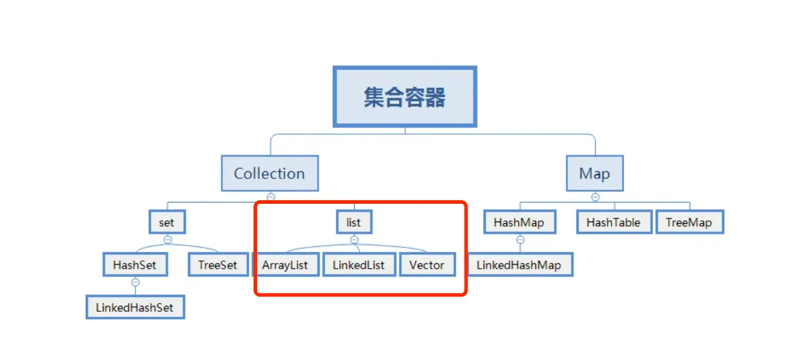

# Java集合面试题

## 概念

### 1.数组与集合区别，用过哪些？

数组和集合的区别：

- 数组是固定长度的数据结构，一旦创建长度就无法改变，而集合是动态长度的数据结构，可以根据需要动态增加或减少元素。
- 数组可以包含基本数据类型和对象，而集合只能包含对象。
- 数组可以直接访问元素，而集合需要通过迭代器或其他方法访问元素。

我用过的一些 Java 集合类：

- **ArrayList：** 动态数组，实现了List接口，支持动态增长。
- **LinkedList：** 双向链表，也实现了List接口，支持快速的插入和删除操作。
- **HashMap：** 基于哈希表的Map实现，存储键值对，通过键快速查找值。
- **HashSet：** 基于HashMap实现的Set集合，用于存储唯一元素。
- **TreeMap：** 基于红黑树实现的有序Map集合，可以按照键的顺序进行排序。
- **LinkedHashMap：** 基于哈希表和双向链表实现的Map集合，保持插入顺序或访问顺序。
- **PriorityQueue：** 优先队列，可以按照比较器或元素的自然顺序进行排序。

### 2.说说Java中的集合？


> List是有序的Collection，使用此接口能够精确的控制每个元素的插入位置，用户能根据索引访问List中元素。常用的实现List的类有LinkedList，ArrayList，Vector，Stack。

- ArrayList是容量可变的非线程安全列表，其底层使用数组实现。当几何扩容时，会创建更大的数组，并把原数组复制到新数组。ArrayList支持对元素的快速随机访问，但插入与删除速度很慢。
- LinkedList本质是一个双向链表，与ArrayList相比，，其插入和删除速度更快，但随机访问速度更慢。

> Set不允许存在重复的元素，与List不同，set中的元素是无序的。常用的实现有HashSet，LinkedHashSet和TreeSet。

- HashSet通过HashMap实现，HashMap的Key即HashSet存储的元素，所有Key都是用相同的Value，一个名为PRESENT的Object类型常量。使用Key保证元素唯一性，但不保证有序性。由于HashSet是HashMap实现的，因此线程不安全。
- LinkedHashSet继承自HashSet，通过LinkedHashMap实现，使用双向链表维护元素插入顺序。
- TreeSet通过TreeMap实现的，添加元素到集合时按照比较规则将其插入合适的位置，保证插入后的集合仍然有序。

> Map 是一个键值对集合，存储键、值和之间的映射。Key 无序，唯一；value 不要求有序，允许重复。Map 没有继承于Collection 接口，从 Map 集合中检索元素时，只要给出键对象，就会返回对应的值对象。主要实现有TreeMap、HashMap、HashTable、LinkedHashMap、ConcurrentHashMap

- HashMap：JDK1.8 之前 HashMap 由数组+链表组成的，数组是 HashMap 的主体，链表则是主要为了解决哈希冲突而存在的（“拉链法”解决冲突），JDK1.8 以后在解决哈希冲突时有了较大的变化，当链表长度大于阈值（默认为 8）时，将链表转化为红黑树，以减少搜索时间
- LinkedHashMap：LinkedHashMap 继承自 HashMap，所以它的底层仍然是基于拉链式散列结构即由数组和链表或红黑树组成。另外，LinkedHashMap 在上面结构的基础上，增加了一条双向链表，使得上面的结构可以保持键值对的插入顺序。同时通过对链表进行相应的操作，实现了访问顺序相关逻辑。
- HashTable：数组+链表组成的，数组是 HashTable 的主体，链表则是主要为了解决哈希冲突而存在的
- TreeMap：红黑树（自平衡的排序二叉树）
- ConcurrentHashMap：Node数组+链表+红黑树实现，线程安全的（jdk1.8以前Segment锁，1.8以后volatile + CAS 或者 synchronized）

### 3.Java中的线程安全的集合是什么？

> [!important]
>
> 在 java.util 包中的线程安全的类主要 2 个，其他都是非线程安全的。

- **Vector**：线程安全的动态数组，其内部方法基本都经过synchronized修饰，如果不需要线程安全，并不建议选择，毕竟同步是有额外开销的。Vector 内部是使用对象数组来保存数据，可以根据需要自动的增加容量，当数组已满时，会创建新的数组，并拷贝原有数组数据。
- **Hashtable**：线程安全的哈希表，HashTable 的加锁方法是给每个方法加上 synchronized 关键字，这样锁住的是整个 Table 对象，不支持 null 键和值，由于同步导致的性能开销，所以已经很少被推荐使用，如果要保证线程安全的哈希表，可以用ConcurrentHashMap。

> java.util.concurrent 包提供的都是线程安全的集合：

> [!note]
>
> 并发Map：

- **ConcurrentHashMap**：它与 HashTable 的主要区别是二者加锁粒度的不同，在**JDK1.7**，ConcurrentHashMap加的是分段锁，也就是Segment锁，每个Segment 含有整个 table 的一部分，这样不同分段之间的并发操作就互不影响。在**JDK 1.8** ，它取消了Segment字段，直接在table元素上加锁，实现对每一行进行加锁，进一步减小了并发冲突的概率。对于put操作，如果Key对应的数组元素为null，则通过CAS操作（Compare and Swap）将其设置为当前值。如果Key对应的数组元素（也即链表表头或者树的根元素）不为null，则对该元素使用 synchronized 关键字申请锁，然后进行操作。如果该 put 操作使得当前链表长度超过一定阈值，则将该链表转换为红黑树，从而提高寻址效率。
- **ConcurrentSkipListMap**：实现了一个基于SkipList（跳表）算法的可排序的并发集合，SkipList是一种可以在对数预期时间内完成搜索、插入、删除等操作的数据结构，通过维护多个指向其他元素的“跳跃”链接来实现高效查找。

> [!note]
>
>并发Set：

- **ConcurrentSkipListSet**：是线程安全的有序的集合。底层是使用ConcurrentSkipListMap实现。
- **CopyOnWriteArraySet**：是线程安全的Set实现，它是线程安全的无序的集合，可以将它理解成线程安全的HashSet。有意思的是，CopyOnWriteArraySet和HashSet虽然都继承于共同的父类AbstractSet；但是，HashSet是通过“散列表”实现的，而CopyOnWriteArraySet则是通过“动态数组(CopyOnWriteArrayList)”实现的，并不是散列表。

> [!note]
>
>并发List：

- **CopyOnWriteArrayList**：它是 ArrayList 的线程安全的变体，其中所有写操作（add，set等）都通过对底层数组进行全新复制来实现，允许存储 null 元素。即当对象进行写操作时，使用了Lock锁做同步处理，内部拷贝了原数组，并在新数组上进行添加操作，最后将新数组替换掉旧数组；若进行的读操作，则直接返回结果，操作过程中不需要进行同步。
> [!note]
>
>并发 Queue：

- **ConcurrentLinkedQueue**：是一个适用于高并发场景下的队列，它通过无锁的方式(CAS)，实现了高并发状态下的高性能。通常，ConcurrentLinkedQueue 的性能要好于 BlockingQueue 。
- **BlockingQueue**：与 ConcurrentLinkedQueue 的使用场景不同，BlockingQueue 的主要功能并不是在于提升高并发时的队列性能，而在于简化多线程间的数据共享。BlockingQueue 提供一种读写阻塞等待的机制，即如果消费者速度较快，则 BlockingQueue 则可能被清空，此时消费线程再试图从 BlockingQueue 读取数据时就会被阻塞。反之，如果生产线程较快，则 BlockingQueue 可能会被装满，此时，生产线程再试图向 BlockingQueue 队列装入数据时，便会被阻塞等待。

> [!note]
>
>并发 Deque：

- **LinkedBlockingDeque**：是一个线程安全的双端队列实现。它的内部使用链表结构，每一个节点都维护了一个前驱节点和一个后驱节点。LinkedBlockingDeque 没有进行读写锁的分离，因此同一时间只能有一个线程对其进行操作
- **ConcurrentLinkedDeque**：ConcurrentLinkedDeque是一种基于链接节点的无限并发链表。可以安全地并发执行插入、删除和访问操作。当许多线程同时访问一个公共集合时，ConcurrentLinkedDeque是一个合适的选择。

### 4.Collections和Collection的区别

- Collection是Java集合框架中的一个接口，它是所有集合类的基础接口。它定义了一组通用的操作和方法，如添加、删除、遍历等，用于操作和管理一组对象。Collection接口有许多实现类，如List、Set和Queue等。
- Collections（注意有一个s）是Java提供的一个工具类，位于java.util包中。它提供了一系列静态方法，用于对集合进行操作和算法。Collections类中的方法包括排序、查找、替换、反转、随机化等等。这些方法可以对实现了Collection接口的集合进行操作，如List和Set。

### 5.集合遍历的方法有哪些？

在Java中，集合的遍历方法主要有以下几种：

- **普通 for 循环：** 可以使用带有索引的普通 for 循环来遍历 List。

```java
List<String> list = new ArrayList<>();
list.add("A");
list.add("B");
list.add("C");

for (int i = 0; i < list.size(); i++) {
    String element = list.get(i);
    System.out.println(element);
}
```

- **增强 for 循环（for-each循环）：** 用于循环访问数组或集合中的元素。

```java
List<String> list = new ArrayList<>();
list.add("A");
list.add("B");
list.add("C");

for (String element : list) {
    System.out.println(element);
}
```

- **Iterator 迭代器：** 可以使用迭代器来遍历集合，特别适用于需要删除元素的情况。

```java
List<String> list = new ArrayList<>();
list.add("A");
list.add("B");
list.add("C");

Iterator<String> iterator = list.iterator();
while(iterator.hasNext()) {
    String element = iterator.next();
    System.out.println(element);
}
```

- **ListIterator 列表迭代器：** ListIterator是迭代器的子类，可以双向访问列表并在迭代过程中修改元素。

```java
List<String> list = new ArrayList<>();
list.add("A");
list.add("B");
list.add("C");

ListIterator<String> listIterator= list.listIterator();
while(listIterator.hasNext()) {
    String element = listIterator.next();
    System.out.println(element);
}
```

- **使用 forEach 方法：** Java 8引入了 forEach 方法，可以对集合进行快速遍历。

```java
List<String> list = new ArrayList<>();
list.add("A");
list.add("B");
list.add("C");

list.forEach(element -> System.out.println(element));
```

- **Stream API：** Java 8的Stream API提供了丰富的功能，可以对集合进行函数式操作，如过滤、映射等。

```java
List<String> list = new ArrayList<>();
list.add("A");
list.add("B");
list.add("C");

list.stream().forEach(element -> System.out.println(element));
```

这些是常用的集合遍历方法，根据情况选择合适的方法来遍历和操作集合。

## List

### 1.常见的List

常见的List集合（非线程安全）：

- `ArrayList`基于动态数组实现，它允许快速的随机访问，即通过索引访问元素的时间复杂度为 O (1)。在添加和删除元素时，如果操作位置不是列表末尾，可能需要移动大量元素，性能相对较低。适用于需要频繁随机访问元素，而对插入和删除操作性能要求不高的场景，如数据的查询和展示等。
- `LinkedList`基于双向链表实现，在插入和删除元素时，只需修改链表的指针，不需要移动大量元素，时间复杂度为 O (1)。但随机访问元素时，需要从链表头或链表尾开始遍历，时间复杂度为 O (n)。适用于需要频繁进行插入和删除操作的场景，如队列、栈等数据结构的实现，以及需要在列表中间频繁插入和删除元素的情况。

常见的List集合（线程安全）：

- `Vector`和`ArrayList`类似，也是基于数组实现。`Vector`中的方法大多是同步的，这使得它在多线程环境下可以保证数据的一致性，但在单线程环境下，由于同步带来的开销，性能会略低于`ArrayList`。
- `CopyOnWriteArrayList`在对列表进行修改（如添加、删除元素）时，会创建一个新的底层数组，将修改操作应用到新数组上，而读操作仍然在原数组上进行，这样可以保证读操作不会被写操作阻塞，实现了读写分离，提高了并发性能。适用于读操作远远多于写操作的并发场景，如事件监听列表等，在这种场景下可以避免大量的锁竞争，提高系统的性能和响应速度。

### 2.讲一下java里面list的几种实现，几种实现有什么不同？

在Java中，`List`接口是最常用的集合类型之一，用于存储元素的有序集合。以下是Java中常见的`List`实现及其特点：

 

- Vector 是 Java 早期提供的线程安全的动态数组，如果不需要线程安全，并不建议选择，毕竟同步是有额外开销的。Vector 内部是使用对象数组来保存数据，可以根据需要自动的增加容量，当数组已满时，会创建新的数组，并拷贝原有数组数据。
- ArrayList 是应用更加广泛的动态数组实现，它本身不是线程安全的，所以性能要好很多。与 Vector 近似，ArrayList 也是可以根据需要调整容量，不过两者的调整逻辑有所区别，Vector 在扩容时会提高 1 倍，而 ArrayList 则是增加 50%。
- LinkedList 顾名思义是 Java 提供的双向链表，所以它不需要像上面两种那样调整容量，它也不是线程安全的。

> 这几种实现具体在什么场景下应该用哪种？

- Vector 和 ArrayList 作为动态数组，其内部元素以数组形式顺序存储的，所以非常适合随机访问的场合。除了尾部插入和删除元素，往往性能会相对较差，比如我们在中间位置插入一个元素，需要移动后续所有元素。
- 而 LinkedList 进行节点插入、删除却要高效得多，但是随机访问性能则要比动态数组慢。

### 3.list可以一边遍历一边修改元素吗？

在 Java 中，`List`在遍历过程中是否可以修改元素取决于遍历方式和具体的`List`实现类，以下是几种常见情况：

- 使用普通for循环遍历：可以在遍历过程中修改元素，只要修改的索引不超出`List`的范围即可。

```java
import java.util.ArrayList;
import java.util.List;

public class ListTraversalAndModification {
    public static void main(String[] args) {
        List<Integer> list = new ArrayList<>();
        list.add(1);
        list.add(2);
        list.add(3);

        // 使用普通for循环遍历并修改元素
        for (int i = 0; i < list.size(); i++) {
            list.set(i, list.get(i) * 2);
        }

        System.out.println(list);
    }
}
```

- 使用foreach循环遍历：一般不建议在`foreach`循环中直接修改正在遍历的`List`元素，因为这可能会导致意外的结果或`ConcurrentModificationException`异常。在`foreach`循环中修改元素可能会破坏迭代器的内部状态，因为`foreach`循环底层是基于迭代器实现的，在遍历过程中修改集合结构，会导致迭代器的预期结构和实际结构不一致。

```java
import java.util.ArrayList;
import java.util.List;

public class ListTraversalAndModification {
    public static void main(String[] args) {
        List<Integer> list = new ArrayList<>();
        list.add(1);
        list.add(2);
        list.add(3);

        // 使用foreach循环遍历并尝试修改元素，会抛出ConcurrentModificationException异常
        for (Integer num : list) {
            list.set(list.indexOf(num), num * 2);
        }

        System.out.println(list);
    }
}
```

- 使用迭代器遍历：可以使用迭代器的`remove`方法来删除元素，但如果要修改元素的值，需要通过迭代器的`set`方法来进行，而不是直接通过`List`的`set`方法，否则也可能会抛出`ConcurrentModificationException`异常。

```java
import java.util.ArrayList;
import java.util.Iterator;
import java.util.List;

public class ListTraversalAndModification {
    public static void main(String[] args) {
        List<Integer> list = new ArrayList<>();
        list.add(1);
        list.add(2);
        list.add(3);

        // 使用迭代器遍历并修改元素
        Iterator<Integer> iterator = list.iterator();
        while (iterator.hasNext()) {
            Integer num = iterator.next();
            if (num == 2) {
                // 使用迭代器的set方法修改元素
                iterator.set(4);
            }
        }

        System.out.println(list);
    }
}
```

对于线程安全的`List`，如`CopyOnWriteArrayList`，由于其采用了写时复制的机制，在遍历的同时可以进行修改操作，不会抛出`ConcurrentModificationException`异常，但可能会读取到旧的数据，因为修改操作是在新的副本上进行的。