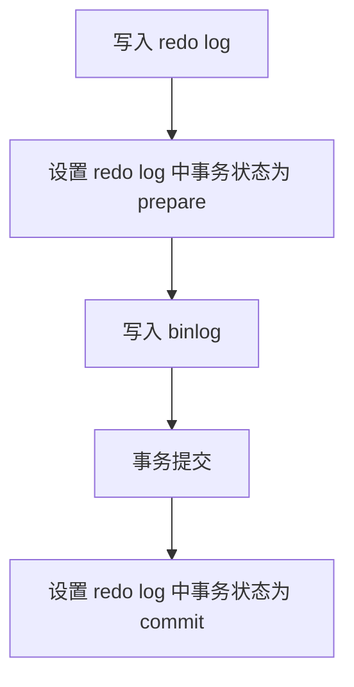

# 60道 MySQL 精选面试题(优化版)

## :books:基础

### :book:1.关系型和非关系型数据库的区别

**关系型数据库的优点是：**

1. 容易理解和使用，用表格形式组织数据，结构清晰，便与操作
2. 保障数据一致性，遵循ACID原则（原子性，一致性，隔离性，持久性），保证事务处理的可靠性与一致性
3. 数据更新开销低，插入更新删除操作高效
4. 查询能力强大，可以使用带有where，join的语句。适合多表联查

**非关系型数据库(NoSQL)的优点：**

1. 读写性能高效，因为不经过SQL解析，读写速度快，高并发场景下表现优秀
2. 存储结构灵活，包括键值对，文档或列式存储等多种存储结构，适合JSON，二进制等多样化数据存储
3. 支持多种数据类型，能处理结构化，半结构化和非结构化数据，比如图片，视频，日志，文档等
4. 水平扩展型强，非关系型数据库支持横向扩展，能够处理大规模数据，如Redis（内存数据库）、MongoDB（文档数据库）、HBase（列式数据库），适用于大数据、高可用的场景，如日志系统、地理位置存储等。

---

### :book:2.详细说一下一条 MySQL 语句执行的步骤

1. 客户端发起请求
2. 连接器验证身份信息及权限，验证通过将用户连接到查询处理层
3. 查询缓存：如果查询缓存开启，存在缓存结果则直接返回，否则执行后续操作
4. 分析器：对SQL语句进行词法和语法分析。MySQL将SQL语句解析为一个结构化的查询树，检查语法是否合法。如果存在语法错误会报错并停止执行。如果语法正确，则会生成一个抽象语法树（AST）。
5. 优化器：选择最优的执行计划。常见优化包括：查询重写，索引选择，JOIN操作顺序优化等
6. 执行器（Executor）
    在执行阶段，执行器会检查用户是否具有足够的权限来执行这个查询（如对相关表的读取权限）。如果用户权限验证通过，执行器将通过合适的存储引擎（例如 InnoDB 或 MyISAM）执行查询操作。
7. 执行器：检查用户权限是否支持当前查询。通过则使用存储引擎执行查询
8. 存储引擎：获取数据后返回。若开启查询缓存则会将结果缓存

## :books:索引相关

### :book:3.MySQL 使用索引的原因？

- :fire: 使用索引就是为了提高数据查询的效率，就像书的目录一样，利用索引可以快速定位数据位置，而不需要遍历整个表

- 创建唯一性索引，可以保证数据库表中每一行数据的唯一性
- 避免不必要的排序和临时表生成
- 加速表之间连接的操作，将随机 IO 变为顺序 IO

---

### :books:4.索引的三种常见底层数据结构以及优缺点

#### :book:  重点

三种常见的索引底层数据结构：分别是哈希表、有序数组和搜索树。

- **哈希表**：适合快速等值查询，但不支持范围查询，且存在空间浪费和哈希冲突的风险。
- **有序数组**：适合静态数据的查询，范围查询高效，但更新操作代价高，且插入和删除效率低。
- **搜索树（如 B+ 树）**：适合大规模数据存储，支持范围查询，适合磁盘优化存储，具有较高的查询性能，但内存消耗较大，且需要维护树的平衡。

---

#### :eyes: 扩展

##### 1. 哈希表（Hash Table）

- **适用场景**：哈希表主要用于等值查询，适合一些缓存系统和 NoSQL 数据库（如 memcached）。
- 优点
  - 查询速度极快，时间复杂度 O(1)，特别适用于精确匹配查询。
  - 查询效率与数据量大小无关。
- 缺点
  - **不支持范围查询**：由于哈希表的键值对是无序存储的，无法进行范围查询（例如查找大于某个值的所有记录）。
  - **哈希冲突**：在哈希表中，不同的键可能被哈希到相同的桶中，哈希冲突的发生可能会影响查询性能。
  - **空间浪费**：哈希表需要为每个键分配一定的空间，可能导致内存浪费，尤其是哈希表较稀疏时。

##### 2. 有序数组（Sorted Array）

- **适用场景**：适用于静态存储引擎或数据更新较少的场景。通过数组存储有序数据，能够高效执行等值查询和范围查询。
- 优点
  - **高效的范围查询**：通过二分查找，等值查询和范围查询的时间复杂度为 O(log n)，能够高效执行。
  - **存储效率高**：数据存储有序，不需要额外的空间结构来保持顺序。
- 缺点
  - **更新操作成本高**：插入或删除元素时，需要移动大量数据，时间复杂度 O(n)。
  - **空间灵活性差**：插入和删除操作可能会导致大量数据的移动或重排序。

##### 3. 搜索树（如 B 树、B+ 树）

- **适用场景**：广泛应用于数据库引擎中，特别适合需要频繁读取和修改的大型数据库。
- 优点
  - **高效的查找和更新**：B 树、B+ 树的查找、插入和删除操作时间复杂度都为 O(log n)，适合处理大规模数据。
  - **支持范围查询**：B+ 树特别适合范围查询，因为它的叶子节点通过链表连接，能高效地执行区间查询。
  - **适合磁盘存储**：B+ 树的结构优化了磁盘 I/O，节点的大小通常与磁盘块大小一致，可以减少磁盘访问的次数。
- 缺点
  - **内存消耗较大**：树结构需要维护多个节点，可能会消耗更多内存。
  - **树的平衡维护开销**：随着数据的增删，树需要不断地保持平衡，可能涉及节点的分裂和合并。

---

### :book:5.MySQL的索引类型有哪些？

从数据结构角度来看，MySQL索引可以分为以下几类：

- B+树索引
- 哈希索引
- 倒排索引（即全文索引Full-Text)
- R-树索引（多维空间树)

从常见的基于InnoDB B+树索引角度来看，可以分为：

- 聚簇索引(Clustered Index)

- 非聚簇索引(Non-clustered Index)

从索引性质的角度来看，可以分为：

- 普通索引（二级索引、辅助索引）
- 主键索引
- 联合索引
- 唯一索引
- 全文索引
- 空间索引

---

### :book:6. MyISAM 和 InnoDB 实现 B 树索引方式的区别是什么？

- InnoDB 存储引擎：B+ 树索引的叶子节点保存数据本身，其数据文件本身就是索引文件。
- MyISAM 存储引擎：B+ 树索引的叶子节点保存数据的物理地址，叶节点的 data 域存放的是数据记录的地址，索引文件和数据文件是分离的。

---

### :book:7.InnoDB 为什么设计 B+ 树索引？

#### 1. **高效的范围查询**
   - **B+ 树的叶子节点按顺序排列，并且通过链表连接**。这使得它特别适合执行范围查询。例如，在查找一个范围内的数据时，B+ 树可以直接从一个叶子节点开始，通过叶子节点链表顺序遍历来快速获得所有匹配的数据，而无需重新扫描整个表。这是 B 树无法做到的，因为 B 树的节点之间没有这种顺序连接。

#### 2. **保持平衡，查找效率高**
   - **B+ 树是一种自平衡的数据结构**，所有叶子节点都位于同一层级。不管数据的大小如何，B+ 树的查询时间复杂度始终保持在 **O(log N)**，其中 **N** 是树中的数据项个数。树的高度相对较低，有助于减少磁盘 I/O 操作，从而提高查询性能。

#### 3. **支持顺序扫描**
   - **B+ 树的叶子节点通过链表相连**，支持顺序访问数据。对于某些查询（如排序查询），可以非常高效地顺序读取数据，无需再进行额外的排序操作。

#### 4. **高效的磁盘访问**
   - 数据库通常是基于磁盘存储的，而 **B+ 树的节点大小设计非常适合磁盘存储**。B+ 树的内部节点包含多个键值，这样可以尽可能减少磁盘访问次数，因为每次磁盘 I/O 操作可以获取更多的数据。由于 **磁盘 I/O 操作是相对昂贵的**，减少磁盘访问次数是数据库系统设计中的重要目标。

#### 5. **适合动态插入和删除**
   - 在 B+ 树中，**插入和删除操作是相对高效的**。当数据发生变化时，B+ 树会保持其平衡性，确保树的高度不会变得过高，从而保持查询的效率。虽然在更新时可能需要进行一些节点分裂或合并，但相较于其他树型结构，B+ 树的插入和删除操作通常较为平稳。

#### 6. **支持多列复合索引**
   - B+ 树不仅支持单列索引，也可以支持**多列复合索引**。当多个列联合创建一个复合索引时，B+ 树可以利用多个列的值建立索引，这样可以优化复杂查询的性能，尤其是带有多个筛选条件的查询。

#### 7. **避免了非叶子节点的数据存储**
   - **B+ 树的非叶子节点仅保存索引信息，而不存储实际的数据**，而所有数据都存储在叶子节点中。这种设计使得树结构更加简洁高效，查找过程可以直接通过非叶子节点快速定位到叶子节点的相关位置，减少了不必要的存储空间浪费。

---

### :books:8.什么是覆盖索引和索引下推？

#### :book:  重点

- **覆盖索引：:fire:查询操作所需的所有数据都可以通过索引直接获取**，而不需要访问表中的实际数据行。
- **索引下推**：在扫描索引时，提前应用查询条件，从而减少了不必要的数据读取，进一步提高查询性能。

---

#### :eyes: 扩展

##### 1. **覆盖索引 (Covering Index)**

覆盖索引是指**查询操作所需的所有数据都可以通过索引直接获取**，而不需要访问表中的实际数据行。也就是说，索引本身包含了查询需要的所有列信息，无需回表查找。

**工作原理：**

- 当数据库执行查询时，如果查询的列已经包含在索引中，那么数据库引擎就可以直接使用这个索引来返回结果，而不必再去访问表中的数据行。
- 例如，在一个包含 `id` 和 `name` 列的表上创建一个索引，如果查询语句只涉及 `id` 和 `name` 列，那么就可以直接通过索引获取结果，而不需要查找对应的行数据。

**优点：**

- **提高查询效率**：避免了从表中回读数据，减少了磁盘 I/O 操作，特别是在查询只涉及索引的列时。
- **减少查询延迟**：因为不需要访问表的实际数据页，所以查询时间可以更短。

**示例：** 假设有一个 `users` 表，结构如下：

```sql
sql CREATE TABLE users (
    id INT,
    name VARCHAR(100),
    age INT,
    PRIMARY KEY(id)
);
```

如果我们在 `id` 和 `name` 列上创建一个索引：

```sql
sql CREATE INDEX idx_id_name ON users(id, name);
```

那么以下查询就可以完全通过索引来返回结果：

```sql
sql SELECT id, name FROM users WHERE id = 1;
```

因为 `id` 和 `name` 都在索引中，查询可以直接通过索引返回，不需要再访问实际的 `users` 表数据。

##### 2. **索引下推 (Index Condition Pushdown, ICP)**

索引下推是一种优化策略，它在数据库执行查询时，可以将一些条件**从查询的筛选阶段推到索引扫描的阶段**，以减少无效数据的扫描，从而提升查询效率。

**工作原理：**

- 在没有索引下推的情况下，数据库会扫描索引，找到匹配的索引条目，然后将数据页加载到内存中，最后再在表数据上进行进一步的筛选。
- 启用了索引下推后，数据库会尽量将部分查询条件应用到索引扫描的过程中，这样可以在索引扫描时就减少不必要的数据读取，提升性能。

**优点：**

- **减少不必要的数据读取**：通过在索引层面进行条件过滤，可以减少从磁盘加载的无用数据，降低 I/O 开销。
- **提高查询性能**：尤其是在复杂查询或有多个筛选条件时，能显著提高查询效率。

**示例：** 假设有一个 `users` 表，结构如下：

```sql
CREATE TABLE users (
    id INT,
    name VARCHAR(100),
    age INT,
    PRIMARY KEY(id)
);
```

如果查询如下：

```sql
sql SELECT id, name FROM users WHERE age > 30 AND name LIKE 'A%';
```

如果没有启用索引下推，数据库会先扫描索引（假设我们在 `age` 列上有索引），然后再加载数据页并对 `name` 列进行过滤。而在启用了索引下推的情况下，数据库引擎会在索引扫描的过程中，直接将 `age > 30` 和 `name LIKE 'A%'` 这两个条件应用到索引扫描中，从而只返回符合条件的数据，减少无效数据的读取。

### :book:9.哪些操作会导致索引失效？

1. **函数运算**。如：`explain select * from tb_user where substring(phone, 10, 2) = '15';`
2. **字符串不加单引号**。如：`explain select * from tb_user where phone = 17799990015;`，此处phone的值没有加引号
3. **模糊查询中头部模糊**。如：`explain select * from tb_user where profession like '%工程';`，前后都有 % 也会失效。
4. **or连接条件两侧不全有索引**。
5. **数据分布影响**，如果 MySQL 评估使用索引比全表更慢，则不使用索引。

### :book:10.字符串加索引

- **完整字段索引**：适合精确匹配查询。
- **前缀索引**：适合长字符串或重复前缀的字段。
- **倒序索引**：适合后缀查询。
- **哈希索引**：适合等值查询，不能支持范围查询。
- **全文索引**：适合复杂的文本搜索。
- **B树索引**：适合多种查询类型，包括范围查询。
- **空间索引**：适合处理空间数据。

## :books: 日志相关

### :book:11.MySQL 的 change buffer 是什么？

Change Buffer 主要用于 **延迟索引更新**

- **缓冲更新：**当需要更新一个数据页时，如果数据页在内存中就直接更新；而如果这个数据页还没有在内存中的话，在不影响数据一致性的前提下，InnoDB 会将这些更新操作缓存在 change buffer 中。
- **合并更新：**在下次查询需要访问这个数据页的时候，将数据页读入内存，InnoDB 会检查 Change Buffer 中的相关更新，并将它们合并到数据页中。通过这种方式就能保证这个数据逻辑的正确性。
- 注意唯一索引的更新就不能使用 change buffer，实际上也只有普通索引可以使用。
- 适用场景：
  - 对于**写多读少**的业务来说，页面在写完以后马上被访问到的概率比较小，此时 change buffer 的使用效果最好。这种业务模型常见的就是账单类、日志类的系统。
  - 反过来，假设一个业务的更新模式是写入之后马上会做查询，那么即使满足了条件，将更新先记录在 change buffer，但之后由于马上要访问这个数据页，会立即触发 merge 过程。这样随机访问 IO 的次数不会减少，反而增加了 change buffer 的维护代价。

### :eyes: 12.MySQL 是如何判断一行扫描数的？

- MySQL 判断一行扫描数主要依赖于查询的执行计划，这由查询优化器根据表的索引情况、数据的分布、表的大小以及查询条件的选择性来决定。
- 通过 `EXPLAIN` 语句，可以查看 MySQL 估算的扫描行数。
-  MySQL 通过尽量避免全表扫描，合理使用索引，来提高查询效率，减少扫描的行数。

---

### :book:13.MySQL 的 redo log 和 binlog 区别？

| 特性         | Redo Log                                      | Binlog                                        |
| ------------ | --------------------------------------------- | --------------------------------------------- |
| 目的         | 事务持久化、崩溃恢复                          | 数据复制、增量备份、主从同步                  |
| 记录内容     | 物理页级别的数据变动（事务提交的变动）        | 逻辑操作（SQL语句，数据操作）                 |
| 存储位置     | InnoDB 存储引擎的日志文件（如 `ib_logfile0`） | 独立的二进制日志文件（如 `mysql-bin.000001`） |
| 持久化方式   | 事务提交时同步写入磁盘，确保崩溃恢复          | 异步写入磁盘，可以根据需要配置                |
| 与事务的关系 | 直接与事务相关，记录已提交事务的数据          | 不一定与事务相关，记录所有数据操作            |
| 使用场景     | 数据恢复、崩溃恢复                            | 数据复制、增量备份、审计                      |

---

### :book:14. MySQL中的WAL机制是什么,有什么优点？

WAL（Write-Ahead Logging）是一种日志记录策略。MySQL 执行更新操作后，**在真正把数据写入到磁盘前，先记录日志**。

好处是不用每一次操作都实时把数据写盘，就算 crash 后也可以通过redo log 恢复，所以能够实现快速响应 SQL 语句。

---

### :book:15.为什么需要 redo log？ 

- **确保数据一致性与持久性**：Redo log 是 MySQL 数据库用于保障数据一致性的一种重要机制，尤其在系统异常重启时，它**能够帮助快速恢复丢失的事务数据，确保数据的完整性和一致性**。
- **配合 Write-Ahead Logging (WAL) 机制**：MySQL 采用了 WAL 机制，通过将所有修改操作**先记录在 redo log 中，然后再异步写回磁盘**。这种方式使得数据库能够在高效响应请求的同时，减少磁盘 I/O 操作，提高性能。
- **防止系统崩溃带来的数据丢失**：由于 MySQL 在进行数据更新时先写入内存，后异步刷写磁盘，这会带来系统崩溃时数据丢失的风险。Redo log 通过保证已提交事务的操作在日志中持久化存储，即使发生崩溃，也**能够通过 replay redo log 恢复数据**，确保系统的 **crash-safe** 性能。

---

### :book:16.为什么 redo log 具有 crash-safe 的能力，是 binlog 无法替代的？

- `redolog`只会记录未刷盘的日志。`binlog` 是追加日志，保存的是全量的日志。
- `binlog` 无法准确判断哪些数据已经持久化，哪些还没有。
- `redolog` 的写入失败会导致事务回滚，从而保证数据的一致性；而 binlog 仅记录操作日志，并不跟踪数据是否已持久化，因此无法提供崩溃恢复功能，无法替代 redo log 进行崩溃恢复。
- 只要crash后读取`redolog`进行`replay`（重做），就可以恢复数据

---

### :book:17.当数据库 crash 后，如何恢复未刷盘的数据到内存中？

- 首先从 **`binlog`** 恢复数据，确保所有已提交的事务恢复。
- 然后从 **`redo log`** 恢复所有已提交事务的变更，确保数据一致性。
- 最后，恢复 **`change buffer`** 中的变更，以确保数据完整。

---

### :book:18.redo log 写入方式？

:fire:redo log包括两部分内容，分别是内存中的**日志缓冲**(redo log buffer)和磁盘上的**日志文件**(redo log file)。MySQL 每执行一条 DML 语句，会先把记录写入 **redo log buffer（用户空间）** ，再保存到内核空间的缓冲区 OS-buffer 中，后续某个时间点再一次性将多个操作记录写到 **redo log file（刷盘）** 。

---

**:eyes:`redo log` 的刷盘策略**

在 MySQL 中，**日志缓冲区** 的内容会通过操作系统缓存（OS Buffer）最终写入到 **日志文件**，具体的刷新策略由配置参数 **`innodb_flush_log_at_trx_commit`** 控制。该参数影响日志刷新到磁盘的方式，具体含义如下：

- **0（延迟写）**：事务提交时，Redo Log Buffer 不会立即刷新到磁盘。日志先写入操作系统缓存，并每秒刷写到磁盘。这样能提高性能，但在系统崩溃时可能丢失一些数据。
- **1（实时写）**：事务提交时，Redo Log Buffer 会立即写入操作系统缓存，并尽快刷新到磁盘。虽然这提供了更强的数据一致性保障，但会牺牲一定的性能。
- **2（实时写，延迟刷）**：事务提交时，日志先写入操作系统缓存，每秒钟刷新到磁盘。此设置在性能和一致性之间提供了平衡，可能会在崩溃恢复时丢失一小部分数据。


---

### :book:19.redo log 的执行流程?

我们来看下Redo log的执行流程，假设执行的 SQL 如下： 

```
update T set a =1 where id =666
```


1.  MySQL 客户端将请求语句 update T set a =1 where id =666，发往 MySQL Server 层。 
2.  MySQL Server 层接收到 SQL 请求后，对其进行分析、优化、执行等处理工作，将生成的 SQL 执行计划发到 InnoDB 存储引擎层执行。 
3.  InnoDB 存储引擎层将**a修改为1**的这个操作记录到内存中。 
4.  记录到内存以后会修改 redo log 的记录，会在添加一行记录，其内容是**需要在哪个数据页上做什么修改**。 
5.  此后，将事务的状态设置为 prepare ，说明已经准备好提交事务了。 
6.  等到 MySQL Server 层处理完事务以后，会将事务的状态设置为 **commit**，也就是提交该事务。 
7.  在收到事务提交的请求以后，**redo log** 会把刚才写入内存中的操作记录写入到磁盘中，从而完成整个日志的记录过程。


---

### :book:20.binlog 的概念是什么，起到什么作用， 可以保证 crash-safe 吗? 

-  binlog 是归档日志，属于 MySQL Server 层的日志。可以实现**主从复制**和**数据恢复**两个作用。 
-  当需要**恢复数据**时，可以取出某个时间范围内的 binlog 进行重放恢复。 
-  但是 binlog 不可以做 crash safe，因为 crash 之前，binlog **可能没有写入完全** MySQL 就挂了。所以需要配合 **redo log** 才可以进行 crash safe。

---

### :books:21.MySQL事务的二阶段提交是什么？

#### :book:重点

MySQL事务的二阶段提交是指在MySQL中，为了确保`redo log`(重做日志)和`binlog`(二进制日志)之间的一致性，
使用的一种机制。MySQL通过二阶段提交来保证在`crash recovery`(崩溃恢复)时，不会出现数据丢失或数据不一致的情况。

**二阶段提交的两个阶段：**

- **准备阶段(Prepare Phase):**在事务提交时，MySQL的InnoDB引擎会先写入`redo log`,并将其状态标记为
  `prepare`,表示事务已经准备提交但还未真正完成。此时的`redo log`是预提交状态，还未标记为完成提交。

- **提交阶段(Commit Phase):**当`redo log`的状态变为`prepare`后，MySQL Server会写入`binlog`(记录用户的
  DML操作)。`binlog`写入成功后，MySQL会通知InnoDB,将`redo log`状态改为`commit`,完成整个事务的提交
  过程。


#### :eyes:扩展：为什么需要两阶段提交呢? 

##### 1.不使用二阶段提交

**场景 1：先写完 redo log，再写 binlog**

假设在写入 redo log 完成后，MySQL 异常宕机，此时 binlog 还没有写入。在重新启动后，事务的物理修改（即 redo log 中的内容）已经恢复，但由于 binlog 没有记录该事务的提交，后续的恢复操作可能会丢失该事务的逻辑操作。

**场景 2：先写完 binlog，再写 redo log：**

如果在 binlog 写入完成后，MySQL 异常宕机，重启时由于 redo log 没有记录事务的修改，恢复过程中，虽然 binlog 中记录了事务的逻辑操作，但因为没有物理操作（即没有 redo log），数据无法恢复，数据库将进入不一致状态。

##### 2.使用二阶段提交

**场景 1：redo log 处于 prepare 阶段，binlog 未写入：**

- 在 **prepare 阶段**，事务已经被记录在 redo log 中，但尚未提交。
- 如果此时 MySQL 异常宕机，重启后，由于 redo log 没有被提交（没有进入 commit 阶段），则数据库恢复时会 **回滚** 该事务。
- **结论：** 数据一致，事务会被回滚，恢复后数据库状态与事务未提交之前一致。

**场景 2：redo log 处于 prepare 阶段，binlog 已写入，但 redo log 未提交：**

- 在这种情况下，**binlog** 可能已经写入并记录了事务的提交，但 **redo log** 没有完成 commit。若发生异常宕机，MySQL 恢复后需要根据 **redo log** 和 **binlog** 来确保数据一致性。
- 恢复过程时，MySQL 会对比 redo log 和 binlog 的数据：
  - 如果一致，则提交事务（因为事务的操作已经在 redo log 中记录，并且 binlog 也已经提交）。
  - 如果不一致，说明事务在系统崩溃时没有完全提交，MySQL 会进行回滚操作，丢弃不一致的事务数据。

:fire:回滚即撤销本次操作

:star:redolog和binlog数据不一致指的是**事务的提交状态和数据持久化状态之间的不一致**，即两个日志文件中的记录不一致

:star2:每一个箭头处都可能出现crash



### :book:22.MySQL 怎么知道 binlog 是完整的?

一个事务的 binlog 是有完整格式的：

- statement 格式的 binlog，最后会有 COMMIT；
- row 格式的 binlog，最后会有一个 XID event。 

---

### :books:23.binlog 日志的三种格式 

:book:重点

 binlog 日志有三种格式 

-  Statement：binlog 记录的是执行的 SQL 语句（SBR）
-  Row：binlog 记录的是实际的数据行变化，而不是 SQL 语句。（RBR）
-  Mixed：混合模式。(mixed-based replication,MBR)。 MySQL 会根据具体的 SQL 语句自动选择是使用语句模式还是行模式。

:eyes:扩展

**Statement格式** 

 **每一条会修改数据的 SQL 都会记录在 binlog 中** 

-  优点：不需要记录每一行的变化，减少了binlog日志量，节约了IO，提高性能。 
-  缺点：由于记录的只是执行语句，为了这些语句能在备库上正确运行，还必须记录每条语句在执行的时候的一些相关信息，以保证所有语句能在备库得到和在主库端执行时候相同的结果。 

 **Row格式** 

 **不记录 SQL 语句上下文相关信息，仅保存哪条记录被修改。** 

-  优点：binlog 中可以不记录执行的 SQL 语句的上下文相关的信息，仅需要记录那一条记录被修改成什么了。所以rowlevel的日志内容会非常清楚的记录下每一行数据修改的细节。不会出现某些特定情况下的存储过程、或 function、或trigger的调用和触发无法被正确复制的问题。 
-  缺点:可能会产生大量的日志内容。 

 **Mixed格式** 

**实际上就是 Statement 与 Row 的结合。**一般的语句修改使用 statment 格式保存 binlog，如一些函数，statement 无法完成主从复制的操作，则采用 row 格式保存 binlog，MySQL 会根据执行的每一条具体的 SQL 语句来区分对待记录的日志形式。

---

### :book:24.redo log日志格式

`redo log buffer `(内存中)是由首尾相连的四个文件组成的，它们分别是：ib_logfile_1、ib_logfile_2、ib_logfile_3、ib_logfile_4。

- write pos (写入位置)是当前记录的位置，一边写一边后移，写到第 3 号文件末尾后就回到 0 号文件开头。
- checkpoint(检查点) 是当前要擦除的位置，也是往后推移并且循环的，擦除记录前要把记录更新到数据文件(.ibd)。
- write pos 和 checkpoint 之间的是“粉板”上还空着的部分，可以用来记录新的操作。
- 如果 write pos 追上 checkpoint，表示“粉板**（空余空间）**”满了，这时候不能再执行新的更新，得停下来先擦掉一些记录，把 checkpoint 推进一下。
- 有了 redo log，当数据库发生宕机重启后，可通过 redo log将未落盘的数据（check point之后的数据）恢复，保证已经提交的事务记录不会丢失，这种能力称为**crash-safe（崩溃安全性）**。


---

### :book:25.原本可以执行得很快的 SQL 语句，执行速度却比预期的慢很多，原因是什么？如何解决？

原因：从大到小可分为四种情况

- MySQL 数据库本身被堵住了，比如：系统或网络资源不够。
- SQL 语句被堵住了，比如：表锁，行锁等，导致存储引擎不执行对应的 SQL 语句。
- 确实是索引使用不当，没有走索引。
- 表中数据的特点导致的，走了索引，但回表次数庞大。

解决：

- 使用 force index 强行选择一个索引
- 考虑修改SQL，引导 MySQL 使用我们期望的索引。比如把“order by b limit 1” 改成 “order by b,a limit 1” ，语义的逻辑是相同的。
- 可以新建一个更合适的索引，来提供给优化器做选择，或删掉误用的索引。
- 如果确定是索引根本没必要，可以考虑删除索引。

### :book:26.InnoDB 数据页结构


---

## :books:数据相关
