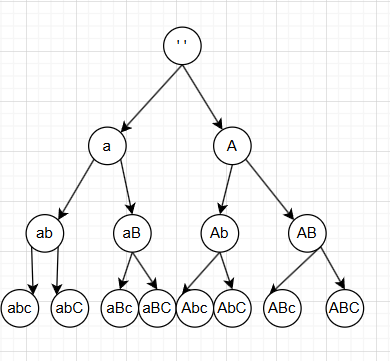

## [784. 字母大小写全排列](https://leetcode.cn/problems/letter-case-permutation/)



> 题目

> 给定一个字符串 `s` ，通过将字符串 `s` 中的每个字母转变大小写，我们可以获得一个新的字符串。
>
> 返回 *所有可能得到的字符串集合* 。以 **任意顺序** 返回输出。
>
> **示例 1：**
>
> ```
> 输入：s = "a1b2"
> 输出：["a1b2", "a1B2", "A1b2", "A1B2"]
> ```
>
> **示例 2:**
>
> ```
> 输入: s = "3z4"
> 输出: ["3z4","3Z4"]
> ```
>
>  
>
> **提示:**
>
> - `1 <= s.length <= 12`
> - `s` 由小写英文字母、大写英文字母和数字组成

> 解题思路：
>
> 步骤 1：初始化
>
> 创建结果列表 ans，用于存储所有答案。
>
> 创建队列 queue，初始时放入一个空的 StringBuilder。
>
> 步骤 2：遍历队列
>
> 当队列不为空时，取出队首元素 curr（但先不移除）。
>
> 如果 curr 的长度等于 s 的长度：
>
> 说明已经构造出一个完整的字符串。
>
> 把 curr 转成字符串，加入结果集 ans，然后把它从队列中移除。
>
> 步骤 3：扩展下一层
>
> 否则，计算当前位置 pos = curr.length()，表示我们需要处理的字符下标。
>
> 如果 s.charAt(pos) 是字母：
>
> 复制当前字符串 curr 得到一个新的 StringBuilder。
>
> 在新副本中追加 大小写翻转 的字符 (char)(s.charAt(pos) ^ 32)。
>
> 把新副本 offer 到队列中。
>
> 无论是否是字母，都要在 curr 上追加当前字符的原始形式 s.charAt(pos)。
>
> 步骤 4：循环结束
>
> 直到队列被完全清空，所有可能的组合都已经生成并存入 ans。

```java
class Solution {
    public List<String> letterCasePermutation(String s) {
        List<String> ans = new ArrayList<String>();
        Queue<StringBuilder>  queue= new ArrayDeque<StringBuilder>();
        queue.offer(new StringBuilder());
        while(!queue.isEmpty()){
            StringBuilder curr = queue.peek();
            if(curr.length() == s.length()){
                ans.add(curr.toString());
                queue.poll();
            }else{
                int pos = curr.length();
                if(Character.isLetter(s.charAt(pos))){
                    StringBuilder str = new StringBuilder(curr);
                    str.append((char)(s.charAt(pos)^32));
                    queue.offer(str);
                }
                // 保证了最后队列的元素全都是完整的
                curr.append(s.charAt(pos));
            }
        }
        return ans;
    }
}
```