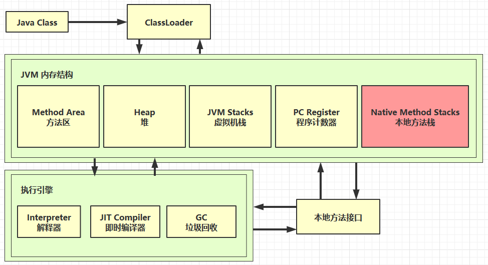

# 2.内存结构

## 1.程序计数器

### 1.1 定义

> Program Counter Register 程序计数器（寄存器）
> 作用：是记录下一条 jvm 指令的执行地址行号。

**特点**

- 是线程私有的
- 不会存在内存溢出

### 1.2 **作用**

- 程序计数器是`线程私有`的，每个线程都有自己的程序计数器。
- 在多线程环境下，程序计数器用于记录当前线程执行的字节码指令的地址，以支持线程切换后能够恢复到正确的执行位置。

### 1.3 **特点**

- 程序计数器是JVM中唯一一个在`多线程间不共享`的内存区域。
- 如果当前线程执行的是Java方法，程序计数器记录的是正在执行的虚拟机字节码指令地址；如果执行的是Native方法，计数器的值为undefined。

### 1.4 **内存结构**

- 程序计数器是线程私有的，是线程内部的数据结构，不会发生内存溢出。
- 程序计数器是一个较小的内存区域，通常大小为一个机器字长（例如32位或64位）。

### 1.5 **线程切换**

- 程序计数器在线程切换时起到重要作用，可以确保线程切换后能够恢复到正确的执行位置。
- 在线程执行过程中，程序计数器会被不断更新，记录当前执行的字节码指令地址。

### 1.6 **异常情况**

- 程序计数器在Java虚拟机规范中没有规定任何OutOfMemoryError情况。
- 程序计数器是线程私有的，不会发生线程安全问题。

## 2.虚拟机栈

### 1.1 **虚拟机栈**

- **定义**：
  - 每个线程运行所需的内存空间称为虚拟机栈。
  - 每个栈由多个栈帧（Frame）组成，对应每次方法调用所占用的内存。
- **特点**：
  - 栈大小可调整，超出限制会导致StackOverflowError。
  - 可能动态扩展，但无法动态收缩。
- **内存结构**：
  - 包含多个栈帧，每个对应一个方法的执行。
  - 栈帧包括局部变量表、操作数栈、动态链接、方法出口等信息。
- **线程切换**：
  - 在线程切换时起到关键作用，确保正确恢复执行位置。
  - 每个线程有独立虚拟机栈，保证数据隔离。
- **异常情况**：
  - 可出现StackOverflowError，栈空间不足时抛出。
  - 线程私有，不会导致线程安全问题.

### 1.2 **问题辨析**

- 垃圾回收
  - 不涉及栈内存，方法调用结束后栈弹出。
- 栈内存分配
  - 不是越大越好，大栈支持更多递归调用但减少可执行线程数。
- 局部变量线程安全性
  - 作用域内不逃离是安全的，否则需考虑线程安全。

### 1.3 **栈内存溢出**

- 原因包括栈帧过大、过多或第三方操作，可使用`-Xss256k`指定栈大小。

### 1.4 **线程运行诊断**

- 案例一：CPU 占用过多
  - 解决方法
    1. 使用`top`查看占用CPU高的进程。
    2. 通过`ps`查看哪个线程占用CPU高。
    3. 使用`jstack`查看线程NID，定位具体线程。

## 3.本地方法栈

> 本地方法栈（Native Method Stack）是Java虚拟机（JVM）中的一个重要组成部分，用于支持Java调用本地方法（Native Method）的功能。本地方法是用本地语言（如C、C++）编写的方法，通过Java Native Interface（JNI）与Java程序进行交互。

### 3.1 作用

- 本地方法栈用于执行本地方法，即由本地语言编写的方法，与Java虚拟机交互。
- 本地方法栈为Java应用程序提供了与底层系统交互的能力，可以调用系统级别的功能和库。

### 3.2 与Java虚拟机栈的区别

- Java虚拟机栈主要用于执行Java方法，而本地方法栈主要用于执行本地方法。
- Java虚拟机栈中的栈帧包含Java方法的信息，而本地方法栈中的栈帧包含本地方法的信息。

### 3.3 栈帧结构

- 本地方法栈中的栈帧结构与Java虚拟机栈中的栈帧结构类似，包含局部变量表、操作数栈、动态链接、返回地址等信息。
- 本地方法栈中的栈帧还包含了调用本地方法所需的一些额外信息，如本地方法的参数和返回值等。

### 3.4 栈大小限制

- 本地方法栈的大小可以通过参数进行调整，通常较小，因为本地方法的调用通常比较简单，不需要过多的栈空间。
- 如果本地方法栈空间不足，会抛出StackOverflowError。

### 3.5 安全性考虑

- 由于本地方法是由本地语言编写的，JVM无法直接控制本地方法的行为，因此本地方法栈的安全性需要开发人员自行确保。

> 本地方法是在本地环境中编写和编译的，而不是在Java虚拟机中执行的Java字节码

## 4. 堆

> 堆（Heap）是Java虚拟机中用于存储对象实例的一块内存区域。通过关键字`new`创建的对象都会被放在堆内存中。

### 4.1 特点

1. **线程共享**：堆内存是线程共享的，所有线程都可以访问堆内存中的对象。因此，在多线程环境下，需要考虑堆内存中对象的线程安全性。
2. **垃圾回收机制**：Java堆内存具有垃圾回收机制，用于自动回收不再使用的对象，释放内存空间，避免内存泄漏。

### 4.2 堆内存溢出

> 堆内存溢出（Heap OutOfMemoryError）是一种常见的内存错误，表示堆内存中的对象过多，超出了堆内存的容量限制。可以通过指定堆内存大小（例如`-Xmx8m`）来调整堆内存大小，避免堆内存溢出错误。

为了诊断堆内存问题，可以使用一些工具：

1. **jps工具**：用于查看当前系统中有哪些Java进程正在运行。
2. **jmap工具**：用于查看Java进程的堆内存占用情况，可以通过`jmap -heap 进程ID`命令查看堆内存信息。
3. **jconsole工具**：是一个图形化的监测工具，可以用来监测Java应用程序的运行情况，包括堆内存使用情况等。
4. **jvisualvm工具**：结合了多种功能，可以用来监测Java应用程序的性能，并提供堆内存分析等功能。

## 5. 方法区

### 5.1 定义

> 方法区是Java虚拟机规范定义的内存区域之一，用于存储类的结构信息、运行时常量池、静态变量、即时编译器编译后的代码等。

### 5.2 组成

### 5.2 特点

- 方法区是线程共享的，所有线程共享同一方法区。
- 方法区主要存储类的相关信息，如类的结构、方法、字段、运行时常量池等。
- 方法区中的数据是在类加载时被加载并存储的，是静态的数据区域。

### 5.3 内存溢出

- 方法区内存溢出（OutOfMemoryError）通常发生在加载大量类的情况下，导致方法区空间不足。
- 可以通过调整虚拟机参数（如增大方法区大小）来避免方法区内存溢出错误。
- 1.8 之前会导致永久代内存溢出
  - 使用 -XX:MaxPermSize=8m 指定永久代内存大小
- 1.8 之后会导致元空间内存溢出
  - 使用 -XX:MaxMetaspaceSize=8m 指定元空间大小

### 5.4 诊断工具

- 工具如jmap、jconsole、jvisualvm等可以用于监控和诊断方法区的使用情况，帮助定位内存泄漏或溢出问题。

### 5.5 常量池

1. **定义**：常量池是Java虚拟机规范中定义的一块内存区域，用于存储编译期生成的各种字面量和符号引用。
2. **特点**：
   - 常量池是类加载过程中的一部分，属于方法区的一部分。
   - 常量池中存储着类文件中的常量信息，包括类、接口、字段、方法等的符号引用和字面量。
   - 常量池中的内容在类加载时被加载到内存中，是静态的数据区域。
3. **类型**：
   - 常量池包含不同类型的常量，如字符串常量、整型常量、浮点型常量、符号引用等。
   - 常见的常量包括类名、方法名、字段名、字符串常量等。
4. **作用**：
   - 常量池在运行时起着重要作用，用于存储类文件中的各种常量信息，方便在运行时进行符号引用解析。
5. **内存溢出**：
   - 常量池内存溢出（OutOfMemoryError）可能发生在常量池中包含大量常量时，可以通过增大常量池的大小或优化代码来避免。
