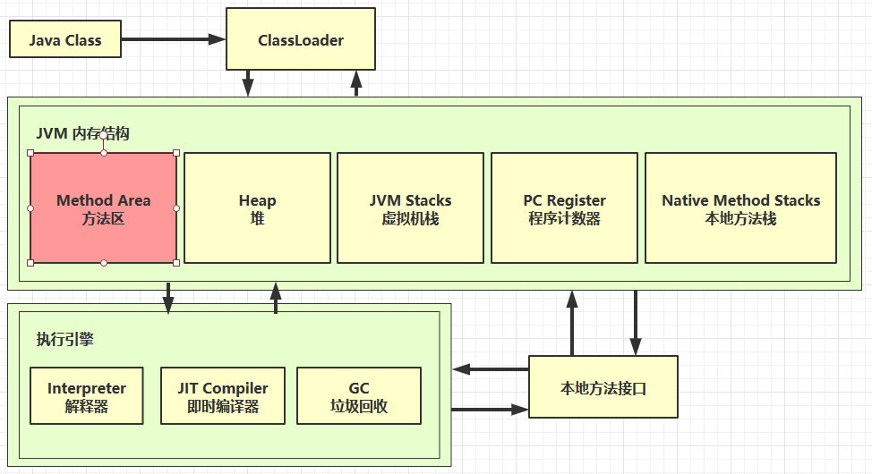
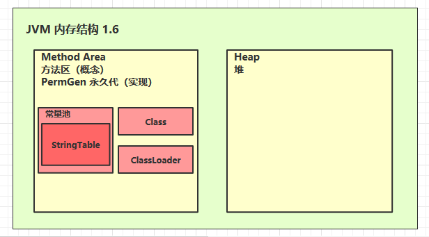
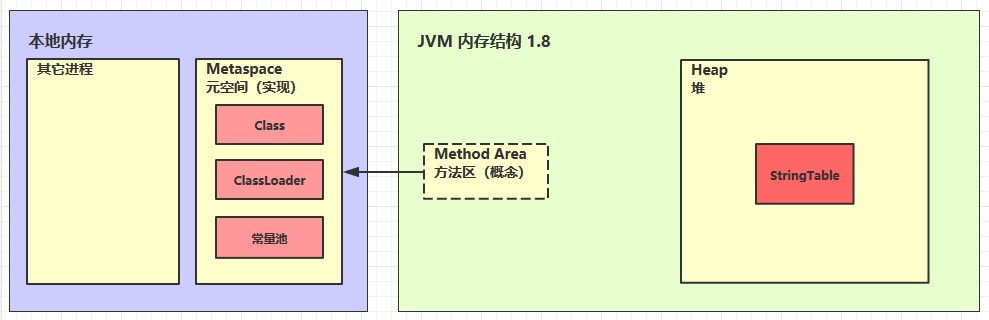

# 2.JVM 内存结构详解

本文将介绍 Java 虚拟机（JVM）的内存结构，包括程序计数器、虚拟机栈、本地方法栈、堆、方法区等重要内存区域的特点和作用。

## 1. 程序计数器

### 1.1 定义

**程序计数器（Program Counter Register）**：用于记录下一条 JVM 指令的执行地址行号。

**特点：**
- 线程私有
- 不会导致内存溢出
<!-- more -->
### 1.2 作用

- 每个线程都有自己的程序计数器，记录当前线程执行的字节码指令地址，确保线程切换后能恢复到正确的位置。

### 1.3 特点

- 程序计数器是 JVM 中唯一一个线程私有的内存区域。
- 执行 Java 方法时，计数器记录字节码指令的地址；执行 Native 方法时，计数器值为 `undefined`。

### 1.4 内存结构

- 程序计数器是较小的内存区域，通常为机器字长（32 位或 64 位），并且不会导致内存溢出。

### 1.5 线程切换

- 程序计数器在线程切换时起到关键作用，确保线程切换后能够恢复到正确的执行位置。

### 1.6 异常情况

- 程序计数器不会引发 `OutOfMemoryError`，且由于其线程私有，线程切换时不会出现线程安全问题。

---

## 2. 虚拟机栈

### 2.1 定义

虚拟机栈为每个线程分配的内存区域，由多个栈帧组成。每个栈帧对应一次方法调用时所需的内存。

**特点：**
- 栈大小可调整，超出限制会抛出 `StackOverflowError`。
- 栈空间可以动态扩展，但无法收缩。

### 2.2 内存结构

- 虚拟机栈包含多个栈帧，每个栈帧保存当前方法的局部变量表、操作数栈、动态链接、方法出口等信息。

### 2.3 线程切换

- 每个线程有独立的虚拟机栈，确保数据隔离，线程切换时能够正确恢复执行位置。

### 2.4 异常情况

- 可能会发生 `StackOverflowError`，栈空间不足时抛出。
- 由于栈是线程私有的，不会导致线程安全问题。

### 2.5 问题辨析

- **垃圾回收**：虚拟机栈内存不涉及垃圾回收，方法调用结束后栈帧被弹出。
- **栈内存分配**：栈内存过大会支持更多递归调用，但减少可执行线程数。
- **局部变量线程安全性**：局部变量在线程栈内是线程安全的，但如果其作用域超出栈（如被引用到堆），需要考虑线程安全问题。

### 2.6 栈内存溢出

- 栈溢出的原因可能是栈帧过大或栈的深度过深。可以通过调整 `-Xss256k` 参数来设置栈的大小。

### 2.7 线程运行诊断

- **诊断工具**：
  - 使用 `top` 查看 CPU 占用情况。
  - 使用 `ps` 查看哪个线程占用 CPU。
  - 使用 `jstack` 查看线程信息，定位具体线程。

---

## 3. 本地方法栈


### 3.1 作用

本地方法栈用于执行本地方法（由 C、C++ 等编写），通过 Java Native Interface（JNI）与 Java 程序交互，主要用于与底层系统进行交互。

### 3.2 与 Java 虚拟机栈的区别

- 虚拟机栈用于执行 Java 方法，而本地方法栈用于执行本地方法。

### 3.3 栈帧结构

- 本地方法栈的栈帧结构与虚拟机栈类似，但栈帧中包含本地方法的特定信息，如参数和返回值。

### 3.4 栈大小限制

- 本地方法栈通常较小，因为本地方法的调用相对简单。

### 3.5 安全性考虑

- 本地方法栈的安全性需要开发人员注意，因本地方法由本地代码编写，JVM 无法直接控制。

---

## 4. 堆

### 4.1 定义

堆（Heap）是 JVM 中用于存储对象实例的内存区域。所有通过 `new` 关键字创建的对象都会分配到堆内存中。

**特点：**
- 线程共享：所有线程都可以访问堆内存中的对象。
- 垃圾回收：堆内存支持垃圾回收，自动回收不再使用的对象。

### 4.2 堆内存溢出

**堆内存溢出**（Heap OutOfMemoryError）通常发生在堆内存中对象过多，超出了容量限制。可以通过指定堆内存大小（如 `-Xmx8m`）来避免溢出。

**诊断工具：**
- **jps 工具**：查看当前 Java 进程。
- **jmap 工具**：查看堆内存占用情况。
- **jconsole 工具**：图形化监控工具，查看堆内存使用情况。
- **jvisualvm 工具**：提供堆内存分析和性能监控功能。

---

## 5. 方法区



### 5.1 定义

方法区用于存储类结构信息、运行时常量池、静态变量以及即时编译器编译后的代码等。

### 5.2 特点

- 方法区是线程共享的，存储类的信息、方法、字段、运行时常量池等数据。
- 数据在类加载时存入方法区，是静态数据区域。

### 5.3 内存溢出

方法区内存溢出（OutOfMemoryError）通常发生在加载大量类时，导致空间不足。
- 在 JDK 1.8 之前，方法区被称为**永久代**，可以通过 `-XX:MaxPermSize` 参数调整大小。
- 在 JDK 1.8 之后，方法区被改为**元空间**，通过 `-XX:MaxMetaspaceSize` 参数调整大小。

### 5.4 诊断工具

可以使用 **jmap**、**jconsole**、**jvisualvm** 等工具来监控和诊断方法区内存的使用情况。

### 5.5 常量池

- **定义**：常量池存储编译期生成的字面量和符号引用。
- **特点**：属于方法区的一部分，包含类名、方法名、字段名等符号引用和字面量。

**内存溢出**：常量池内存溢出通常发生在常量过多时。可以通过增加常量池的大小或优化代码来避免溢出。

#### 1. 字面量的实例

在 Java 中，字面量（Literal）是指直接在代码中表示的固定值。例如：

```java
int number = 100; // "100" 是字面量，"number" 是变量
```

这里，`100` 是字面量，而 `number` 是变量。字面量通常用于表示具体的数值、字符串、布尔值等常量。

#### 2. 符号引用的实例

符号引用是指代码中使用的标识符，经过编译后，会被转换成一种指向具体内存位置的引用。以 `String str = "Hello";` 为例：

##### 2.1 编译阶段：

- 字符串 `"Hello"` 以及 `String` 类的符号引用会被存储在 `.class` 文件的常量池中。
- 常量池中的引用是符号引用，指向具体的类或对象。

##### 2.2 运行时：

- JVM 会将符号引用 `"Hello"` 解析为直接引用，指向字符串常量池中的内存地址。
- 同时，`String` 类的符号引用会被解析为方法区中 `String` 类定义的内存地址，确保正确加载类的结构。

### 5.6 **StringTable：字符串常量池**



> `StringTable` 是 JVM 中用于存储字符串常量池的机制，旨在提高内存利用效率，避免重复创建相同的字符串对象。以下是关于 `StringTable` 的总结和关键概念。

---

#### **1. 字符串常量池（StringTable）**

- **作用**：为了避免重复创建相同的字符串对象，JVM 会先检查常量池中是否已存在该字符串对象。如果已存在，直接返回该对象；如果不存在，则将该字符串添加到常量池。
- **历史变化**：
  - **JDK 1.6 及以前**：字符串常量池位于 **永久代（PermGen）** 中。
  - **JDK 1.8 及以后**：`StringTable` 被移至 **堆内存** 中，不再使用永久代。

---

#### **2. 字符串拼接的机制**

- **普通字符串拼接**：在拼接时，JVM 使用 `StringBuilder` 来合并字符串，从而避免每次拼接时生成新的字符串对象。例如：

```java
String str = new String("a") + new String("b"); // 使用 StringBuilder 进行拼接
```

- **字符串常量拼接**：编译器会在编译时将常量字符串拼接成一个新的字符串，而不是在运行时拼接。这样能减少运行时的内存分配。

---

#### **3. `intern()` 方法的作用**

- **`intern()` 方法**：将字符串放入字符串常量池中。如果常量池中已有该字符串，则返回常量池中的引用；如果没有，则将该字符串添加到常量池，并返回它的引用。

**重要特性**：
- 如果字符串已存在于常量池中，`intern()` 方法不会将新字符串加入池中，而是返回常量池中已存在的字符串。
- 如果字符串不在常量池中，`intern()` 会将其添加到池中，并返回引用。

**例子**：

```java
String str = new String("a") + new String("b");

String st2 = str.intern(); // 将 "ab" 加入常量池

String str3 = "ab"; // "ab" 已在常量池中

System.out.println(str == st2); // true, 因为 st2 是常量池中的对象
System.out.println(str == str3); // true, 因为 str3 是常量池中的对象
```

解释：
- `str` 是通过拼接生成的字符串，位于堆内存。
- `st2` 是通过 `intern()` 方法得到的常量池中的引用，因此与常量池中的 `str3` 相同。

---

#### **4. StringTable 的位置**

- **JDK 1.6 之前**：`StringTable` 位于 **永久代（PermGen）** 中。
- **JDK 1.8 及以后**：`StringTable` 被移至 **堆内存** 中，避免了永久代空间限制。

---

#### **5. StringTable 垃圾回收**

- **堆内存大小**：可以通过 `-Xmx` 参数设置堆内存的最大大小。例如：

```bash
java -Xmx512m MyApp
```

- **GC 日志输出**：可以通过 `-XX:+PrintStringTableStatistics` 打印字符串常量池的相关统计信息，帮助开发者分析内存使用。

```bash
java -XX:+PrintStringTableStatistics MyApp
```

- **垃圾回收调试**：使用 `-XX:+PrintGCDetails` 和 `-verbose:gc` 输出垃圾回收的详细信息，帮助分析 GC 性能和内存分配。

```bash
java -XX:+PrintGCDetails -verbose:gc MyApp
```

**示例代码**：

```java
public class StringTableTest {
    public static void main(String[] args) {
        int i = 0;
        try {
            for (int j = 0; j < 10000; j++) {
                String.valueOf(j).intern();  // 将数字转换为字符串并尝试加入常量池
                i++;
            }
        } catch (Exception e) {
            e.printStackTrace();
        } finally {
            System.out.println(i);
        }
    }
}
```

该代码将数字转换为字符串并尝试将其加入常量池，从而模拟字符串常量池的填充过程。

---

#### **6. StringTable 性能调优**

- **HashTable 实现**：`StringTable` 使用 `HashTable` 存储字符串，因此通过调整 `HashTable` 的桶数可以优化查找性能。
  
  例如，通过设置 `-XX:StringTableSize=1009` 来增加桶的数量，减少字符串放入常量池时的查找时间：

```bash
java -XX:StringTableSize=1009 MyApp
```

- **合理使用 `intern()`**：通过 `intern()` 方法可以避免重复的字符串对象加入常量池，节省内存。但频繁调用 `intern()` 可能会导致性能下降，因此应该谨慎使用。

---

#### **7. 总结**



- **StringTable**：JVM 中用于存储字符串常量池的机制，主要用于提高内存效率，避免重复创建相同的字符串对象。
- **`intern()` 方法**：显式将字符串添加到常量池中，并返回池中已有的字符串对象。
- **位置变化**：
  - **JDK 1.6 之前**：`StringTable` 位于永久代（PermGen）。
  - **JDK 1.8 及以后**：`StringTable` 移至堆内存。
- **性能调优**：
  - 通过调整 `StringTable` 的大小（如 `-XX:StringTableSize`）来优化性能。
  - 合理使用 `intern()` 方法，以减少内存占用并提高性能。
