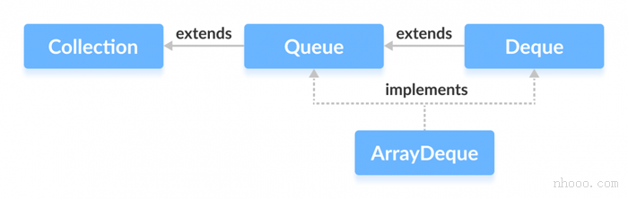

# Java ArrayDeque

在本教程中，我们将借助示例来学习ArrayDeque类及其方法。此外，我们还将学习使用ArrayDeque来实现堆栈。

在Java中，我们可以使用ArrayDeque该类使用数组来实现队列和双端队列数据结构。

## 由ArrayDeque实现的接口

在ArrayDeque类实现这两个接口：

- [Java Queue接口](https://www.cainiaojc.com/java/java-queue.html)
- [Java Deque接口](https://www.cainiaojc.com/java/java-deque.html)



## 创建ArrayDeque

为了创建ArrayDeque双端队列，我们必须导入java.util.ArrayDeque包。

这是我们可以用Java创建ArrayDeque双端队列的方法：

```
ArrayDeque<Type> animal = new ArrayDeque<>();
```

在此，Type表示ArrayDeque双端队列的类型。例如，

```
//创建字符串类型ArrayDeque
ArrayDeque<String> animals = new ArrayDeque<>();

//创建整数类型ArrayDeque
ArrayDeque<Integer> age = new ArrayDeque<>();
```

## ArrayDeque方法

ArrayDeque类提供了所有的存在于方法Queue和Deque接口。

### 将元素插入双端队列

**1.使用add()，addFirst()和addLast()添加元素**

- add() - 将指定的元素插入ArrayDeque双端队列的末尾
- addFirst() -在ArrayDeque双端队列的开头，插入指定的元素
- addLast() - 在ArrayDeque双端队列的末尾插入指定的内容（等效于add()）

**注意：**如果ArrayDeque双端队列已满，则所有这些方法add()，addFirst()和addLast()都会引发IllegalStateException。

例如，

```
import java.util.ArrayDeque;

class Main {
    public static void main(String[] args) {
        ArrayDeque<String> animals= new ArrayDeque<>();

        //使用add ()
        animals.add("Dog");

        //使用addFirst ()
        animals.addFirst("Cat");

        //使用addLast()
        animals.addLast("Horse");
        System.out.println("ArrayDeque: " + animals);
    }
}
```

**输出结果**

```
ArrayDeque: [Cat, Dog, Horse]
```

**2.使用 offer()，offerFirst()和offerLast()插入元素**

- offer() - 将指定的元素插入ArrayDeque双端队列的末尾
- offerFirst() - 在ArrayDeque双端队列的开始处插入指定的元素
- offerLast() - 将指定的元素插入ArrayDeque双端队列的末尾

**注意：** offer()，offerFirst()并offerLast()返回true是否成功插入元素；否则，返回。如果ArrayDeque双端队列已满，则这些方法返回false。

例如，

```
import java.util.ArrayDeque;

class Main {
    public static void main(String[] args) {
        ArrayDeque<String> animals= new ArrayDeque<>();
        //使用offer()
        animals.offer("Dog");

        //使用offerFirst()
        animals.offerFirst("Cat");

        //使用offerLast()
        animals.offerLast("Horse");
        System.out.println("ArrayDeque: " + animals);
    }
}
```

**输出结果**

```
ArrayDeque: [Cat, Dog, Horse]
```

### 访问ArrayDeque元素

**1.使用getFirst()和getLast()访问元素**

- getFirst() - 返回ArrayDeque双端队列的第一个元素
- getLast() - 返回ArrayDeque双端队列的最后一个元素

**注：**如果ArrayDeque双端队列为空，getFirst()和getLast()抛出NoSuchElementException。

例如，

```
import java.util.ArrayDeque;

class Main {
    public static void main(String[] args) {
        ArrayDeque<String> animals= new ArrayDeque<>();
        animals.add("Dog");
        animals.add("Cat");
        animals.add("Horse");
        System.out.println("ArrayDeque: " + animals);

        // 获取第一个元素
        String firstElement = animals.getFirst();
        System.out.println("第一个元素： " + firstElement);

        //获取最后一个元素
        String lastElement = animals.getLast();
        System.out.println("最后一个元素： " + lastElement);
    }
}
```

**输出结果**

```
ArrayDeque: [Dog, Cat, Horse]
第一个元素： Dog
最后一个元素： Horse
```

**2.使用peek()，peekFirst()和peekLast()方法访问元素**

- peek() - 返回ArrayDeque双端队列的第一个元素
- peekFirst() - 返回ArrayDeque双端队列的第一个元素（等效于peek()）
- peekLast() - 返回ArrayDeque双端队列的最后一个元素

例如，

```
import java.util.ArrayDeque;

class Main {
    public static void main(String[] args) {
        ArrayDeque<String> animals= new ArrayDeque<>();
        animals.add("Dog");
        animals.add("Cat");
        animals.add("Horse");
        System.out.println("ArrayDeque: " + animals);

        //使用peek()
        String element = animals.peek();
        System.out.println("头元素： " + element);

        //使用peekFirst()
        String firstElement = animals.peekFirst();
        System.out.println("第一个元素： " + firstElement);

        //使用peekLast
        String lastElement = animals.peekLast();
        System.out.println("最后一个元素： " + lastElement);
    }
}
```

**输出结果**

```
ArrayDeque: [Dog, Cat, Horse]
Head Element: Dog
第一个元素： Dog
最后一个元素： Horse
```

**注意：**如果ArrayDeque双端队列为空，peek()，peekFirst()和getLast()抛出NoSuchElementException。

### 删除 ArrayDeque 元素

**1.使用remove()，removeFirst()，removeLast()方法删除元素**

- remove() - 返回并从ArrayDeque双端队列的第一个元素中删除一个元素
- remove(element) - 返回并从ArrayDeque双端队列的头部删除指定的元素
- removeFirst() - 返回并从ArrayDeque双端队列中删除第一个元素（等效于remove()）
- removeLast() - 返回并从ArrayDeque双端队列中删除最后一个元素

**注意：**如果数组双端队列为空，则remove()，removeFirst()和removeLast()方法将引发异常。 另外，如果找不到元素，则remove(element)会引发异常。

例如，

```
import java.util.ArrayDeque;

class Main {
    public static void main(String[] args) {
        ArrayDeque<String> animals= new ArrayDeque<>();
        animals.add("Dog");
        animals.add("Cat");
        animals.add("Cow");
        animals.add("Horse");
        System.out.println("ArrayDeque: " + animals);

        //使用remove()
        String element = animals.remove();
        System.out.println("删除Element: " + element);

        System.out.println("新的ArrayDeque： " + animals);

        //使用removeFirst()
        String firstElement = animals.removeFirst();
        System.out.println("删除第一个元素： " + firstElement);

        //使用removeLast()
        String lastElement = animals.removeLast();
        System.out.println("删除最后一个元素： " + lastElement);
    }
}
```

**输出结果**

```
ArrayDeque: [Dog, Cat, Cow, Horse]
删除Element: Dog
新的ArrayDeque： [Cat, Cow, Horse]
删除第一个元素： Cat
删除最后一个元素： Horse
```

**2.使用poll()，pollFirst()和pollLast()方法删除元素**

- poll() - 返回并删除ArrayDeque双端队列的第一个元素
- pollFirst() - 返回并删除ArrayDeque双端队列的第一个元素（等效于poll()）
- pollLast() - 返回并删除ArrayDeque双端队列的最后一个元素

**注意：**如果ArrayDeque双端队列为空，则如果找不到该元素，则poll()，pollFirst()和pollLast()返回null。

例如，

```
import java.util.ArrayDeque;

class Main {
    public static void main(String[] args) {
        ArrayDeque<String> animals= new ArrayDeque<>();
        animals.add("Dog");
        animals.add("Cat");
        animals.add("Cow");
        animals.add("Horse");
        System.out.println("ArrayDeque: " + animals);

        //使用poll()
        String element = animals.poll();
        System.out.println("删除Element: " + element);
        System.out.println("新的ArrayDeque： " + animals);

        //使用pollFirst()
        String firstElement = animals.pollFirst();
        System.out.println("删除第一个元素： " + firstElement);

        //使用pollLast()
        String lastElement = animals.pollLast();
        System.out.println("删除最后一个元素： " + lastElement);
    }
}
```

**输出结果**

```
ArrayDeque: [Dog, Cat, Cow, Horse]
删除Element: Dog
新的ArrayDeque： [Cat, Cow, Horse]
删除第一个元素： Cat
删除最后一个元素： Horse
```

**3.删除元素：使用clear()方法**

要从ArrayDeque双端队列中删除所有元素，我们使用clear()方法。例如，

```
import java.util.ArrayDeque;

class Main {
    public static void main(String[] args) {
        ArrayDeque<String> animals= new ArrayDeque<>();
        animals.add("Dog");
        animals.add("Cat");
        animals.add("Horse");
        System.out.println("ArrayDeque: " + animals);

        //使用clear()
        animals.clear();

        System.out.println("新的ArrayDeque： " + animals);
    }
}
```

**输出结果**

```
ArrayDeque: [Dog, Cat, Horse]
新的ArrayDeque： []
```

### 迭代遍历ArrayDeque

- iterator() - 返回可用于遍历ArrayDeque双端队列的迭代器
- descendingIterator() -返回一个迭代器，该迭代器可用于以相反顺序遍历ArrayDeque双端队列

为了使用这些方法，我们必须导入java.util.Iterator包。例如，

```
import java.util.ArrayDeque;
import java.util.Iterator;

class Main {
    public static void main(String[] args) {
        ArrayDeque<String> animals= new ArrayDeque<>();
        animals.add("Dog");
        animals.add("Cat");
        animals.add("Horse");

        System.out.print("ArrayDeque: ");

        //使用iterator()
        Iterator<String> iterate = animals.iterator();
        while(iterate.hasNext()) {
            System.out.print(iterate.next());
            System.out.print(", ");
        }

        System.out.print("\n反向ArrayDeque: ");
        //使用descendingIterator()
        Iterator<String> desIterate = animals.descendingIterator();
        while(desIterate.hasNext()) {
            System.out.print(desIterate.next());
            System.out.print(", ");
        }
    }
}
```

**输出结果**

```
ArrayDeque: [Dog, Cat, Horse]
反向ArrayDeque: [Horse, Cat, Dog]
```

## 其他方法

| 方法              | 内容描述                                                     |
| :---------------- | :----------------------------------------------------------- |
| element()         | 从ArrayDeque双端队列的头部返回一个元素。                     |
| contains(element) | 在ArrayDeque双端队列中搜索指定的元素。 如果找到该元素，则返回true，否则返回false。 |
| size()            | 返回ArrayDeque双端队列的长度。                               |
| toArray()         | 将ArrayDeque双端队列转换为数组并返回。                       |
| clone()           | 创建ArrayDeque双端队列的副本并返回它。                       |

## ArrayDeque作为堆栈

要在Java中实现**LIFO（后进先出）**堆栈，建议在[Stack类](https://www.cainiaojc.com/java/java-stack.html)上使用双端队列。该ArrayDeque类比Stack类快。

ArrayDeque 提供了以下可用于实现堆栈的方法。

- push() - 在堆栈顶部添加一个元素
- peek() - 从堆栈顶部返回一个元素
- pop() - 返回并从堆栈顶部删除元素

例如，

```
import java.util.ArrayDeque;

class Main {
    public static void main(String[] args) {
        ArrayDeque<String> stack = new ArrayDeque<>();

        //将元素添加到stack
        stack.push("Dog");
        stack.push("Cat");
        stack.push("Horse");
        System.out.println("Stack: " + stack);

        //从堆栈顶部访问元素
        String element = stack.peek();
        System.out.println("访问元素： " + element);

        //从堆栈顶部删除元素
        String remElement = stack.pop();
        System.out.println("删除element: " + remElement);
    }
}
```

**输出结果**

```
Stack: [Horse, Cat, Dog]
访问元素： Horse
删除Element: Horse
```

## ArrayDeque与 LinkedList类

ArrayDeque和[Java的LinkedList都](https://www.cainiaojc.com/java/java-linkedlist.html)实现了Deque接口。但是，它们之间存在一些差异。

- LinkedList支持空元素，而ArrayDeque不支持。
- 链表中的每个节点都包含到其他节点的链接。这就是LinkedList比ArrayDeque需要更多存储空间的原因。
- 如果要实现队列或双端队列数据结构，则ArrayDeque可能比LinkedList快。