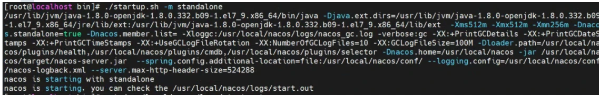
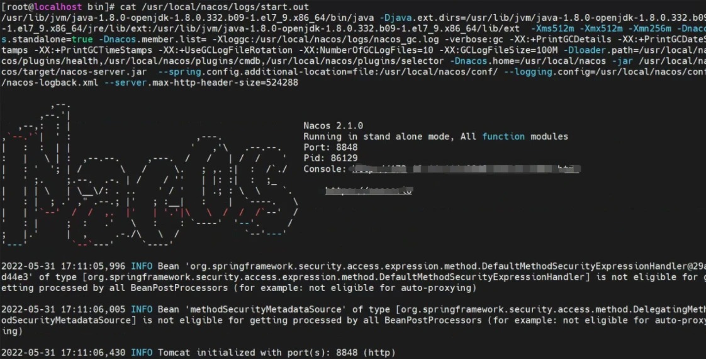
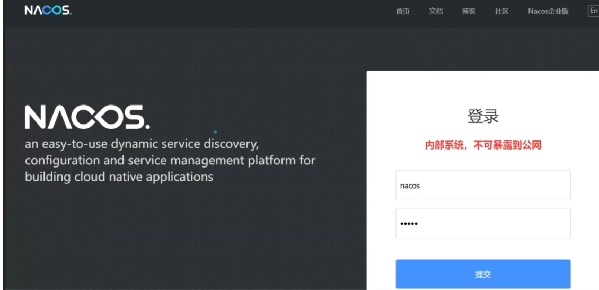
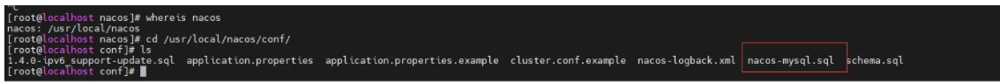
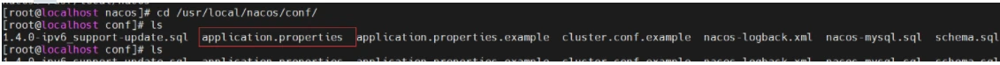
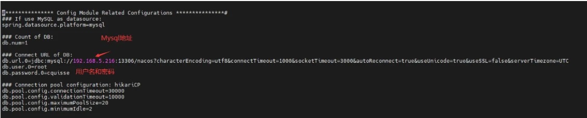
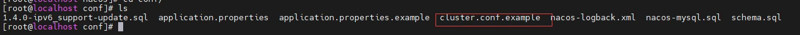
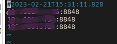
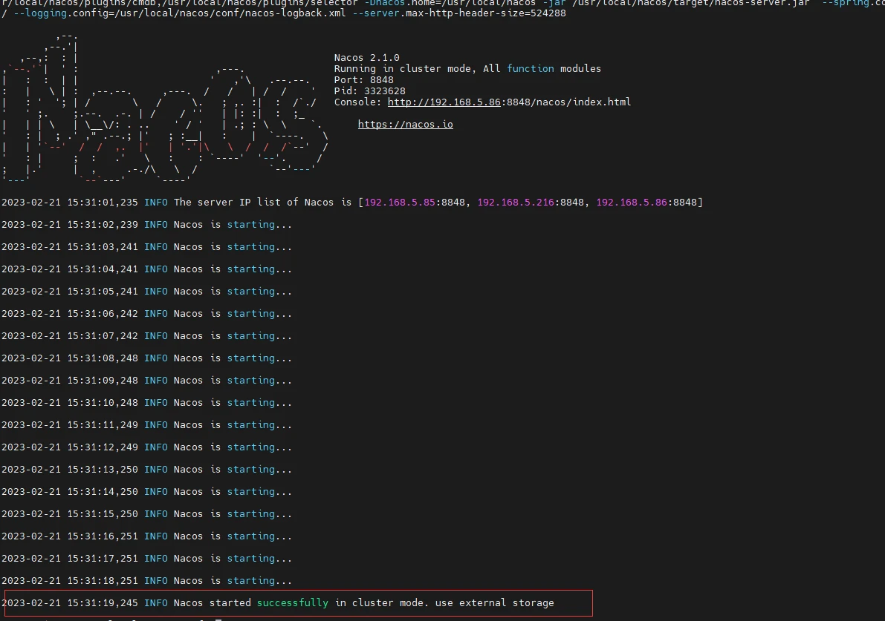
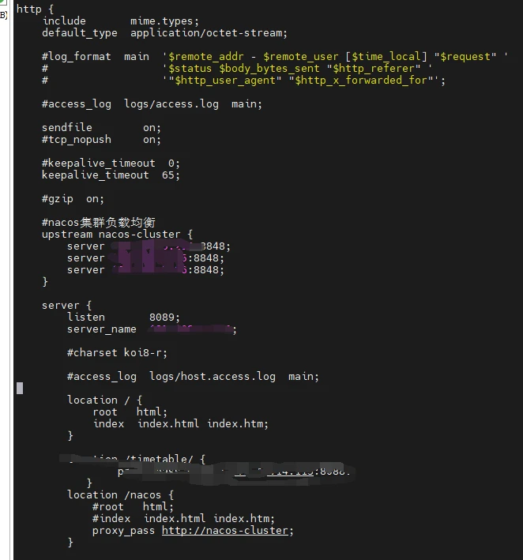

# Nacos多节点部署

Nacos集群安装一，在每台服务器上安装nacos

### 1.准备安装包[github下载点](https://github.com/alibaba/nacos/releases)

### 2.在/usr/local/目录下创建一个文件夹用于上传和解压Nacos

```plain
cd /usr/local/
#这里创建文件夹名字可随意，解压后会生成一个名为nacos的文件夹，后续会移动至/usr/local/
mkdir nacosall
#解压之前cd进安装包根目录
cd /usr/local/nacosall/
#这边选择的Nacos版本为2.1.0
tar -zxxvf nacos-server-2.1.0.tar.gz
#把该文件移动至/usr/local/目录下
mv nacos /usr/local/
```

### 3.以单机模式运行Nacos

```plain
#首先进入nacos的bin目录下
cd /usr/local/nacos/
#以单机模式启动
sh ./bin/startup.sh -m standalone
which: no javac in (/opt/rh/devtoolset-9/root/usr/bin:/usr/local/sbin:/usr/local/bin:                                              /usr/sbin:/usr/bin:/root/bin)
readlink: 缺少操作数
yum install -y java-1.8.0-openjdk*
#再次启动
sh ./bin/startup.sh -m standalone
```



```plain
#根据提示查看log，看是否成功启动
cat /usr/local/nacos/logs/start.out
```



**开放8848端口号，然后登录nacos，登陆方式，主机Ip:8848/nacos,默认账户密码都为nacos**



### **4.配置Mysql数据库**（因为是集群，所以三台服务器的Nacos数据库地址为同一个)

- [安装数据库](https://www.cnblogs.com/blogof-fusu/p/16710871.html)，版本要求：5.6.5+，安装教程为8.0.20
- 初始化mysql数据库，数据库初始化文件：nacos-mysql.sql

 数据库初始化文件一般在nacos的安装目录下：

打开DBeaver或者Navicat，先执行如下语句：

```plain
CREATE database if NOT EXISTS `nacos` default character set utf8mb4 collate utf8mb4_unicode_ci;
use `nacos`;
SET NAMES utf8mb4;
```

然后复制数据库初始化文件，nacos-mysql.sql中的文件内容执行。 

- 在Nacos配置文件中绑定Mysql数据库

```plain
#进入Nacos配置文件目录
cd /usr/local/nacos/conf/
ls
```



```plain
vi application.properties
#修改如下配置
```



```plain
#查看Nacos是否运行
ps -ef | grep nacos
#如果有
kill -9 <id>
#进入安装目录
cd /usr/local/nacos/
#单机启动Nacos
sh ./bin/startup.sh -m standalone
```

启动成功后，再次执行

```plain
#查看Nacos是否运行
ps -ef | grep nacos
#杀掉进程
kill -9 <id>
```

到这里三台服务器的nacos就已经安装配置好了，下一步配置集群二，配置nacos集群1,在每台服务器上都配置cluster.conf文件cluster.conf文件一般都在nacos安装目录的conf文件夹下

```plain
cd /usr/local/nacos/conf
ls
```



```plain
#复制一份配置文件
cp cluster.conf.example cluster.conf
vi cluster.conf
```




在配置文件中添加Nacos服务节点，配置格式如下(注意每台服务器的防火墙必须开放对应端口：

```plain
192.168.1.101:8848
192.168.1.102:8848
192.168.1.103:8848
```

2，在每台服务器上启动Nacos

```plain
#进入安装目录
cd /usr/local/nacos/
#以集群模式启动
sh ./bin/startup.sh -m cluster
```



启动成功后会有提示，此时无论从任何一台服务器都能够访问nacos，而且所有变更同时作用在三个nacos节点上。三，配置nginx负载均衡1,在nginx中添加一个upstream块，用于配置nacos集群节点，如下所示：

```plain
#nacos集群负载均衡
    upstream nacos-cluster {
        server 192.168.5.216:8848;
        server 192.168.5.85:8848;
        server 192.168.5.86:8848;
    }
```

此处修改的nginx的，nginx,conf配置文件2,在nginx中配置一个location块，用于将客户端请求代理到上面配置的nacos集群节点，如下所示：

```plain
location /nacos {
        proxy_pass http://nacos-cluster;
    }
```

最后重启nginx，通过代理后的地址访问nacos即可。