# 学习路线

Java最高效学习路线图（依次向下顺序学习即可） 

```mermaid
graph TD;
    A[Java基础] --> B[Javaweb+AI]
    B --> C[苍穹外卖]
    C --> D[AI+若依框架]
    D --> E[微服务全套]
    E --> F[学成在线项目]
    F --> G[黑马头条项目]
    G --> H[23年Java大厂面试]
    
    H --> I[MySQL]
    I --> J[JVM]
    J --> K[数据结构与算法上部]
    K --> L[数据结构与算法下部]
    L --> M[SSM]
    M --> N[springboot]
    N --> O[Spring高级]
    O --> P[springcloud]
    P --> Q[Docker]
    Q --> R[Git]
    R --> S[Maven]
    S --> T[Dubbo]
    T --> U[Zookeeper]
    U --> V[Redis]
    V --> W[MongoDB]
    W --> X[RabbitMQ]
    X --> Y[RocketMQ]
    
    %% Links
    A:::link1
    B:::link1
    C:::link1
    D:::link1
    E:::link1
    F:::link1
    G:::link1
    H:::link1
    I:::link2
    J:::link2
    K:::link2
    L:::link2
    M:::link2
    N:::link2
    O:::link2
    P:::link2
    Q:::link2
    R:::link2
    S:::link2
    T:::link2
    U:::link2
    V:::link2
    W:::link2
    X:::link2
    Y:::link2

    classDef link1 fill:#ffcc00,stroke:#333,stroke-width:2px;
    classDef link2 fill:#66ccff,stroke:#333,stroke-width:2px;
```

Java基础：[BV1gb42177hm](https://www.bilibili.com/video/BV1gb42177hm/?spm_id_from=333.788.video.desc.click) 

Javaweb+AI：[BV1yGydYEE3H](https://www.bilibili.com/video/BV1yGydYEE3H/?spm_id_from=333.788.video.desc.click) 

苍穹外卖：[BV1TP411v7v6](https://www.bilibili.com/video/BV1TP411v7v6/?spm_id_from=333.788.video.desc.click) 

AI+若依框架：[BV1pf421B71v](https://www.bilibili.com/video/BV1pf421B71v/?spm_id_from=333.788.video.desc.click) 

微服务全套：[BV1S142197x7](https://www.bilibili.com/video/BV1S142197x7/?spm_id_from=333.788.video.desc.click) 

学成在线项目：[BV1j8411N7Bm](https://www.bilibili.com/video/BV1j8411N7Bm/?spm_id_from=333.788.video.desc.click) 

黑马头条项目：[BV1Qs4y1v7x4](https://www.bilibili.com/video/BV1Qs4y1v7x4/?spm_id_from=333.788.video.desc.click) 

23年Java大厂面试：[BV1yT411H7YK](https://www.bilibili.com/video/BV1yT411H7YK/?spm_id_from=333.788.video.desc.click) 

工作后进阶提升，点击下方技术点详细学习 

MySQL：[BV1Kr4y1i7ru](https://www.bilibili.com/video/BV1Kr4y1i7ru/?spm_id_from=333.788.video.desc.click) 

JVM：[BV1r94y1b7eS](https://www.bilibili.com/video/BV1r94y1b7eS/?spm_id_from=333.788.video.desc.click) 

数据结构与算法上部：[BV1Lv4y1e7HL](https://www.bilibili.com/video/BV1Lv4y1e7HL/?spm_id_from=333.788.video.desc.click) 

数据结构与算法下部：[BV1rv4y1H7o6](https://www.bilibili.com/video/BV1rv4y1H7o6/?spm_id_from=333.788.video.desc.click) 

SSM：[BV1Fi4y1S7ix](https://www.bilibili.com/video/BV1Fi4y1S7ix/?spm_id_from=333.788.video.desc.click) 

springboot：[BV14z4y1N7pg](https://www.bilibili.com/video/BV14z4y1N7pg/?spm_id_from=333.788.video.desc.click) 

Spring高级：[BV1P44y1N7QG](https://www.bilibili.com/video/BV1P44y1N7QG/?spm_id_from=333.788.video.desc.click) 

springcloud：[BV1kH4y1S7wz](https://www.bilibili.com/video/BV1kH4y1S7wz/?spm_id_from=333.788.video.desc.click) 

Docker：[BV1HP4118797](https://www.bilibili.com/video/BV1HP4118797/?spm_id_from=333.788.video.desc.click) 

Git：[BV1MU4y1Y7h5](https://www.bilibili.com/video/BV1MU4y1Y7h5/?spm_id_from=333.788.video.desc.click) 

Maven：[BV1Ah411S7ZE](https://www.bilibili.com/video/BV1Ah411S7ZE/?spm_id_from=333.788.video.desc.click) 

Dubbo：[BV1VE411q7dX](https://www.bilibili.com/video/BV1VE411q7dX/?spm_id_from=333.788.video.desc.click) 

Zookeeper：[BV1M741137qY](https://www.bilibili.com/video/BV1M741137qY/?spm_id_from=333.788.video.desc.click) 

Redis：[BV1cr4y1671t](https://www.bilibili.com/video/BV1cr4y1671t/?spm_id_from=333.788.video.desc.click) 

MongoDB：[BV1bJ411x7mq](https://www.bilibili.com/video/BV1bJ411x7mq/?spm_id_from=333.788.video.desc.click) 

RabbitMQ：[BV1mN4y1Z7t9](https://www.bilibili.com/video/BV1mN4y1Z7t9/?spm_id_from=333.788.video.desc.click) 

RocketMQ：[BV1L4411y7mn](https://www.bilibili.com/video/BV1L4411y7mn/?spm_id_from=333.788.video.desc.click)