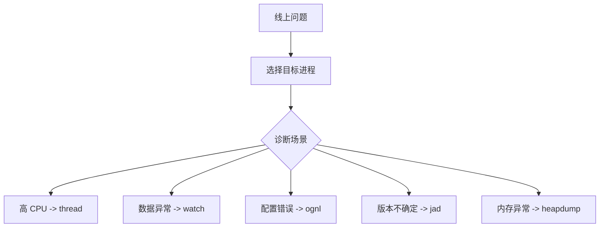

# Arthas实用案例笔记

## 前言

在实际的 Java 开发和运维中，线上问题往往出乎意料：
CPU 突然飙高、内存暴涨、接口响应异常……
此时，我们既不能轻易重启服务，又不能随意加日志，这就需要一个**无侵入、动态诊断、适合生产环境**的工具。

**Arthas** 由阿里巴巴开源，是一款强大的 Java 诊断工具，可以实时连接正在运行的 JVM，帮助我们快速定位问题。
本文总结了几个常见且实用的使用案例，方便生产遇到问题时快速定位。





## 场景一：排查 CPU 飙高

当线上服务的 CPU 使用率飙升，我们需要定位具体的线程和方法。

**命令：**

bash

```bash
thread            # 查看所有线程 CPU 占用
thread <threadId> # 查看单个线程详情及堆栈
```

**效果**：

- 找到 CPU 占用最高的线程 ID。
- 查看堆栈，直接定位业务代码位置，比如死循环或频繁运算。

------

## 场景二：动态查看方法入参和返回值

无需改代码，无需重启，实时观察某个方法的调用情况。

**命令：**

bash

```bash
watch com.example.service.UserService getUserById "{params, returnObj}"
```

支持条件过滤：

bash

```bash
watch com.example.service.UserService getUserById "{params, returnObj}" "params[0] == 123"
```

**效果**：

- 精确观察特定 userId 的参数和返回结果。
- 适合排查数据异常、接口逻辑问题。

------

## 场景三：临时修改线上静态变量

配置错误但不能重启服务时，可以直接修改内存中的静态变量。

**命令：**

bash

```bash
ognl '@com.example.Config@TIMEOUT'
ognl '@com.example.Config@TIMEOUT=5000'
```

**效果**：

- 即时生效，解决某些紧急问题。
- 注意修改需要谨慎，确保来源可信。

------

## 场景四：排查类加载器与依赖冲突

jar 多版本冲突或类找不到，可以用 Arthas 查看加载信息。

**命令：**

bash

```bash
sc -d com.example.MyClass
classloader
```

**效果**：

- 找出类是由哪个 ClassLoader 加载的。
- 分析是否加载了错误版本的 jar。

------

## 场景五：JAD 反编译确认线上代码版本

不确定线上部署的 jar 是不是预期版本，可以直接反编译。

**命令：**

bash

```bash
jad com.example.service.UserService
```

**效果**：

- 查看方法实现，确认是否是最新版本。
- 常用于线上代码核对。

------

## 场景六：调用链分析

定位某个方法是从哪条业务链调用的，以及耗时情况。

**命令：**

bash

```bash
stack com.example.service.UserService getUserById
```

**效果**：

- 打印完整调用栈。
- 分析源头和调用路径。

------

## 场景七：内存占用分析

排查 OOM 或内存异常，需要 dump 现场。

**命令：**

bash

```bash
heapdump /tmp/heap.hprof
```

**效果**：

- 导出 heap 文件，用 MAT/VisualVM 分析对象占用。
- 找出内存泄漏或大对象来源。

------

## 总结：Arthas 快速诊断秘籍

| 场景         | 命令                    | 目的               |
| :----------- | :---------------------- | :----------------- |
| CPU 飙高     | `thread`, `thread <id>` | 找高占用线程和堆栈 |
| 查看方法参数 | `watch`                 | 动态追踪调用数据   |
| 改静态变量   | `ognl`                  | 修改配置立即生效   |
| 类加载分析   | `sc`, `classloader`     | 解决依赖冲突       |
| 源码反编译   | `jad`                   | 确认代码版本       |
| 链路分析     | `stack`                 | 查看调用路径和耗时 |
| 内存分析     | `heapdump`              | 分析内存占用及泄漏 |