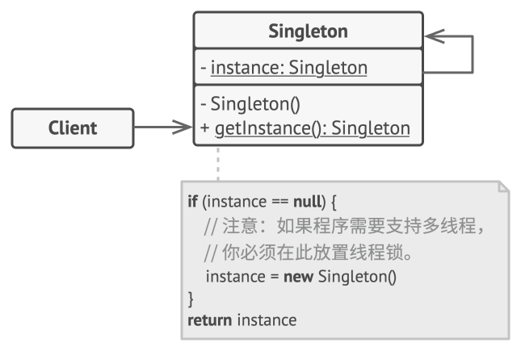

# ☕ 设计模式总结：单例模式（Singleton Pattern）

------

## 🧠 模式简介

**单例模式（Singleton Pattern）** 是一种创建型设计模式，旨在**保证一个类在整个应用程序中只有一个实例**，并提供一个全局访问点。
 常用于管理全局资源（如配置对象、线程池、日志工具、数据库连接等）。

------

## 📌 适用场景

单例模式适用于以下场景：

- **全局唯一资源管理**：例如配置中心、日志记录器、线程池、缓存对象。
- **避免频繁创建销毁对象**：某些对象初始化开销大（如数据库连接、网络客户端）。
- **需要统一访问控制**：如统一的业务网关、单点入口。

------

## ⚙️ 实现方式

### 1. 饿汉式（线程安全，类加载即初始化）

饿汉式单例（Eager Initialization）在类加载时就急切地创建实例，不管你后续用不用得到，这也是饿汉式的来源，简单但不支持延迟加载实例。

```java
public class Singleton {
    private static final Singleton INSTANCE = new Singleton();

    private Singleton() {}

    public static Singleton getInstance() {
        return INSTANCE;
    }
}
```

- ✅ 优点：实现简单，线程安全。
- ❌ 缺点：类加载时就创建实例，可能造成资源浪费。

------

### 2. 懒汉式（线程不安全，延迟加载）

懒汉式单例（Lazy Initialization）在实际使用时才创建实例，“确实懒”（😂）。这种实现方式需要考虑线程安全问题，因此一般会带上 `synchronized` 关键字

```java
public class Singleton {
    private static Singleton instance;

    private Singleton() {}

    public static synchronized Singleton getInstance() {
        if (instance == null) {
            instance = new Singleton();
        }
        return instance;
    }
}
```

- ✅ 优点：延迟加载，节省资源。
- ❌ 缺点：多线程环境下可能创建多个实例。



------

### 3. 双重检查锁（DCL，推荐）

双重检查锁用 `synchronized` 同步代码块替代了 `synchronized` 同步方法。并且在 instance 前加上 `volatile` 关键字，防止指令重排，因为 `instance = new Singleton()` 并不是一个原子操作，可能会被重排序，导致其他线程获取到未初始化完成的实例。

```java
public class Singleton {
    private static volatile Singleton instance;

    private Singleton() {}

    public static Singleton getInstance() {
        if (instance == null) {
            synchronized (Singleton.class) {
                if (instance == null) {
                    instance = new Singleton();
                }
            }
        }
        return instance;
    }
}
```

- ✅ 优点：线程安全，延迟加载，效率较高。
- ❌ 缺点：实现稍复杂。

当 instance 创建后，再次调用 getInstance 方法时，不会进入同步代码块，从而提高了性能。

------

### 4. 静态内部类（推荐，懒加载+线程安全）

- 利用 Java 的**静态内部类**（Static Nested Class）和**类加载机制**来实现线程安全的延迟初始化。

- 当第一次加载 Singleton 类时并不会初始化 Holder，只有在第一次调用 getInstance 方法时才会导致 Holder 被加载，从而实例化 instance。

```java
public class Singleton {
    private Singleton() {}

    private static class Holder {
        private static final Singleton INSTANCE = new Singleton();
    }

    public static Singleton getInstance() {
        return Holder.INSTANCE;
    }
}
```

- ✅ 优点：线程安全，延迟加载，写法简洁。

------

### 5. 枚举单例（最推荐）

```java
public enum Singleton {
    INSTANCE;

    public void doSomething() {
        System.out.println("Doing something...");
    }
}
```

- ✅ 优点：天然防止反射和序列化破坏，线程安全。
- ❌ 缺点：扩展性差，不适合复杂场景。

------

## ⚖️ 优缺点总结

**优点**

- 全局唯一，节省资源，避免重复实例化。
- 提供统一访问点，便于管理。

**缺点**

- 单例对象一旦创建，生命周期长，可能导致资源占用。
- 不利于扩展和测试（难以模拟多个实例）。
- 滥用可能导致代码耦合过高。

------

## 🏗️ 在JDK/Spring中的应用

- **JDK**：`Runtime`、`Desktop` 类。
- **Spring**：`@Bean` 默认是单例模式（容器级别单例）。

------

## ✅ 总结

单例模式是最基础的设计模式之一，在实际开发中应用广泛。
推荐优先使用 **静态内部类** 或 **枚举单例** 实现，既能保证线程安全，又能避免资源浪费。