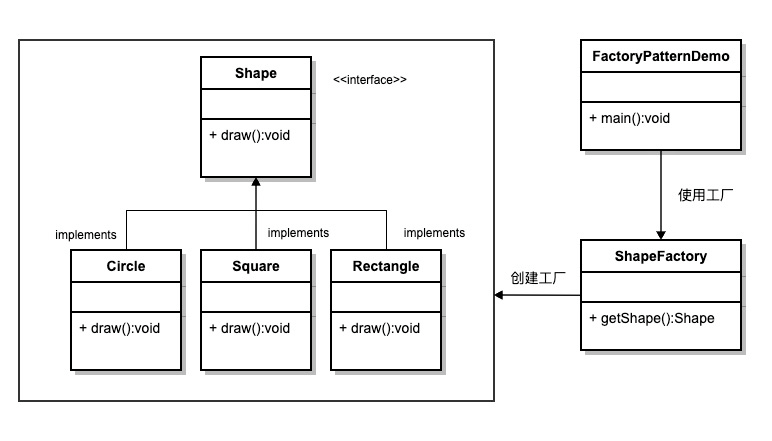
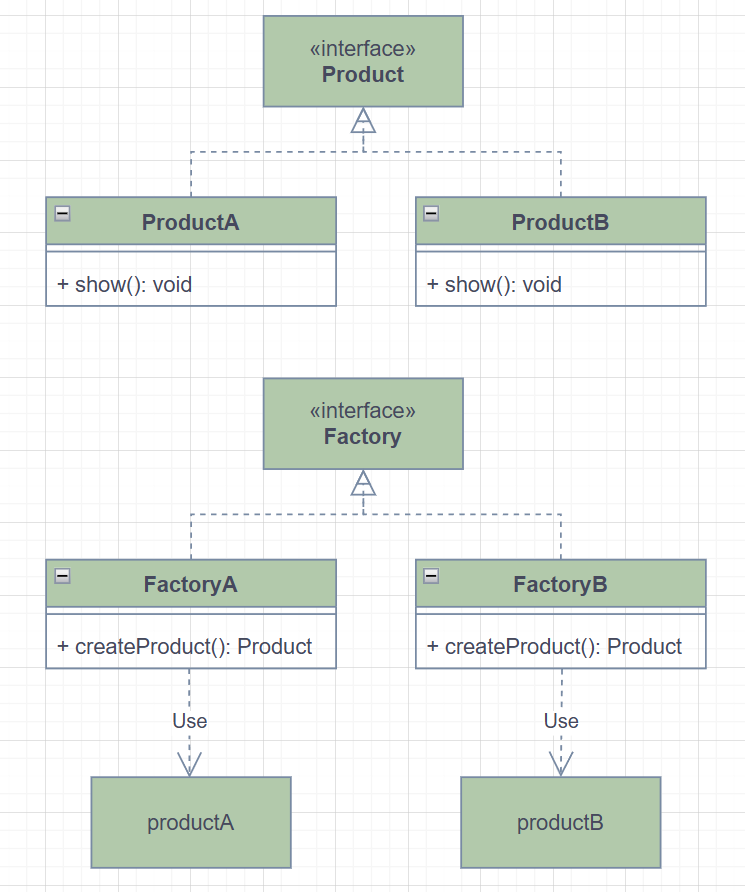
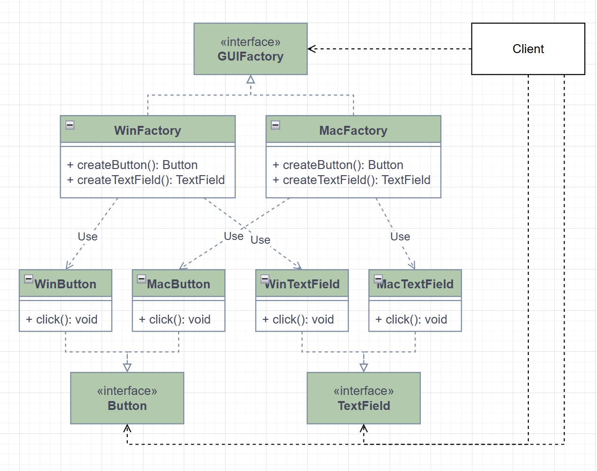

# 🏭 设计模式总结：工厂模式系列

------

## 🧠 模式简介

工厂模式（Factory Pattern）是一类创建型设计模式，**将对象的创建过程封装到工厂类中，由工厂决定实例化哪一个具体类**。

核心思想：客户端不直接 new 对象，通过工厂获取实例，实现解耦与可扩展性。

工厂模式主要包括三种形式：

1. 简单工厂模式（Simple Factory）
2. 工厂方法模式（Factory Method）
3. 抽象工厂模式（Abstract Factory）

------

## 1️⃣ 简单工厂模式（Simple Factory）

### 🔹 概念

由一个工厂类负责创建所有产品对象，客户端只需传入参数即可获得对应对象。

> 简单工厂模式不是一个正式的设计模式，但它是工厂模式的基础。它使用一个单独的工厂类来创建不同的对象，根据传入的参数决定创建哪种类型的对象。

### 🔹 UML 类图



### 🔹 代码示例

```java
public class ShapeFactory {
    
   //使用 getShape 方法获取形状类型的对象
   public Shape getShape(String shapeType){
      if(shapeType == null){
         return null;
      }        
      if(shapeType.equalsIgnoreCase("CIRCLE")){
         return new Circle();
      } else if(shapeType.equalsIgnoreCase("RECTANGLE")){
         return new Rectangle();
      } else if(shapeType.equalsIgnoreCase("SQUARE")){
         return new Square();
      }
      return null;
   }
}

public class FactoryPatternDemo {
 
   public static void main(String[] args) {
      ShapeFactory shapeFactory = new ShapeFactory();
 
      //获取 Circle 的对象，并调用它的 draw 方法
      Shape shape1 = shapeFactory.getShape("CIRCLE");
 
      //调用 Circle 的 draw 方法
      shape1.draw();
 
      //获取 Rectangle 的对象，并调用它的 draw 方法
      Shape shape2 = shapeFactory.getShape("RECTANGLE");
 
      //调用 Rectangle 的 draw 方法
      shape2.draw();
 
      //获取 Square 的对象，并调用它的 draw 方法
      Shape shape3 = shapeFactory.getShape("SQUARE");
 
      //调用 Square 的 draw 方法
      shape3.draw();
   }

}
```

### 🔹 优缺点

**优点**：简单易用，客户端无需关心具体实现
**缺点**：工厂类职责集中，新增产品需修改工厂，不符合开闭原则

------

## 2️⃣ 工厂方法模式（Factory Method）

### 🔹 概念

将“创建对象”抽象成接口，由不同子类工厂实现具体的产品创建。

> 每个产品对应一个工厂类，符合开闭原则，适合扩展。

### 🔹 UML 类图



### 🔹 代码示例

```java
interface Product { void show(); }

class ProductA implements Product { public void show() { System.out.println("产品A"); } }
class ProductB implements Product { public void show() { System.out.println("产品B"); } }

interface Factory { Product createProduct(); }

class FactoryA implements Factory { public Product createProduct() { return new ProductA(); } }
class FactoryB implements Factory { public Product createProduct() { return new ProductB(); } }

// 客户端
Factory factoryA = new FactoryA();
Product a = factoryA.createProduct();
a.show();

Factory factoryB = new FactoryB();
Product b = factoryB.createProduct();
b.show();
```

### 🔹 优缺点

**优点**：符合开闭原则，客户端无需修改即可新增产品
**缺点**：类数量增加，系统复杂度提高

------

## 3️⃣ 抽象工厂模式（Abstract Factory）

### 🔹 概念

提供一个接口，创建一系列相关或依赖的对象（产品族），而不指定具体类。

> 适合系统需要生产**多类产品族**的场景，如不同操作系统下的按钮、输入框。

### 🔹 UML 类图



### 🔹 代码示例

```java
interface Button { void click(); }
interface TextField { void input(); }

class WinButton implements Button { public void click() { System.out.println("Win按钮"); } }
class WinTextField implements TextField { public void input() { System.out.println("Win输入框"); } }

class MacButton implements Button { public void click() { System.out.println("Mac按钮"); } }
class MacTextField implements TextField { public void input() { System.out.println("Mac输入框"); } }

interface GUIFactory {
    Button createButton();
    TextField createTextField();
}

class WinFactory implements GUIFactory {
    public Button createButton() { return new WinButton(); }
    public TextField createTextField() { return new WinTextField(); }
}

class MacFactory implements GUIFactory {
    public Button createButton() { return new MacButton(); }
    public TextField createTextField() { return new MacTextField(); }
}

// 客户端
GUIFactory factory = new WinFactory();
factory.createButton().click();
factory.createTextField().input();
```

### 🔹 优缺点

**优点**：保证产品族一致性，符合开闭原则
 **缺点**：扩展产品等级困难，每增加新产品类需修改所有工厂接口

------

## 4️⃣ 总结与对比

| 模式     | 优点                     | 缺点                         | 适用场景                             |
| -------- | ------------------------ | ---------------------------- | ------------------------------------ |
| 简单工厂 | 简单易用                 | 工厂职责集中，不符合开闭原则 | 产品种类少，创建逻辑简单             |
| 工厂方法 | 符合开闭原则，灵活       | 类数量增加                   | 产品种类多，需独立工厂               |
| 抽象工厂 | 保证产品族一致，开闭原则 | 扩展新产品等级困难           | 产品族复杂，需要保证不同产品之间匹配 |

------

✅ **核心思想**

- **简单工厂** → 集中创建对象
- **工厂方法**：一个工厂 → 一个产品
- **抽象工厂**：一个工厂 → 多个产品（产品族）
