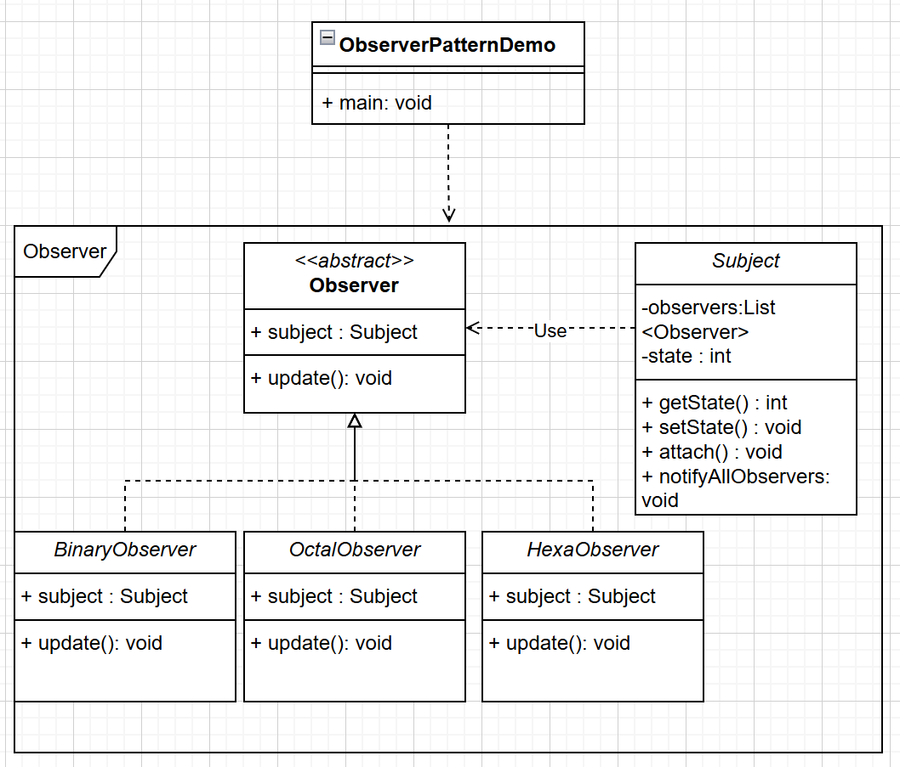

# 👀 设计模式总结：观察者模式（Observer Pattern）

------

## 🧠 模式简介

观察者模式是一种 **行为型设计模式**，用于 **对象间一对多的依赖关系**。
 当一个对象（称为 **目标对象 / Subject**）的状态发生变化时，**所有依赖它的对象（称为观察者 / Observer）都会得到自动通知并更新**。

核心思想：**将状态变化的通知逻辑从主体对象中分离出来，使系统松耦合。**

------

## 1️⃣ 参与角色

| 角色                               | 说明                                                 |
| ---------------------------------- | ---------------------------------------------------- |
| **Subject（目标/被观察者）**       | 拥有状态的对象，维护观察者列表，状态变化时通知观察者 |
| **Observer（观察者）**             | 依赖目标对象并关注其状态变化，收到通知后执行更新操作 |
| **ConcreteSubject（具体目标）**    | 实现目标接口，存储状态并在状态变化时通知所有观察者   |
| **ConcreteObserver（具体观察者）** | 实现观察者接口，根据目标对象状态执行具体操作         |

------

## 2️⃣ UML 类图



------

## 3️⃣ 代码示例（Java）

1. 创建Subject类

```java
import java.util.ArrayList;
import java.util.List;
 
public class Subject {
   
   private List<Observer> observers 
      = new ArrayList<Observer>();
   private int state;
 
   public int getState() {
      return state;
   }
 
   public void setState(int state) {
      this.state = state;
      notifyAllObservers();
   }
 
   public void attach(Observer observer){
      observers.add(observer);      
   }
 
   public void notifyAllObservers(){
      for (Observer observer : observers) {
         observer.update();
      }
   }  
}
```
2. 创建 Observer 类

```java
public abstract class Observer {
   protected Subject subject;
   public abstract void update();
}
```

3. 创建实体观察者类

```java
public class BinaryObserver extends Observer{
 
   public BinaryObserver(Subject subject){
      this.subject = subject;
      this.subject.attach(this);
   }
 
   @Override
   public void update() {
      System.out.println( "Binary String: " 
      + Integer.toBinaryString( subject.getState() ) ); 
   }
}
```

4. 使用 Subject 和实体观察者对象

```java
public class ObserverPatternDemo {
   public static void main(String[] args) {
      Subject subject = new Subject();
 
      new HexaObserver(subject);
      new OctalObserver(subject);
      new BinaryObserver(subject);
 
      System.out.println("First state change: 15");   
      subject.setState(15);
      System.out.println("Second state change: 10");  
      subject.setState(10);
   }
}
```

5. 执行程序，输出结果：

```java
First state change: 15
Hex String: F
Octal String: 17
Binary String: 1111
Second state change: 10
Hex String: A
Octal String: 12
Binary String: 1010
```


------

## 4️⃣ 优缺点

**优点**：

- 降低对象间耦合度
- 符合开闭原则，便于扩展新的观察者
- 支持广播通信，状态变化自动通知多个对象

**缺点**：

- 观察者过多时，通知会影响性能
- 若观察者和被观察者存在循环依赖，可能导致无限循环
- 无法保证通知顺序（需要额外管理）

------

## 5️⃣ 应用场景

- **MVC 模式**：视图（View）监听模型（Model）的变化
- **事件机制**：按钮点击、鼠标移动等 GUI 事件
- **订阅-发布系统**：消息推送、新闻订阅

------

✅ **总结一句话**：
 观察者模式通过 **一对多依赖** 和 **事件通知机制**，实现对象之间的松耦合，适合状态变化需要自动通知多个对象的场景。