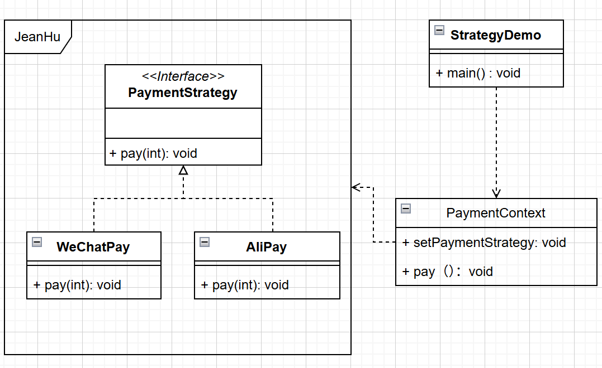

# 🎯 策略模式（Strategy Pattern）详解

------

## 🧠 模式简介

**策略模式**（Strategy Pattern）是一种行为型设计模式。它定义了一系列算法，并将每个算法封装起来，使它们可以互相替换，从而让算法的变化独立于使用算法的客户。

一句话概括：
 👉 **策略模式就是把一组算法封装成独立的类，让它们可以自由替换，避免硬编码的 if-else。**

------

## 💡 解决的问题

在实际开发中，经常会遇到这样的场景：

- 一个功能可以通过多种算法或逻辑实现。
- 不同情况下需要选择不同的实现。
- 如果直接在业务代码里用 `if-else` 或 `switch` 来控制，会导致代码臃肿、难以维护。

**策略模式**的目的就是将这些算法抽象出来，使它们可以灵活切换，并且对调用方透明。

------

## 🔑 模式结构

策略模式包含以下几个角色：

1. **Strategy（抽象策略接口）**
   - 定义算法的公共接口。
2. **ConcreteStrategy（具体策略类）**
   - 实现不同的算法。
3. **Context（上下文环境类）**
   - 持有一个策略对象，负责调用算法。

### UML 类图



------

## 🛠️ 代码示例

下面用 Java 代码演示策略模式：

### 1. 策略接口

```java
// 抽象策略
public interface PaymentStrategy {
    void pay(int amount);
}
```

### 2. 具体策略类

```java
// 微信支付
public class WeChatPay implements PaymentStrategy {
    @Override
    public void pay(int amount) {
        System.out.println("使用微信支付：" + amount + " 元");
    }
}

// 支付宝支付
public class AliPay implements PaymentStrategy {
    @Override
    public void pay(int amount) {
        System.out.println("使用支付宝支付：" + amount + " 元");
    }
}
```

### 3. 上下文类

```java
public class PaymentContext {
    private PaymentStrategy strategy;

    // 动态设置策略
    public void setPaymentStrategy(PaymentStrategy strategy) {
        this.strategy = strategy;
    }

    public void pay(int amount) {
        strategy.pay(amount);
    }
}
```

### 4. 使用示例

```java
public class StrategyDemo {
    public static void main(String[] args) {
        PaymentContext context = new PaymentContext();

        // 使用微信支付
        context.setPaymentStrategy(new WeChatPay());
        context.pay(100);

        // 切换为支付宝支付
        context.setPaymentStrategy(new AliPay());
        context.pay(200);
    }
}
```

输出结果：

```
使用微信支付：100 元
使用支付宝支付：200 元
```

------

## 📌 优缺点

### ✅ 优点

- 避免冗长的 `if-else` 或 `switch-case`。
- 提供算法的灵活切换。
- 遵循 **开闭原则**：增加新算法时只需增加策略类，不用修改原有代码。

### ❌ 缺点

- 会增加类的数量，每个算法都要写一个类。
- 需要客户端理解不同策略的适用场景。

------

## 🎯 适用场景

- 系统需要在运行时切换不同算法。
- 需要避免大量的 `if-else` 或 `switch` 分支语句。
- 算法逻辑相对复杂，且会不断扩展时。

典型案例：

- 支付方式选择（微信 / 支付宝 / 银行卡）。
- 排序算法切换（快速排序 / 归并排序 / 插入排序）。
- 日志记录策略（写文件 / 写数据库 / 写控制台）。

------

## 🚀 总结

策略模式通过 **封装算法**，将不同的算法独立出来，使得调用方可以在不修改代码的情况下自由切换算法。它的核心思想就是 **用多态代替 if-else**。

👉 如果你发现代码中有很多的分支判断，并且这些分支对应的是不同的算法或逻辑，那么考虑使用 **策略模式** 来优化代码结构